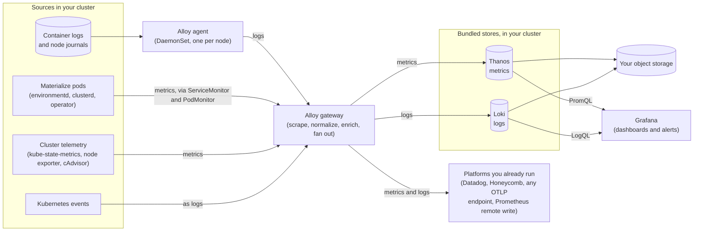

# Self-Managed

Monitor and alert on Self-Managed Materialize with the bundled monitoring stack or your own observability platform.

This section covers monitoring and alerting for Self-Managed Materialize.

## Built-in monitoring stack

The Materialize Terraform modules ([AWS
⧉](https://github.com/MaterializeInc/materialize-terraform-self-managed/tree/main/aws),
[Azure
⧉](https://github.com/MaterializeInc/materialize-terraform-self-managed/tree/main/azure),
[GCP
⧉](https://github.com/MaterializeInc/materialize-terraform-self-managed/tree/main/gcp))
install a monitoring stack alongside your deployment. It is enabled by default
starting with v11.0.0 of the Materialize Terraform Modules. For the module
install steps, see [Install using Terraform
modules](/self-managed-deployments/installation/#install-using-terraform-modules).

The stack collects metrics and logs from Materialize and from the cluster,
stores them in your own infrastructure, and ships dashboards to query them:

- [How logs and metrics are stored](/manage/monitor/self-managed/storage/), including
  the backends you can forward them to.

- [Grafana](/manage/monitor/self-managed/grafana/), the dashboards and query
  interface that ship with the stack.

To configure the stack outside the Materialize Terraform modules, or to see the
full set of module variables, see the [`materialize-monitoring` Terraform
installation guide
⧉](https://materializeinc.github.io/materialize-monitoring/getting-started/terraform/).

## Deliver data to your observability platform

To send metrics and logs to a platform you already run, a guide is available for
each destination:

- [Datadog](/manage/monitor/self-managed/datadog/)

- [Honeycomb](/manage/monitor/self-managed/honeycomb/)

- [OpenTelemetry](/manage/monitor/self-managed/opentelemetry/), for any other OTLP
  endpoint, including your own collector.

- [Google Cloud Monitoring](/manage/monitor/self-managed/google-cloud-monitoring/)

- [Prometheus remote
  write](/manage/monitor/self-managed/prometheus-remote-write/), for Mimir,
  Amazon Managed Prometheus, Grafana Cloud, or a Thanos you run elsewhere.

## Alerting

After setting up a monitoring tool, you can configure alert rules. Alert rules
send a notification when a metric surpasses a threshold. This will help you
prevent operational incidents. For alert rules guidelines, see
[Alerting](/manage/monitor/self-managed/alerting/).

---

## Alerting

After setting up a monitoring tool, it is important to configure alert rules. Alert rules send a notification when a metric surpasses a threshold. This will help you prevent operational incidents.

This page describes which metrics and thresholds to build as a starting point. For more details on how to set up alert rules in Datadog or Grafana, refer to:

 * [Datadog monitors](https://docs.datadoghq.com/monitors/)
 * [Grafana alerts](https://grafana.com/docs/grafana/latest/alerting/fundamentals/)

## Thresholds

Alert rules tend to have two threshold levels, and we are going to define them as follows:
 * **Warning:** represents a call to attention to a symptom with high chances to develop into an issue.
 * **Alert:** represents an active issue that requires immediate action.

For each threshold level, use the following table as a guide to set up your own alert rules:

Metric | Warning | Alert | Description
-- | -- | -- | --
CPU | 85% | 100% | Average CPU usage for a cluster in the last *15 minutes*.
Memory | 80% | 90% | Average memory usage for a cluster in the last *15 minutes*.
Source status | - | On Change | Source status change in the last *1 minute*.
Cluster status | - | On Change | Cluster replica status change in the last *1 minute*.
Freshness | > 5s | > 1m | Average [lag behind an input](/reference/system-catalog/mz_internal/#mz_materialization_lag) in the last *15 minutes*.

### Custom Thresholds

For the following table, replace the two variables, _X_ and _Y_, by your organization and use case:

Metric | Warning | Alert | Description
-- | -- | -- | --
Latency | Avg > X | Avg > Y | Average latency in the last *15 minutes*. Where X and Y are the expected latencies in milliseconds.
Credits | Consumption rate increase by X% | Consumption rate increase by Y% | Average credit consumption in the last *60 minutes*.

---

## Datadog

This guide walks you through the steps required to monitor the performance and
overall health of your Materialize region using [Datadog
⧉](https://www.datadoghq.com/). Self-Managed Materialize pushes metrics, and
optionally logs, to Datadog from the monitoring stack the Materialize Terraform
modules install.

## How it works

The stack collects metrics and logs before any destination is involved. For the
collection pipeline and where that data is stored by default, see [How logs and
metrics are stored](/manage/monitor/self-managed/storage/#how-it-works).

Datadog is an **additive** destination. It receives its own filtered copy of the
metrics, and the bundled [Thanos](/manage/monitor/self-managed/storage/),
Grafana, and Alertmanager keep working as before. You do not give anything up by
turning it on.

The exporter authenticates directly against the Datadog intake with an API key,
so the only decisions are which site to send to and how much to send.

## Instructions

### Before you begin

Ensure you have:

- A Materialize deployment created with the [Materialize Terraform
  modules](/self-managed-deployments/), with the monitoring stack enabled. See
  [Step 1](#step-1-enable-observability).

- [Terraform ⧉](https://developer.hashicorp.com/terraform/install) installed.

- [kubectl ⧉](https://kubernetes.io/docs/tasks/tools/) installed and configured
  to connect to your cluster.

> **Note:** The Terraform steps on this page require **v11.0.0** or later of the Materialize
> Terraform Modules, which is where the monitoring module accepts these
> destinations. If you install the
> `materialize-monitoring` chart with Helm rather than through the Terraform
> modules, no Terraform release applies and neither does `enable_observability`.
> Follow the Helm instructions at the end of this page instead.

You also need:

- A [Datadog API key
  ⧉](https://docs.datadoghq.com/account_management/api-app-keys/). An application
  key is not needed and is not accepted: the metrics intake authenticates with
  the API key alone.

- Your [Datadog site ⧉](https://docs.datadoghq.com/getting_started/site/), such
  as `datadoghq.com`, `datadoghq.eu`, or `us3.datadoghq.com`. A wrong site is a
  403 from the intake rather than a routing error, so confirm it before you
  apply.

### Step 1. Enable observability

The Materialize Terraform Modules take an `enable_observability` variable.
Starting with **v11.0.0** it defaults to `true`, so a fresh apply installs the
monitoring stack without any configuration, and bumping `ref=<tag>` to v11.0.0
or later installs it on a deployment that never set the variable.

1. To confirm the setting, or to change it, set it explicitly in your
   `terraform.tfvars`:

   ```hcl
   enable_observability = true    # default starting with Materialize Terraform Modules v11.0.0
   ```

1. Apply the configuration:

   ```bash
   terraform apply
   ```

   The apply creates the object storage and cloud identities for metrics and
   logs, and installs the stack into the `monitoring` namespace.

> **Warning:** The stack and its supporting resources are billable, and the `generic` node pool
> may need to grow before the first apply can schedule everything. If you do not
> want it, set `enable_observability = false` before upgrading to Materialize
> Terraform Modules v11.0.0.

### Step 2. Configure the Datadog destination

Datadog is configured on the `monitoring` module block, not through a root
variable of the examples. It provisions no cloud resources, so there is no
`enable_datadog` toggle: setting `datadog_metrics` is what turns it on.

1. In the `monitoring` module block of your Terraform, add:

   ```hcl
   module "monitoring" {
     # ...

     datadog_metrics = {
       site           = "datadoghq.com"
       min_importance = "essential"
     }
     datadog_api_key = var.datadog_api_key
   }
   ```

   The examples ship this block commented out, so you can uncomment it in place.

   | Field | Default | Purpose |
   |-------|---------|---------|
   | `site` | `datadoghq.com` | Your Datadog site. Determines the intake the exporter writes to. |
   | `min_importance` | `essential` | Which metrics to send. See [How to control which metrics Datadog receives](#how-to-control-which-metrics-datadog-receives). |
   | `metric_endpoint` | derived from `site` | Override the metrics intake URL. Only for a proxy or PrivateLink. |
   | `logs_endpoint` | derived from `site` | Override the logs intake URL. Only for a proxy or PrivateLink. |

   > **Warning:** A hand-written `metric_endpoint` or `logs_endpoint` that disagrees with `site`
>    fails at the intake, not at plan time. Leave both unset unless you are routing
>    through a proxy.

1. Declare the API key as a sensitive variable and pass it in the way you pass
   other secrets, for example through an environment variable:

   ```hcl
   variable "datadog_api_key" {
     type      = string
     sensitive = true
   }
   ```

   ```bash
   export TF_VAR_datadog_api_key='<your-datadog-api-key>'
   ```

1. Apply the configuration:

   ```bash
   terraform apply
   ```

Credentials do not travel through the Helm values. The monitoring module puts
them in a Kubernetes Secret that the gateway mounts, so they are not recoverable
with `helm get values` and do not land in the rendered manifests. Rotating one
rolls the gateway, because environment variables are fixed at container start
and a running pod would otherwise keep authenticating with the credential it
started with, indefinitely.

### Step 3. Confirm metrics are arriving

1. Check that the gateway picked up the new configuration and is healthy:

   ```bash
   kubectl -n monitoring rollout status deployment/alloy-gateway
   ```

1. Query the receiving backend for recent samples of a metric you expect, such
   as `mz_dataflow_wallclock_lag_seconds`.

> **Note:** A backend's metric summary, schema, or column browser is cumulative, so a metric
> listed there is not proof that it is arriving now. It may be left over from
> before a configuration change. Query for recent samples instead.

> **Warning:** The gateway shards scrape targets across its replicas. During a partial rollout a
> metric can look missing simply because its target is being scraped by a pod that
> has not picked up the new configuration yet. Let all gateway replicas roll out
> before concluding that a metric is being filtered.

In Datadog, **Metrics > Summary** filtered to `mz_` is the quickest place to look.

### Step 4. Build alerts

With metrics in Datadog, build [monitors ⧉](https://docs.datadoghq.com/monitors/)
from the metrics and thresholds in
[Alerting](/manage/monitor/self-managed/alerting/).

The monitoring stack also ships Alertmanager rules that evaluate against the
bundled Thanos. Decide which system owns which alerts rather than running both
against the same thresholds and paging twice.

## How to control which metrics Datadog receives

Datadog bills per custom metric, so the volume you send is a cost decision.

Every metric the stack collects carries an *importance* tier, and each
destination keeps only the metrics at or above a floor you choose. The tiers
below run from most to least important, and the floor is cumulative: it keeps
that tier and every tier above it.

| Tier | What it covers |
|------|----------------|
| `essential` | The metrics that are critical and that you would always want available. These are the ones used in alerting. |
| `recommended` | The metrics used in dashboards, and generally desirable for troubleshooting. |
| `extended` | The metrics used by optional and experimental dashboards. |
| `diagnostic` | The metrics used for in-depth troubleshooting and analysis. |
| `all` | Absolutely everything scraped, including metrics no tier classifies. Suited to cheap storage such as the bundled Thanos, not to a metered backend. |

The tiers are shared across the stack, so a tier selected in Terraform means the
same set of metrics as the same tier selected in Helm. For the membership of each
tier, see [List of metrics
⧉](https://materializeinc.github.io/materialize-monitoring/reference/stable-metrics/list-metrics/).
For the metrics Materialize recommends dashboarding and alerting on, see
[essential metrics](/manage/monitor/essential-metrics/), and for everything it
exposes, the [appendix of all metrics](/manage/monitor/appendix-metrics/).

> **Note:** The `extended` and `diagnostic` tiers are still being populated, so today they
> resolve to the same set as `recommended`. To send everything that is scraped, use
> `all`, not `diagnostic`.

> **Warning:** The filter fails open. If the allowlist reaches the gateway empty, the gateway
> sends everything to that destination rather than nothing. That is safe for
> visibility and expensive on a metered backend, so check the receiving backend's
> ingest volume after a configuration change.

`datadog_metrics.min_importance` defaults to `essential`, a tighter floor than the
other destinations use, for exactly this reason. `all` is a diagnostic setting,
not a steady state.

## How to forward logs

The gateway collects logs as well as metrics, and can forward them to the same
OpenTelemetry destinations. The bundled Loki continues to receive them either
way. Enable it through `additional_values` on the `monitoring` module block:

```hcl
additional_values = [
  <<-EOT
    pipeline:
      logging:
        gateway:
          destination:
            otel:
              enabled: true
  EOT
]
```

The switch is not per-destination. It turns on the log path to every logs-capable
exporter the gateway has enabled, so if you have both a Datadog and a generic
OTLP destination configured, both receive the logs. Google Cloud Monitoring is
metrics-only and cannot receive them, and enabling the switch with no logs-capable
exporter configured fails the install rather than silently dropping the logs.

Logs are considerably higher volume than metrics, and backends generally bill for
them separately from metrics. Turn this on deliberately.

Datadog bills for logs separately from custom metrics. For the log storage
options in full, see [How logs and metrics are stored](/manage/monitor/self-managed/storage/).

## Instructions when using Helm

If you install the `materialize-monitoring` chart directly rather than through the
Terraform modules, the Datadog destination is a chart value and the API key is a
Secret you create.

1. Enable the exporter:

   ```yaml
   pipeline:
     metrics:
       gateway:
         destination:
           otel:
             enabled: true
             datadogExporter:
               enabled: true
               url: datadoghq.com
               minMetricImportance: essential
   ```

1. Create the gateway Secret with the API key. The chart does not create it, and
   mounts it optionally, so a wrong name or namespace is ignored silently rather
   than failing:

   ```bash
   kubectl create secret generic mzmon-alloy-gateway-env \
     --namespace monitoring \
     --from-literal=GATEWAY_OTEL_DEST_DATADOG_API_KEY='<your-datadog-api-key>'
   ```

   > **Warning:** The Secret name must match the release, so with the default
>    `fullnameOverride: mzmon` it is `mzmon-alloy-gateway-env`, in the namespace the
>    gateway runs in. In production, source it from Sealed Secrets, External
>    Secrets, or SOPS rather than committing a raw credential.

For a ready-made starting point that fans metrics out to several backends at
once, see the [`otel-metrics-fanout.values.yaml`
⧉](https://github.com/MaterializeInc/materialize-monitoring/blob/main/charts/materialize-monitoring/profiles/otel-metrics-fanout.values.yaml)
profile, and for the full value reference, [Metrics > Storing
⧉](https://materializeinc.github.io/materialize-monitoring/metrics/storing/).

## See also

- [How logs and metrics are stored](/manage/monitor/self-managed/storage/), for the
  bundled stores and the other backends you can send metrics and logs to.

- [Honeycomb](/manage/monitor/self-managed/honeycomb/) and
  [OpenTelemetry](/manage/monitor/self-managed/opentelemetry/), which follow the
  same additive model over OTLP.

- [Alerting](/manage/monitor/self-managed/alerting/), for the metrics and
  thresholds to alert on.

---

## Google Cloud Monitoring

This guide walks you through the steps required to monitor the performance and
overall health of your Materialize region using [Google Cloud Monitoring
⧉](https://cloud.google.com/monitoring). Self-Managed Materialize pushes metrics
to Cloud Monitoring from the monitoring stack the Materialize Terraform modules
install.

This destination is **GCP only**, and it is the one destination that needs cloud
resources the monitoring chart cannot create for itself. That is why it is enabled
with a flat variable rather than a configuration block: Terraform has to know at
plan time whether to create the service account and the Workload Identity binding
that authenticate it.

## How it works

The stack collects metrics and logs before any destination is involved. For the
collection pipeline and where that data is stored by default, see [How logs and
metrics are stored](/manage/monitor/self-managed/storage/#how-it-works).

Cloud Monitoring is an **additive** destination. It receives its own filtered copy
of the metrics, and the bundled [Thanos](/manage/monitor/self-managed/storage/),
Grafana, and Alertmanager keep working as before.

Authentication is **ambient**, not a credential you supply. The module creates a
Google service account, grants it `roles/monitoring.metricWriter`, and binds the
gateway's in-cluster ServiceAccount to it through Workload Identity. The exporter
then authenticates with Application Default Credentials.

> **Note:** Cloud Monitoring is metrics-only. Its exporter cannot receive logs, and enabling
> the log path with Cloud Monitoring as the only OpenTelemetry destination fails the
> install rather than silently dropping them. For logs on GCP, use an [OTLP
> destination](/manage/monitor/self-managed/opentelemetry/) or keep them in the
> bundled [Loki](/manage/monitor/self-managed/storage/).

## Instructions

### Before you begin

Ensure you have:

- A Materialize deployment created with the [Materialize Terraform
  modules](/self-managed-deployments/), with the monitoring stack enabled. See
  [Step 1](#step-1-enable-observability).

- [Terraform ⧉](https://developer.hashicorp.com/terraform/install) installed.

- [kubectl ⧉](https://kubernetes.io/docs/tasks/tools/) installed and configured
  to connect to your cluster.

> **Note:** The Terraform steps on this page require **v11.0.0** or later of the Materialize
> Terraform Modules, which is where the monitoring module accepts these
> destinations. If you install the
> `materialize-monitoring` chart with Helm rather than through the Terraform
> modules, no Terraform release applies and neither does `enable_observability`.
> Follow the Helm instructions at the end of this page instead.

You also need:

- A deployment on **GCP**, created with the GCP Terraform modules. Workload
  Identity must be enabled on the cluster, which the `gke` module already sets.

- Permission to create a service account and IAM bindings in the project.

### Step 1. Enable observability

The Materialize Terraform Modules take an `enable_observability` variable.
Starting with **v11.0.0** it defaults to `true`, so a fresh apply installs the
monitoring stack without any configuration, and bumping `ref=<tag>` to v11.0.0
or later installs it on a deployment that never set the variable.

1. To confirm the setting, or to change it, set it explicitly in your
   `terraform.tfvars`:

   ```hcl
   enable_observability = true    # default starting with Materialize Terraform Modules v11.0.0
   ```

1. Apply the configuration:

   ```bash
   terraform apply
   ```

   The apply creates the object storage and cloud identities for metrics and
   logs, and installs the stack into the `monitoring` namespace.

> **Warning:** The stack and its supporting resources are billable, and the `generic` node pool
> may need to grow before the first apply can schedule everything. If you do not
> want it, set `enable_observability = false` before upgrading to Materialize
> Terraform Modules v11.0.0.

### Step 2. Configure the Cloud Monitoring destination

1. On the `monitoring` module block of your Terraform, set:

   ```hcl
   module "monitoring" {
     # ...

     enable_google_cloud_metrics         = true
     google_cloud_metrics_min_importance = "recommended"
   }
   ```

   | Variable | Default | Purpose |
   |----------|---------|---------|
   | `enable_google_cloud_metrics` | `false` | Turns the destination on, and creates the service account and Workload Identity binding it authenticates with. |
   | `google_cloud_metrics_min_importance` | `recommended` | Which metrics to send. See [How to control which metrics Cloud Monitoring receives](#how-to-control-which-metrics-cloud-monitoring-receives). |
   | `google_cloud_metrics_prefix` | `workload.googleapis.com/mzmon` | The metric name prefix in Cloud Monitoring. |

1. Apply the configuration:

   ```bash
   terraform apply
   ```

> **Warning:** Authentication is Application Default Credentials only. There is no key-file path.
> Without the Workload Identity binding the module creates, the exporter falls back
> to the node's service account, which works only if that account happens to hold
> `roles/monitoring.metricWriter`, and fails opaquely if it does not.

### Step 3. Confirm metrics are arriving

1. Check that the gateway picked up the new configuration and is healthy:

   ```bash
   kubectl -n monitoring rollout status deployment/alloy-gateway
   ```

1. Query the receiving backend for recent samples of a metric you expect, such
   as `mz_dataflow_wallclock_lag_seconds`.

> **Note:** A backend's metric summary, schema, or column browser is cumulative, so a metric
> listed there is not proof that it is arriving now. It may be left over from
> before a configuration change. Query for recent samples instead.

> **Warning:** The gateway shards scrape targets across its replicas. During a partial rollout a
> metric can look missing simply because its target is being scraped by a pod that
> has not picked up the new configuration yet. Let all gateway replicas roll out
> before concluding that a metric is being filtered.

In Cloud Monitoring, use **Metrics explorer** and filter to the prefix, which is
`workload.googleapis.com/mzmon` unless you changed it.

### Step 4. Build alerts

Build Cloud Monitoring [alerting policies
⧉](https://cloud.google.com/monitoring/alerts) from the metrics and thresholds in
[Alerting](/manage/monitor/self-managed/alerting/).

The monitoring stack also ships Alertmanager rules that evaluate against the
bundled Thanos. Decide which system owns which alerts rather than running both
against the same thresholds.

## How to control which metrics Cloud Monitoring receives

Cloud Monitoring bills per custom metric and per sample, so the tier you pick sets
the bill.

Every metric the stack collects carries an *importance* tier, and each
destination keeps only the metrics at or above a floor you choose. The tiers
below run from most to least important, and the floor is cumulative: it keeps
that tier and every tier above it.

| Tier | What it covers |
|------|----------------|
| `essential` | The metrics that are critical and that you would always want available. These are the ones used in alerting. |
| `recommended` | The metrics used in dashboards, and generally desirable for troubleshooting. |
| `extended` | The metrics used by optional and experimental dashboards. |
| `diagnostic` | The metrics used for in-depth troubleshooting and analysis. |
| `all` | Absolutely everything scraped, including metrics no tier classifies. Suited to cheap storage such as the bundled Thanos, not to a metered backend. |

The tiers are shared across the stack, so a tier selected in Terraform means the
same set of metrics as the same tier selected in Helm. For the membership of each
tier, see [List of metrics
⧉](https://materializeinc.github.io/materialize-monitoring/reference/stable-metrics/list-metrics/).
For the metrics Materialize recommends dashboarding and alerting on, see
[essential metrics](/manage/monitor/essential-metrics/), and for everything it
exposes, the [appendix of all metrics](/manage/monitor/appendix-metrics/).

> **Note:** The `extended` and `diagnostic` tiers are still being populated, so today they
> resolve to the same set as `recommended`. To send everything that is scraped, use
> `all`, not `diagnostic`.

> **Warning:** The filter fails open. If the allowlist reaches the gateway empty, the gateway
> sends everything to that destination rather than nothing. That is safe for
> visibility and expensive on a metered backend, so check the receiving backend's
> ingest volume after a configuration change.

`google_cloud_metrics_min_importance` defaults to `recommended`, which covers the
metrics the dashboards and alerts use. `all` is a diagnostic setting, not a steady
state.

## Instructions when using Helm

If you install the `materialize-monitoring` chart directly rather than through the
Terraform modules, you create the identity and binding yourself, then point the
chart at it.

1. Create a Google service account, grant it `roles/monitoring.metricWriter` on
   the project, and bind the gateway's ServiceAccount to it with
   `roles/iam.workloadIdentityUser`.

1. Enable the exporter and annotate the gateway ServiceAccount so the binding
   applies:

   ```yaml
   alloy-gateway:
     serviceAccount:
       annotations:
         iam.gke.io/gcp-service-account: <gsa>@<project>.iam.gserviceaccount.com

   pipeline:
     metrics:
       gateway:
         destination:
           otel:
             enabled: true
             googleCloudExporter:
               enabled: true
               minMetricImportance: recommended
   ```

There is no Secret to create, because the exporter authenticates with the ambient
identity. Cloud Monitoring supports `gzip` compression only.

For the full value reference, see [Metrics > Storing
⧉](https://materializeinc.github.io/materialize-monitoring/metrics/storing/).

## See also

- [How logs and metrics are stored](/manage/monitor/self-managed/storage/), for the
  bundled stores and the other backends you can send metrics and logs to.

- [OpenTelemetry](/manage/monitor/self-managed/opentelemetry/), for OTLP
  destinations, which can also carry logs.

- [Alerting](/manage/monitor/self-managed/alerting/), for the metrics and
  thresholds to alert on.

---

## Grafana

**Grafana** is the dashboarding and query interface for the monitoring stack the
[Materialize Terraform
modules](/self-managed-deployments/installation/#install-using-terraform-modules)
install. This guide will help you deploy Grafana, with all data sources wired up
to our template dashboards. This means you can start monitoring Materialize
immediately.

If you are upgrading from a previous version of the Materialize Terraform
Modules, read [How to upgrade from previous
versions](#how-to-upgrade-from-previous-versions-of-the-materialize-terraform-modules)
first.

## How it works

The dashboards read the two stores the monitoring stack runs: Thanos for metrics
and Loki for logs. For how that data is collected, and where it is stored, see
[How logs and metrics are
stored](/manage/monitor/self-managed/storage/#how-it-works).

## Installation

### Before you begin

Ensure you have:

- A Materialize deployment created with the [Materialize Terraform
  modules](/self-managed-deployments/).

- [Terraform ⧉](https://developer.hashicorp.com/terraform/install) installed.

- [kubectl ⧉](https://kubernetes.io/docs/tasks/tools/) installed and configured
  to connect to your cluster.

### Step 1. Enable observability

The Materialize Terraform Modules take an `enable_observability` variable.
Starting with **v11.0.0** it defaults to `true`, so a fresh apply installs the
monitoring stack without any configuration, and bumping `ref=<tag>` to v11.0.0
or later installs it on a deployment that never set the variable.

1. To confirm the setting, or to change it, set it explicitly in your
   `terraform.tfvars`:

   ```hcl
   enable_observability = true    # default starting with Materialize Terraform Modules v11.0.0
   ```

1. Apply the configuration:

   ```bash
   terraform apply
   ```

   The apply creates the object storage and cloud identities for metrics and
   logs, and installs the stack into the `monitoring` namespace.

> **Warning:** The stack and its supporting resources are billable, and the `generic` node pool
> may need to grow before the first apply can schedule everything. If you do not
> want it, set `enable_observability = false` before upgrading to Materialize
> Terraform Modules v11.0.0.

Starting in **v10.1.0**, the examples also create two resources for Grafana
itself whenever `enable_observability` is on:

| Resource | Purpose |
|----------|---------|
| A dedicated PostgreSQL instance | Holds Grafana's own state — users, service accounts and API tokens, annotations, dashboard versions, preferences, and alert-rule state. |
| An L4 load balancer | Reaches Grafana without port forwarding. Internal by default. |

Both are billable, and both are sized as small as the cloud offers
(`db.t4g.micro` on AWS, `db-f1-micro` on GCP, `B_Standard_B1ms` on Azure).
See [Step 2](#step-2-access-grafana) for the load balancer and [Step
3](#step-3-persist-grafanas-own-state) for the database.

> **Note:** The monitoring stack runs several components: Loki, Thanos, Grafana,
> Alertmanager, kube-state-metrics, and two Alloy roles. Your generic node pool
> may need to grow before the first apply can schedule all of them.

If you instantiate the modules in your own Terraform rather than using an
example, add the `monitoring` module for your cloud (see the [Terraform
installation guide
⧉](https://materializeinc.github.io/materialize-monitoring/getting-started/terraform/)),
and turn on the operator's scrape annotations so its pods are collected:

```hcl
module "operator" {
  # ...
  helm_values = {
    observability = {
      enabled = true
      prometheus = {
        scrapeAnnotations = {
          enabled = true
        }
      }
    }
  }
}
```

### Step 2. Access Grafana

Retrieve the `admin` password from the Terraform output. You need it for either
access method below:

```bash
terraform output -raw grafana_admin_password
```

> **Tip:** Your shell may show an ending marker (such as `%`) because the output did not
> end with a newline. Do not include the marker when using the value.

#### Through the load balancer

Starting in v10.1.0, the examples put Grafana behind an L4 load balancer. It
follows the same `internal_load_balancer` and `ingress_cidr_blocks` variables as
the Materialize load balancer, so by default it is **internal** and allowlisted
to the same ranges.

1. Read the address:

   ```bash
   terraform output -raw grafana_url
   ```

   `grafana_url` is the hostname you supplied, else the load balancer's own
   address, else the in-cluster Service. `grafana_load_balancer_address` gives
   you just the load balancer.

   > **Note:** On GCP and Azure the cloud assigns the address asynchronously, so a fresh
>    apply can still report the in-cluster name. The next plan picks it up. Set
>    `ip` on `grafana_load_balancer` to pre-allocate the address and have it known
>    at plan time.

1. Open the address in a browser and log in as `admin`.

> **Warning:** The load balancer terminates no TLS, and Grafana has no identity provider until
> you configure one — so the generated admin password is the whole of the access
> control, sent over plain HTTP. Keep the load balancer internal until both are
> addressed.
> Every datasource behind Grafana reads every metric in Thanos and every log in
> the tenant. A public load balancer whose allowlist is still `0.0.0.0/0` is
> **refused at plan time** for Grafana specifically.

> **Note:** Do not set `security.cookie_secure` while Grafana is served over plain HTTP. It
> marks the session cookie `Secure`, the browser then stops sending it over the
> connection that works, and login breaks entirely.

To make Grafana's own share links, alert notification links, and OAuth redirect
URIs correct, set `grafana_host` to a hostname you control. Nothing in the
modules publishes DNS for that name — that record is yours to create.

To skip the load balancer entirely and keep Grafana on a `ClusterIP` Service,
set `grafana_load_balancer = null` on the `monitoring` module block.

#### Through port forwarding

Port forwarding stays the private path, and is the only option when the load
balancer is internal and you are outside the network.

1. Forward a local port to the Grafana service:

   ```bash
   kubectl -n monitoring port-forward svc/grafana 3000:80
   ```

1. Open [http://localhost:3000](http://localhost:3000) in a browser and log in
   as `admin` with the password from above.

### Step 3. Persist Grafana's own state

Grafana keeps users, service accounts and API tokens, annotations, dashboard
versions, preferences, and alert-rule state in its own database — separate from
the metrics in Thanos and the logs in Loki.

The chart default is SQLite on an `emptyDir`, so all of it is lost on every
restart, upgrade, and reschedule. Starting in v10.1.0 the examples provision a
dedicated PostgreSQL instance for it instead, whenever `enable_observability` is
on. Confirm it:

```bash
terraform output -raw grafana_database_endpoint
```

> **Warning:** Grafana has no SQLite-to-PostgreSQL migration. Switching to the database does
> **not** carry existing state over — export anything you care about through
> Grafana's HTTP API first.

To keep the previous SQLite behaviour, set `grafana_database = null` on the
`monitoring` module block. To point at a database you already run, leave
`grafana_database = null` and set the `grafana_database_host`,
`grafana_database_port`, `grafana_database_name`, `grafana_database_user`,
`grafana_database_password`, and `grafana_database_ssl_mode` variables instead.

### Step 4. Open the Materialize dashboards

The dashboards and their data sources are installed by Grafana Operator from the
released chart, so they track the chart version rather than a copy you maintain.

To confirm that they were installed:

```bash
kubectl -n monitoring get grafanamanifest,grafanadatasource
```

> **Note:** Helm returns once the operator's Deployment is ready. Pushing the dashboards
> into Grafana happens afterwards and can fail on its own, so check these
> resources rather than the Helm release status.


For the list of dashboards and what each one covers, see [Grafana dashboards
⧉](https://materializeinc.github.io/materialize-monitoring/dashboards/grafana/importing/).

## How to upgrade from previous versions of the Materialize Terraform Modules

Before Terraform v10.0.0, `enable_observability = true` installed a single Prometheus
and a Grafana from `kubernetes/modules/prometheus` and
`kubernetes/modules/grafana`. Those two modules were **removed** in v10.0.0 —
not deprecated in place — and replaced by a `monitoring` module per cloud.

> **Warning:** Upgrading to v10.0.0 or later **destroys** the `prometheus` and `grafana` Helm
> releases and their PersistentVolumeClaims. Up to 15 days of local Prometheus
> data goes with them: there is no backfill, and the new stack begins collecting
> at install. Anything hand-created in the old Grafana — dashboards, users, saved
> queries — does not carry over either.

Other things that change on that upgrade:

- If you referenced `kubernetes/modules/prometheus` or
  `kubernetes/modules/grafana` directly rather than through an example, that
  reference breaks. Pin the previous major until you have migrated to the
  `monitoring` module for your cloud.

- The `prometheus_url` output is gone, replaced by `metrics_url` (Thanos Query)
  and `logs_url` (Loki). Thanos Query is Prometheus-API-compatible, so consumers
  of the old URL work against the new one — only the host and port change.

- `grafana_url` and `grafana_admin_password` keep their names and meaning.

- New cloud resources are created: object storage for each backend (logs and
  metrics), plus a per-backend cloud identity bound to the in-cluster
  ServiceAccount.

- If you set `install_metrics_server = false` on the operator module, set
  `install_metrics_server = true` on the monitoring module in the same change.
  The Materialize Console depends on the metrics API for cluster metrics.

For the per-cloud module blocks and the full upgrade procedure, see the upgrade
guide for your cloud: [AWS](/self-managed-deployments/upgrading/upgrade-on-aws/),
[Azure](/self-managed-deployments/upgrading/upgrade-on-azure/), or
[GCP](/self-managed-deployments/upgrading/upgrade-on-gcp/).

## Connect existing tooling

If you already run Grafana, or another tool that should read the collected data,
the examples publish the query endpoints for both stores as Terraform outputs.
See [How logs and metrics are stored](/manage/monitor/self-managed/storage/#connect-existing-tooling).

To have the stack push its metrics or logs to a platform you already run rather
than being queried, see the destinations listed in [How logs and metrics are
stored](/manage/monitor/self-managed/storage/#sending-metrics-and-logs-elsewhere).

## Advanced configuration

The monitoring modules expose additional options, including sizing profiles,
retention, node placement, and raw Helm value overrides. For these, and for
installing the stack without the Materialize Terraform modules, see:

- [Terraform installation guide
  ⧉](https://materializeinc.github.io/materialize-monitoring/getting-started/terraform/),
  for the full set of module variables.

- [Helm installation guide
  ⧉](https://materializeinc.github.io/materialize-monitoring/getting-started/helm/),
  for installing the stack with Helm rather than Terraform.

- [Production best practices
  ⧉](https://materializeinc.github.io/materialize-monitoring/operating/production-best-practices/),
  for the throughput envelope each sizing profile assumes and what to scale when
  metric/logging queries feel slow.

## Alerting

The stack includes Alertmanager for recording and routing alerts.
For guidance on the initial set of metrics and suggested thresholds,
see [Alerting](/manage/monitor/self-managed/alerting/).

---

## Honeycomb

This guide walks you through the steps required to monitor the performance and
overall health of your Materialize region using [Honeycomb
⧉](https://www.honeycomb.io/). Self-Managed Materialize pushes metrics, and
optionally logs, to Honeycomb over OTLP from the monitoring stack the Materialize
Terraform modules install.

Honeycomb is an OpenTelemetry destination, so the mechanism is the one described
in [OpenTelemetry](/manage/monitor/self-managed/opentelemetry/). This page covers
the Honeycomb-specific parts: the endpoint, the two request headers it expects,
and which of them is a secret.

## How it works

The stack collects metrics and logs before any destination is involved. For the
collection pipeline and where that data is stored by default, see [How logs and
metrics are stored](/manage/monitor/self-managed/storage/#how-it-works).

Honeycomb is an **additive** destination. It receives its own filtered copy of the
metrics, and the bundled [Thanos](/manage/monitor/self-managed/storage/),
Grafana, and Alertmanager keep working as before.

Honeycomb authenticates with an API-key **request header** rather than a bearer
token, and it takes the target dataset as a second header. That split matters
here, because the two headers are configured in different places: the dataset
renders into the gateway's configuration as a literal, and the API key is
delivered through a Secret.

## Instructions

### Before you begin

Ensure you have:

- A Materialize deployment created with the [Materialize Terraform
  modules](/self-managed-deployments/), with the monitoring stack enabled. See
  [Step 1](#step-1-enable-observability).

- [Terraform ⧉](https://developer.hashicorp.com/terraform/install) installed.

- [kubectl ⧉](https://kubernetes.io/docs/tasks/tools/) installed and configured
  to connect to your cluster.

> **Note:** The Terraform steps on this page require **v11.0.0** or later of the Materialize
> Terraform Modules, which is where the monitoring module accepts these
> destinations. If you install the
> `materialize-monitoring` chart with Helm rather than through the Terraform
> modules, no Terraform release applies and neither does `enable_observability`.
> Follow the Helm instructions at the end of this page instead.

You also need:

- A Honeycomb [API key
  ⧉](https://docs.honeycomb.io/configure/environments/manage-api-keys/) with
  permission to send events, from the environment you want the metrics in.

- The name of the Honeycomb **dataset** the metrics should land in. Honeycomb
  creates it on first write, so this is a name you choose rather than one you look
  up.

- Your Honeycomb region's endpoint: `api.honeycomb.io`, or
  `api.eu1.honeycomb.io` for the EU instance.

### Step 1. Enable observability

The Materialize Terraform Modules take an `enable_observability` variable.
Starting with **v11.0.0** it defaults to `true`, so a fresh apply installs the
monitoring stack without any configuration, and bumping `ref=<tag>` to v11.0.0
or later installs it on a deployment that never set the variable.

1. To confirm the setting, or to change it, set it explicitly in your
   `terraform.tfvars`:

   ```hcl
   enable_observability = true    # default starting with Materialize Terraform Modules v11.0.0
   ```

1. Apply the configuration:

   ```bash
   terraform apply
   ```

   The apply creates the object storage and cloud identities for metrics and
   logs, and installs the stack into the `monitoring` namespace.

> **Warning:** The stack and its supporting resources are billable, and the `generic` node pool
> may need to grow before the first apply can schedule everything. If you do not
> want it, set `enable_observability = false` before upgrading to Materialize
> Terraform Modules v11.0.0.

### Step 2. Configure the Honeycomb destination

Honeycomb is configured on the `monitoring` module block, not through a root
variable of the examples. It provisions no cloud resources, so there is no
`enable_honeycomb` toggle: setting `otlp_metrics` is what turns it on.

1. In the `monitoring` module block of your Terraform, add:

   ```hcl
   module "monitoring" {
     # ...

     otlp_metrics = {
       url            = "api.honeycomb.io"
       protocol       = "grpc"
       min_importance = "recommended"
       auth_headers   = { "x-honeycomb-dataset" = "mzmon" }
     }
     otlp_auth_header_secrets = { "x-honeycomb-team" = var.honeycomb_api_key }
   }
   ```

   The examples ship this block commented out, so you can uncomment it in place.

   | Field | Value | Why |
   |-------|-------|-----|
   | `url` | `api.honeycomb.io` | A `host[:port]` with **no** scheme. |
   | `protocol` | `grpc` | Honeycomb accepts OTLP over gRPC and HTTP. `grpc` is the default. |
   | `min_importance` | `recommended` | Honeycomb is metered. See [How to control which metrics Honeycomb receives](#how-to-control-which-metrics-honeycomb-receives). |
   | `auth_headers` | `x-honeycomb-dataset` | The target dataset. Not a secret, so it goes here and renders inline. |
   | `otlp_auth_header_secrets` | `x-honeycomb-team` | The API key. Delivered through a Secret. |

   > **Warning:** `url` takes no scheme. A `https://` prefix fails when the gateway starts, not
>    at plan time.

   > **Note:** Put the API key in `otlp_auth_header_secrets`, never in
>    `otlp_metrics.auth_headers`. The latter renders its values into the gateway's
>    configuration in plaintext. The two compose into one header set, so the
>    non-secret dataset header and the secret key header work together.

1. Declare the API key as a sensitive variable and pass it in the way you pass
   other secrets, for example through an environment variable:

   ```hcl
   variable "honeycomb_api_key" {
     type      = string
     sensitive = true
   }
   ```

   ```bash
   export TF_VAR_honeycomb_api_key='<your-honeycomb-api-key>'
   ```

1. Apply the configuration:

   ```bash
   terraform apply
   ```

Credentials do not travel through the Helm values. The monitoring module puts
them in a Kubernetes Secret that the gateway mounts, so they are not recoverable
with `helm get values` and do not land in the rendered manifests. Rotating one
rolls the gateway, because environment variables are fixed at container start
and a running pod would otherwise keep authenticating with the credential it
started with, indefinitely.

### Step 3. Confirm metrics are arriving

1. Check that the gateway picked up the new configuration and is healthy:

   ```bash
   kubectl -n monitoring rollout status deployment/alloy-gateway
   ```

1. Query the receiving backend for recent samples of a metric you expect, such
   as `mz_dataflow_wallclock_lag_seconds`.

> **Note:** A backend's metric summary, schema, or column browser is cumulative, so a metric
> listed there is not proof that it is arriving now. It may be left over from
> before a configuration change. Query for recent samples instead.

> **Warning:** The gateway shards scrape targets across its replicas. During a partial rollout a
> metric can look missing simply because its target is being scraped by a pod that
> has not picked up the new configuration yet. Let all gateway replicas roll out
> before concluding that a metric is being filtered.

In Honeycomb, select the dataset you named and query for a recent metric.

> **Note:** Honeycomb's schema view is cumulative, so a metric shown there may predate a
> configuration change. Confirm against a recent time window.

### Step 4. Build alerts

Build Honeycomb [triggers
⧉](https://docs.honeycomb.io/investigate/alerts/triggers/) from the metrics and
thresholds in [Alerting](/manage/monitor/self-managed/alerting/).

The monitoring stack also ships Alertmanager rules that evaluate against the
bundled Thanos. Decide which system owns which alerts rather than running both
against the same thresholds.

## How to control which metrics Honeycomb receives

Honeycomb is metered, so the volume you send is a cost decision.

Every metric the stack collects carries an *importance* tier, and each
destination keeps only the metrics at or above a floor you choose. The tiers
below run from most to least important, and the floor is cumulative: it keeps
that tier and every tier above it.

| Tier | What it covers |
|------|----------------|
| `essential` | The metrics that are critical and that you would always want available. These are the ones used in alerting. |
| `recommended` | The metrics used in dashboards, and generally desirable for troubleshooting. |
| `extended` | The metrics used by optional and experimental dashboards. |
| `diagnostic` | The metrics used for in-depth troubleshooting and analysis. |
| `all` | Absolutely everything scraped, including metrics no tier classifies. Suited to cheap storage such as the bundled Thanos, not to a metered backend. |

The tiers are shared across the stack, so a tier selected in Terraform means the
same set of metrics as the same tier selected in Helm. For the membership of each
tier, see [List of metrics
⧉](https://materializeinc.github.io/materialize-monitoring/reference/stable-metrics/list-metrics/).
For the metrics Materialize recommends dashboarding and alerting on, see
[essential metrics](/manage/monitor/essential-metrics/), and for everything it
exposes, the [appendix of all metrics](/manage/monitor/appendix-metrics/).

> **Note:** The `extended` and `diagnostic` tiers are still being populated, so today they
> resolve to the same set as `recommended`. To send everything that is scraped, use
> `all`, not `diagnostic`.

> **Warning:** The filter fails open. If the allowlist reaches the gateway empty, the gateway
> sends everything to that destination rather than nothing. That is safe for
> visibility and expensive on a metered backend, so check the receiving backend's
> ingest volume after a configuration change.

`otlp_metrics.min_importance` defaults to `recommended`, which covers the metrics
the dashboards and alerts use. `all` is a diagnostic setting, not a steady state.

## How to forward logs

The gateway collects logs as well as metrics, and can forward them to the same
OpenTelemetry destinations. The bundled Loki continues to receive them either
way. Enable it through `additional_values` on the `monitoring` module block:

```hcl
additional_values = [
  <<-EOT
    pipeline:
      logging:
        gateway:
          destination:
            otel:
              enabled: true
  EOT
]
```

The switch is not per-destination. It turns on the log path to every logs-capable
exporter the gateway has enabled, so if you have both a Datadog and a generic
OTLP destination configured, both receive the logs. Google Cloud Monitoring is
metrics-only and cannot receive them, and enabling the switch with no logs-capable
exporter configured fails the install rather than silently dropping the logs.

Logs are considerably higher volume than metrics, and backends generally bill for
them separately from metrics. Turn this on deliberately.

For the log storage options in full, see
[How logs and metrics are stored](/manage/monitor/self-managed/storage/).

## Instructions when using Helm

If you install the `materialize-monitoring` chart directly rather than through the
Terraform modules, the destination is a chart value and the API key is a Secret
you create.

1. Enable the generic OTLP exporter and set header auth:

   ```yaml
   pipeline:
     metrics:
       gateway:
         destination:
           otel:
             enabled: true
             otlpExporter:
               enabled: true
               url: api.honeycomb.io
               protocol: grpc
               minMetricImportance: recommended
             auth:
               authType: headers
               headers:
                 headers:
                   - key: x-honeycomb-team
                     valueEnv: GATEWAY_OTEL_DEST_HONEYCOMB_API_KEY
                   - key: x-honeycomb-dataset
                     value: mzmon
   ```

   Each header sets exactly one of `value` or `valueEnv`. `value` renders into the
   gateway's configuration in plaintext, so keep it for routing headers such as
   the dataset; `valueEnv` names an environment variable the gateway reads at
   startup, which is where the credential belongs. The variable name is yours to
   pick.

1. Create the gateway Secret with the API key. The chart does not create it, and
   mounts it optionally, so a wrong name or namespace is ignored silently rather
   than failing:

   ```bash
   kubectl create secret generic mzmon-alloy-gateway-env \
     --namespace monitoring \
     --from-literal=GATEWAY_OTEL_DEST_HONEYCOMB_API_KEY='<your-honeycomb-api-key>'
   ```

The chart validates the header shape at render time: an empty header list, a
header missing its `key`, a header setting both `value` and `valueEnv` or neither,
and a `valueEnv` that nothing could supply all fail the install rather than
authenticating with an empty header at run time.

A ready-made starting point for exactly this setup lives at
[`otlp-metrics-honeycomb.values.yaml`
⧉](https://github.com/MaterializeInc/materialize-monitoring/blob/main/charts/materialize-monitoring/profiles/otlp-metrics-honeycomb.values.yaml).

## See also

- [OpenTelemetry](/manage/monitor/self-managed/opentelemetry/), for OTLP
  destinations generally, including bearer-token authentication and your own
  collector.

- [How logs and metrics are stored](/manage/monitor/self-managed/storage/), for the
  bundled stores and the other backends you can send metrics and logs to.

- [Alerting](/manage/monitor/self-managed/alerting/), for the metrics and
  thresholds to alert on.

---

## How logs and metrics are stored and delivered

The monitoring stack installed by the [Materialize Terraform
Modules](/self-managed-deployments/installation/#install-using-terraform-modules) collects metrics from Materialize, along with
container logs and Kubernetes events. It stores both signals, and
can forward either to observability platforms you already run.

This page covers where that data is stored.

## How it works

Materialize captures and stores logs and metrics.



1. A **Grafana Alloy agent** runs as a DaemonSet on every node and tails
   container logs.

1. A **Grafana Alloy gateway** does the processing. It receives logs from the
   agents, collects Kubernetes events, and scrapes metrics from Materialize and
   from the cluster using the `ServiceMonitor` and `PodMonitor` resources the
   chart installs. It normalizes and enriches both streams.

1. The gateway **forwards** each stream to one or more destinations. Metrics go
   to any number of metric backends, and logs to any number of log backends.

The default install points the gateway at storage that runs inside your cluster:
**Thanos** for metrics and **Loki** for logs, both persisting to object storage
the Terraform modules create. Neither is something you interact with directly.
You query them through Grafana, and you can add or replace them without changing
how anything is collected.

Because the fan-out happens at the gateway, every destination is configured in
one place, and each one receives its own independently filtered copy.

Processing happens before storage. The gateway normalizes log levels, reduces
label cardinality, and extracts structured metadata as logs pass through, and it
enriches metrics as it scrapes them. Whatever reaches an external destination
arrives already processed, the same as what lands in the bundled stores.

## The bundled stores

Metrics are stored in **Thanos** and logs in **Loki**. Both run in the
`monitoring` namespace and persist to object storage that the Materialize
Terraform Modules create, and neither is something you interact with directly:
the bundled Grafana queries both, and the
[Alertmanager](/manage/monitor/self-managed/alerting/) rules evaluate against
them. The examples publish both query endpoints as Terraform outputs:

```bash
terraform output -raw metrics_url   # Thanos Query, Prometheus-API-compatible
terraform output -raw logs_url      # Loki read endpoint
```

The two stores differ in how they retain data.

### Metrics, in Thanos

**One Prometheus-compatible endpoint.** Thanos Query federates recent data and
historical data behind a single PromQL API, so any tool that speaks the
Prometheus query API works against it unchanged.

**Storage is object storage, not disks you size.** Thanos Receive accepts the
gateway's writes and uploads blocks to the bucket. A store gateway serves
historical blocks back out of it for queries, and a compactor compacts and
downsamples them. There is no volume to grow as retention increases, only cost.

**Retention is per resolution.** The compactor keeps three resolutions with
independent retention, so a year-wide query reads hourly blocks rather than raw
samples:

| Resolution | Default retention |
|------------|-------------------|
| raw | 30 days |
| 5 minute | 90 days |
| 1 hour | 365 days |

Tune these to trade storage cost against how far back high-resolution data stays
available. Raw retention has a floor worth knowing about: Thanos produces
5 minute downsamples only from blocks spanning 40 hours or more, and 1 hour
downsamples only from blocks spanning 10 days or more, so cutting raw retention
below those thresholds means the coarser tiers are never created and long-range
queries fall back to reading raw blocks. The 30 day default clears both
comfortably.

For the sizing profiles, the component layout, and the object-storage
configuration, see [Metrics > Storing
⧉](https://materializeinc.github.io/materialize-monitoring/metrics/storing/).

### Logs, in Loki

**Retention is enforced by Loki, not by bucket lifecycle rules.** The default is
30 days for everything. Loki also supports per-stream retention, which is the
main cost lever at volume: keep `ERROR` and audit-relevant streams far longer
than high-volume `INFO` chatter. A deletion API handles targeted deletes outside
the normal retention schedule.

> **Note:** Loki's ingesters run on node-local ephemeral storage rather than persistent
> volumes, and durability comes from running at least three replicas. Scale them on
> memory and stream cardinality rather than on bytes ingested.

For the storage layout, the object-storage configuration, and disaster recovery,
see [Logs and events > Storing
⧉](https://materializeinc.github.io/materialize-monitoring/logs-and-events/storing/).

## Sending metrics and logs elsewhere

The gateway can send either signal to backends outside the cluster. There are two
shapes to this, and the difference matters more than the choice of vendor:

**Additive destinations** run alongside the bundled stores. Each one receives its
own copy, with its own filter, so full-fidelity local storage and a smaller,
cheaper slice to a metered platform are the same install rather than a tradeoff.
Several additive destinations can run at once.

**Replacements take over a bundled store's single sink.** Each signal has exactly
one: the metrics remote-write endpoint, which the bundled Thanos occupies, and
the Loki push endpoint. Pointing either at something external means the bundled
store stops receiving that signal.

| Destination | Metrics | Logs | Shape | Guide |
|-------------|---------|------|-------|-------|
| Thanos and Loki, in-cluster | Yes | Yes | The default sinks | This page |
| Datadog | Yes | Yes | Additive, through the Datadog exporter | [Datadog](/manage/monitor/self-managed/datadog/) |
| Honeycomb | Yes | Yes | Additive, over OTLP | [Honeycomb](/manage/monitor/self-managed/honeycomb/) |
| Any OTLP endpoint, including your own OpenTelemetry Collector | Yes | Yes | Additive | [OpenTelemetry](/manage/monitor/self-managed/opentelemetry/) |
| Google Cloud Monitoring | Yes | No | Additive, GCP only | [Google Cloud Monitoring](/manage/monitor/self-managed/google-cloud-monitoring/) |
| Mimir, Amazon Managed Prometheus, Grafana Cloud, another Thanos | Yes | No | Replaces Thanos | [Prometheus remote write](/manage/monitor/self-managed/prometheus-remote-write/) |
| A Loki you run elsewhere, or another cluster's gateway | No | Yes | Replaces the bundled Loki | [Logs and events > Storing ⧉](https://materializeinc.github.io/materialize-monitoring/logs-and-events/storing/) |

Three things follow from that table.

**Google Cloud Monitoring is the one destination that cannot receive logs.** Its
exporter is metrics-only, and enabling the log path with Cloud Monitoring as the
only OpenTelemetry destination fails the install rather than silently dropping
them. For logs on GCP, use an [OTLP
destination](/manage/monitor/self-managed/opentelemetry/) or keep them in the
bundled Loki.

**A platform that accepts both OTLP and remote write can be reached either way.**
Grafana Cloud is the common case. Prefer the additive OTLP path if you want to
keep the bundled Thanos.

**Running with a bundled store disabled entirely is supported.** The agents and
gateway still collect and process in-cluster, and everything from storage onward
lives somewhere else.

Logs and metrics share one destination configuration, so sending logs to an OTLP
or Datadog destination reuses the one you have already set up for metrics rather
than defining a second.

## Choosing what each destination receives

Every metric the stack collects carries an *importance* tier, and each
destination keeps only the metrics at or above a floor you choose. The tiers
below run from most to least important, and the floor is cumulative: it keeps
that tier and every tier above it.

| Tier | What it covers |
|------|----------------|
| `essential` | The metrics that are critical and that you would always want available. These are the ones used in alerting. |
| `recommended` | The metrics used in dashboards, and generally desirable for troubleshooting. |
| `extended` | The metrics used by optional and experimental dashboards. |
| `diagnostic` | The metrics used for in-depth troubleshooting and analysis. |
| `all` | Absolutely everything scraped, including metrics no tier classifies. Suited to cheap storage such as the bundled Thanos, not to a metered backend. |

The tiers are shared across the stack, so a tier selected in Terraform means the
same set of metrics as the same tier selected in Helm. For the membership of each
tier, see [List of metrics
⧉](https://materializeinc.github.io/materialize-monitoring/reference/stable-metrics/list-metrics/).
For the metrics Materialize recommends dashboarding and alerting on, see
[essential metrics](/manage/monitor/essential-metrics/), and for everything it
exposes, the [appendix of all metrics](/manage/monitor/appendix-metrics/).

> **Note:** The `extended` and `diagnostic` tiers are still being populated, so today they
> resolve to the same set as `recommended`. To send everything that is scraped, use
> `all`, not `diagnostic`.

> **Warning:** The filter fails open. If the allowlist reaches the gateway empty, the gateway
> sends everything to that destination rather than nothing. That is safe for
> visibility and expensive on a metered backend, so check the receiving backend's
> ingest volume after a configuration change.

### Forwarding logs to an OpenTelemetry destination

The gateway collects logs as well as metrics, and can forward them to the same
OpenTelemetry destinations. The bundled Loki continues to receive them either
way. Enable it through `additional_values` on the `monitoring` module block:

```hcl
additional_values = [
  <<-EOT
    pipeline:
      logging:
        gateway:
          destination:
            otel:
              enabled: true
  EOT
]
```

The switch is not per-destination. It turns on the log path to every logs-capable
exporter the gateway has enabled, so if you have both a Datadog and a generic
OTLP destination configured, both receive the logs. Google Cloud Monitoring is
metrics-only and cannot receive them, and enabling the switch with no logs-capable
exporter configured fails the install rather than silently dropping the logs.

Logs are considerably higher volume than metrics, and backends generally bill for
them separately from metrics. Turn this on deliberately.

## Connect existing tooling

Anything that speaks the Prometheus query API or Loki's query API can read the
bundled stores directly, without a destination being configured for it:

```bash
terraform output -raw metrics_url
terraform output -raw logs_url
```

That is a pull model: your tooling queries the stack on its own schedule. The
destinations above are push models, where the gateway delivers data to the
backend. A platform you already run for other services usually wants the push
model, so its alerting and dashboards work without reaching into this cluster.

## See also

- [Grafana](/manage/monitor/self-managed/grafana/), for the bundled dashboards
  and how to reach them.

- [Alerting](/manage/monitor/self-managed/alerting/), for the metrics and
  thresholds to alert on.

---

## OpenTelemetry

This guide walks you through the steps required to monitor the performance and
overall health of your Materialize region using any OpenTelemetry-compatible
destination. Self-Managed Materialize pushes metrics, and optionally logs, over
OTLP from the monitoring stack the Materialize Terraform modules install.

## How it works

The stack collects metrics and logs before any destination is involved. For the
collection pipeline and where that data is stored by default, see [How logs and
metrics are stored](/manage/monitor/self-managed/storage/#how-it-works).

An OTLP destination is **additive**. It receives its own filtered copy of the
metrics, and the bundled [Thanos](/manage/monitor/self-managed/storage/),
Grafana, and Alertmanager keep working as before. Several additive destinations
can run at once, each with its own filter.

## Instructions

### Before you begin

Ensure you have:

- A Materialize deployment created with the [Materialize Terraform
  modules](/self-managed-deployments/), with the monitoring stack enabled. See
  [Step 1](#step-1-enable-observability).

- [Terraform ⧉](https://developer.hashicorp.com/terraform/install) installed.

- [kubectl ⧉](https://kubernetes.io/docs/tasks/tools/) installed and configured
  to connect to your cluster.

> **Note:** The Terraform steps on this page require **v11.0.0** or later of the Materialize
> Terraform Modules, which is where the monitoring module accepts these
> destinations. If you install the
> `materialize-monitoring` chart with Helm rather than through the Terraform
> modules, no Terraform release applies and neither does `enable_observability`.
> Follow the Helm instructions at the end of this page instead.

You also need:

- Your destination's OTLP endpoint, as a `host[:port]` with no scheme, and whether
  it accepts OTLP over gRPC or HTTP.

- The credential it expects. The gateway supports an API-key request header or a
  bearer token, and the two are mutually exclusive.

### Step 1. Enable observability

The Materialize Terraform Modules take an `enable_observability` variable.
Starting with **v11.0.0** it defaults to `true`, so a fresh apply installs the
monitoring stack without any configuration, and bumping `ref=<tag>` to v11.0.0
or later installs it on a deployment that never set the variable.

1. To confirm the setting, or to change it, set it explicitly in your
   `terraform.tfvars`:

   ```hcl
   enable_observability = true    # default starting with Materialize Terraform Modules v11.0.0
   ```

1. Apply the configuration:

   ```bash
   terraform apply
   ```

   The apply creates the object storage and cloud identities for metrics and
   logs, and installs the stack into the `monitoring` namespace.

> **Warning:** The stack and its supporting resources are billable, and the `generic` node pool
> may need to grow before the first apply can schedule everything. If you do not
> want it, set `enable_observability = false` before upgrading to Materialize
> Terraform Modules v11.0.0.

### Step 2. Choose which metrics to deliver

Most OTLP platforms are metered, so the volume you send is a cost decision. Decide
the floor before you configure the destination, because it is the input you are
most likely to want to change later.

Every metric the stack collects carries an *importance* tier, and each
destination keeps only the metrics at or above a floor you choose. The tiers
below run from most to least important, and the floor is cumulative: it keeps
that tier and every tier above it.

| Tier | What it covers |
|------|----------------|
| `essential` | The metrics that are critical and that you would always want available. These are the ones used in alerting. |
| `recommended` | The metrics used in dashboards, and generally desirable for troubleshooting. |
| `extended` | The metrics used by optional and experimental dashboards. |
| `diagnostic` | The metrics used for in-depth troubleshooting and analysis. |
| `all` | Absolutely everything scraped, including metrics no tier classifies. Suited to cheap storage such as the bundled Thanos, not to a metered backend. |

The tiers are shared across the stack, so a tier selected in Terraform means the
same set of metrics as the same tier selected in Helm. For the membership of each
tier, see [List of metrics
⧉](https://materializeinc.github.io/materialize-monitoring/reference/stable-metrics/list-metrics/).
For the metrics Materialize recommends dashboarding and alerting on, see
[essential metrics](/manage/monitor/essential-metrics/), and for everything it
exposes, the [appendix of all metrics](/manage/monitor/appendix-metrics/).

> **Note:** The `extended` and `diagnostic` tiers are still being populated, so today they
> resolve to the same set as `recommended`. To send everything that is scraped, use
> `all`, not `diagnostic`.

> **Warning:** The filter fails open. If the allowlist reaches the gateway empty, the gateway
> sends everything to that destination rather than nothing. That is safe for
> visibility and expensive on a metered backend, so check the receiving backend's
> ingest volume after a configuration change.

`otlp_metrics.min_importance` defaults to `recommended`, which covers the metrics
the dashboards and alerts use. The bundled Thanos keeps `all` regardless, so
lowering this floor does not cost you local fidelity.

### Step 3. Export to an OTLP endpoint

The destination is configured on the `monitoring` module block, not through a root
variable of the examples. It provisions no cloud resources, so there is no
`enable_otlp` toggle: setting `otlp_metrics` is what turns it on.

1. In the `monitoring` module block of your Terraform, add:

   ```hcl
   module "monitoring" {
     # ...

     otlp_metrics = {
       url            = "otlp.example.com:4317"
       protocol       = "grpc"
       min_importance = "recommended"
     }
     otlp_auth_bearer_token = var.otlp_token
   }
   ```

   The examples ship this block commented out, so you can uncomment it in place.

   | Field | Default | Purpose |
   |-------|---------|---------|
   | `url` | required | The endpoint as `host[:port]`, with **no** scheme. |
   | `protocol` | `grpc` | `grpc` for OTLP/gRPC, `http` for OTLP/HTTP. |
   | `compression` | unset | `gzip` for compatibility, `snappy` for throughput. |
   | `min_importance` | `recommended` | Which metrics to send. See [Step 2](#step-2-choose-which-metrics-to-deliver). |
   | `auth_headers` | `{}` | **Non-secret** request headers, such as a dataset or tenant name. |

   > **Warning:** `url` takes no scheme. A `https://` prefix fails when the gateway starts, not
>    at plan time.

1. Supply the credential. Two inputs carry credentials, and they are mutually
   exclusive because the gateway has a single auth slot per OTLP destination.
   Setting both fails the plan rather than silently dropping one.

   | Input | Use when |
   |-------|----------|
   | `otlp_auth_header_secrets` | The destination authenticates with an API-key header. This is how most OTLP vendors work. See [Honeycomb](/manage/monitor/self-managed/honeycomb/) for a worked example. |
   | `otlp_auth_bearer_token` | The destination takes `Authorization: Bearer`. |

   Declare the value as a sensitive variable and pass it the way you pass other
   secrets:

   ```hcl
   variable "otlp_token" {
     type      = string
     sensitive = true
   }
   ```

   ```bash
   export TF_VAR_otlp_token='<your-token>'
   ```

   > **Note:** `auth_headers` renders its values into the gateway's configuration as literals,
>    so anything secret belongs in `otlp_auth_header_secrets` instead. Non-secret
>    routing headers and secret credential headers compose into one header set.

1. Apply the configuration:

   ```bash
   terraform apply
   ```

Credentials do not travel through the Helm values. The monitoring module puts
them in a Kubernetes Secret that the gateway mounts, so they are not recoverable
with `helm get values` and do not land in the rendered manifests. Rotating one
rolls the gateway, because environment variables are fixed at container start
and a running pod would otherwise keep authenticating with the credential it
started with, indefinitely.

### Step 4. Confirm metrics are being delivered

1. Check that the gateway picked up the new configuration and is healthy:

   ```bash
   kubectl -n monitoring rollout status deployment/alloy-gateway
   ```

1. Query the receiving backend for recent samples of a metric you expect, such
   as `mz_dataflow_wallclock_lag_seconds`.

> **Note:** A backend's metric summary, schema, or column browser is cumulative, so a metric
> listed there is not proof that it is arriving now. It may be left over from
> before a configuration change. Query for recent samples instead.

> **Warning:** The gateway shards scrape targets across its replicas. During a partial rollout a
> metric can look missing simply because its target is being scraped by a pod that
> has not picked up the new configuration yet. Let all gateway replicas roll out
> before concluding that a metric is being filtered.

### Step 5. Configure alerts

Build alerts in your destination from the metrics and thresholds in
[Alerting](/manage/monitor/self-managed/alerting/).

The monitoring stack also ships Alertmanager rules that evaluate against the
bundled Thanos. Decide which system owns which alerts rather than running both
against the same thresholds and paging twice.

## How to forward logs

The gateway collects logs as well as metrics, and can forward them to the same
OpenTelemetry destinations. The bundled Loki continues to receive them either
way. Enable it through `additional_values` on the `monitoring` module block:

```hcl
additional_values = [
  <<-EOT
    pipeline:
      logging:
        gateway:
          destination:
            otel:
              enabled: true
  EOT
]
```

The switch is not per-destination. It turns on the log path to every logs-capable
exporter the gateway has enabled, so if you have both a Datadog and a generic
OTLP destination configured, both receive the logs. Google Cloud Monitoring is
metrics-only and cannot receive them, and enabling the switch with no logs-capable
exporter configured fails the install rather than silently dropping the logs.

Logs are considerably higher volume than metrics, and backends generally bill for
them separately from metrics. Turn this on deliberately.

For the log storage options in full, see
[How logs and metrics are stored](/manage/monitor/self-managed/storage/).

## Instructions when using Helm

If you install the `materialize-monitoring` chart directly rather than through the
Terraform modules, the destination is a chart value and the credential is a Secret
you create.

1. Enable the generic OTLP exporter and pick an auth type:

   ```yaml
   pipeline:
     metrics:
       gateway:
         destination:
           otel:
             enabled: true
             otlpExporter:
               enabled: true
               url: otlp.example.com:4317
               protocol: grpc
               compression: gzip
               minMetricImportance: recommended
             auth:
               authType: bearer
   ```

   `authType` is one of `none`, `basic`, `bearer`, `headers`, `awsSigv4`, or
   `custom`. Authentication is configured once under `otel.auth` and shared by the
   OTLP exporter.

1. Create the gateway Secret with the credential. The chart does not create it,
   and mounts it optionally, so a wrong name or namespace is ignored silently
   rather than failing:

   ```bash
   kubectl create secret generic mzmon-alloy-gateway-env \
     --namespace monitoring \
     --from-literal=GATEWAY_OTEL_DEST_BEARER_TOKEN='<your-token>'
   ```

   | Auth type | Secret keys |
   |-----------|-------------|
   | `basic` | `GATEWAY_OTEL_DEST_USERNAME`, `GATEWAY_OTEL_DEST_PASSWORD` |
   | `bearer` | `GATEWAY_OTEL_DEST_BEARER_TOKEN` |
   | `headers` | whatever each header's `valueEnv` names, which you choose |
   | `awsSigv4` | none. It signs with the gateway pod's IRSA identity |

   > **Warning:** The Secret name must match the release, so with the default
>    `fullnameOverride: mzmon` it is `mzmon-alloy-gateway-env`, in the namespace the
>    gateway runs in. In production, source it from Sealed Secrets, External Secrets,
>    or SOPS rather than committing a raw credential.

For the full value reference, see [Metrics > Storing
⧉](https://materializeinc.github.io/materialize-monitoring/metrics/storing/).

## See also

- [How logs and metrics are stored](/manage/monitor/self-managed/storage/), for the
  bundled stores and the other backends you can send metrics and logs to.

- [Alerting](/manage/monitor/self-managed/alerting/), for the metrics and
  thresholds to alert on.

---

## Prometheus remote write

This guide walks you through the steps required to store the metrics from your
Materialize region in an external Prometheus remote-write store, such as Grafana
Mimir, Amazon Managed Prometheus, Grafana Cloud, or a Thanos you run elsewhere.

> **Warning:** Unlike other destinations, remote write is a **replacement**,
> not an addition. It is the single sink the bundled Thanos already occupies, so
> pointing it at an external store means Thanos stops receiving metrics, and the
> bundled Grafana dashboards go empty unless you also repoint their data source.
> If you want an external copy *and* the bundled store, use an [OTLP
> destination](/manage/monitor/self-managed/opentelemetry/) instead, which runs
> alongside Thanos. That only works if your platform exposes an OTLP ingest
> endpoint. A remote-write-only backend cannot be reached additively, so with one of
> those the choice really is external store or bundled store, not both.

## How it works

The stack collects metrics and logs before any destination is involved. For the
collection pipeline and where that data is stored by default, see [How logs and
metrics are stored](/manage/monitor/self-managed/storage/#how-it-works).

The gateway writes metrics with the Prometheus remote-write protocol, and the
bundled Thanos is simply the default endpoint for that write. Repointing it is a
change of address rather than a new code path, which is why it needs no separate
exporter and why there can only be one of them.

Because the external store replaces Thanos, consider turning the bundled one off
in the same change rather than paying to run a store nothing writes to.

## Instructions

### Before you begin

Ensure you have:

- A Materialize deployment created with the [Materialize Terraform
  modules](/self-managed-deployments/), with the monitoring stack enabled. See
  [Step 1](#step-1-enable-observability).

- [Terraform ⧉](https://developer.hashicorp.com/terraform/install) installed.

- [kubectl ⧉](https://kubernetes.io/docs/tasks/tools/) installed and configured
  to connect to your cluster.

> **Note:** The Terraform steps on this page require **v11.0.0** or later of the Materialize
> Terraform Modules, which is where the monitoring module accepts these
> destinations. If you install the
> `materialize-monitoring` chart with Helm rather than through the Terraform
> modules, no Terraform release applies and neither does `enable_observability`.
> Follow the Helm instructions at the end of this page instead.

You also need:

- Your store's remote-write endpoint, as a full URL including the scheme and path,
  such as `https://<host>/api/v1/write`. Note that this differs from the OTLP
  destinations, which take a bare `host[:port]`.

- The credential it expects: basic auth, a bearer token, OAuth2 client
  credentials, or AWS SigV4 signing.

- A decision about the bundled Grafana. Its data source points at Thanos, so if
  you retire Thanos you either repoint that data source at the external store or
  use the external platform's own query interface.

### Step 1. Enable observability

The Materialize Terraform Modules take an `enable_observability` variable.
Starting with **v11.0.0** it defaults to `true`, so a fresh apply installs the
monitoring stack without any configuration, and bumping `ref=<tag>` to v11.0.0
or later installs it on a deployment that never set the variable.

1. To confirm the setting, or to change it, set it explicitly in your
   `terraform.tfvars`:

   ```hcl
   enable_observability = true    # default starting with Materialize Terraform Modules v11.0.0
   ```

1. Apply the configuration:

   ```bash
   terraform apply
   ```

   The apply creates the object storage and cloud identities for metrics and
   logs, and installs the stack into the `monitoring` namespace.

> **Warning:** The stack and its supporting resources are billable, and the `generic` node pool
> may need to grow before the first apply can schedule everything. If you do not
> want it, set `enable_observability = false` before upgrading to Materialize
> Terraform Modules v11.0.0.

### Step 2. Repoint the remote-write destination

Remote write is not modelled as a Terraform input, because unlike the additive
destinations it changes where the stack's own storage lives. Set it through
`additional_values` on the `monitoring` module block, which is appended last and so
wins over anything the modules compute.

1. In the `monitoring` module block of your Terraform, add:

   ```hcl
   module "monitoring" {
     # ...

     additional_values = [
       <<-EOT
         pipeline:
           metrics:
             gateway:
               destination:
                 prometheusRemoteWrite:
                   url: https://<your-endpoint>/api/v1/write
                   authType: basicAuth
                   minMetricImportance: all
       EOT
     ]
   }
   ```

   `authType` is one of `none`, `basicAuth`, `bearer`, `oauth2`, or `sigv4`.

1. Set the `cluster` label so series from different deployments stay distinct once
   they land in a shared store. Every sample carries it, and it defaults to
   `default`:

   ```hcl
   additional_values = [
     <<-EOT
       env:
         CLUSTER_NAME: prod-us-east-1
     EOT
   ]
   ```

1. Supply the credential through the gateway Secret rather than inline in the
   values. The remote-write block accepts a credential inline, but anything set
   there is baked into the gateway's ConfigMap in plaintext:

   ```bash
   kubectl create secret generic mzmon-alloy-gateway-env \
     --namespace monitoring \
     --from-literal=GATEWAY_PROMETHEUS_DEST_USERNAME='<user>' \
     --from-literal=GATEWAY_PROMETHEUS_DEST_PASSWORD='<password>'
   ```

   | Auth type | Secret keys |
   |-----------|-------------|
   | `basicAuth` | `GATEWAY_PROMETHEUS_DEST_USERNAME`, `GATEWAY_PROMETHEUS_DEST_PASSWORD` |
   | `bearer` | `GATEWAY_PROMETHEUS_DEST_BEARER_TOKEN` |
   | `oauth2` | `GATEWAY_PROMETHEUS_DEST_OAUTH2_CLIENT_ID`, `..._CLIENT_SECRET`, `..._TOKEN_URL` |
   | client TLS | `GATEWAY_PROMETHEUS_DEST_TLS_CA`, `..._TLS_CERT`, `..._TLS_KEY` |
   | `sigv4` | none. It signs with the gateway pod's IRSA identity |

   > **Warning:** The Secret name must match the release, so with the default
>    `fullnameOverride: mzmon` it is `mzmon-alloy-gateway-env`, in the namespace the
>    gateway runs in. Because the mount is optional, a wrong name or namespace is
>    ignored silently and the destination then authenticates with empty credentials
>    rather than failing loudly.

1. Apply the configuration:

   ```bash
   terraform apply
   ```

### Step 3. Amazon Managed Prometheus

Amazon Managed Prometheus is the one remote-write store that needs no credential
in the cluster at all. `sigv4` signs requests with the gateway pod's IRSA
identity.

1. Create an IAM role with remote-write permission on the workspace, and a trust
   policy scoped to the gateway's namespace and ServiceAccount.

1. Point remote write at the workspace and annotate the gateway ServiceAccount so
   IRSA applies:

   ```hcl
   additional_values = [
     <<-EOT
       pipeline:
         metrics:
           gateway:
             destination:
               prometheusRemoteWrite:
                 authType: sigv4
                 url: https://aps-workspaces.<region>.amazonaws.com/workspaces/<workspace-id>/api/v1/remote_write

       alloy-gateway:
         serviceAccount:
           annotations:
             eks.amazonaws.com/role-arn: arn:aws:iam::<account-id>:role/<amp-role>
     EOT
   ]
   ```

A ready-made starting point lives at [`aws-amp-example.values.yaml`
⧉](https://github.com/MaterializeInc/materialize-monitoring/blob/main/charts/materialize-monitoring/profiles/aws-amp-example.values.yaml).
Note that it also sets `thanos.enabled: false`, which is the next step.

### Step 4. Retire the bundled metric store

Once the external store is receiving metrics, the bundled Thanos is a component
nothing writes to. Turning it off frees its compute and stops new writes to its
object storage:

```hcl
additional_values = [
  <<-EOT
    thanos:
      enabled: false
  EOT
]
```

> **Warning:** Do this only after confirming the external store is receiving metrics. Disabling
> Thanos does not delete its bucket, so historical blocks survive, but nothing serves
> queries against them while it is off. Repoint the bundled Grafana's data source at
> the external store in the same change, or its dashboards will show no data.

### Step 5. Confirm metrics are arriving

1. Check that the gateway picked up the new configuration and is healthy:

   ```bash
   kubectl -n monitoring rollout status deployment/alloy-gateway
   ```

1. Query the receiving backend for recent samples of a metric you expect, such
   as `mz_dataflow_wallclock_lag_seconds`.

> **Note:** A backend's metric summary, schema, or column browser is cumulative, so a metric
> listed there is not proof that it is arriving now. It may be left over from
> before a configuration change. Query for recent samples instead.

> **Warning:** The gateway shards scrape targets across its replicas. During a partial rollout a
> metric can look missing simply because its target is being scraped by a pod that
> has not picked up the new configuration yet. Let all gateway replicas roll out
> before concluding that a metric is being filtered.

### Step 6. Configure alerts

The Alertmanager rules the stack ships evaluate against the bundled Thanos, so
retiring it moves alerting to the external platform. Rebuild the alerts there from
the metrics and thresholds in [Alerting](/manage/monitor/self-managed/alerting/).

## How to control which metrics the store receives

Every metric the stack collects carries an *importance* tier, and each
destination keeps only the metrics at or above a floor you choose. The tiers
below run from most to least important, and the floor is cumulative: it keeps
that tier and every tier above it.

| Tier | What it covers |
|------|----------------|
| `essential` | The metrics that are critical and that you would always want available. These are the ones used in alerting. |
| `recommended` | The metrics used in dashboards, and generally desirable for troubleshooting. |
| `extended` | The metrics used by optional and experimental dashboards. |
| `diagnostic` | The metrics used for in-depth troubleshooting and analysis. |
| `all` | Absolutely everything scraped, including metrics no tier classifies. Suited to cheap storage such as the bundled Thanos, not to a metered backend. |

The tiers are shared across the stack, so a tier selected in Terraform means the
same set of metrics as the same tier selected in Helm. For the membership of each
tier, see [List of metrics
⧉](https://materializeinc.github.io/materialize-monitoring/reference/stable-metrics/list-metrics/).
For the metrics Materialize recommends dashboarding and alerting on, see
[essential metrics](/manage/monitor/essential-metrics/), and for everything it
exposes, the [appendix of all metrics](/manage/monitor/appendix-metrics/).

> **Note:** The `extended` and `diagnostic` tiers are still being populated, so today they
> resolve to the same set as `recommended`. To send everything that is scraped, use
> `all`, not `diagnostic`.

> **Warning:** The filter fails open. If the allowlist reaches the gateway empty, the gateway
> sends everything to that destination rather than nothing. That is safe for
> visibility and expensive on a metered backend, so check the receiving backend's
> ingest volume after a configuration change.

The remote-write destination defaults to `all`, on the assumption that it is
backed by cheap storage. If you repoint it at a metered platform, lower the floor
in the same change:

```yaml
pipeline:
  metrics:
    gateway:
      destination:
        prometheusRemoteWrite:
          minMetricImportance: recommended
```

## Instructions when using Helm

The values above are chart values, so a Helm install uses them directly rather
than through `additional_values`. The gateway Secret and its keys are identical.

For the full value reference, including the per-`authType` blocks and the client
TLS settings, see [Metrics > Storing
⧉](https://materializeinc.github.io/materialize-monitoring/metrics/storing/).

## See also

- [How logs and metrics are stored](/manage/monitor/self-managed/storage/), for the
  bundled stores and the additive backends that keep them in place.

- [OpenTelemetry](/manage/monitor/self-managed/opentelemetry/), the additive
  alternative where your platform accepts OTLP.

- [Alerting](/manage/monitor/self-managed/alerting/), for the metrics and
  thresholds to alert on.

