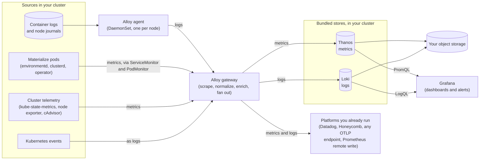

# How logs and metrics are stored and delivered
Where Self-Managed Materialize stores the metrics and logs it collects, and the backends it can forward them to.
The monitoring stack installed by the [Materialize Terraform
Modules](/self-managed-deployments/installation/#install-using-terraform-modules) collects metrics from Materialize, along with
container logs and Kubernetes events. It stores both signals, and
can forward either to observability platforms you already run.

This page covers where that data is stored.

## How it works

Materialize captures and stores logs and metrics.



1. A **Grafana Alloy agent** runs as a DaemonSet on every node and tails
   container logs.

1. A **Grafana Alloy gateway** does the processing. It receives logs from the
   agents, collects Kubernetes events, and scrapes metrics from Materialize and
   from the cluster using the `ServiceMonitor` and `PodMonitor` resources the
   chart installs. It normalizes and enriches both streams.

1. The gateway **forwards** each stream to one or more destinations. Metrics go
   to any number of metric backends, and logs to any number of log backends.

The default install points the gateway at storage that runs inside your cluster:
**Thanos** for metrics and **Loki** for logs, both persisting to object storage
the Terraform modules create. Neither is something you interact with directly.
You query them through Grafana, and you can add or replace them without changing
how anything is collected.

Because the fan-out happens at the gateway, every destination is configured in
one place, and each one receives its own independently filtered copy.

Processing happens before storage. The gateway normalizes log levels, reduces
label cardinality, and extracts structured metadata as logs pass through, and it
enriches metrics as it scrapes them. Whatever reaches an external destination
arrives already processed, the same as what lands in the bundled stores.

## The bundled stores

Metrics are stored in **Thanos** and logs in **Loki**. Both run in the
`monitoring` namespace and persist to object storage that the Materialize
Terraform Modules create, and neither is something you interact with directly:
the bundled Grafana queries both, and the
[Alertmanager](/manage/monitor/self-managed/alerting/) rules evaluate against
them. The examples publish both query endpoints as Terraform outputs:

```bash
terraform output -raw metrics_url   # Thanos Query, Prometheus-API-compatible
terraform output -raw logs_url      # Loki read endpoint
```

The two stores differ in how they retain data.

### Metrics, in Thanos

**One Prometheus-compatible endpoint.** Thanos Query federates recent data and
historical data behind a single PromQL API, so any tool that speaks the
Prometheus query API works against it unchanged.

**Storage is object storage, not disks you size.** Thanos Receive accepts the
gateway's writes and uploads blocks to the bucket. A store gateway serves
historical blocks back out of it for queries, and a compactor compacts and
downsamples them. There is no volume to grow as retention increases, only cost.

**Retention is per resolution.** The compactor keeps three resolutions with
independent retention, so a year-wide query reads hourly blocks rather than raw
samples:

| Resolution | Default retention |
|------------|-------------------|
| raw | 30 days |
| 5 minute | 90 days |
| 1 hour | 365 days |

Tune these to trade storage cost against how far back high-resolution data stays
available. Raw retention has a floor worth knowing about: Thanos produces
5 minute downsamples only from blocks spanning 40 hours or more, and 1 hour
downsamples only from blocks spanning 10 days or more, so cutting raw retention
below those thresholds means the coarser tiers are never created and long-range
queries fall back to reading raw blocks. The 30 day default clears both
comfortably.

For the sizing profiles, the component layout, and the object-storage
configuration, see [Metrics > Storing
⧉](https://materializeinc.github.io/materialize-monitoring/metrics/storing/).

### Logs, in Loki

**Retention is enforced by Loki, not by bucket lifecycle rules.** The default is
30 days for everything. Loki also supports per-stream retention, which is the
main cost lever at volume: keep `ERROR` and audit-relevant streams far longer
than high-volume `INFO` chatter. A deletion API handles targeted deletes outside
the normal retention schedule.

> **Note:** Loki's ingesters run on node-local ephemeral storage rather than persistent
> volumes, and durability comes from running at least three replicas. Scale them on
> memory and stream cardinality rather than on bytes ingested.

For the storage layout, the object-storage configuration, and disaster recovery,
see [Logs and events > Storing
⧉](https://materializeinc.github.io/materialize-monitoring/logs-and-events/storing/).

## Sending metrics and logs elsewhere

The gateway can send either signal to backends outside the cluster. There are two
shapes to this, and the difference matters more than the choice of vendor:

**Additive destinations** run alongside the bundled stores. Each one receives its
own copy, with its own filter, so full-fidelity local storage and a smaller,
cheaper slice to a metered platform are the same install rather than a tradeoff.
Several additive destinations can run at once.

**Replacements take over a bundled store's single sink.** Each signal has exactly
one: the metrics remote-write endpoint, which the bundled Thanos occupies, and
the Loki push endpoint. Pointing either at something external means the bundled
store stops receiving that signal.

| Destination | Metrics | Logs | Shape | Guide |
|-------------|---------|------|-------|-------|
| Thanos and Loki, in-cluster | Yes | Yes | The default sinks | This page |
| Datadog | Yes | Yes | Additive, through the Datadog exporter | [Datadog](/manage/monitor/self-managed/datadog/) |
| Honeycomb | Yes | Yes | Additive, over OTLP | [Honeycomb](/manage/monitor/self-managed/honeycomb/) |
| Any OTLP endpoint, including your own OpenTelemetry Collector | Yes | Yes | Additive | [OpenTelemetry](/manage/monitor/self-managed/opentelemetry/) |
| Google Cloud Monitoring | Yes | No | Additive, GCP only | [Google Cloud Monitoring](/manage/monitor/self-managed/google-cloud-monitoring/) |
| Mimir, Amazon Managed Prometheus, Grafana Cloud, another Thanos | Yes | No | Replaces Thanos | [Prometheus remote write](/manage/monitor/self-managed/prometheus-remote-write/) |
| A Loki you run elsewhere, or another cluster's gateway | No | Yes | Replaces the bundled Loki | [Logs and events > Storing ⧉](https://materializeinc.github.io/materialize-monitoring/logs-and-events/storing/) |

Three things follow from that table.

**Google Cloud Monitoring is the one destination that cannot receive logs.** Its
exporter is metrics-only, and enabling the log path with Cloud Monitoring as the
only OpenTelemetry destination fails the install rather than silently dropping
them. For logs on GCP, use an [OTLP
destination](/manage/monitor/self-managed/opentelemetry/) or keep them in the
bundled Loki.

**A platform that accepts both OTLP and remote write can be reached either way.**
Grafana Cloud is the common case. Prefer the additive OTLP path if you want to
keep the bundled Thanos.

**Running with a bundled store disabled entirely is supported.** The agents and
gateway still collect and process in-cluster, and everything from storage onward
lives somewhere else.

Logs and metrics share one destination configuration, so sending logs to an OTLP
or Datadog destination reuses the one you have already set up for metrics rather
than defining a second.

## Choosing what each destination receives

Every metric the stack collects carries an *importance* tier, and each
destination keeps only the metrics at or above a floor you choose. The tiers
below run from most to least important, and the floor is cumulative: it keeps
that tier and every tier above it.

| Tier | What it covers |
|------|----------------|
| `essential` | The metrics that are critical and that you would always want available. These are the ones used in alerting. |
| `recommended` | The metrics used in dashboards, and generally desirable for troubleshooting. |
| `extended` | The metrics used by optional and experimental dashboards. |
| `diagnostic` | The metrics used for in-depth troubleshooting and analysis. |
| `all` | Absolutely everything scraped, including metrics no tier classifies. Suited to cheap storage such as the bundled Thanos, not to a metered backend. |

The tiers are shared across the stack, so a tier selected in Terraform means the
same set of metrics as the same tier selected in Helm. For the membership of each
tier, see [List of metrics
⧉](https://materializeinc.github.io/materialize-monitoring/reference/stable-metrics/list-metrics/).
For the metrics Materialize recommends dashboarding and alerting on, see
[essential metrics](/manage/monitor/essential-metrics/), and for everything it
exposes, the [appendix of all metrics](/manage/monitor/appendix-metrics/).

> **Note:** The `extended` and `diagnostic` tiers are still being populated, so today they
> resolve to the same set as `recommended`. To send everything that is scraped, use
> `all`, not `diagnostic`.

> **Warning:** The filter fails open. If the allowlist reaches the gateway empty, the gateway
> sends everything to that destination rather than nothing. That is safe for
> visibility and expensive on a metered backend, so check the receiving backend's
> ingest volume after a configuration change.

### Forwarding logs to an OpenTelemetry destination

The gateway collects logs as well as metrics, and can forward them to the same
OpenTelemetry destinations. The bundled Loki continues to receive them either
way. Enable it through `additional_values` on the `monitoring` module block:

```hcl
additional_values = [
  <<-EOT
    pipeline:
      logging:
        gateway:
          destination:
            otel:
              enabled: true
  EOT
]
```

The switch is not per-destination. It turns on the log path to every logs-capable
exporter the gateway has enabled, so if you have both a Datadog and a generic
OTLP destination configured, both receive the logs. Google Cloud Monitoring is
metrics-only and cannot receive them, and enabling the switch with no logs-capable
exporter configured fails the install rather than silently dropping the logs.

Logs are considerably higher volume than metrics, and backends generally bill for
them separately from metrics. Turn this on deliberately.

## Connect existing tooling

Anything that speaks the Prometheus query API or Loki's query API can read the
bundled stores directly, without a destination being configured for it:

```bash
terraform output -raw metrics_url
terraform output -raw logs_url
```

That is a pull model: your tooling queries the stack on its own schedule. The
destinations above are push models, where the gateway delivers data to the
backend. A platform you already run for other services usually wants the push
model, so its alerting and dashboards work without reaching into this cluster.

## See also

- [Grafana](/manage/monitor/self-managed/grafana/), for the bundled dashboards
  and how to reach them.

- [Alerting](/manage/monitor/self-managed/alerting/), for the metrics and
  thresholds to alert on.
