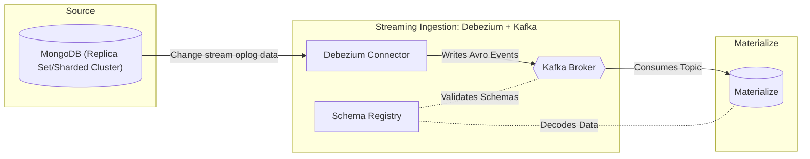

<!-- mz-docs page: ingest-data -->

# Ingest data

Best practices for ingesting data into Materialize from external systems.

You can ingest data into Materialize from various external systems:

| Type | External system |
|------|-----------------|
| **Databases (CDC): native connectors** | [PostgreSQL](/ingest-data/postgres/) <br> [MySQL](/ingest-data/mysql/) <br> [SQL Server](/ingest-data/sql-server/) |
| **Databases (CDC): via the Kafka connector** | [CockroachDB](/ingest-data/cdc-cockroachdb/) (using changefeeds) <br> [MongoDB](/ingest-data/mongodb/) (using Debezium) |
| **Message brokers** | [Kafka](/ingest-data/kafka/) <br> [Redpanda](/sql/create-source/kafka) |
| **Webhooks** | [Amazon EventBridge](/ingest-data/webhooks/amazon-eventbridge/) <br> [Segment](/ingest-data/webhooks/segment/) <br> [HubSpot](/ingest-data/webhooks/hubspot/) <br> [RudderStack](/ingest-data/webhooks/rudderstack/) <br> [SnowcatCloud](/ingest-data/webhooks/snowcatcloud/) <br> [Stripe](/ingest-data/webhooks/stripe/)|

## Sources and clusters

Materialize ingests data from external systems using
[sources](/fundamentals/concepts/sources/). For the sources, you need to associate a
[cluster](/fundamentals/concepts/clusters/) to provide the compute resources needed to ingest
data.

> **Tip:** If possible, dedicate a cluster just for sources.

## Snapshotting

Snapshotting is the initial sync of a table's data. It reads from the upstream
system and writes the data into Materialize's storage. The initial snapshot is
committed to storage atomically, with all records assigned the same ingestion
timestamp.

### When snapshotting occurs

When snapshotting occurs depends on the syntax.

- With the legacy [`CREATE SOURCE ... FOR <ALL
  TABLES|TABLES|SCHEMAS>`](/sql/create-source/#legacy-syntax), you run a single
  statement to create both the source and the tables that ingest data.
  Snapshotting begins when you run the statement. For an existing source, the
  legacy [`ALTER SOURCE ... ADD SUBSOURCE`](/sql/alter-source/) starts the
  snapshotting for the added table.

- With the source-versioning syntax, you create the source and its tables
  separately using [`CREATE SOURCE ...`](/sql/create-source/#new-syntax) and
  [`CREATE TABLE ... FROM SOURCE`](/sql/create-table/). Snapshotting begins when
  you run `CREATE TABLE ... FROM SOURCE`.

### Duration

Snapshot duration depends on:

- Volume of upstream data
- Size of the source's cluster
- Upstream capacity to serve the read, on top of its normal workload
- Network path between the upstream system and Materialize

In cloud environments, an instance's network and disk throughput are typically
capped by its instance type, so a busy or throughput-limited upstream, or a
constrained network path, can be the bottleneck regardless of the source
cluster's size.

For **upsert** sources, snapshotting can be especially resource-intensive
(compared to append-only), and large upsert sources can take hours to snapshot.

To reduce the operational burden of snapshotting on the upstream system and
ensure you are only bringing in the volume of data that you need in Materialize,
we recommend:

- If possible, running source creation operations during **off-peak hours** to
  minimize operational risk in both the upstream system and Materialize.

- **Limiting the volume of data** that is synced into Materialize on source
  creation. This will help speed up snapshotting, as well as make data
  exploration more lightweight. See [Limit the volume of
  data](#limit-the-volume-of-data) for best practices.

- **For upsert sources**, overprovisioning the source cluster for snapshotting,
  then right-sizing once the snapshot is complete and you have a better grasp on
  the steady-state resource needs of your upsert source(s). See [Best practices:
  Upsert sources](#upsert-sources).

### Parallelism

Materialize can parallelize snapshotting across the workers of the cluster
hosting the source.

- **PostgreSQL sources** are parallelized by table, i.e., different tables
  are read concurrently by different workers. On PostgreSQL 14 and later,
  Materialize additionally attempts to partition each table's read across
  workers. Tables that cannot be partitioned fall back to a single worker.

- **MySQL sources** are parallelized by table, i.e., different tables are
  read concurrently by different workers. For tables that meet certain
  requirements, Materialize can additionally partition the table's read
  across workers. See [MySQL snapshot
  parallelism](/ingest-data/mysql/snapshot-parallelism/).

- **Kafka sources** are parallelized by topic partition, with partitions
  distributed across workers, so parallelism is bounded by the topic's
  partition count.

- **SQL Server sources** are not parallelized: a single worker reads all
  tables.

The degree of snapshot parallelism depends on the number of workers. A
cluster's [size](/sql/create-cluster/#available-sizes) determines its number
of workers, so a larger cluster can shorten the snapshot, to the extent the
work parallelizes and the upstream database keeps up. The volume read from
the upstream database is unchanged, it is compressed into a shorter window
of more concurrent queries and connections. To determine whether
snapshotting is overloading the upstream database, and for ways to mitigate
the load, see [Is the upstream database
overloaded?](/ingest-data/troubleshooting/#is-the-upstream-database-overloaded)

### Monitoring progress

While snapshotting is taking place, you can monitor the progress of the
operation in the **overview page** for the source in the [Materialize
Console](/developer-tools/console/data/#sample-source-overview). Alternatively, you can manually
keep track of using information from the system catalog. See [Monitoring the
snapshotting
progress](/ingest-data/monitoring-data-ingestion/#monitoring-the-snapshotting-progress)
for guidance.

It's also important to **monitor CPU and memory utilization** for the cluster
hosting the source during snapshotting. If there are signs of resource
exhaustion, you may need to [resize the cluster](#use-a-larger-cluster-for-upsert-source-snapshotting).

### Queries during snapshotting

<!--
Syntax-specific (legacy and source-versioning) query behavior during
snapshotting. For the generic (syntax-agnostic) version, see
headless/ingestion/snapshotting-ingestion.md.
-->

Queries on a table that is snapshotting are blocked until its snapshot
completes.

- With the legacy `CREATE` syntax:

  - None of the subsources created as part of `CREATE SOURCE ... FOR ...` are
    queryable until they have all finished snapshotting.

  - When altering a source to add a new subsource (`ALTER SOURCE ... ADD
    SUBSOURCE`), only the new subsource snapshots. The source's other subsources
    remain queryable. **However**, ingestion for these subsources is temporarily
    blocked, so they stop advancing until the snapshot completes.

- With the source-versioning `CREATE TABLE FROM SOURCE` syntax:

  - None of the tables created within a [transaction
    block](/sql/begin/#ddl-only-transactions) are queryable until all their
    snapshots complete.

  - When you create new tables from a source that already has tables, only the
    new tables snapshot. The source's existing tables remain queryable.
    **However**, ingestion for the existing tables is temporarily blocked, so
    they stop advancing until the snapshots for the new tables complete.

### Modifying an existing source

<!--
Generic (syntax-agnostic) version of the "existing tables blocked" behavior.
Keep in sync with the syntax-specific version in
headless/ingestion/snapshotting-queries.md.
-->

When you create additional tables for a source that already has tables ingesting
data, ingestion for the existing tables is blocked while the new tables
snapshot. The existing tables remain queryable, but they stop advancing until
the new tables' snapshots complete.

If possible, resize the cluster to speed up the snapshot, then right-size it once
snapshotting completes.

## Running/steady-state

Once snapshotting completes, Materialize transitions to Running state. During
this state, Materialize continually ingests changes from the upstream system.

### Queries during steady-state

Although Materialize is continually ingesting changes from the upstream system,
depending on the volume of the upstream changes, Materialize may lag behind the
upstream system. If the lag is significant, queries may block until Materialize
has caught up sufficiently with the upstream system when using the default
[isolation level](/serve-results/isolation-level/) of [strict
serializability](/serve-results/isolation-level/#strict-serializable).

In the Materialize Console, you can see a source's data freshness from the
**Data Explorer** screen. Alternatively, you can run a query to monitor the lag.
See [Monitoring hydration/data freshness status](/ingest-data/monitoring-data-ingestion/#monitoring-hydrationdata-freshness-status).

## Hydration

Hydration is the reconstruction of an object's in-memory state by reading
from Materialize's storage layer and existing indexes; hydration does not
read from the upstream system.

When a cluster is restarted (such as after resizing), certain objects on that
cluster  (such as Kafka upsert sources, indexes, materialized views, and sinks)
undergo hydration. For the full list of events that trigger hydration and the
affected objects, see [Hydration](/fundamentals/concepts/hydration/).

> **Tip:** If possible, use a dedicated cluster just for sources. That is, avoid
> using the same cluster for sources and other objects, such as sinks, etc.
> See [Best practices](#best-practices) for more details.

### Process

During hydration, data from Materialize's storage layer is read to reconstruct
the in-memory state of the object. As part of the hydration process:

- Internal data structures are re-created.

- Various processes are re-initiated. These processes may also require
  re-reading of their in-memory state.

### Duration

For a source, the duration of its hydration depends on the type and the size
of the source; e.g., large `UPSERT` sources can take hours to complete.

### Queries during hydration

During hydration, queries usually block until the process has been completed.

## Best practices

The following lists some general best practice guidelines as well as additional
guidelines for upsert sources.

### Scheduling

If possible, schedule creating new sources during off-peak hours to mitigate
the impact of snapshotting on both the upstream system and the Materialize
cluster.

### Dedicate a cluster for the sources

If possible, dedicate a cluster just for sources. That is, avoid using the same
cluster for sources and sinks/indexes/materialized views (and other compute objects).

### Limit the volume of data

If possible, limit the volume of data that needs to be synced into Materialize
on source creation. This will help speed up snapshotting as well as make data
exploration more lightweight.

For example, when creating a PostgreSQL source, you may want to create a
publication with specific tables rather than for all tables in the database.

Once the data is in Materialize, you can further [reduce the size of the
data](/transform-data/optimization/#reduce-the-size-of-the-data) maintained by
your view definitions.

### Upsert sources

In addition to the general best practices, the following additional best
practices apply to upsert sources.

#### Use a larger cluster for upsert source snapshotting

When you create a new source, Materialize performs a one-time [snapshotting
operation](#snapshotting) to initially populate the source in Materialize. For
upsert sources, snapshotting is a resource-intensive operation that can require
a significant amount of CPU and memory.

Consider using a [larger cluster size](/sql/alter-cluster/#alter-cluster-size)
during snapshotting for upsert sources. Once the snapshotting operation is
complete, you can downsize the cluster to align with the steady-state ingestion.

If the cluster hosting the source restarts during snapshotting (e.g., because it
ran out of memory), you can scale up to a [larger
size](/sql/alter-cluster/#alter-cluster-size) to complete the operation.

```sql
ALTER CLUSTER <cluster_name> SET ( SIZE = <new_size> );
```

> **Note:** Resizing a cluster with sources requires the cluster to restart. This operation
> incurs downtime for the duration it takes for all objects in the cluster to
> [hydrate](/ingest-data/#hydration).
> You might want to let the new-sized replica hydrate before shutting down the
> current replica. See the [resizing
> process](/sql/alter-cluster/#resizing-process) about automating
> this process.

Once the initial snapshot has completed, you can resize the cluster for steady
state.

#### Right-size the cluster for steady-state

Once the initial snapshot has completed, you can
[resize](/sql/alter-cluster/#resizing)  the cluster
to align with the volume of changes being replicated from your upstream in
steady-state.

```sql
ALTER CLUSTER <cluster_name> SET ( SIZE = <new_size> );
```

> **Note:** Resizing a cluster with sources requires the cluster to restart. This operation
> incurs downtime for the duration it takes for all objects in the cluster to
> [hydrate](#hydration).
> You might want to let the new-sized replica hydrate before shutting down the
> current replica. See the [resizing
> process](/sql/alter-cluster/#resizing-process) about automating
> this process.

## See also

- [Monitoring data ingestion](/ingest-data/monitoring-data-ingestion)
- [Troubleshooting data ingestion](/ingest-data/troubleshooting)

---

## Amazon EventBridge

This guide walks through the steps to ingest data from [Amazon EventBridge](https://aws.amazon.com/eventbridge/)
into Materialize using the [Webhook source](/sql/create-source/webhook/).

> **Tip:** For help getting started with your own data, you can schedule a [free guided
> trial](https://materialize.com/demo/?utm_campaign=General&utm_source=documentation).

## Before you begin

Ensure that you have:

- An [EventBridge-enabled Amazon Simple Storage Service (S3) bucket](https://docs.aws.amazon.com/AmazonS3/latest/user-guide/Welcome.html).

## Step 1. (Optional) Create a cluster

> **Note:** If you are prototyping and already have a cluster to host your webhook
> source (e.g. `quickstart`), **you can skip this step**. For production
> scenarios, we recommend separating your workloads into multiple clusters for
> [resource isolation](/sql/create-cluster/#resource-isolation).

To create a cluster in Materialize, use the [`CREATE CLUSTER` command](/sql/create-cluster):

```mzsql
CREATE CLUSTER webhooks_cluster (SIZE = '25cc');

SET CLUSTER = webhooks_cluster;
```

## Step 2. Create a secret

To validate requests between Amazon EventBridge and Materialize, you must create
a [secret](/sql/create-secret/):

```mzsql
CREATE SECRET eventbridge_webhook_secret AS '<secret_value>';
```

Change the `<secret_value>` to a unique value that only you know and store it in
a secure location.

## Step 3. Set up a webhook source

Using the secret from the previous step, create a [webhook source](/sql/create-source/webhook/)
in Materialize to ingest data from Amazon EventBridge. By default, the source
will be created in the active cluster; to use a different cluster, use the `IN
CLUSTER` clause.

```mzsql
CREATE SOURCE eventbridge_source
FROM WEBHOOK
  BODY FORMAT JSON
  -- Include all headers, but filter out the secret.
  INCLUDE HEADERS ( NOT 'x-mz-api-key' )
  CHECK (
    WITH ( HEADERS, SECRET eventbridge_webhook_secret AS validation_secret)
    -- The constant_time_eq validation function **does not support** fully
    -- qualified secret names. We recommend always aliasing the secret name
    -- for ease of use.
    constant_time_eq(headers->'x-mz-api-key', validation_secret)
  );
```

After a successful run, the command returns a `NOTICE` message containing the
unique [webhook URL](/sql/create-source/webhook/#webhook-url)
that allows you to `POST` events to the source. Copy and store it. You will need
it for the next step.

The URL will have the following format:

```
https://<HOST>/api/webhook/<database>/<schema>/<src_name>
```

If you missed the notice, you can find the URLs for all webhook sources in the
[`mz_internal.mz_webhook_sources`](/sql/system-catalog/mz_internal/#mz_webhook_sources)
system table.

### Access and authentication

> **Warning:** Without a `CHECK` statement, **all requests will be accepted**. To prevent bad
> actors from injecting data into your source, it is **strongly encouraged** that
> you define a `CHECK` statement with your webhook sources.

The above webhook source uses [basic authentication](https://developer.mozilla.org/en-US/docs/Web/HTTP/Authentication#basic_authentication_scheme).
This enables a simple and rudimentary way to grant authorization to your webhook source.

### Throughput

If your throughput exceeds the [maximum request rate](/sql/create-source/webhook/#request-limits),
we recommend [batching multiple events](/sql/create-source/webhook/#handling-batch-events)
into a single request, for example using [EventBridge Pipes](https://docs.aws.amazon.com/eventbridge/latest/userguide/eb-pipes-batching-concurrency.html).

## Step 4. Create an API destination in Amazon EventBridge

[//]: # "TODO(morsapaes) This needs to be broken down into instructions, same as
the other guides."

For guidance on creating an API destination in Amazon EventBridge to connect to
Materialize, check out [this guide](https://docs.aws.amazon.com/eventbridge/latest/userguide/eb-tutorial-datadog.html).
Use the secret created in **Step 2.** as the **API key name** for request
validation.

## Step 5. Validate incoming data

With the source set up in Materialize and the API destination configured in
Amazon EventBridge, you can now query the incoming data:

1. [In the Materialize console](/developer-tools/console/), navigate to
   the **SQL Shell**.

1. Use SQL queries to inspect and analyze the incoming data:

    ```mzsql
    SELECT * FROM eventbridge_source LIMIT 10;
    ```

## Step 6. Transform incoming data

### JSON parsing

Webhook data is ingested as a JSON blob. We recommend creating a parsing view on
top of your webhook source that uses [`jsonb` operators](/sql/types/jsonb/#operators)
to map the individual fields to columns with the required data types.

Manually parsing JSON-formatted data in SQL can be tedious. You can use the [interactive JSON parser widget](https://materialize.com/docs/sql/types/jsonb/#parsing) to automatically turn a sample JSON payload into a parsing view with the individual fields mapped to columns.

### Timestamp handling

We highly recommend using the [`try_parse_monotonic_iso8601_timestamp`](/transform-data/patterns/temporal-filters/#temporal-filter-pushdown)
function when casting from `text` to `timestamp`, which enables [temporal filter
pushdown](/transform-data/patterns/temporal-filters/#temporal-filter-pushdown).

### Deduplication

With the vast amount of data processed and potential network issues, it's not
uncommon to receive duplicate records. You can use the `DISTINCT ON` clause to
efficiently remove duplicates. For more details, refer to the webhook source
[reference documentation](/sql/create-source/webhook/#handling-duplicated-and-partial-events).

## Next steps

With Materialize ingesting your Amazon EventBridge data, you can start exploring it,
computing real-time results that stay up-to-date as new data arrives, and
serving results efficiently. For more details, check out the
[Amazon EventBridge documentation](https://docs.aws.amazon.com/eventbridge/) and the
[webhook source reference documentation](/sql/create-source/webhook/).

---

## AWS PrivateLink connections (Cloud-only)

Materialize can connect to a Kafka broker, a Confluent Schema Registry server, a
PostgreSQL database, or a MySQL database through an [AWS PrivateLink](https://aws.amazon.com/privatelink/)
service.

In this guide, we'll cover how to create `AWS PRIVATELINK` connections and
retrieve the AWS principal needed to configure the AWS PrivateLink service.

## Create an AWS PrivateLink connection

**Kafka on AWS:**

> **Note:** Materialize provides a Terraform module that automates the creation and
> configuration of AWS resources for a PrivateLink connection. For more details,
> see the Terraform module repositories for [Amazon MSK](https://github.com/MaterializeInc/terraform-aws-msk-privatelink)
> and [self-managed Kafka clusters](https://github.com/MaterializeInc/terraform-aws-kafka-privatelink).

This section covers how to create AWS PrivateLink connections
and retrieve the AWS principal needed to configure the AWS PrivateLink service.

1. Create target groups. Create a dedicated [target
   group](https://docs.aws.amazon.com/elasticloadbalancing/latest/network/create-target-group.html)
   **for each broker** with the following details:

    a. Target type as **IP address**.

    b. Protocol as **TCP**.

    c. Port as **9092**, or the port that you are using in case it is not 9092 (e.g. 9094 for TLS or 9096 for SASL).

    d. Make sure that the target group is in the same VPC as the Kafka cluster.

    e. Click next, and register the respective Kafka broker to each target group using its IP address.

1. Create a [Network Load
    Balancer](https://docs.aws.amazon.com/elasticloadbalancing/latest/network/create-network-load-balancer.html)
    that is **enabled for the same subnets** that the Kafka brokers are in.

1. Create a [TCP
   listener](https://docs.aws.amazon.com/elasticloadbalancing/latest/network/create-listener.html)
   for every Kafka broker that forwards to the corresponding target group you
   created (e.g. `b-1`, `b-2`, `b-3`).

    The listener port needs to be unique, and will be used later on in the `CREATE CONNECTION` statement.

    For example, you can create a listener for:

    a. Port `9001` → broker `b-1...`.

    b. Port `9002` → broker `b-2...`.

    c. Port `9003` → broker `b-3...`.

1. Verify security groups and health checks. Once the TCP listeners have been
   created, make sure that the [health
   checks](https://docs.aws.amazon.com/elasticloadbalancing/latest/network/target-group-health-checks.html)
   for each target group are passing and that the targets are reported as
   healthy.

    If you have set up a security group for your Kafka cluster, you must ensure that it allows traffic on both the listener port and the health check port.

    **Remarks**:

    - By default, Network Load Balancers do not have associated security
      groups. In addition, target security groups cannot use client security
      groups as a traffic source. Therefore, the security groups for your
      targets must allow traffic using IP address ranges rather than security
      group references. For more information, see the [AWS
      documentation](https://docs.aws.amazon.com/elasticloadbalancing/latest/network/target-group-register-targets.html).

    - If you use [network ACLs
      (NACLs)](https://docs.aws.amazon.com/vpc/latest/userguide/vpc-network-acls.html)
      and traffic between the NLB and its targets crosses subnet boundaries,
      the NACLs must allow both the application port and the ephemeral port
      range (1024–65535) for return traffic. This can occur when cross-zone
      load balancing is enabled, or when the NLB and its targets reside in
      different subnets, even within the same Availability Zone.

      For example, if a target application listens on port 9098, the target
      subnet must allow ingress on port 9098 from the NLB's IP ranges and
      egress on the ephemeral port range (1024–65535) to those ranges
      for return traffic. Likewise, the NLB subnet must allow egress on
      port 9098 to the target IP ranges and ingress on the ephemeral port
      range from them.

    - If you have associated a security group with your Network Load Balancer
      and enabled **Enforce inbound rules on PrivateLink traffic**, the
      security group's inbound rules also apply to traffic from Materialize's
      VPC endpoint. Any traffic not explicitly permitted, including
      Materialize's, will be silently blocked.

      To resolve this, either:
      - Add inbound rules to the NLB's security group that permit the listener
        port and the health check port from a source covering Materialize's
        VPC endpoint traffic, or
      - Disable **Enforce inbound rules on PrivateLink traffic**.

1. Create a VPC [endpoint service](https://docs.aws.amazon.com/vpc/latest/privatelink/create-endpoint-service.html) and associate it with the **Network Load Balancer** that you’ve just created.

    Note the **service name** that is generated for the endpoint service.

1. Create an AWS PrivateLink connection. In Materialize, create an [AWS
    PrivateLink connection](/sql/create-connection/#aws-privatelink) that
    references the endpoint service that you created in the previous step.

    ↕️ **In-region connections**

    To connect to an AWS PrivateLink endpoint service in the **same region** as your
    Materialize environment:

      ```mzsql
      CREATE CONNECTION privatelink_svc TO AWS PRIVATELINK (
        SERVICE NAME 'com.amazonaws.vpce.<region_id>.vpce-svc-<endpoint_service_id>',
        AVAILABILITY ZONES ('use1-az1', 'use1-az2', 'use1-az4')
      );
      ```

    - Replace the `SERVICE NAME` value with the service name you noted earlier.

    - Replace the `AVAILABILITY ZONES` list with the IDs of the availability
      zones in your AWS account. For in-region connections the availability
      zones of the NLB and the consumer VPC **must match**.

      To find your availability zone IDs, select your database in the RDS
      Console and click the subnets under **Connectivity & security**. For each
      subnet, look for **Availability Zone ID** (e.g., `use1-az6`),
      not **Availability Zone** (e.g., `us-east-1d`).

    ↔️ **Cross-region connections**

    To connect to an AWS PrivateLink endpoint service in a **different region** to
    the one where your Materialize environment is deployed:

      ```mzsql
      CREATE CONNECTION privatelink_svc TO AWS PRIVATELINK (
        SERVICE NAME 'com.amazonaws.vpce.us-west-1.vpce-svc-<endpoint_service_id>',
        -- For now, the AVAILABILITY ZONES clause **is** required, but will be
        -- made optional in a future release.
        AVAILABILITY ZONES ()
      );
      ```

    - Replace the `SERVICE NAME` value with the service name you noted earlier.

    - The service name region refers to where the endpoint service was created.
      You **do not need** to specify `AVAILABILITY ZONES` manually — these will
      be optimally auto-assigned when none are provided.

    - For Kafka connections, it is required for [cross-zone load balancing](https://docs.aws.amazon.com/elasticloadbalancing/latest/network/network-load-balancers.html) to be
      enabled on the VPC endpoint service's NLB when using cross-region Privatelink.

1. Configure the AWS PrivateLink service. Retrieve the AWS principal for the AWS
    PrivateLink connection you just created:

      ```mzsql
    SELECT principal
    FROM mz_aws_privatelink_connections plc
    JOIN mz_connections c ON plc.id = c.id
    WHERE c.name = 'privatelink_svc';
    ```

    ```
                                     principal
    ---------------------------------------------------------------------------
     arn:aws:iam::664411391173:role/mz_20273b7c-2bbe-42b8-8c36-8cc179e9bbc3_u1
    ```

    Follow the instructions in the [AWS PrivateLink documentation](https://docs.aws.amazon.com/vpc/latest/privatelink/add-endpoint-service-permissions.html)
    to configure your VPC endpoint service to accept connections from the
    provided AWS principal.

1. If your AWS PrivateLink service is configured to require acceptance of connection requests, you must manually approve the connection request from Materialize after executing `CREATE CONNECTION`. For more details, check the [AWS PrivateLink documentation](https://docs.aws.amazon.com/vpc/latest/privatelink/configure-endpoint-service.html#accept-reject-connection-requests).

    **Note:** It might take some time for the endpoint service connection to show up, so you would need to wait for the endpoint service connection to be ready before you create a source.

1. Validate the AWS PrivateLink connection you created using the [`VALIDATE CONNECTION`](/sql/validate-connection) command:

   ```mzsql
   VALIDATE CONNECTION privatelink_svc;
   ```

   If no validation error is returned, move to the next step.

1. Create a source connection

   In Materialize, create a source connection that uses the AWS PrivateLink
connection you just configured:

   ```mzsql
   CREATE CONNECTION kafka_connection TO KAFKA (
       BROKERS (
           -- The port **must exactly match** the port assigned to the broker in
           -- the TCP listerner of the NLB.
           'b-1.hostname-1:9096' USING AWS PRIVATELINK privatelink_svc (PORT  9001, AVAILABILITY ZONE 'use1-az2'),
           'b-2.hostname-2:9096' USING AWS PRIVATELINK privatelink_svc (PORT  9002, AVAILABILITY ZONE 'use1-az1'),
           'b-3.hostname-3:9096' USING AWS PRIVATELINK privatelink_svc (PORT  9003, AVAILABILITY ZONE 'use1-az4')
       ),
       -- Authentication details
       -- Depending on the authentication method the Kafka cluster is using
       SASL MECHANISMS = 'SCRAM-SHA-512',
       SASL USERNAME = 'foo',
       SASL PASSWORD = SECRET kafka_password
   );
   ```

   If you run into connectivity issues during source creation, make sure that:

   * The `(PORT <port_number>)` value **exactly matches** the port assigned to
      the corresponding broker in the **TCP listener** of the Network Load
      Balancer. Misalignment between ports and broker addresses is the most
      common cause for connectivity issues.

   * For **in-region connections**, the correct availability zone is specified
      for each broker.

**PostgreSQL on AWS:**

> **Note:** Materialize provides a Terraform module that automates the creation and
> configuration of AWS resources for a PrivateLink connection. For more details,
> see the [Terraform module repository](https://github.com/MaterializeInc/terraform-aws-rds-privatelink).

1. #### Create target groups
    Create a dedicated [target group](https://docs.aws.amazon.com/elasticloadbalancing/latest/network/create-target-group.html) for your RDS or Aurora instance with the following details:

    a. Target type as **IP address**.

    b. Protocol as **TCP**.

    c. Port as **5432**, or the port that you are using in case it is not 5432.

    d. Make sure that the target group is in the same VPC as the RDS or Aurora instance.

    e. Click next, and register the respective RDS or Aurora instance to the target group using its IP address.

1. #### Create a Network Load Balancer (NLB)
    Create a [Network Load Balancer](https://docs.aws.amazon.com/elasticloadbalancing/latest/network/create-network-load-balancer.html) that is **enabled for the same subnets** that the RDS or Aurora instance is in.

1. #### Create TCP listeners

    Create a [TCP listener](https://docs.aws.amazon.com/elasticloadbalancing/latest/network/create-listener.html) for your RDS or Aurora instance that forwards to the corresponding target group you created.

1. #### Verify security groups and health checks

    Once the target groups have been created, make sure that the [health checks](https://docs.aws.amazon.com/elasticloadbalancing/latest/network/target-group-health-checks.html) are passing and that the targets are reported as healthy.

    If you have set up a security group for your RDS or Aurora instance, you must ensure that it allows traffic on the health check port.

    **Remarks**:

    - By default, Network Load Balancers do not have associated security
      groups. In addition, target security groups cannot use client security
      groups as a traffic source. Therefore, the security groups for your
      targets must allow traffic using IP address ranges rather than security
      group references. For more information, see the [AWS
      documentation](https://docs.aws.amazon.com/elasticloadbalancing/latest/network/target-group-register-targets.html).

    - If you use [network ACLs
      (NACLs)](https://docs.aws.amazon.com/vpc/latest/userguide/vpc-network-acls.html)
      and traffic between the NLB and its targets crosses subnet boundaries,
      the NACLs must allow both the application port and the ephemeral port
      range (1024–65535) for return traffic. This can occur when cross-zone
      load balancing is enabled, or when the NLB and its targets reside in
      different subnets, even within the same Availability Zone.

      For example, if a target application listens on port 9098, the target
      subnet must allow ingress on port 9098 from the NLB's IP ranges and
      egress on the ephemeral port range (1024–65535) to those ranges
      for return traffic. Likewise, the NLB subnet must allow egress on
      port 9098 to the target IP ranges and ingress on the ephemeral port
      range from them.

    - If you have associated a security group with your Network Load Balancer
      and enabled **Enforce inbound rules on PrivateLink traffic**, the
      security group's inbound rules also apply to traffic from Materialize's
      VPC endpoint. Any traffic not explicitly permitted, including
      Materialize's, will be silently blocked.

      To resolve this, either:
      - Add inbound rules to the NLB's security group that permit the listener
        port and the health check port from a source covering Materialize's
        VPC endpoint traffic, or
      - Disable **Enforce inbound rules on PrivateLink traffic**.

1. #### Create a VPC endpoint service

    Create a VPC [endpoint service](https://docs.aws.amazon.com/vpc/latest/privatelink/create-endpoint-service.html) and associate it with the **Network Load Balancer** that you’ve just created.

    Note the **service name** that is generated for the endpoint service.

1. #### Create an AWS PrivateLink connection

    In Materialize, create an [AWS PrivateLink connection](/sql/create-connection/#aws-privatelink)
    that references the endpoint service that you created in the previous step.

    ↕️ **In-region connections**

    To connect to an AWS PrivateLink endpoint service in the **same region** as your
    Materialize environment:

      ```mzsql
      CREATE CONNECTION privatelink_svc TO AWS PRIVATELINK (
        SERVICE NAME 'com.amazonaws.vpce.<region_id>.vpce-svc-<endpoint_service_id>',
        AVAILABILITY ZONES ('use1-az1', 'use1-az2', 'use1-az4')
      );
      ```

    - Replace the `SERVICE NAME` value with the service name you noted earlier.

    - Replace the `AVAILABILITY ZONES` list with the IDs of the availability
      zones in your AWS account. For in-region connections the availability
      zones of the NLB and the consumer VPC **must match**.

      To find your availability zone IDs, select your database in the RDS
      Console and click the subnets under **Connectivity & security**. For each
      subnet, look for **Availability Zone ID** (e.g., `use1-az6`),
      not **Availability Zone** (e.g., `us-east-1d`).

    ↔️ **Cross-region connections**

    To connect to an AWS PrivateLink endpoint service in a **different region** to
    the one where your Materialize environment is deployed:

      ```mzsql
      CREATE CONNECTION privatelink_svc TO AWS PRIVATELINK (
        SERVICE NAME 'com.amazonaws.vpce.us-west-1.vpce-svc-<endpoint_service_id>',
        -- For now, the AVAILABILITY ZONES clause **is** required, but will be
        -- made optional in a future release.
        AVAILABILITY ZONES ()
      );
      ```

    - Replace the `SERVICE NAME` value with the service name you noted earlier.

    - The service name region refers to where the endpoint service was created.
      You **do not need** to specify `AVAILABILITY ZONES` manually — these will
      be optimally auto-assigned when none are provided.

## Configure the AWS PrivateLink service

1. Retrieve the AWS principal for the AWS PrivateLink connection you just created:

    ```mzsql
    SELECT principal
    FROM mz_aws_privatelink_connections plc
    JOIN mz_connections c ON plc.id = c.id
    WHERE c.name = 'privatelink_svc';
    ```

    ```
                                     principal
    ---------------------------------------------------------------------------
     arn:aws:iam::664411391173:role/mz_20273b7c-2bbe-42b8-8c36-8cc179e9bbc3_u1
    ```

    Follow the instructions in the [AWS PrivateLink documentation](https://docs.aws.amazon.com/vpc/latest/privatelink/add-endpoint-service-permissions.html)
    to configure your VPC endpoint service to accept connections from the
    provided AWS principal.

1. If your AWS PrivateLink service is configured to require acceptance of connection requests, you must manually approve the connection request from Materialize after executing `CREATE CONNECTION`. For more details, check the [AWS PrivateLink documentation](https://docs.aws.amazon.com/vpc/latest/privatelink/configure-endpoint-service.html#accept-reject-connection-requests).

    **Note:** It might take some time for the endpoint service connection to show up, so you would need to wait for the endpoint service connection to be ready before you create a source.

## Validate the AWS PrivateLink connection

Validate the AWS PrivateLink connection you created using the [`VALIDATE CONNECTION`](/sql/validate-connection) command:

```mzsql
VALIDATE CONNECTION privatelink_svc;
```

If no validation error is returned, move to the next step.

## Create a source connection

In Materialize, create a source connection that uses the AWS PrivateLink connection you just configured:

```mzsql
CREATE CONNECTION pg_connection TO POSTGRES (
    HOST 'instance.foo000.us-west-1.rds.amazonaws.com',
    PORT 5432,
    DATABASE postgres,
    USER postgres,
    PASSWORD SECRET pgpass,
    AWS PRIVATELINK privatelink_svc
);
```

This PostgreSQL connection can then be reused across multiple [`CREATE SOURCE`](https://materialize.com/docs/sql/create-source/postgres/) statements.

**MySQL on AWS:**

> **Note:** Materialize provides a Terraform module that automates the creation and
> configuration of AWS resources for a PrivateLink connection. For more details,
> see the [Terraform module repository](https://github.com/MaterializeInc/terraform-aws-rds-privatelink).

1. #### Create target groups
    Create a dedicated [target group](https://docs.aws.amazon.com/elasticloadbalancing/latest/network/create-target-group.html) for your RDS instance with the following details:

    a. Target type as **IP address**.

    b. Protocol as **TCP**.

    c. Port as **3306**, or the port that you are using in case it is not 3306.

    d. Make sure that the target group is in the same VPC as the RDS instance.

    e. Click next, and register the respective RDS instance to the target group using its IP address.

1. #### Create a Network Load Balancer (NLB)
    Create a [Network Load Balancer](https://docs.aws.amazon.com/elasticloadbalancing/latest/network/create-network-load-balancer.html) that is **enabled for the same subnets** that the RDS instance is in.

1. #### Create TCP listeners

    Create a [TCP listener](https://docs.aws.amazon.com/elasticloadbalancing/latest/network/create-listener.html) for your RDS instance that forwards to the corresponding target group you created.

1. #### Verify security groups and health checks

    Once the target groups have been created, make sure that the [health checks](https://docs.aws.amazon.com/elasticloadbalancing/latest/network/target-group-health-checks.html) are passing and that the targets are reported as healthy.

    If you have set up a security group for your RDS instance, you must ensure that it allows traffic on the health check port.

    **Remarks**:

    - By default, Network Load Balancers do not have associated security
      groups. In addition, target security groups cannot use client security
      groups as a traffic source. Therefore, the security groups for your
      targets must allow traffic using IP address ranges rather than security
      group references. For more information, see the [AWS
      documentation](https://docs.aws.amazon.com/elasticloadbalancing/latest/network/target-group-register-targets.html).

    - If you use [network ACLs
      (NACLs)](https://docs.aws.amazon.com/vpc/latest/userguide/vpc-network-acls.html)
      and traffic between the NLB and its targets crosses subnet boundaries,
      the NACLs must allow both the application port and the ephemeral port
      range (1024–65535) for return traffic. This can occur when cross-zone
      load balancing is enabled, or when the NLB and its targets reside in
      different subnets, even within the same Availability Zone.

      For example, if a target application listens on port 9098, the target
      subnet must allow ingress on port 9098 from the NLB's IP ranges and
      egress on the ephemeral port range (1024–65535) to those ranges
      for return traffic. Likewise, the NLB subnet must allow egress on
      port 9098 to the target IP ranges and ingress on the ephemeral port
      range from them.

    - If you have associated a security group with your Network Load Balancer
      and enabled **Enforce inbound rules on PrivateLink traffic**, the
      security group's inbound rules also apply to traffic from Materialize's
      VPC endpoint. Any traffic not explicitly permitted, including
      Materialize's, will be silently blocked.

      To resolve this, either:
      - Add inbound rules to the NLB's security group that permit the listener
        port and the health check port from a source covering Materialize's
        VPC endpoint traffic, or
      - Disable **Enforce inbound rules on PrivateLink traffic**.

1. #### Create a VPC endpoint service

    Create a VPC [endpoint service](https://docs.aws.amazon.com/vpc/latest/privatelink/create-endpoint-service.html) and associate it with the **Network Load Balancer** that you’ve just created.

    Note the **service name** that is generated for the endpoint service.

1. #### Create an AWS PrivateLink connection

    In Materialize, create an [AWS PrivateLink connection](/sql/create-connection/#aws-privatelink)
    that references the endpoint service that you created in the previous step.

    ↕️ **In-region connections**

    To connect to an AWS PrivateLink endpoint service in the **same region** as your
    Materialize environment:

      ```mzsql
      CREATE CONNECTION privatelink_svc TO AWS PRIVATELINK (
        SERVICE NAME 'com.amazonaws.vpce.<region_id>.vpce-svc-<endpoint_service_id>',
        AVAILABILITY ZONES ('use1-az1', 'use1-az2', 'use1-az4')
      );
      ```

    - Replace the `SERVICE NAME` value with the service name you noted earlier.

    - Replace the `AVAILABILITY ZONES` list with the IDs of the availability
      zones in your AWS account. For in-region connections the availability
      zones of the NLB and the consumer VPC **must match**.

      To find your availability zone IDs, select your database in the RDS
      Console and click the subnets under **Connectivity & security**. For each
      subnet, look for **Availability Zone ID** (e.g., `use1-az6`),
      not **Availability Zone** (e.g., `us-east-1d`).

    ↔️ **Cross-region connections**

    To connect to an AWS PrivateLink endpoint service in a **different region** to
    the one where your Materialize environment is deployed:

      ```mzsql
      CREATE CONNECTION privatelink_svc TO AWS PRIVATELINK (
        SERVICE NAME 'com.amazonaws.vpce.us-west-1.vpce-svc-<endpoint_service_id>',
        -- For now, the AVAILABILITY ZONES clause **is** required, but will be
        -- made optional in a future release.
        AVAILABILITY ZONES ()
      );
      ```

    - Replace the `SERVICE NAME` value with the service name you noted earlier.

    - The service name region refers to where the endpoint service was created.
      You **do not need** to specify `AVAILABILITY ZONES` manually — these will
      be optimally auto-assigned when none are provided.

## Configure the AWS PrivateLink service

1. Retrieve the AWS principal for the AWS PrivateLink connection you just created:

    ```mzsql
    SELECT principal
    FROM mz_aws_privatelink_connections plc
    JOIN mz_connections c ON plc.id = c.id
    WHERE c.name = 'privatelink_svc';
    ```

    ```
                                     principal
    ---------------------------------------------------------------------------
     arn:aws:iam::664411391173:role/mz_20273b7c-2bbe-42b8-8c36-8cc179e9bbc3_u1
    ```

    Follow the instructions in the [AWS PrivateLink documentation](https://docs.aws.amazon.com/vpc/latest/privatelink/add-endpoint-service-permissions.html)
    to configure your VPC endpoint service to accept connections from the
    provided AWS principal.

1. If your AWS PrivateLink service is configured to require acceptance of connection requests, you must manually approve the connection request from Materialize after executing `CREATE CONNECTION`. For more details, check the [AWS PrivateLink documentation](https://docs.aws.amazon.com/vpc/latest/privatelink/configure-endpoint-service.html#accept-reject-connection-requests).

    **Note:** It might take some time for the endpoint service connection to show up, so you would need to wait for the endpoint service connection to be ready before you create a source.

## Validate the AWS PrivateLink connection

Validate the AWS PrivateLink connection you created using the [`VALIDATE CONNECTION`](/sql/validate-connection) command:

```mzsql
VALIDATE CONNECTION privatelink_svc;
```

If no validation error is returned, move to the next step.

## Create a source connection

In Materialize, create a source connection that uses the AWS PrivateLink connection you just configured:

```mzsql
CREATE CONNECTION mysql_connection TO MYSQL (
      HOST <host>,
      PORT 3306,
      USER 'materialize',
      PASSWORD SECRET mysqlpass,
      SSL MODE REQUIRED,
      AWS PRIVATELINK privatelink_svc
);
```

This MySQL connection can then be reused across multiple [`CREATE SOURCE`](https://materialize.com/docs/sql/create-source/mysql/) statements.

## Related pages

- [`CREATE SECRET`](/sql/create-secret)
- [`CREATE CONNECTION`](/sql/create-connection)
- [`CREATE SOURCE`: Kafka](/sql/create-source/kafka)
- Integration guides: [Self-hosted
  PostgreSQL](/ingest-data/postgres/self-hosted/), [Amazon RDS for
  PostgreSQL](/ingest-data/postgres/amazon-rds/), [Self-hosted
  Kafka](/ingest-data/kafka/kafka-self-hosted), [Amazon
  MSK](/ingest-data/kafka/amazon-msk), [Redpanda
  Cloud](/ingest-data/redpanda/redpanda-cloud/)

---

## Change a webhook source's included headers

A webhook source fixes its column shape when you create it, including which
request headers it exposes through [`INCLUDE HEADER` /
`INCLUDE HEADERS`](/sql/create-source/webhook/#exposing-headers). You cannot alter
the header configuration of an existing webhook source in place. To change it,
create a new source with the header configuration you want in a separate schema,
then swap it into place with [`ALTER SCHEMA ...
SWAP WITH`](/sql/alter-schema/). Because the swap only renames schemas,
the [webhook endpoint URL](/sql/create-source/webhook/#webhook-url) that your
senders post to stays the same.

> **Tip:** For help getting started with your own data, you can schedule a [free guided
> trial](https://materialize.com/demo/?utm_campaign=General&utm_source=documentation).

> **Warning:** Unlike a Kafka or database source, a webhook source has no upstream system to
> re-read. The replacement source starts **empty**: it only contains webhook calls
> received **after** the swap. Events delivered to the original source are **not**
> copied to the replacement, and are lost for good once you drop the original
> source. Only perform the swap when losing the original source's history is
> acceptable, or keep the original source around to continue querying its past
> data.

## How it works

The webhook endpoint URL is derived from the source's fully qualified name:

```
https://<HOST>/api/webhook/<database>/<schema>/<src_name>
```

Because the schema is part of the URL, building the replacement in a different
schema and then swapping the two schemas atomically leaves the original URL
resolving to the new source. Senders keep posting to the same URL, and downstream
objects keep referencing the same name.

## Before you begin

You need a Materialize account and a cluster to host the source. The examples
below use the `quickstart` cluster and omit the `CHECK` clause for brevity. In
production, always [validate requests](/sql/create-source/webhook/#validating-requests)
with a `CHECK` clause.

## Step 1. Create the initial source

Create the original source in a `prod` schema. This version exposes a single
`foo` header as its own column:

```mzsql
CREATE SCHEMA prod;

CREATE SOURCE prod.events
  IN CLUSTER quickstart
  FROM WEBHOOK
  BODY FORMAT JSON
  INCLUDE HEADER 'foo' AS foo;
```

The source has a `foo` column alongside the `body`:

Column | Type    | Nullable?
-------|---------|-----------
 body  | `jsonb` | No
 foo   | `text`  | Yes

Point your webhook sender at
`https://<HOST>/api/webhook/materialize/prod/events`. Incoming events accumulate
in `prod.events`.

## Step 2. Create the replacement with the new header configuration

Suppose you now want to expose **all** headers except a sensitive `bar` header,
rather than only `foo`. Build the replacement in a separate `staging` schema
using the `INCLUDE HEADERS ( NOT ... )` syntax:

```mzsql
CREATE SCHEMA staging;

CREATE SOURCE staging.events
  IN CLUSTER quickstart
  FROM WEBHOOK
  BODY FORMAT JSON
  INCLUDE HEADERS ( NOT 'bar' );
```

Instead of a single `foo` column, this version has a `headers` map column that
contains every header except `bar`:

Column  | Type                | Nullable?
--------|---------------------|-----------
 body   | `jsonb`             | No
 headers | `map[text => text]` | No

At this point nothing is posting to `staging.events` yet, so it is empty. Your
senders are still delivering to `prod.events`.

## Step 3. Swap the schemas

Swap the two schemas to cut over. The swap is atomic:

```mzsql
ALTER SCHEMA prod SWAP WITH staging;
```

After the swap:

- `prod.events` now resolves to the new source (the `headers` map version), so
  the unchanged endpoint URL `.../materialize/prod/events` and any downstream
  objects that reference `prod.events` immediately pick up the new shape.
- The original source now lives at `staging.events`, retaining the data it
  ingested before the swap.

New webhook calls to `prod.events` land in the new source and expose the
`headers` map. As noted in the warning above, the events that arrived before the
swap remain only in `staging.events` (the old source) and are **not** present in
the new `prod.events`.

## Step 4. Clean up

Once you have validated the cutover, drop the retired source. This permanently
discards the data it ingested before the swap:

```mzsql
DROP SCHEMA staging CASCADE;
```

If you need to preserve the original source's historical events, copy them into a
table or downstream object **before** dropping it, or leave the `staging` schema
in place and query it as needed.

## See also

- [`CREATE SOURCE: Webhook`](/sql/create-source/webhook/)
- [`ALTER SCHEMA ... SWAP WITH`](/sql/alter-schema/)
- [Webhooks quickstart](/ingest-data/webhooks/webhook-quickstart/)

<!-- mz-docs page: ingest-data/cdc-cockroachdb -->

# CockroachDB CDC using Kafka and Changefeeds
How to propagate Change Data Capture (CDC) data from a CockroachDB database to Materialize
> **Tip:** For help getting started with your own data, you can schedule a [free guided
> trial](https://materialize.com/demo/?utm_campaign=General&utm_source=documentation).

Change Data Capture (CDC) allows you to track and propagate changes in a
CockroachDB database to downstream consumers. In this guide, we’ll cover how to
use Materialize to create and efficiently maintain real-time views with
incrementally updated results on top of CockroachDB CDC data.

[//]: # "TODO(morsapaes) Add Before you begin section for consistency and
details like the minimum required Cockroach version to follow this."

## A. Configure CockroachDB

### 1. Enable rangefeeds

[//]: # "TODO(morsapaes) Add more detailed steps and best practices, including
checking if rangefeeds are already enabled (true for CockroachDB serverless),
creating a dedicated user for replication, granting it the appropriate
permissions, using CDC queries to reduce the amount of data sent over the wire,
and so on."

As a first step, you must ensure [rangefeeds](https://www.cockroachlabs.com/docs/stable/create-and-configure-changefeeds#enable-rangefeeds)
are enabled in your CockroachDB instance so you can create changefeeds for the
tables you want to replicate to Materialize.

1. As a user with the `admin` role, enable the `kv.rangefeed.enabled`
   [cluster setting](https://www.cockroachlabs.com/docs/stable/set-cluster-setting):

   ```sql
   SET CLUSTER SETTING kv.rangefeed.enabled = true;
   ```

### 2. Configure per-table changefeeds

[//]: # "TODO(morsapaes) Instructions to create a changefeed vary depending on
whether users are on CockroachDB core or enterprise."

[Changefeeds](https://www.cockroachlabs.com/docs/stable/change-data-capture-overview)
capture row-level changes resulting from `INSERT`, `UPDATE`, and `DELETE`
operations against CockroachDB tables and publish them as events to Kafka
(or other Kafka API-compatible broker). You can then use the [Kafka source](/sql/create-source/kafka/#debezium-envelope)
to consume these changefeed events into Materialize, making the data available
for transformation.

1. [Create a changefeed](https://www.cockroachlabs.com/docs/stable/create-and-configure-changefeeds?)
   for each table you want to replicate:

   ```sql
   CREATE CHANGEFEED FOR TABLE my_table
     INTO 'kafka://broker:9092'
     WITH format = avro,
       confluent_schema_registry = 'http://registry:8081',
       diff,
       envelope = wrapped
   ```

   We recommend creating changefeeds using the Avro format (`format = avro`) and
   the default [diff envelope](https://www.cockroachlabs.com/docs/v24.3/create-changefeed#envelope)
   (`envelope = wrapped`), which is compatible with the message format
   Materialize expects. Each table will produce data to a dedicated Kafka
   topic, which can then be consumed by Materialize.

For detailed instructions on configuring your CockroachDB instance for CDC,
refer to the [CockroachDB documentation](https://www.cockroachlabs.com/docs/stable/create-changefeed).

## B. Ingest data in Materialize

### 1. (Optional) Create a cluster

> **Note:** If you are prototyping and already have a cluster to host your Kafka
> source (e.g. `quickstart`), **you can skip this step**. For production
> scenarios, we recommend separating your workloads into multiple clusters for
> [resource isolation](/sql/create-cluster/#resource-isolation).

In Materialize, a [cluster](/fundamentals/concepts/clusters/) is an isolated environment,
similar to a virtual warehouse in Snowflake. When you create a cluster, you
choose the size of its compute resource allocation based on the work you need
the cluster to do, whether ingesting data from a source, computing
always-up-to-date query results, serving results to external clients, or a
combination.

In this step, you'll create a dedicated cluster for ingesting source data from
topics in your Kafka (or Kafka-API compatible) broker.

1. In the [SQL Shell](/developer-tools/console/), or your preferred SQL
   client connected to Materialize, use the [`CREATE CLUSTER`](/sql/create-cluster/)
   command to create the new cluster:

    ```mzsql
    CREATE CLUSTER ingest_kafka (SIZE = '100cc');

    SET CLUSTER = ingest_kafka;
    ```

    A cluster of [size](/sql/create-cluster/#available-sizes) `100cc` should be enough to
    accommodate multiple Kafka sources, depending on the source
    characteristics (e.g., sources with [`ENVELOPE UPSERT`](/sql/create-source/kafka/#upsert-envelope)
    or [`ENVELOPE DEBEZIUM`](/sql/create-source/kafka/#debezium-envelope) will be more
    memory-intensive) and the upstream traffic patterns. You can readjust the
    size of the cluster at any time using the [`ALTER CLUSTER`](/sql/alter-cluster) command:

    ```mzsql
    ALTER CLUSTER <cluster_name> SET ( SIZE = <new_size> );
    ```

### 2. Create a connection

Now that you've created an ingestion cluster, you can connect Materialize to
your Kafka broker and start ingesting data. The exact steps depend on your
authentication and networking configurations, so refer to the
[`CREATE CONNECTION`](/sql/create-connection/#kafka) documentation for further
guidance.

1. In the [SQL Shell](/developer-tools/console/), or your preferred SQL
   client connected to Materialize, use the [`CREATE SECRET`](/sql/create-secret/)
   command to securely store the credentials to connect to your Kafka broker
   and, optionally, schema registry:

    ```mzsql
    CREATE SECRET kafka_ssl_key AS '<BROKER_SSL_KEY>';
    CREATE SECRET kafka_ssl_crt AS '<BROKER_SSL_CRT>';
    CREATE SECRET csr_password AS '<CSR_PASSWORD>';
    ```

1. Use the [`CREATE CONNECTION`](/sql/create-connection/#kafka) command to create
   a connection object with access and authentication details for Materialize to
   use:

    ```mzsql
    CREATE CONNECTION kafka_connection TO KAFKA (
      BROKER '<host>',
      SSL KEY = SECRET kafka_ssl_key,
      SSL CERTIFICATE = SECRET kafka_ssl_crt
    );
    ```

    If you're using a schema registry, create an additional connection object:

    ```mzsql
    CREATE CONNECTION csr_connection TO CONFLUENT SCHEMA REGISTRY (
      URL '<csr_url>',
      SSL KEY = SECRET csr_ssl_key,
      SSL CERTIFICATE = SECRET csr_ssl_crt,
      USERNAME = 'foo',
      PASSWORD = SECRET csr_password
    );
    ```

### 3. Start ingesting data

1. Use the [`CREATE SOURCE`](/sql/create-source/kafka/) command to connect Materialize
   to your Kafka broker and start ingesting data from the target topic.
   CockroachDB's default envelope structure for changefeed messages is
   compatible with the Debezium format, so you can use `ENVELOPE DEBEZIUM` to
   interpret the data:

   **Legacy Syntax:**

   With the legacy syntax, the source decodes the topic directly and is itself
   queryable. Picking up an upstream schema change requires dropping and recreating
   the source, which incurs downtime.

   ```mzsql
   CREATE SOURCE kafka_repl
       FROM KAFKA CONNECTION kafka_connection (TOPIC 'my_table')
       FORMAT AVRO USING CONFLUENT SCHEMA REGISTRY CONNECTION csr_connection ENVELOPE DEBEZIUM;
   ```

   **New Syntax:**

   With the new syntax, create a source for the topic and then a table that decodes
   it. Each table pins its own reader schema, which lets you pick up upstream schema
   changes without downtime. For details, see [Handle upstream schema changes with
   zero downtime](/ingest-data/kafka/source-versioning/).

   ```mzsql
   CREATE SOURCE kafka_repl
       FROM KAFKA CONNECTION kafka_connection (TOPIC 'my_table');

   CREATE TABLE my_table
       FROM SOURCE kafka_repl
       FORMAT AVRO USING CONFLUENT SCHEMA REGISTRY CONNECTION csr_connection ENVELOPE DEBEZIUM;
   ```

    By default, the source will be created in the active cluster; to use a
    different cluster, use the `IN CLUSTER` clause.

### 4. Monitor the ingestion status

When a new source is created, Materialize performs a sync of all data available
in the upstream Kafka topic before it starts ingesting new data — an operation
known as _snapshotting_. Because the initial snapshot is persisted in the
storage layer atomically (i.e., at the same ingestion timestamp), you
will **not able to query the source until snapshotting is complete**.

In this step, you'll monitor the progress of the initial snapshot using the
observability features in the [Materialize Console](/developer-tools/console/).

1. If not already logged in, [log in to the Materialize Console](/developer-tools/console/).

1. Navigate to **Monitoring** > **Sources** and click through to the source you
   created in the previous step. In the source overview page, you will see a
   progress bar with the status and progress of the snapshot.

1. For the duration of the snapshotting operation, the source status will show
   as `Snapshotting`. Once the source status transitions from `Snapshotting` to
   `Running`, the source is ready for querying and you can move on to the next
   step.

   If the source fails to transition to this state, check the
   [ingestion troubleshooting guide](/ingest-data/troubleshooting/).

### 5. Create a view

A [view](/fundamentals/concepts/views/) saves a query under a name to provide a shorthand for
referencing the query. During view creation, the underlying query is not
executed.

```mzsql
CREATE VIEW cnt_table1 AS
    SELECT field1,
           COUNT(*) AS cnt
    FROM kafka_repl
    GROUP BY field1;
```

### 6. Create an index on the view

In Materialize, [indexes](/fundamentals/concepts/indexes) on views compute and, as new data
arrives, incrementally update view results in memory within a
[cluster](/fundamentals/concepts/clusters/) instead of recomputing the results from scratch.

Create an index on `cnt_table1` view. Then, as new change events stream in
through Kafka (as the result of `INSERT`, `UPDATE` and `DELETE` operations in
the upstream database), the index incrementally updates the view
results in memory, such that the in-memory up-to-date results are immediately
available and computationally free to query.

```mzsql
CREATE INDEX idx_cnt_table1_field1 ON cnt_table1(field1);
```

For best practices on when to index a view, see
[Indexes](/fundamentals/concepts/indexes/) and [Views](/fundamentals/concepts/views/).

## Next steps

With Materialize ingesting your CockroachDB data into durable storage, you can
start exploring the data, computing real-time results that stay up-to-date as
new data arrives, and serving results efficiently.

- Explore your data with [`SHOW SOURCES`](/sql/show-sources) and [`SELECT`](/sql/select/).

- Compute real-time results in memory with [`CREATE VIEW`](/sql/create-view/)
  and [`CREATE INDEX`](/sql/create-index/) or in durable
  storage with [`CREATE MATERIALIZED VIEW`](/sql/create-materialized-view/).

- Serve results to a PostgreSQL-compatible SQL client or driver with [`SELECT`](/sql/select/)
  or [`SUBSCRIBE`](/sql/subscribe/) or to an external message broker with
  [`CREATE SINK`](/sql/create-sink/).

- Check out the [tools and integrations](/developer-tools/integrations/) supported by
  Materialize.

<!-- mz-docs page: ingest-data/debezium -->

# Debezium
How to propagate Change Data Capture (CDC) data from a database to Materialize using Debezium
For databases that are not natively supported, like Oracle or MongoDB, you can
use [Debezium](https://debezium.io/) to propagate Change Data Capture (CDC) data
to Materialize.

| Database   | Natively supported? | Integration guide                                                                              |
|------------|---------------------| ---------------------------------------------------------------------------------------------- |
| Oracle     |                     | [Kafka + Debezium](https://debezium.io/documentation/reference/stable/connectors/oracle.html)  |
| MongoDB    |                     | [Kafka + Debezium](/ingest-data/mongodb/) |

Debezium captures row-level changes resulting from `INSERT`, `UPDATE`, and
`DELETE` operations in the upstream database and publishes them as events to
Kafka (and other Kafka API-compatible brokers) using Kafka Connect-compatible
connectors.

<div class="note">
  <strong class="gutter">NOTE:</strong> Currently, Materialize only supports Avro-encoded Debezium records. If you're interested in JSON support, please reach out in the community Slack or submit a <a href="https://github.com/MaterializeInc/materialize/discussions/new?category=feature-requests">feature request</a>.
</div>

For more details on CDC support in Materialize, check the
[Kafka source](/sql/create-source/kafka/#debezium-envelope) reference
documentation.

<!-- mz-docs page: ingest-data/fivetran -->

# Fivetran
How to use Fivetran to sync data into Materialize

[Fivetran](https://www.fivetran.com/) is a cloud-based automated data movement platform for
extracting, loading and transforming data from a wide variety of connectors.

You can use Fivetran to sync data into Materialize for the following use cases:
- To sync data from SaaS applications or platforms, such as HubSpot, Shopify, or Stripe.
- To sync data from event streaming sources, such as Kinesis or Google Pub/Sub.
- To sync data from other data warehouses, such as Snowflake, Databricks, or Oracle.

For relational databases like PostgreSQL or MySQL, and event streaming sources like Apache Kafka,
you should prefer to use [Materialize native sources](/sql/create-source/).

## Before you begin
### Terminology
Fivetran syncs data from what they call
[sources](https://fivetran.com/docs/getting-started/glossary#source) to what they call
[destinations](https://fivetran.com/docs/getting-started/glossary#destination). Users create
[connectors](https://fivetran.com/docs/getting-started/glossary#connector) to configure the data
pipelines that repeatedly sync the data from each source to the destination at a scheduled cadence.

In this setup, Materialize is the destination. The source is whichever data source you're syncing
into Materialize, such as Hubspot or Shopify.

### Prerequisites
Ensure that you have:
- An active [Fivetran](https://www.fivetran.com/) account with
[permission to add destinations and connectors](https://fivetran.com/docs/using-fivetran/fivetran-dashboard/account-management/role-based-access-control#legacyandnewrbacmodel).
- For the Materialize user that you're using to connect to Fivetran,
[`CREATE`](/security/appendix/appendix-privileges/) privileges on the
target database in Materialize.

## Setup guide
### Step 1: Create the Materialize destination
Follow this
[Materialize-authored guide in the Fivetran docs](https://fivetran.com/docs/destinations/materialize/setup-guide#materializesetupguide) to set up Materialize as a destination in Fivetran.

### Step 2: Create the connector(s)
Follow the
[Fivetran guide on connectors](https://fivetran.com/docs/using-fivetran/fivetran-dashboard/connectors#overview)
to set up your connector(s). Choose your newly created Materialize destination as the destination
for the connector.

Schema changes to existing tables is not currently supported. When creating a Connector you should
select the option to
["Block all" schema changes](https://fivetran.com/docs/using-fivetran/fivetran-dashboard/connectors/schema#defineschemachangehandlingsettings).

You can see the full list of available [Fivetran connectors](https://fivetran.com/docs/connectors)
in their docs.

## Other setup information
### Type transformation mapping
As we extract your data, we match Fivetran data types to types that Materialize supports. If we don't
support a specific data type, we automatically change that type to the closest supported data type.

The data types in Materialize follow Fivetran's standard data type storage.

The following table illustrates how we transform Fivetran data types into Materialize-supported
types:

| FIVETRAN DATA TYPE | MATERIALIZE DATA TYPE |
|--------------------|-----------------------|
| BOOLEAN            | BOOLEAN               |
| SHORT              | INT16                 |
| INT                | INT32                 |
| LONG               | INT64                 |
| BIGDECIMAL         | DOUBLE                |
| FLOAT              | FLOAT                 |
| DOUBLE             | DOUBLE                |
| LOCALDATE          | DATE                  |
| LOCALDATETIME      | TIMESTAMP             |
| INSTANT            | TIMESTAMP             |
| STRING             | STRING                |
| JSON               | JSONB                 |
| BINARY             | STRING                |
| XML                | Unsupported           |

----

### Sync frequency
The highest sync frequency Fivetran offers is 1 minute for Enterprise and Business Critical plans,
and 5 minutes for all other plans. The lowest sync frequency is 24 hours. You can read more about
sync scheduling in the
[Fivetran docs](https://fivetran.com/docs/core-concepts/syncoverview#syncfrequencyandscheduling).

<!-- mz-docs page: ingest-data/kafka -->

# Kafka

Connecting Materialize to a Kafka source.

Materialize provides native connector for Kafka message broker. To ingest data
from Kafka, you need to

1. Create a connection that specifies access and authentication parameters.
2. Create a source that specifies the format of the data you want to ingest.

## Supported versions

The Kafka source supports **Kafka 3.2+** and is compatible with most common Kafka hosted services, including all supported versions of the [Confluent Platform](https://docs.confluent.io/platform/current/installation/versions-interoperability.html).

## Formats

Materialize can decode incoming bytes of data from several formats:

- Avro
- JSON
- CSV
- Protobuf
- Plain text
- Raw bytes

## Envelopes

What Materialize actually does with the data it receives depends on the
"envelope" your data provides:

Envelope | Action
---------|-------
**Append-only** | Inserts all received data; does not support updates or deletes.
**Debezium** | Treats data as wrapped in a "diff envelope" that indicates whether the record is an insertion, deletion, or update. The Debezium envelope is only supported by sources published to Kafka by Debezium.<br/><br/>For more information, see [`CREATE SOURCE`: Kafka - Debezium envelope](/sql/create-source/kafka/#debezium-envelope).
**Upsert** | Treats data as having a key and a value. New records with non-null value that have the same key as a preexisting record in the dataflow will replace the preexisting record. New records with null value that have the same key as preexisting record will cause the preexisting record to be deleted. <br/><br/>For more information, see [`CREATE SOURCE`: Kafka - Upsert envelope](/sql/create-source/kafka/#upsert-envelope).

## Integration guides

- [Amazon MSK](/ingest-data/kafka/amazon-msk/)
- [Confluent Cloud](/ingest-data/kafka/confluent-cloud/)
- [Self-hosted Kafka](/ingest-data/kafka/kafka-self-hosted/)
- [Warpstream](/ingest-data/kafka/warpstream/)

## See also

- [Redpanda Cloud](/ingest-data/redpanda/redpanda-cloud/)
- [Redpanda Self-hosted](/ingest-data/redpanda/)

<!-- mz-docs page: ingest-data/kafka/amazon-msk -->

# Amazon Managed Streaming for Apache Kafka (Amazon MSK)
How to securely connect an Amazon MSK cluster as a source to Materialize.
[//]: # "TODO(morsapaes) The Kafka guides need to be rewritten for consistency
with the PostgreSQL ones. We should add information about using AWS IAM
authentication then."

This guide goes through the required steps to connect Materialize to an Amazon
MSK cluster.

> **Tip:** For help getting started with your own data, you can schedule a [free guided
> trial](https://materialize.com/demo/?utm_campaign=General&utm_source=documentation).

## Before you begin

Before you begin, you must have:

- An Amazon MSK cluster running on AWS.
- A client machine that can interact with your cluster.

## Creating a connection

**Cloud:**

There are various ways to configure your Kafka network to allow Materialize to
connect:

- **Allow Materialize IPs:** If your Kafka cluster is publicly accessible, you
    can configure your firewall to allow connections from a set of static
    Materialize IP addresses.

- **Use AWS PrivateLink**: If your Kafka cluster is running in a private network, you
    can use [AWS PrivateLink](/ingest-data/network-security/privatelink/) to
    connect Materialize to the cluster. For details, see [AWS PrivateLink](/ingest-data/network-security/privatelink/).

- **Use an SSH tunnel:** If your Kafka cluster is running in a private network,
    you can use an SSH tunnel to connect Materialize to the cluster.

**PrivateLink:**

> **Note:** Materialize provides a Terraform module that automates the creation and
> configuration of AWS resources for a PrivateLink connection. For more details,
> see the Terraform module repositories for [Amazon MSK](https://github.com/MaterializeInc/terraform-aws-msk-privatelink)
> and [self-managed Kafka clusters](https://github.com/MaterializeInc/terraform-aws-kafka-privatelink).

This section covers how to create AWS PrivateLink connections
and retrieve the AWS principal needed to configure the AWS PrivateLink service.

1. Create target groups. Create a dedicated [target
   group](https://docs.aws.amazon.com/elasticloadbalancing/latest/network/create-target-group.html)
   **for each broker** with the following details:

    a. Target type as **IP address**.

    b. Protocol as **TCP**.

    c. Port as **9092**, or the port that you are using in case it is not 9092 (e.g. 9094 for TLS or 9096 for SASL).

    d. Make sure that the target group is in the same VPC as the Kafka cluster.

    e. Click next, and register the respective Kafka broker to each target group using its IP address.

1. Create a [Network Load
    Balancer](https://docs.aws.amazon.com/elasticloadbalancing/latest/network/create-network-load-balancer.html)
    that is **enabled for the same subnets** that the Kafka brokers are in.

1. Create a [TCP
   listener](https://docs.aws.amazon.com/elasticloadbalancing/latest/network/create-listener.html)
   for every Kafka broker that forwards to the corresponding target group you
   created (e.g. `b-1`, `b-2`, `b-3`).

    The listener port needs to be unique, and will be used later on in the `CREATE CONNECTION` statement.

    For example, you can create a listener for:

    a. Port `9001` → broker `b-1...`.

    b. Port `9002` → broker `b-2...`.

    c. Port `9003` → broker `b-3...`.

1. Verify security groups and health checks. Once the TCP listeners have been
   created, make sure that the [health
   checks](https://docs.aws.amazon.com/elasticloadbalancing/latest/network/target-group-health-checks.html)
   for each target group are passing and that the targets are reported as
   healthy.

    If you have set up a security group for your Kafka cluster, you must ensure that it allows traffic on both the listener port and the health check port.

    **Remarks**:

    - By default, Network Load Balancers do not have associated security
      groups. In addition, target security groups cannot use client security
      groups as a traffic source. Therefore, the security groups for your
      targets must allow traffic using IP address ranges rather than security
      group references. For more information, see the [AWS
      documentation](https://docs.aws.amazon.com/elasticloadbalancing/latest/network/target-group-register-targets.html).

    - If you use [network ACLs
      (NACLs)](https://docs.aws.amazon.com/vpc/latest/userguide/vpc-network-acls.html)
      and traffic between the NLB and its targets crosses subnet boundaries,
      the NACLs must allow both the application port and the ephemeral port
      range (1024–65535) for return traffic. This can occur when cross-zone
      load balancing is enabled, or when the NLB and its targets reside in
      different subnets, even within the same Availability Zone.

      For example, if a target application listens on port 9098, the target
      subnet must allow ingress on port 9098 from the NLB's IP ranges and
      egress on the ephemeral port range (1024–65535) to those ranges
      for return traffic. Likewise, the NLB subnet must allow egress on
      port 9098 to the target IP ranges and ingress on the ephemeral port
      range from them.

    - If you have associated a security group with your Network Load Balancer
      and enabled **Enforce inbound rules on PrivateLink traffic**, the
      security group's inbound rules also apply to traffic from Materialize's
      VPC endpoint. Any traffic not explicitly permitted, including
      Materialize's, will be silently blocked.

      To resolve this, either:
      - Add inbound rules to the NLB's security group that permit the listener
        port and the health check port from a source covering Materialize's
        VPC endpoint traffic, or
      - Disable **Enforce inbound rules on PrivateLink traffic**.

1. Create a VPC [endpoint service](https://docs.aws.amazon.com/vpc/latest/privatelink/create-endpoint-service.html) and associate it with the **Network Load Balancer** that you’ve just created.

    Note the **service name** that is generated for the endpoint service.

1. Create an AWS PrivateLink connection. In Materialize, create an [AWS
    PrivateLink connection](/sql/create-connection/#aws-privatelink) that
    references the endpoint service that you created in the previous step.

    ↕️ **In-region connections**

    To connect to an AWS PrivateLink endpoint service in the **same region** as your
    Materialize environment:

      ```mzsql
      CREATE CONNECTION privatelink_svc TO AWS PRIVATELINK (
        SERVICE NAME 'com.amazonaws.vpce.<region_id>.vpce-svc-<endpoint_service_id>',
        AVAILABILITY ZONES ('use1-az1', 'use1-az2', 'use1-az4')
      );
      ```

    - Replace the `SERVICE NAME` value with the service name you noted earlier.

    - Replace the `AVAILABILITY ZONES` list with the IDs of the availability
      zones in your AWS account. For in-region connections the availability
      zones of the NLB and the consumer VPC **must match**.

      To find your availability zone IDs, select your database in the RDS
      Console and click the subnets under **Connectivity & security**. For each
      subnet, look for **Availability Zone ID** (e.g., `use1-az6`),
      not **Availability Zone** (e.g., `us-east-1d`).

    ↔️ **Cross-region connections**

    To connect to an AWS PrivateLink endpoint service in a **different region** to
    the one where your Materialize environment is deployed:

      ```mzsql
      CREATE CONNECTION privatelink_svc TO AWS PRIVATELINK (
        SERVICE NAME 'com.amazonaws.vpce.us-west-1.vpce-svc-<endpoint_service_id>',
        -- For now, the AVAILABILITY ZONES clause **is** required, but will be
        -- made optional in a future release.
        AVAILABILITY ZONES ()
      );
      ```

    - Replace the `SERVICE NAME` value with the service name you noted earlier.

    - The service name region refers to where the endpoint service was created.
      You **do not need** to specify `AVAILABILITY ZONES` manually — these will
      be optimally auto-assigned when none are provided.

    - For Kafka connections, it is required for [cross-zone load balancing](https://docs.aws.amazon.com/elasticloadbalancing/latest/network/network-load-balancers.html) to be
      enabled on the VPC endpoint service's NLB when using cross-region Privatelink.

1. Configure the AWS PrivateLink service. Retrieve the AWS principal for the AWS
    PrivateLink connection you just created:

      ```mzsql
    SELECT principal
    FROM mz_aws_privatelink_connections plc
    JOIN mz_connections c ON plc.id = c.id
    WHERE c.name = 'privatelink_svc';
    ```

    ```
                                     principal
    ---------------------------------------------------------------------------
     arn:aws:iam::664411391173:role/mz_20273b7c-2bbe-42b8-8c36-8cc179e9bbc3_u1
    ```

    Follow the instructions in the [AWS PrivateLink documentation](https://docs.aws.amazon.com/vpc/latest/privatelink/add-endpoint-service-permissions.html)
    to configure your VPC endpoint service to accept connections from the
    provided AWS principal.

1. If your AWS PrivateLink service is configured to require acceptance of connection requests, you must manually approve the connection request from Materialize after executing `CREATE CONNECTION`. For more details, check the [AWS PrivateLink documentation](https://docs.aws.amazon.com/vpc/latest/privatelink/configure-endpoint-service.html#accept-reject-connection-requests).

    **Note:** It might take some time for the endpoint service connection to show up, so you would need to wait for the endpoint service connection to be ready before you create a source.

1. Validate the AWS PrivateLink connection you created using the [`VALIDATE CONNECTION`](/sql/validate-connection) command:

   ```mzsql
   VALIDATE CONNECTION privatelink_svc;
   ```

   If no validation error is returned, move to the next step.

1. Create a source connection

   In Materialize, create a source connection that uses the AWS PrivateLink
connection you just configured:

   ```mzsql
   CREATE CONNECTION kafka_connection TO KAFKA (
       BROKERS (
           -- The port **must exactly match** the port assigned to the broker in
           -- the TCP listerner of the NLB.
           'b-1.hostname-1:9096' USING AWS PRIVATELINK privatelink_svc (PORT  9001, AVAILABILITY ZONE 'use1-az2'),
           'b-2.hostname-2:9096' USING AWS PRIVATELINK privatelink_svc (PORT  9002, AVAILABILITY ZONE 'use1-az1'),
           'b-3.hostname-3:9096' USING AWS PRIVATELINK privatelink_svc (PORT  9003, AVAILABILITY ZONE 'use1-az4')
       ),
       -- Authentication details
       -- Depending on the authentication method the Kafka cluster is using
       SASL MECHANISMS = 'SCRAM-SHA-512',
       SASL USERNAME = 'foo',
       SASL PASSWORD = SECRET kafka_password
   );
   ```

   If you run into connectivity issues during source creation, make sure that:

   * The `(PORT <port_number>)` value **exactly matches** the port assigned to
      the corresponding broker in the **TCP listener** of the Network Load
      Balancer. Misalignment between ports and broker addresses is the most
      common cause for connectivity issues.

   * For **in-region connections**, the correct availability zone is specified
      for each broker.

**SSH Tunnel:**

Materialize can connect to a Kafka broker, a Confluent Schema Registry server, a
PostgreSQL database, or a MySQL database through an SSH tunnel connection. In
this guide, you will create an SSH tunnel connection, configure your
Materialize authentication settings, and create a source connection.

Before you begin, make sure you have access to a bastion host. You will need:

* The bastion host IP address and port number
* The bastion host username

1. Create an SSH tunnel connection. In Materialize, create an [SSH tunnel
   connection](/sql/create-connection/#ssh-tunnel) to the bastion host:

    ```mzsql
    CREATE CONNECTION ssh_connection TO SSH TUNNEL (
        HOST '<SSH_BASTION_HOST>',
        USER '<SSH_BASTION_USER>',
        PORT <SSH_BASTION_PORT>
    );
    ```

1. Configure the SSH bastion host. The bastion host needs a **public key** to
connect to the Materialize tunnel you created in the previous step. Materialize
stores public keys for SSH tunnels in the system catalog. Query
[`mz_ssh_tunnel_connections`](/sql/system-catalog/mz_catalog/#mz_ssh_tunnel_connections)
to retrieve the public keys for the SSH tunnel connection you just created:

    ```mzsql
    SELECT
        mz_connections.name,
        mz_ssh_tunnel_connections.*
    FROM
        mz_connections JOIN
        mz_ssh_tunnel_connections USING(id)
    WHERE
        mz_connections.name = 'ssh_connection';
    ```

    ```
    | id    | public_key_1                          | public_key_2                          |
    |-------|---------------------------------------|---------------------------------------|
    | u75   | ssh-ed25519 AAAA...76RH materialize   | ssh-ed25519 AAAA...hLYV materialize   |
    ```

    > Materialize provides two public keys to allow you to rotate keys without
    connection downtime. Review the [`ALTER CONNECTION`](/sql/alter-connection) documentation for
    more information on how to rotate your keys.

1. Log in to your SSH bastion server and add each key to the bastion `authorized_keys` file:

    ```bash
    # Command for Linux
    echo "ssh-ed25519 AAAA...76RH materialize" >> <AUTHORIZED_KEYS_FILE>
    echo "ssh-ed25519 AAAA...hLYV materialize" >> <AUTHORIZED_KEYS_FILE>
    ```

1. Configure your internal firewall to allow the SSH bastion host to connect to your Kafka cluster or PostgreSQL instance.

    If you are using a cloud provider like AWS or GCP, update the security group or firewall rules for your PostgreSQL instance or Kafka brokers.

    Allow incoming traffic from the SSH bastion host IP address on the necessary ports.

    For example, use port `5432` for PostgreSQL and ports `9092`, `9094`, and `9096` for Kafka.

    Test the connection from the bastion host to the Kafka cluster or PostgreSQL instance.

    ```bash
    telnet <KAFKA_BROKER_HOST> <KAFKA_BROKER_PORT>
    telnet <POSTGRES_HOST> <POSTGRES_PORT>
    ```

    If the command hangs, double-check your security group and firewall settings. If the connection is successful, you can proceed to the next step.

1. Verify the SSH tunnel connection from your source to your bastion host:

    ```bash
    # Command for Linux
    ssh -L 9092:kafka-broker:9092 <SSH_BASTION_USER>@<SSH_BASTION_HOST>
    ```

    Verify that you can connect to the Kafka broker or PostgreSQL instance via the SSH tunnel:

    ```bash
    telnet localhost 9092
    ```

    If you are unable to connect using the `telnet` command, enable `AllowTcpForwarding` and `PermitTunnel` on your bastion host SSH configuration file.

    On your SSH bastion host, open the SSH config file (usually located at `/etc/ssh/sshd_config`) using a text editor:

    ```bash
    sudo nano /etc/ssh/sshd_config
    ```

    Add or uncomment the following lines:

    ```bash
    AllowTcpForwarding yes
    PermitTunnel yes
    ```

    Save the changes and restart the SSH service:

    ```bash
    sudo systemctl restart sshd
    ```

1. Retrieve the static egress IPs from Materialize and configure the firewall rules (e.g. AWS Security Groups) for your bastion host to allow SSH traffic for those IP addresses only.

    ```mzsql
    SELECT * FROM mz_catalog.mz_egress_ips;
    ```

    ```
    XXX.140.90.33
    XXX.198.159.213
    XXX.100.27.23
    ```

1. To confirm that the SSH tunnel connection is correctly configured, use the
   [`VALIDATE CONNECTION`](/sql/validate-connection) command:

   ```mzsql
   VALIDATE CONNECTION ssh_connection;
   ```

   If no validation errors are returned, the connection can be used to create a
   source connection.

1. In Materialize, create a source connection that uses the SSH tunnel
   connection you configured in the previous section:

   ```mzsql
   CREATE CONNECTION kafka_connection TO KAFKA (
     BROKER 'broker1:9092',
     SSH TUNNEL ssh_connection
   );
   ```

**Public cluster:**

This section goes through the required steps to connect Materialize to an Amazon MSK cluster, including some of the more complicated bits around configuring security settings in Amazon MSK.

If you already have an Amazon MSK cluster, you can skip step 1 and directly move
on to **Make the cluster public and enable SASL** step. You can also skip steps
3 and 4 if you already have Apache Kafka installed and running, and have created
a topic that you want to create a source for.

The process to connect Materialize to Amazon MSK consists of the following steps:
1. Create an Amazon MSK cluster. If you already have an Amazon MSK cluster set
   up, then you can skip this step.

    a. Sign in to the AWS Management Console and open the [Amazon MSK console](https://console.aws.amazon.com/msk/)

    b. Choose **Create cluster**

    c. Enter a cluster name, and leave all other settings unchanged

    d. From the table under **All cluster settings**, copy the values of the following settings and save them because you need them later in this tutorial: **VPC**, **Subnets**, **Security groups associated with VPC**

    e. Choose **Create cluster**

    **Note:** This creation can take about 15 minutes.

1. Make the cluster public and enable SASL.
    ##### Turn on SASL
    a. Navigate to the [Amazon MSK console](https://console.aws.amazon.com/msk/)

    b. Choose the MSK cluster you just created in Step 1

    c. Click on the **Properties** tab

    d. In the **Security settings** section, choose **Edit**

    e. Check the checkbox next to **SASL/SCRAM authentication**

    f. Click **Save changes**

    You can find more details about updating a cluster's security configurations [here](https://docs.aws.amazon.com/msk/latest/developerguide/msk-update-security.html).

    ##### Create a symmetric key
    a. Now go to the [AWS Key Management Service (AWS KMS) console](https://console.aws.amazon.com/kms)

    b. Click **Create Key**

    c. Choose **Symmetric** and click **Next**

    d. Give the key and **Alias** and click **Next**

    e. Under Administrative permissions, check the checkbox next to the **AWSServiceRoleForKafka** and click **Next**

    f. Under Key usage permissions, again check the checkbox next to the **AWSServiceRoleForKafka** and click **Next**

    g. Click on **Create secret**

    h. Review the details and click **Finish**

    You can find more details about creating a symmetric key [here](https://docs.aws.amazon.com/kms/latest/developerguide/create-keys.html#create-symmetric-cmk).

    ##### Store a new Secret
    a. Go to the [AWS Secrets Manager console](https://console.aws.amazon.com/secretsmanager/)

    b. Click **Store a new secret**

    c. Choose **Other type of secret** (e.g. API key) for the secret type

    d. Under **Key/value pairs** click on **Plaintext**

    e. Paste the following in the space below it and replace `<your-username>` and `<your-password>` with the username and password you want to set for the cluster
      ```
        {
          "username": "<your-username>",
          "password": "<your-password>"
        }
      ```

    f. On the next page, give a **Secret name** that starts with `AmazonMSK_`

    g. Under **Encryption Key**, select the symmetric key you just created in the previous sub-section from the dropdown

    h. Go forward to the next steps and finish creating the secret. Once created, record the ARN (Amazon Resource Name) value for your secret

    You can find more details about creating a secret using AWS Secrets Manager [here](https://docs.aws.amazon.com/msk/latest/developerguide/msk-password.html).

    ##### Associate secret with MSK cluster
    a. Navigate back to the [Amazon MSK console](https://console.aws.amazon.com/msk/) and click on the cluster you created in Step 1

    b. Click on the **Properties** tab

    c. In the **Security settings** section, under **SASL/SCRAM authentication**, click on **Associate secrets**

    d. Paste the ARN you recorded in the previous subsection and click **Associate secrets**

    ##### Create the cluster's configuration
    a. Go to the [Amazon CloudShell console](https://console.aws.amazon.com/cloudshell/)

    b. Create a file (eg. _msk-config.txt_) with the following line
      ```
        allow.everyone.if.no.acl.found = false
      ```

    c. Run the following AWS CLI command, replacing `<config-file-path>` with the path to the file where you saved your configuration in the previous step
    ```
      aws kafka create-configuration --name "MakePublic" \
      --description "Set allow.everyone.if.no.acl.found = false" \
      --kafka-versions "2.6.2" \
      --server-properties fileb://<config-file-path>/msk-config.txt
    ```

    You can find more information about making your cluster public [here](https://docs.aws.amazon.com/msk/latest/developerguide/public-access.html).

1. If you already have a client machine set up that can interact with your
   cluster, then you can skip this step.

    If not, you can create an EC2 client machine and then add the security group of the client to the inbound rules of the cluster's security group from the VPC console. You can find more details about how to do that [here](https://docs.aws.amazon.com/msk/latest/developerguide/create-client-machine.html).

1. Install Apache Kafka and create a topic. To start using Materialize with
    Apache Kafka, you need to create a Materialize source over an Apache Kafka
    topic. If you already have Apache Kafka installed and a topic created, you
    can skip this step.

    Otherwise, you can install Apache Kafka on your client machine from the previous step and create a topic. You can find more information about how to do that [here](https://docs.aws.amazon.com/msk/latest/developerguide/create-topic.html).

1. Create ACLs. As `allow.everyone.if.no.acl.found` is set to `false`, you must
    create ACLs for the cluster and topics configured in the previous step to
    set appropriate access permissions. For more information, see the [Amazon
    MSK](https://docs.aws.amazon.com/msk/latest/developerguide/msk-acls.html)
    documentation.

1. Create a connection in Materialize.

    a. Open the [Amazon MSK console](https://console.aws.amazon.com/msk/) and select your cluster

    b. Click on **View client information**

    c. Copy the url under **Private endpoint** and against **SASL/SCRAM**. This will be your `<broker-url>` going forward.

    d. Connect to Materialize using the [SQL Shell](/developer-tools/console/),
       or your preferred SQL client.

    e. Create a connection using the command below. The broker URL is what you copied in step c of this subsection. The `<topic-name>` is the name of the topic you created in Step 4. The `<your-username>` and `<your-password>` is from _Store a new secret_ under Step 2.

      ```mzsql
      CREATE SECRET msk_password AS '<your-password>';

      CREATE CONNECTION kafka_connection TO KAFKA (
          BROKER '<broker-url>',
          SASL MECHANISMS = 'SCRAM-SHA-512',
          SASL USERNAME = '<your-username>',
          SASL PASSWORD = SECRET msk_password
        );
      ```

**Self-Managed:**
Configure your Kafka network to allow Materialize to connect:

- **Use an SSH tunnel**: If your Kafka cluster is running in a private network, you can use an SSH tunnel to connect Materialize to the cluster.

- **Allow Materialize IPs**: If your Kafka cluster is publicly accessible, you can configure your firewall to allow connections from a set of static Materialize IP addresses.

**SSH Tunnel:**

Materialize can connect to a Kafka broker, a Confluent Schema Registry server, a
PostgreSQL database, or a MySQL database through an SSH tunnel connection. In
this guide, you will create an SSH tunnel connection, configure your
Materialize authentication settings, and create a source connection.

Before you begin, make sure you have access to a bastion host. You will need:

* The bastion host IP address and port number
* The bastion host username

1. Create an SSH tunnel connection. In Materialize, create an [SSH tunnel
   connection](/sql/create-connection/#ssh-tunnel) to the bastion host:

    ```mzsql
    CREATE CONNECTION ssh_connection TO SSH TUNNEL (
        HOST '<SSH_BASTION_HOST>',
        USER '<SSH_BASTION_USER>',
        PORT <SSH_BASTION_PORT>
    );
    ```

1. Configure the SSH bastion host. The bastion host needs a **public key** to
connect to the Materialize tunnel you created in the previous step. Materialize
stores public keys for SSH tunnels in the system catalog. Query
[`mz_ssh_tunnel_connections`](/sql/system-catalog/mz_catalog/#mz_ssh_tunnel_connections)
to retrieve the public keys for the SSH tunnel connection you just created:

    ```mzsql
    SELECT
        mz_connections.name,
        mz_ssh_tunnel_connections.*
    FROM
        mz_connections JOIN
        mz_ssh_tunnel_connections USING(id)
    WHERE
        mz_connections.name = 'ssh_connection';
    ```

    ```
    | id    | public_key_1                          | public_key_2                          |
    |-------|---------------------------------------|---------------------------------------|
    | u75   | ssh-ed25519 AAAA...76RH materialize   | ssh-ed25519 AAAA...hLYV materialize   |
    ```

    > Materialize provides two public keys to allow you to rotate keys without
    connection downtime. Review the [`ALTER CONNECTION`](/sql/alter-connection) documentation for
    more information on how to rotate your keys.

1. Log in to your SSH bastion server and add each key to the bastion `authorized_keys` file:

    ```bash
    # Command for Linux
    echo "ssh-ed25519 AAAA...76RH materialize" >> <AUTHORIZED_KEYS_FILE>
    echo "ssh-ed25519 AAAA...hLYV materialize" >> <AUTHORIZED_KEYS_FILE>
    ```

1. Configure your internal firewall to allow the SSH bastion host to connect to your Kafka cluster or PostgreSQL instance.

    If you are using a cloud provider like AWS or GCP, update the security group or firewall rules for your PostgreSQL instance or Kafka brokers.

    Allow incoming traffic from the SSH bastion host IP address on the necessary ports.

    For example, use port `5432` for PostgreSQL and ports `9092`, `9094`, and `9096` for Kafka.

    Test the connection from the bastion host to the Kafka cluster or PostgreSQL instance.

    ```bash
    telnet <KAFKA_BROKER_HOST> <KAFKA_BROKER_PORT>
    telnet <POSTGRES_HOST> <POSTGRES_PORT>
    ```

    If the command hangs, double-check your security group and firewall settings. If the connection is successful, you can proceed to the next step.

1. Verify the SSH tunnel connection from your source to your bastion host:

    ```bash
    # Command for Linux
    ssh -L 9092:kafka-broker:9092 <SSH_BASTION_USER>@<SSH_BASTION_HOST>
    ```

    Verify that you can connect to the Kafka broker or PostgreSQL instance via the SSH tunnel:

    ```bash
    telnet localhost 9092
    ```

    If you are unable to connect using the `telnet` command, enable `AllowTcpForwarding` and `PermitTunnel` on your bastion host SSH configuration file.

    On your SSH bastion host, open the SSH config file (usually located at `/etc/ssh/sshd_config`) using a text editor:

    ```bash
    sudo nano /etc/ssh/sshd_config
    ```

    Add or uncomment the following lines:

    ```bash
    AllowTcpForwarding yes
    PermitTunnel yes
    ```

    Save the changes and restart the SSH service:

    ```bash
    sudo systemctl restart sshd
    ```

1. Ensure materialize cluster pods have network access to your SSH bastion host.

1. Validate the SSH tunnel connection

   To confirm that the SSH tunnel connection is correctly configured, use the [`VALIDATE CONNECTION`](/sql/validate-connection) command:

    ```mzsql
    VALIDATE CONNECTION ssh_connection;
    ```

    If no validation errors are returned, the connection can be used to create a source connection.

1. In Materialize, create a source connection that uses the SSH tunnel
   connection you configured in the previous section:

   ```mzsql
   CREATE CONNECTION kafka_connection TO KAFKA (
     BROKER 'broker1:9092',
     SSH TUNNEL ssh_connection
   );
   ```

**Public cluster:**

This section goes through the required steps to connect Materialize to an Amazon MSK cluster, including some of the more complicated bits around configuring security settings in Amazon MSK.

If you already have an Amazon MSK cluster, you can skip step 1 and directly move
on to **Make the cluster public and enable SASL** step. You can also skip steps
3 and 4 if you already have Apache Kafka installed and running, and have created
a topic that you want to create a source for.

The process to connect Materialize to Amazon MSK consists of the following steps:
1. Create an Amazon MSK cluster. If you already have an Amazon MSK cluster set
   up, then you can skip this step.

    a. Sign in to the AWS Management Console and open the [Amazon MSK console](https://console.aws.amazon.com/msk/)

    b. Choose **Create cluster**

    c. Enter a cluster name, and leave all other settings unchanged

    d. From the table under **All cluster settings**, copy the values of the following settings and save them because you need them later in this tutorial: **VPC**, **Subnets**, **Security groups associated with VPC**

    e. Choose **Create cluster**

    **Note:** This creation can take about 15 minutes.

1. Make the cluster public and enable SASL.
    ##### Turn on SASL
    a. Navigate to the [Amazon MSK console](https://console.aws.amazon.com/msk/)

    b. Choose the MSK cluster you just created in Step 1

    c. Click on the **Properties** tab

    d. In the **Security settings** section, choose **Edit**

    e. Check the checkbox next to **SASL/SCRAM authentication**

    f. Click **Save changes**

    You can find more details about updating a cluster's security configurations [here](https://docs.aws.amazon.com/msk/latest/developerguide/msk-update-security.html).

    ##### Create a symmetric key
    a. Now go to the [AWS Key Management Service (AWS KMS) console](https://console.aws.amazon.com/kms)

    b. Click **Create Key**

    c. Choose **Symmetric** and click **Next**

    d. Give the key and **Alias** and click **Next**

    e. Under Administrative permissions, check the checkbox next to the **AWSServiceRoleForKafka** and click **Next**

    f. Under Key usage permissions, again check the checkbox next to the **AWSServiceRoleForKafka** and click **Next**

    g. Click on **Create secret**

    h. Review the details and click **Finish**

    You can find more details about creating a symmetric key [here](https://docs.aws.amazon.com/kms/latest/developerguide/create-keys.html#create-symmetric-cmk).

    ##### Store a new Secret
    a. Go to the [AWS Secrets Manager console](https://console.aws.amazon.com/secretsmanager/)

    b. Click **Store a new secret**

    c. Choose **Other type of secret** (e.g. API key) for the secret type

    d. Under **Key/value pairs** click on **Plaintext**

    e. Paste the following in the space below it and replace `<your-username>` and `<your-password>` with the username and password you want to set for the cluster
      ```
        {
          "username": "<your-username>",
          "password": "<your-password>"
        }
      ```

    f. On the next page, give a **Secret name** that starts with `AmazonMSK_`

    g. Under **Encryption Key**, select the symmetric key you just created in the previous sub-section from the dropdown

    h. Go forward to the next steps and finish creating the secret. Once created, record the ARN (Amazon Resource Name) value for your secret

    You can find more details about creating a secret using AWS Secrets Manager [here](https://docs.aws.amazon.com/msk/latest/developerguide/msk-password.html).

    ##### Associate secret with MSK cluster
    a. Navigate back to the [Amazon MSK console](https://console.aws.amazon.com/msk/) and click on the cluster you created in Step 1

    b. Click on the **Properties** tab

    c. In the **Security settings** section, under **SASL/SCRAM authentication**, click on **Associate secrets**

    d. Paste the ARN you recorded in the previous subsection and click **Associate secrets**

    ##### Create the cluster's configuration
    a. Go to the [Amazon CloudShell console](https://console.aws.amazon.com/cloudshell/)

    b. Create a file (eg. _msk-config.txt_) with the following line
      ```
        allow.everyone.if.no.acl.found = false
      ```

    c. Run the following AWS CLI command, replacing `<config-file-path>` with the path to the file where you saved your configuration in the previous step
    ```
      aws kafka create-configuration --name "MakePublic" \
      --description "Set allow.everyone.if.no.acl.found = false" \
      --kafka-versions "2.6.2" \
      --server-properties fileb://<config-file-path>/msk-config.txt
    ```

    You can find more information about making your cluster public [here](https://docs.aws.amazon.com/msk/latest/developerguide/public-access.html).

1. If you already have a client machine set up that can interact with your
   cluster, then you can skip this step.

    If not, you can create an EC2 client machine and then add the security group of the client to the inbound rules of the cluster's security group from the VPC console. You can find more details about how to do that [here](https://docs.aws.amazon.com/msk/latest/developerguide/create-client-machine.html).

1. Install Apache Kafka and create a topic. To start using Materialize with
    Apache Kafka, you need to create a Materialize source over an Apache Kafka
    topic. If you already have Apache Kafka installed and a topic created, you
    can skip this step.

    Otherwise, you can install Apache Kafka on your client machine from the previous step and create a topic. You can find more information about how to do that [here](https://docs.aws.amazon.com/msk/latest/developerguide/create-topic.html).

1. Create ACLs. As `allow.everyone.if.no.acl.found` is set to `false`, you must
    create ACLs for the cluster and topics configured in the previous step to
    set appropriate access permissions. For more information, see the [Amazon
    MSK](https://docs.aws.amazon.com/msk/latest/developerguide/msk-acls.html)
    documentation.

1. Create a connection in Materialize.

    a. Open the [Amazon MSK console](https://console.aws.amazon.com/msk/) and select your cluster

    b. Click on **View client information**

    c. Copy the url under **Private endpoint** and against **SASL/SCRAM**. This will be your `<broker-url>` going forward.

    d. Connect to Materialize using the [SQL Shell](/developer-tools/console/),
       or your preferred SQL client.

    e. Create a connection using the command below. The broker URL is what you copied in step c of this subsection. The `<topic-name>` is the name of the topic you created in Step 4. The `<your-username>` and `<your-password>` is from _Store a new secret_ under Step 2.

      ```mzsql
      CREATE SECRET msk_password AS '<your-password>';

      CREATE CONNECTION kafka_connection TO KAFKA (
          BROKER '<broker-url>',
          SASL MECHANISMS = 'SCRAM-SHA-512',
          SASL USERNAME = '<your-username>',
          SASL PASSWORD = SECRET msk_password
        );
      ```

## Creating a source

The Kafka connection created in the previous section can then be reused across
multiple [`CREATE SOURCE`](/sql/create-source/kafka/) statements. By default,
the source will be created in the active cluster; to use a different cluster,
use the `IN CLUSTER` clause.

**Legacy Syntax:**

With the legacy syntax, the source decodes the topic directly and is itself
queryable. Picking up an upstream schema change requires dropping and recreating
the source, which incurs downtime.

```mzsql
CREATE SOURCE json_source
    FROM KAFKA CONNECTION kafka_connection (TOPIC 'test_topic')
    FORMAT JSON;
```

**New Syntax:**

With the new syntax, create a source for the topic and then a table that decodes
it. Each table pins its own reader schema, which lets you pick up upstream schema
changes without downtime. For details, see [Handle upstream schema changes with
zero downtime](/ingest-data/kafka/source-versioning/).

```mzsql
CREATE SOURCE json_source
    FROM KAFKA CONNECTION kafka_connection (TOPIC 'test_topic');

CREATE TABLE json_table
    FROM SOURCE json_source
    FORMAT JSON;
```

If the command executes without an error, it means that you have successfully
connected Materialize to your cluster.

## Related pages

- [`CREATE SECRET`](/sql/create-secret)
- [`CREATE CONNECTION`](/sql/create-connection)
- [`CREATE SOURCE`: Kafka](/sql/create-source/kafka)

<!-- mz-docs page: ingest-data/kafka/confluent-cloud -->

# Confluent Cloud
How to securely connect a Confluent Cloud Kafka cluster as a source to Materialize.
[//]: # "TODO(morsapaes) The Kafka guides need to be rewritten for consistency
with the Postgres ones. We should include spill to disk in the guidance then."

This guide goes through the required steps to connect Materialize to a Confluent
Cloud Kafka cluster.

> **Tip:** For help getting started with your own data, you can schedule a [free guided
> trial](https://materialize.com/demo/?utm_campaign=General&utm_source=documentation).

If you already have a Confluent Cloud Kafka cluster, you can skip step 1 and
directly move on to [Create an API Key](#2-create-an-api-key). You can also skip
step 3 if you already have a Confluent Cloud Kafka cluster up and running, and
have created a topic that you want to create a source for.

The process to connect Materialize to a Confluent Cloud Kafka cluster consists
of the following steps:

## 1. Create a Confluent Cloud Kafka cluster

If you already have a Confluent Cloud Kafka cluster set up, then you can skip
this step.

1. Sign in to [Confluent Cloud](https://confluent.cloud/)

1. Choose **Create a new cluster**

1. Select the cluster type, and specify the rest of the settings based on your
   needs

1. Choose **Create cluster**

**Note:** This creation can take about 10 minutes. For more information on the cluster creation, see [Confluent Cloud documentation](https://docs.confluent.io/cloud/current/get-started/index.html#step-1-create-a-ak-cluster-in-ccloud).

## 2. Create an API Key

1. Navigate to the [Confluent Cloud dashboard](https://confluent.cloud/)
1. Choose the Confluent Cloud Kafka cluster you just created in Step 1
1. Click on the **API Keys** tab
1. In the **API Keys** section, choose **Add Key**

1. Specify the scope for the API key and then click **Create Key**. If you
choose to create a _granular access_ API key, make sure to create a
[service account](https://docs.confluent.io/cloud/current/access-managementidentity/service-accountshtml#create-a-service-account-using-the-ccloud-console)
and add an [ACL](https://docs.confluent.io/cloud/current/access-managementaccess-control/acl.html#use-access-control-lists-acls-for-ccloud)
with `Read` access to the topic you want to create a source for.
Take note of the API Key you just created, as well as the API Key secret
key; you'll need them later on. Keep in mind that the API Key secret key
contains sensitive information, and you should store it somewhere safe!

## 3. Create a topic

To start using Materialize with Confluent Cloud, you need to point it to an
existing Kafka topic you want to read data from.

If you already have a topic created, you can skip this step.

Otherwise, you can find more information about how to do that [here](https://docs.confluent.io/cloud/current/get-started/indexhtml#step-2-create-a-ak-topic).

## 4. Create a connection in Materialize

1. Open the [Confluent Cloud dashboard](https://confluent.cloud/) and select
   your cluster.

1. Click on **Overview** and select **Cluster settings**.

1. Copy the URL under **Bootstrap server**. This will be your `<broker-url>`
   going forward.

1. Connect to Materialize using the [SQL Shell](/developer-tools/console/), or your preferred
   SQL client.

1. Create the connection. The exact steps depend on your networking
   configuration, so start by selecting the relevant option.

**Public:**

```mzsql
CREATE SECRET confluent_username AS '<your-api-key>';
CREATE SECRET confluent_password AS '<your-api-secret>';

CREATE CONNECTION confluent_cloud TO KAFKA (
    BROKER '<confluent-broker-url>',
    SASL MECHANISMS = 'PLAIN',
    SASL USERNAME = SECRET confluent_username,
    SASL PASSWORD = SECRET confluent_password
);
```

**PrivateLink:**

[AWS PrivateLink](https://aws.amazon.com/privatelink/) lets you connect
Materialize to your Confluent Cloud cluster without exposing traffic tothe
public internet.

1. In the [Confluent Cloud console](https://confluent.cloud/), navigateto
your cluster's **Networking** settings and set up a PrivateLink endpoint.
Record the **VPC Endpoint Service Name** and the **DNS domain**.

1. In the Materialize [SQL shell](/developer-tools/console/), create a
[PrivateLink connection](/ingest-data/network-security/privatelink/)using
the service name from the previous step. Be sure to specify **all
availability zones** of your Confluent Cloud cluster.

    ```mzsql
    CREATE CONNECTION confluent_privatelink TO AWS PRIVATELINK (
        SERVICE NAME 'com.amazonaws.vpceus-east-1vpce-svc-0e123abc123198abc',
        AVAILABILITY ZONES ('use1-az1', 'use1-az4', 'use1-az6')
    );
    ```

1. Retrieve the AWS principal for the PrivateLink connection:

    ```mzsql
    SELECT principal
    FROM mz_aws_privatelink_connections plc
    JOIN mz_connections c ON plc.id = c.id
    WHERE c.name = 'confluent_privatelink';
    ```

1. In the Confluent Cloud console, add the AWS principal to thePrivateLink
access list.

1. In Materialize, validate the PrivateLink connection:

    ```mzsql
    VALIDATE CONNECTION confluent_privatelink;
    ```

    If no validation error is returned, move to the next step.

1. Create the Kafka connection. The static broker (used forbootstrapping)
does not need an `AVAILABILITY ZONE` — Materialize will find it across
availability zones. The `MATCHING` rules should specify `AVAILABILITYZONE`
to route discovered brokers through their specific AZ endpoint. The
availability zones in the `MATCHING` rules must match the AZs whereConfluent
has deployed brokers. For best results, deploy brokers across 3 AZs and
select those same AZs during the Confluent PrivateLink ingress setup.

    ```mzsql
    CREATE SECRET confluent_username AS '<your-api-key>';
    CREATE SECRET confluent_password AS '<your-api-secret>';

    CREATE CONNECTION confluent_cloud TO KAFKA (
        BROKERS (
            '<confluent-broker-url>' USING AWS PRIVATELINK      confluent_privatelink,
            MATCHING '*.use1-az1.*' USING AWSPRIVATELINKconfluent_privatelink        (AVAILABILITY ZONE='use1-az1'),
            MATCHING '*.use1-az4.*' USING AWSPRIVATELINKconfluent_privatelink        (AVAILABILITY ZONE='use1-az4'),
            MATCHING '*.use1-az6.*' USING AWSPRIVATELINKconfluent_privatelink        (AVAILABILITY ZONE ='use1-az6')
        ),
        SASL MECHANISMS = 'PLAIN',
        SASL USERNAME = SECRET confluent_username,
        SASL PASSWORD = SECRET confluent_password
    );
    ```

    The `MATCHING` patterns correspond to the AZ-specific DNS subdomains
    from your Confluent Cloud networking settings. Adjust the patternsand
    availability zones to match your cluster's configuration.

## 5. Start ingesting data

Once you have created the connection, create a source and start ingesting data
from your topic. By default, the source will be created in the active cluster;
to use a different cluster, use the `IN CLUSTER` clause.

**Legacy Syntax:**

With the legacy syntax, the source decodes the topic directly and is itself
queryable. Picking up an upstream schema change requires dropping and recreating
the source, which incurs downtime.

```mzsql
CREATE SOURCE confluent_source
    FROM KAFKA CONNECTION confluent_cloud (TOPIC '<topic-name>')
    FORMAT JSON;
```

**New Syntax:**

With the new syntax, create a source for the topic and then a table that decodes
it. Each table pins its own reader schema, which lets you pick up upstream schema
changes without downtime. For details, see [Handle upstream schema changes with
zero downtime](/ingest-data/kafka/source-versioning/).

```mzsql
CREATE SOURCE confluent_source
    FROM KAFKA CONNECTION confluent_cloud (TOPIC '<topic-name>');

CREATE TABLE confluent_table
    FROM SOURCE confluent_source
    FORMAT JSON;
```

If the command executes without an error, it means that you have successfully
connected Materialize to your Confluent Cloud Kafka cluster.

**Note:** The examples above use `JSON`, but you can also ingest Kafka messages
formatted in other supported formats; e.g., [Avro and
CSV](/sql/create-source/kafka/#syntax). You can find more details about the
various different supported formats and possible configurations in the
[reference documentation](/sql/create-source/kafka/).

<!-- mz-docs page: ingest-data/kafka/kafka-self-hosted -->

# Ingest data from Self-hosted Kafka
How to connect a self-hosted Kafka cluster as a source to Materialize.
[//]: # "TODO(morsapaes) The Kafka guides need to be rewritten for consistency
with the Postgres ones. We should include spill to disk in the guidance then."

This guide goes through the required steps to connect Materialize to a
self-hosted Kafka cluster.

> **Tip:** For help getting started with your own data, you can schedule a [free guided
> trial](https://materialize.com/demo/?utm_campaign=General&utm_source=documentation).

## Before you begin

Before you begin, you must have:

- A Kafka cluster running Kafka 3.2 or later.
- A client machine that can interact with your cluster.

## Configure network security

There are various ways to configure your Kafka network to allow Materialize to
connect:

- **Use AWS PrivateLink**: If your Kafka cluster is running on AWS, you can use
    AWS PrivateLink to connect Materialize to the cluster.

- **Use an SSH tunnel**: If your Kafka cluster is running in a private network,
    you can use an SSH tunnel to connect Materialize to the cluster.

- **Allow Materialize IPs**: If your Kafka cluster is publicly accessible, you
    can configure your firewall to allow connections from a set of static
    Materialize IP addresses.

Select the option that works best for you.

**Cloud:**

**Privatelink:**

> **Note:** Materialize provides Terraform modules for both [Amazon MSK clusters](https://github.com/MaterializeInc/terraform-aws-msk-privatelink)
> and [self-managed Kafka clusters](https://github.com/MaterializeInc/terraform-aws-kafka-privatelink)
> which can be used to create the target groups for each Kafka broker (step 1),
> the network load balancer (step 2), the TCP listeners (step 3) and the VPC
> endpoint service (step 5).

This section covers how to create AWS PrivateLink connections
and retrieve the AWS principal needed to configure the AWS PrivateLink service.

1. Create target groups. Create a dedicated [target
   group](https://docs.aws.amazon.com/elasticloadbalancing/latest/network/create-target-group.html)
   **for each broker** with the following details:

    a. Target type as **IP address**.

    b. Protocol as **TCP**.

    c. Port as **9092**, or the port that you are using in case it is not 9092 (e.g. 9094 for TLS or 9096 for SASL).

    d. Make sure that the target group is in the same VPC as the Kafka cluster.

    e. Click next, and register the respective Kafka broker to each target group using its IP address.

1. Create a [Network Load
    Balancer](https://docs.aws.amazon.com/elasticloadbalancing/latest/network/create-network-load-balancer.html)
    that is **enabled for the same subnets** that the Kafka brokers are in.

1. Create a [TCP
   listener](https://docs.aws.amazon.com/elasticloadbalancing/latest/network/create-listener.html)
   for every Kafka broker that forwards to the corresponding target group you
   created (e.g. `b-1`, `b-2`, `b-3`).

    The listener port needs to be unique, and will be used later on in the `CREATE CONNECTION` statement.

    For example, you can create a listener for:

    a. Port `9001` → broker `b-1...`.

    b. Port `9002` → broker `b-2...`.

    c. Port `9003` → broker `b-3...`.

1. Verify security groups and health checks. Once the TCP listeners have been
   created, make sure that the [health
   checks](https://docs.aws.amazon.com/elasticloadbalancing/latest/network/target-group-health-checks.html)
   for each target group are passing and that the targets are reported as
   healthy.

    If you have set up a security group for your Kafka cluster, you must ensure that it allows traffic on both the listener port and the health check port.

    **Remarks**:

    - By default, Network Load Balancers do not have associated security
      groups. In addition, target security groups cannot use client security
      groups as a traffic source. Therefore, the security groups for your
      targets must allow traffic using IP address ranges rather than security
      group references. For more information, see the [AWS
      documentation](https://docs.aws.amazon.com/elasticloadbalancing/latest/network/target-group-register-targets.html).

    - If you use [network ACLs
      (NACLs)](https://docs.aws.amazon.com/vpc/latest/userguide/vpc-network-acls.html)
      and traffic between the NLB and its targets crosses subnet boundaries,
      the NACLs must allow both the application port and the ephemeral port
      range (1024–65535) for return traffic. This can occur when cross-zone
      load balancing is enabled, or when the NLB and its targets reside in
      different subnets, even within the same Availability Zone.

      For example, if a target application listens on port 9098, the target
      subnet must allow ingress on port 9098 from the NLB's IP ranges and
      egress on the ephemeral port range (1024–65535) to those ranges
      for return traffic. Likewise, the NLB subnet must allow egress on
      port 9098 to the target IP ranges and ingress on the ephemeral port
      range from them.

    - If you have associated a security group with your Network Load Balancer
      and enabled **Enforce inbound rules on PrivateLink traffic**, the
      security group's inbound rules also apply to traffic from Materialize's
      VPC endpoint. Any traffic not explicitly permitted, including
      Materialize's, will be silently blocked.

      To resolve this, either:
      - Add inbound rules to the NLB's security group that permit the listener
        port and the health check port from a source covering Materialize's
        VPC endpoint traffic, or
      - Disable **Enforce inbound rules on PrivateLink traffic**.

1. Create a VPC [endpoint service](https://docs.aws.amazon.com/vpc/latest/privatelink/create-endpoint-service.html) and associate it with the **Network Load Balancer** that you’ve just created.

    Note the **service name** that is generated for the endpoint service.

1. Create an AWS PrivateLink connection. In Materialize, create an [AWS
    PrivateLink connection](/sql/create-connection/#aws-privatelink) that
    references the endpoint service that you created in the previous step.

    ↕️ **In-region connections**

    To connect to an AWS PrivateLink endpoint service in the **same region** as your
    Materialize environment:

      ```mzsql
      CREATE CONNECTION privatelink_svc TO AWS PRIVATELINK (
        SERVICE NAME 'com.amazonaws.vpce.<region_id>.vpce-svc-<endpoint_service_id>',
        AVAILABILITY ZONES ('use1-az1', 'use1-az2', 'use1-az4')
      );
      ```

    - Replace the `SERVICE NAME` value with the service name you noted earlier.

    - Replace the `AVAILABILITY ZONES` list with the IDs of the availability
      zones in your AWS account. For in-region connections the availability
      zones of the NLB and the consumer VPC **must match**.

      To find your availability zone IDs, select your database in the RDS
      Console and click the subnets under **Connectivity & security**. For each
      subnet, look for **Availability Zone ID** (e.g., `use1-az6`),
      not **Availability Zone** (e.g., `us-east-1d`).

    ↔️ **Cross-region connections**

    To connect to an AWS PrivateLink endpoint service in a **different region** to
    the one where your Materialize environment is deployed:

      ```mzsql
      CREATE CONNECTION privatelink_svc TO AWS PRIVATELINK (
        SERVICE NAME 'com.amazonaws.vpce.us-west-1.vpce-svc-<endpoint_service_id>',
        -- For now, the AVAILABILITY ZONES clause **is** required, but will be
        -- made optional in a future release.
        AVAILABILITY ZONES ()
      );
      ```

    - Replace the `SERVICE NAME` value with the service name you noted earlier.

    - The service name region refers to where the endpoint service was created.
      You **do not need** to specify `AVAILABILITY ZONES` manually — these will
      be optimally auto-assigned when none are provided.

    - For Kafka connections, it is required for [cross-zone load balancing](https://docs.aws.amazon.com/elasticloadbalancing/latest/network/network-load-balancers.html) to be
      enabled on the VPC endpoint service's NLB when using cross-region Privatelink.

1. Configure the AWS PrivateLink service. Retrieve the AWS principal for the AWS
    PrivateLink connection you just created:

      ```mzsql
    SELECT principal
    FROM mz_aws_privatelink_connections plc
    JOIN mz_connections c ON plc.id = c.id
    WHERE c.name = 'privatelink_svc';
    ```

    ```
                                     principal
    ---------------------------------------------------------------------------
     arn:aws:iam::664411391173:role/mz_20273b7c-2bbe-42b8-8c36-8cc179e9bbc3_u1
    ```

    Follow the instructions in the [AWS PrivateLink documentation](https://docs.aws.amazon.com/vpc/latest/privatelink/add-endpoint-service-permissions.html)
    to configure your VPC endpoint service to accept connections from the
    provided AWS principal.

1. If your AWS PrivateLink service is configured to require acceptance of connection requests, you must manually approve the connection request from Materialize after executing `CREATE CONNECTION`. For more details, check the [AWS PrivateLink documentation](https://docs.aws.amazon.com/vpc/latest/privatelink/configure-endpoint-service.html#accept-reject-connection-requests).

    **Note:** It might take some time for the endpoint service connection to show up, so you would need to wait for the endpoint service connection to be ready before you create a source.

1. Validate the AWS PrivateLink connection you created using the [`VALIDATE CONNECTION`](/sql/validate-connection) command:

   ```mzsql
   VALIDATE CONNECTION privatelink_svc;
   ```

   If no validation error is returned, move to the next step.

1. Create a source connection

   In Materialize, create a source connection that uses the AWS PrivateLink
connection you just configured:

   ```mzsql
   CREATE CONNECTION kafka_connection TO KAFKA (
       BROKERS (
           -- The port **must exactly match** the port assigned to the broker in
           -- the TCP listerner of the NLB.
           'b-1.hostname-1:9096' USING AWS PRIVATELINK privatelink_svc (PORT  9001, AVAILABILITY ZONE 'use1-az2'),
           'b-2.hostname-2:9096' USING AWS PRIVATELINK privatelink_svc (PORT  9002, AVAILABILITY ZONE 'use1-az1'),
           'b-3.hostname-3:9096' USING AWS PRIVATELINK privatelink_svc (PORT  9003, AVAILABILITY ZONE 'use1-az4')
       ),
       -- Authentication details
       -- Depending on the authentication method the Kafka cluster is using
       SASL MECHANISMS = 'SCRAM-SHA-512',
       SASL USERNAME = 'foo',
       SASL PASSWORD = SECRET kafka_password
   );
   ```

   If you run into connectivity issues during source creation, make sure that:

   * The `(PORT <port_number>)` value **exactly matches** the port assigned to
      the corresponding broker in the **TCP listener** of the Network Load
      Balancer. Misalignment between ports and broker addresses is the most
      common cause for connectivity issues.

   * For **in-region connections**, the correct availability zone is specified
      for each broker.

**SSH Tunnel:**

Materialize can connect to a Kafka broker, a Confluent Schema Registry server, a
PostgreSQL database, or a MySQL database through an SSH tunnel connection. In
this guide, you will create an SSH tunnel connection, configure your
Materialize authentication settings, and create a source connection.

Before you begin, make sure you have access to a bastion host. You will need:

* The bastion host IP address and port number
* The bastion host username

1. Create an SSH tunnel connection. In Materialize, create an [SSH tunnel
   connection](/sql/create-connection/#ssh-tunnel) to the bastion host:

    ```mzsql
    CREATE CONNECTION ssh_connection TO SSH TUNNEL (
        HOST '<SSH_BASTION_HOST>',
        USER '<SSH_BASTION_USER>',
        PORT <SSH_BASTION_PORT>
    );
    ```

1. Configure the SSH bastion host. The bastion host needs a **public key** to
connect to the Materialize tunnel you created in the previous step. Materialize
stores public keys for SSH tunnels in the system catalog. Query
[`mz_ssh_tunnel_connections`](/sql/system-catalog/mz_catalog/#mz_ssh_tunnel_connections)
to retrieve the public keys for the SSH tunnel connection you just created:

    ```mzsql
    SELECT
        mz_connections.name,
        mz_ssh_tunnel_connections.*
    FROM
        mz_connections JOIN
        mz_ssh_tunnel_connections USING(id)
    WHERE
        mz_connections.name = 'ssh_connection';
    ```

    ```
    | id    | public_key_1                          | public_key_2                          |
    |-------|---------------------------------------|---------------------------------------|
    | u75   | ssh-ed25519 AAAA...76RH materialize   | ssh-ed25519 AAAA...hLYV materialize   |
    ```

    > Materialize provides two public keys to allow you to rotate keys without
    connection downtime. Review the [`ALTER CONNECTION`](/sql/alter-connection) documentation for
    more information on how to rotate your keys.

1. Log in to your SSH bastion server and add each key to the bastion `authorized_keys` file:

    ```bash
    # Command for Linux
    echo "ssh-ed25519 AAAA...76RH materialize" >> <AUTHORIZED_KEYS_FILE>
    echo "ssh-ed25519 AAAA...hLYV materialize" >> <AUTHORIZED_KEYS_FILE>
    ```

1. Configure your internal firewall to allow the SSH bastion host to connect to your Kafka cluster or PostgreSQL instance.

    If you are using a cloud provider like AWS or GCP, update the security group or firewall rules for your PostgreSQL instance or Kafka brokers.

    Allow incoming traffic from the SSH bastion host IP address on the necessary ports.

    For example, use port `5432` for PostgreSQL and ports `9092`, `9094`, and `9096` for Kafka.

    Test the connection from the bastion host to the Kafka cluster or PostgreSQL instance.

    ```bash
    telnet <KAFKA_BROKER_HOST> <KAFKA_BROKER_PORT>
    telnet <POSTGRES_HOST> <POSTGRES_PORT>
    ```

    If the command hangs, double-check your security group and firewall settings. If the connection is successful, you can proceed to the next step.

1. Verify the SSH tunnel connection from your source to your bastion host:

    ```bash
    # Command for Linux
    ssh -L 9092:kafka-broker:9092 <SSH_BASTION_USER>@<SSH_BASTION_HOST>
    ```

    Verify that you can connect to the Kafka broker or PostgreSQL instance via the SSH tunnel:

    ```bash
    telnet localhost 9092
    ```

    If you are unable to connect using the `telnet` command, enable `AllowTcpForwarding` and `PermitTunnel` on your bastion host SSH configuration file.

    On your SSH bastion host, open the SSH config file (usually located at `/etc/ssh/sshd_config`) using a text editor:

    ```bash
    sudo nano /etc/ssh/sshd_config
    ```

    Add or uncomment the following lines:

    ```bash
    AllowTcpForwarding yes
    PermitTunnel yes
    ```

    Save the changes and restart the SSH service:

    ```bash
    sudo systemctl restart sshd
    ```

1. Retrieve the static egress IPs from Materialize and configure the firewall rules (e.g. AWS Security Groups) for your bastion host to allow SSH traffic for those IP addresses only.

    ```mzsql
    SELECT * FROM mz_catalog.mz_egress_ips;
    ```

    ```
    XXX.140.90.33
    XXX.198.159.213
    XXX.100.27.23
    ```

1. To confirm that the SSH tunnel connection is correctly configured, use the
   [`VALIDATE CONNECTION`](/sql/validate-connection) command:

   ```mzsql
   VALIDATE CONNECTION ssh_connection;
   ```

   If no validation errors are returned, the connection can be used to create a
   source connection.

1. In Materialize, create a source connection that uses the SSH tunnel
connection you configured in the previous section:

  ```mzsql
  CREATE CONNECTION kafka_connection TO KAFKA (
    BROKER 'broker1:9092',
    SSH TUNNEL ssh_connection
  );
```

**Allow Materialize IPs:**

1. In the [SQL Shell](/developer-tools/console/), or your preferred SQL
   client connected to Materialize, find the static egress IP addresses for the
   Materialize region you are running in:

    ```mzsql
    SELECT * FROM mz_egress_ips;
    ```

1. Update your Kafka cluster firewall rules to allow traffic from each IP
   address from the previous step.

1. Create a [Kafka connection](/sql/create-connection/#kafka) that references
   your Kafka cluster:

    ```mzsql
    CREATE SECRET kafka_password AS '<your-password>';

    CREATE CONNECTION kafka_connection TO KAFKA (
        BROKER '<broker-url>',
        SASL MECHANISMS = 'SCRAM-SHA-512',
        SASL USERNAME = '<your-username>',
        SASL PASSWORD = SECRET kafka_password
    );
    ```

**Self-Managed:**

There are various ways to configure your Kafka network to allow Materialize to
connect:

- **Use an SSH tunnel**: If your Kafka cluster is running in a private network,
    you can use an SSH tunnel to connect Materialize to the cluster.

- **Allow Materialize IPs**: If your Kafka cluster is publicly accessible, you
    can configure your firewall to allow connections from a set of static
    Materialize IP addresses.

Select the option that works best for you.

**SSH Tunnel:**

Materialize can connect to a Kafka broker, a Confluent Schema Registry server, a
PostgreSQL database, or a MySQL database through an SSH tunnel connection. In
this guide, you will create an SSH tunnel connection, configure your
Materialize authentication settings, and create a source connection.

Before you begin, make sure you have access to a bastion host. You will need:

* The bastion host IP address and port number
* The bastion host username

1. Create an SSH tunnel connection. In Materialize, create an [SSH tunnel
   connection](/sql/create-connection/#ssh-tunnel) to the bastion host:

    ```mzsql
    CREATE CONNECTION ssh_connection TO SSH TUNNEL (
        HOST '<SSH_BASTION_HOST>',
        USER '<SSH_BASTION_USER>',
        PORT <SSH_BASTION_PORT>
    );
    ```

1. Configure the SSH bastion host. The bastion host needs a **public key** to
connect to the Materialize tunnel you created in the previous step. Materialize
stores public keys for SSH tunnels in the system catalog. Query
[`mz_ssh_tunnel_connections`](/sql/system-catalog/mz_catalog/#mz_ssh_tunnel_connections)
to retrieve the public keys for the SSH tunnel connection you just created:

    ```mzsql
    SELECT
        mz_connections.name,
        mz_ssh_tunnel_connections.*
    FROM
        mz_connections JOIN
        mz_ssh_tunnel_connections USING(id)
    WHERE
        mz_connections.name = 'ssh_connection';
    ```

    ```
    | id    | public_key_1                          | public_key_2                          |
    |-------|---------------------------------------|---------------------------------------|
    | u75   | ssh-ed25519 AAAA...76RH materialize   | ssh-ed25519 AAAA...hLYV materialize   |
    ```

    > Materialize provides two public keys to allow you to rotate keys without
    connection downtime. Review the [`ALTER CONNECTION`](/sql/alter-connection) documentation for
    more information on how to rotate your keys.

1. Log in to your SSH bastion server and add each key to the bastion `authorized_keys` file:

    ```bash
    # Command for Linux
    echo "ssh-ed25519 AAAA...76RH materialize" >> <AUTHORIZED_KEYS_FILE>
    echo "ssh-ed25519 AAAA...hLYV materialize" >> <AUTHORIZED_KEYS_FILE>
    ```

1. Configure your internal firewall to allow the SSH bastion host to connect to your Kafka cluster or PostgreSQL instance.

    If you are using a cloud provider like AWS or GCP, update the security group or firewall rules for your PostgreSQL instance or Kafka brokers.

    Allow incoming traffic from the SSH bastion host IP address on the necessary ports.

    For example, use port `5432` for PostgreSQL and ports `9092`, `9094`, and `9096` for Kafka.

    Test the connection from the bastion host to the Kafka cluster or PostgreSQL instance.

    ```bash
    telnet <KAFKA_BROKER_HOST> <KAFKA_BROKER_PORT>
    telnet <POSTGRES_HOST> <POSTGRES_PORT>
    ```

    If the command hangs, double-check your security group and firewall settings. If the connection is successful, you can proceed to the next step.

1. Verify the SSH tunnel connection from your source to your bastion host:

    ```bash
    # Command for Linux
    ssh -L 9092:kafka-broker:9092 <SSH_BASTION_USER>@<SSH_BASTION_HOST>
    ```

    Verify that you can connect to the Kafka broker or PostgreSQL instance via the SSH tunnel:

    ```bash
    telnet localhost 9092
    ```

    If you are unable to connect using the `telnet` command, enable `AllowTcpForwarding` and `PermitTunnel` on your bastion host SSH configuration file.

    On your SSH bastion host, open the SSH config file (usually located at `/etc/ssh/sshd_config`) using a text editor:

    ```bash
    sudo nano /etc/ssh/sshd_config
    ```

    Add or uncomment the following lines:

    ```bash
    AllowTcpForwarding yes
    PermitTunnel yes
    ```

    Save the changes and restart the SSH service:

    ```bash
    sudo systemctl restart sshd
    ```

1. Ensure materialize cluster pods have network access to your SSH bastion host.

1. Validate the SSH tunnel connection

   To confirm that the SSH tunnel connection is correctly configured, use the [`VALIDATE CONNECTION`](/sql/validate-connection) command:

    ```mzsql
    VALIDATE CONNECTION ssh_connection;
    ```

    If no validation errors are returned, the connection can be used to create a source connection.

1. In Materialize, create a source connection that uses the SSH tunnel
connection you configured in the previous section:

```mzsql
CREATE CONNECTION kafka_connection TO KAFKA (
  BROKER 'broker1:9092',
  SSH TUNNEL ssh_connection
);
```

**Allow Materialize IPs:**

1. Update your Kafka cluster firewall rules to allow traffic from Materialize.

1. Create a [Kafka connection](/sql/create-connection/#kafka) that references
   your Kafka cluster:

    ```mzsql
    CREATE SECRET kafka_password AS '<your-password>';

    CREATE CONNECTION kafka_connection TO KAFKA (
        BROKER '<broker-url>',
        SASL MECHANISMS = 'SCRAM-SHA-512',
        SASL USERNAME = '<your-username>',
        SASL PASSWORD = SECRET kafka_password
    );
    ```

## Creating a source

The Kafka connection created in the previous section can then be reused across
multiple [`CREATE SOURCE`](/sql/create-source/kafka/) statements. By default, the
source will be created in the active cluster; to use a different cluster, use the
`IN CLUSTER` clause.

**Legacy Syntax:**

With the legacy syntax, the source decodes the topic directly and is itself
queryable. Picking up an upstream schema change requires dropping and recreating
the source, which incurs downtime.

```mzsql
CREATE SOURCE json_source
    FROM KAFKA CONNECTION kafka_connection (TOPIC 'test_topic')
    FORMAT JSON;
```

**New Syntax:**

With the new syntax, create a source for the topic and then a table that decodes
it. Each table pins its own reader schema, which lets you pick up upstream schema
changes without downtime. For details, see [Handle upstream schema changes with
zero downtime](/ingest-data/kafka/source-versioning/).

```mzsql
CREATE SOURCE json_source
    FROM KAFKA CONNECTION kafka_connection (TOPIC 'test_topic');

CREATE TABLE json_table
    FROM SOURCE json_source
    FORMAT JSON;
```

## Related pages

- [`CREATE SECRET`](/sql/create-secret)
- [`CREATE CONNECTION`](/sql/create-connection)
- [`CREATE SOURCE`: Kafka](/sql/create-source/kafka)

<!-- mz-docs page: ingest-data/kafka/source-versioning -->

# Guide: Handle upstream schema changes with zero downtime
How to handle Kafka topic schema changes on Avro-formatted topics, without any downtime in Materialize
Materialize resolves the Avro schema of a Kafka topic when you create a table
from the source, and pins that reader schema to the table. Compatible upstream
schema changes continue to decode, but a table does not expose fields that were
added after it was created.

This guide walks you through how to pick up an upstream schema change without any
downtime in Materialize, using a blue/green cutover:

- Create a new table that reads the evolved schema.
- Recreate the downstream objects against the new table.
- Swap the new objects into place with [`ALTER SCHEMA ... SWAP WITH`](/sql/alter-schema/).

Consumers keep referencing the same object names, and the cutover is atomic.

## Prerequisites

Some familiarity with Materialize. If you've never used Materialize before,
start with our [guide to getting started](/get-started/quickstart/).

### Set up a Kafka topic

For this guide, set up an Avro-formatted Kafka topic `orders` whose value schema
is registered in a Confluent Schema Registry. The initial schema has two fields:

```json
{
    "type": "record",
    "name": "order",
    "fields": [
        { "name": "id", "type": "long" },
        { "name": "item", "type": "string" }
    ]
}
```

Produce a few records using this schema.

### Connect your Kafka broker and schema registry to Materialize

In Materialize, create a [connection](/sql/create-connection/) to your Kafka
broker and to your Confluent Schema Registry:

```mzsql
CREATE CONNECTION kafka_conn TO KAFKA (
    BROKER '<broker>',
    SECURITY PROTOCOL PLAINTEXT
);

CREATE CONNECTION csr_conn TO CONFLUENT SCHEMA REGISTRY (
    URL '<schema-registry-url>'
);
```

## Create a source

Create a Kafka [source](/sql/create-source/kafka/). The source connects to the
topic but does not decode it. Each table you create from the source carries its
own format.

```mzsql
CREATE SOURCE orders_src
    FROM KAFKA CONNECTION kafka_conn (TOPIC 'orders');
```

## Create a table from the source

To start ingesting the topic, create a table from the source. We'll add it into
a `prod` schema in Materialize:

```mzsql
CREATE SCHEMA prod;

CREATE TABLE prod.orders
    FROM SOURCE orders_src
    FORMAT AVRO USING CONFLUENT SCHEMA REGISTRY CONNECTION csr_conn
    ENVELOPE NONE;
```

Materialize resolves the latest registered schema when the `CREATE TABLE`
statement runs, and pins it as the reader schema for `prod.orders`. The table
exposes the `id` and `item` fields.

Once you've created a table from the source, the [initial
snapshot](/ingest-data/#snapshotting) of table `prod.orders` will begin.

> **Note:** The `TEXT COLUMNS` and `EXCLUDE COLUMNS` options are not supported for Kafka
> `CREATE TABLE ... FROM SOURCE`. Unlike PostgreSQL, MySQL, and SQL Server
> sources, a Kafka table's columns are determined entirely by its Avro reader
> schema. To exclude or recast a field, project or cast it in a view on top of the
> table.

## Create a view on top of the table

For this guide, add a materialized view `orders_by_item` (also in schema `prod`)
that counts orders per item:

```mzsql
CREATE MATERIALIZED VIEW prod.orders_by_item AS
    SELECT item, count(*) AS orders
    FROM prod.orders
    GROUP BY item;
```

## Handle an upstream schema change

### A. Evolve the schema in your upstream system

In your upstream system, evolve the topic's value schema in a
[backward-compatible](https://avro.apache.org/docs/++version++/specification/#schema-resolution)
way. Here, add a `quantity` field with a default so that existing records still
decode:

```json
{
    "type": "record",
    "name": "order",
    "fields": [
        { "name": "id", "type": "long" },
        { "name": "item", "type": "string" },
        { "name": "quantity", "type": "int", "default": 0 }
    ]
}
```

Produce records using the new schema.

This operation has no immediate effect in Materialize. `prod.orders` keeps its
pinned reader schema, so it continues to decode new records but resolves away the
`quantity` field. The materialized view `prod.orders_by_item` is unaffected.

### B. Incorporate the new field in Materialize

To pick up the new field, create a new table from the same source in a `staging`
schema. Because you create the table after the schema evolved, it resolves the
latest schema and exposes `quantity`:

```mzsql
CREATE SCHEMA staging;

CREATE TABLE staging.orders
    FROM SOURCE orders_src
    FORMAT AVRO USING CONFLUENT SCHEMA REGISTRY CONNECTION csr_conn
    ENVELOPE NONE;
```

Records produced with the earlier schema take the default value for `quantity`.

Recreate the downstream objects in the `staging` schema, referencing the new
table. Since `staging.orders` exposes `quantity`, the view can use it:

```mzsql
CREATE MATERIALIZED VIEW staging.orders_by_item AS
    SELECT item, sum(quantity) AS total_quantity
    FROM staging.orders
    GROUP BY item;
```

### C. Cut over with a schema swap

Once `staging.orders` has finished snapshotting and its views are hydrated,
atomically swap the `staging` schema into `prod`:

```mzsql
ALTER SCHEMA prod SWAP WITH staging;
```

After the swap, `prod.orders` and `prod.orders_by_item` serve the evolved schema.
Consumers that reference these names pick up the change without any downtime and
without changing their queries. The previous objects now live in the `staging`
schema, where you can drop them once you've validated the cutover:

```mzsql
DROP SCHEMA staging CASCADE;
```

> **Note:** This guide covers backward-compatible changes, such as adding a field with a
> default. An incompatible change, such as dropping a field that the pinned reader
> schema still requires, causes decode errors on the affected table. To recover,
> create a new table that reads the current schema, following the steps above,
> rather than reading from the existing table.


<!-- mz-docs page: ingest-data/kafka/warpstream -->

# WarpStream
How to securely connect WarpStream to Materialize for efficient data streaming.
[//]: # "TODO(morsapaes) The Kafka guides need to be rewritten for consistency
with the Postgres ones. We should include spill to disk in the guidance then."

This guide goes through the necessary steps to connect Materialize to
[WarpStream](https://www.warpstream.com/), an Apache Kafka® protocol compatible
data streaming platform.

WarpStream runs on commodity object stores (e.g., Amazon S3, Google Cloud
Storage, Azure Blob Storage) and offers benefits such as no inter-AZ bandwidth
costs and no local disks management. This guide highlights its integration with
Materialize using [Fly.io](https://fly.io/).

> **Tip:** For help getting started with your own data, you can schedule a [free guided
> trial](https://materialize.com/demo/?utm_campaign=General&utm_source=documentation).

#### Before you begin

Ensure you have the following:

-   [A WarpStream account](https://console.warpstream.com/signup)
-   A Fly.io account: used for deploying a WarpStream cluster with TLS termination
    and SASL authentication.

1. #### Set up WarpStream

    If you already have a WarpStream cluster, you can skip this step.

    a. Begin by registering for a WarpStream account or logging in to your
    existing account.

    b. Follow [this guide](https://github.com/warpstreamlabs/warpstream-fly-io-template)
    to deploy your WarpStream cluster on Fly.io.

    c. Post deployment, [create credentials](https://docs.warpstream.com/warpstream/how-to/configure-the-warpstream-agent-for-production/configure-authentication-for-the-warpstream-agent#sasl-authentication)
    for connecting to your WarpStream cluster.

    d. Use the provided credentials to connect to the WarpStream cluster on
    Fly.io. Test this connection using [the WarpStream CLI](https://docs.warpstream.com/warpstream/install-the-warpstream-agent):

    ```bash
    warpstream kcmd -type diagnose-connection \
                    -bootstrap-host $CLUSTER_NAME.fly.dev \
                    -tls -username ccun_XXXXXXXXXX \
                    -password ccp_XXXXXXXXXX
    ```

    Change the `bootstrap-host` to the name of your WarpStream cluster on
    Fly.io.

    e. Create the `materialize_click_streams` topic:

    ```bash
    warpstream kcmd -bootstrap-host $CLUSTER_NAME.fly.dev \
                    -tls -username ccun_XXXXXXXXX \
                    -password ccp_XXXXXXXXXX \
                    -type create-topic \
                    -topic materialize_click_streams
    ```

    f. Generate and push sample records for testing:

    ```bash
    warpstream kcmd -bootstrap-host $CLUSTER_NAME.fly.dev \
                    -tls -username ccun_XXXXXXXXXX \
                    -password ccp_XXXXXXXXXX \
                    -type produce \
                    -topic materialize_click_streams \
                    --records '{"action": "click", "user_id": "user_0", "page_id": "home"},,{"action": "hover", "user_id": "user_0", "page_id": "home"},,{"action": "scroll", "user_id": "user_0", "page_id": "home"}'
    ```

    > **Note:** The WarpStream CLI uses `,,` as a delimiter between JSON records.

2. #### Integrate with Materialize

    To integrate WarpStream with Materialize, you need to set up a connection to
    the WarpStream broker and create a source in Materialize to consume the
    data.

    Head over to the Materialize console and follow the steps below:

    a. Save WarpStream credentials:

    ```mzsql
    CREATE SECRET warpstream_username AS '<username>';
    CREATE SECRET warpstream_password AS '<password>';
    ```

    b. Set up a connection to the WarpStream broker:

    ```mzsql
    CREATE CONNECTION warpstream_kafka TO KAFKA (
        BROKER '<CLUSTER_NAME>.fly.dev:9092',
        SASL MECHANISMS = "PLAIN",
        SASL USERNAME = SECRET warpstream_username,
        SASL PASSWORD = SECRET warpstream_password
    );
    ```

    c. Create a source in Materialize to consume messages. By default, the
    source will be created in the active cluster; to use a different cluster,
    use the `IN CLUSTER` clause.

    **Legacy Syntax:**

    With the legacy syntax, the source decodes the topic directly and is itself
    queryable. Picking up an upstream schema change requires dropping and recreating
    the source, which incurs downtime.

    ```mzsql
    CREATE SOURCE warpstream_click_stream_source
        FROM KAFKA CONNECTION warpstream_kafka (TOPIC 'materialize_click_streams')
        FORMAT JSON;
    ```

    **New Syntax:**

    With the new syntax, create a source for the topic and then a table that decodes
    it. Each table pins its own reader schema, which lets you pick up upstream schema
    changes without downtime. For details, see [Handle upstream schema changes with
    zero downtime](/ingest-data/kafka/source-versioning/).

    ```mzsql
    CREATE SOURCE warpstream_click_stream_source
        FROM KAFKA CONNECTION warpstream_kafka (TOPIC 'materialize_click_streams');

    CREATE TABLE warpstream_click_stream
        FROM SOURCE warpstream_click_stream_source
        FORMAT JSON;
    ```

    d. Verify the ingestion and query the data in Materialize. With the legacy
    syntax, query the source; with the new syntax, query the table:

    ```mzsql
    SELECT * FROM warpstream_click_stream_source LIMIT 10;
    ```

    e. Furthermore, create a materialized view to aggregate the data:

    ```mzsql
    CREATE MATERIALIZED VIEW warpstream_click_stream_aggregate AS
        SELECT
            user_id,
            page_id,
            COUNT(*) AS count
        FROM warpstream_click_stream_source
        GROUP BY user_id, page_id;
    ```

    f. Produce additional records to monitor real-time updates:

    ```bash
    warpstream kcmd -bootstrap-host $CLUSTER_NAME.fly.dev \
                    -tls -username ccun_XXXXXXXXXX \
                    -password ccp_XXXXXXXXXX \
                    -type produce \
                    -topic materialize_click_streams \
                    --records '{"action": "click", "user_id": "user_1", "page_id": "home"}'
    ```

    g. Query the materialized view to monitor the real-time updates:

    ```mzsql
    SELECT * FROM warpstream_click_stream_aggregate;
    ```

---

By following the steps outlined above, you will have successfully set up a
connection between WarpStream and Materialize. You can now use Materialize to
query the data ingested from WarpStream.

<!-- mz-docs page: ingest-data/lifecycle-of-a-source -->

# Understand the lifecycle of a source
The states a source and its tables move through, how to monitor each one, and the error states you might encounter.
A source and the tables created from it move through a sequence of states
before they continuously serve up-to-date data. Knowing which state an object
is in tells you whether it is making progress or is stuck.

This page covers sources created with the [`CREATE SOURCE`](/sql/create-source/)
and [`CREATE TABLE ... FROM SOURCE`](/sql/create-table/) syntax. All source
types report through the same
[`mz_source_statuses`](/sql/system-catalog/mz_internal/#mz_source_statuses)
view and move through the same states, so the queries below apply whether you
ingest from Kafka, PostgreSQL, MySQL, SQL Server, or a load generator.

The source and each of its tables report their own status. The source tracks
the connection to the upstream system, while each table tracks the ingestion of
one upstream relation.

## States

| State      | Meaning                                                                      |
|------------|------------------------------------------------------------------------------|
| `created`  | The object exists but is not ingesting yet.                                   |
| `starting` | The object is connecting to the upstream system and initializing.             |
| `running`  | The object is ingesting: first the initial snapshot, then upstream changes.   |
| `paused`   | No cluster replica is running the object. It makes no progress until one is.  |
| `stalled`  | The object hit an error. The `error` column reports the cause.                |
| `dropped`  | The object was dropped. Terminal.                                             |

`stalled` covers both errors that Materialize retries on its own and errors that
do not clear until you act. See [Stalled](#stalled).

The examples below use a PostgreSQL source and a Kafka source on a dedicated
cluster. Substitute your own object names.

```mzsql
CREATE CLUSTER ingest_demo SIZE '25cc';

CREATE SOURCE pg_src IN CLUSTER ingest_demo
  FROM POSTGRES CONNECTION pg_conn (PUBLICATION 'mz_orders');

CREATE SOURCE kafka_src IN CLUSTER ingest_demo
  FROM KAFKA CONNECTION kafka_conn (TOPIC 'clicks');
```

## Created

A source that has no tables yet reports `created`. At this point Materialize
has recorded the source and its upstream connection, but it is not ingesting
anything and consumes no cluster resources:

```mzsql
SELECT name, type, status
FROM mz_internal.mz_source_statuses
ORDER BY name;
```

```nofmt
   name    |   type   | status
-----------+----------+---------
 kafka_src | kafka    | created
 pg_src    | postgres | created
(2 rows)
```

A source stays in `created` for as long as it has no tables. Ingestion begins
only when you attach a table with `CREATE TABLE ... FROM SOURCE`:

```mzsql
CREATE TABLE orders FROM SOURCE pg_src (REFERENCE orders);
CREATE TABLE clicks FROM SOURCE kafka_src (REFERENCE clicks) FORMAT JSON;
```

## Starting and running

Once a table is attached, the source and the table connect to the upstream
system (`starting`), then begin ingesting (`running`):

```mzsql
SELECT o.name, s.status, s.error
FROM mz_internal.mz_source_statuses s
JOIN mz_objects o ON o.id = s.id
ORDER BY o.name;
```

```nofmt
   name    | status  | error
-----------+---------+-------
 clicks    | running |
 kafka_src | running |
 orders    | running |
 pg_src    | running |
(4 rows)
```

`starting` is usually brief. If an object stays in `starting` for more than a
few minutes, see [Troubleshooting: Why isn't my source ingesting
data?](/ingest-data/troubleshooting/#why-isnt-my-source-ingesting-data).

## Snapshotting

`running` covers both the initial [snapshot](/fundamentals/concepts/snapshotting/)
and steady-state ingestion, so the status alone does not tell you whether the
initial snapshot is still in progress. Use
[`mz_source_statistics`](/sql/system-catalog/mz_internal/#mz_source_statistics)
instead:

```mzsql
SELECT o.name, s.snapshot_records_known, s.snapshot_records_staged,
       s.snapshot_committed
FROM mz_internal.mz_source_statistics s
JOIN mz_objects o ON o.id = s.id
WHERE o.name IN ('orders', 'clicks')
ORDER BY o.name;
```

```nofmt
  name  | snapshot_records_known | snapshot_records_staged | snapshot_committed
--------+------------------------+-------------------------+--------------------
 clicks | 200                    | 200                     | t
 orders | 501                    | 501                     | t
(2 rows)
```

While the snapshot is in progress, `snapshot_records_staged` climbs toward
`snapshot_records_known` and `snapshot_committed` is `f`. A table cannot serve
queries until its snapshot completes: queries against it block until then.

Nothing is committed until the whole snapshot has been read, because
Materialize ingests it at a single timestamp. So `offset_committed` does not
advance for the duration, and on upsert sources even `updates_staged` sits at
`0`, because the source buffers the snapshot while it builds its in-memory
index. In those statistics a snapshot that is progressing normally is
indistinguishable from a stuck one, so read progress from
`snapshot_records_staged`, `messages_received`, and `bytes_received`.

> **Note:** These statistics are collected periodically, so for a window after an object
> starts running they can read `NULL` and `f` even though the data is already
> ingested and queryable. They also reset when a replica restarts. Track how they
> evolve rather than reading them at a single moment.

[`mz_hydration_statuses`](/sql/system-catalog/mz_internal/#mz_hydration_statuses)
answers the same question one level up, per source and replica rather than per
table:

```mzsql
SELECT o.name, h.hydrated
FROM mz_internal.mz_hydration_statuses h
JOIN mz_objects o ON o.id = h.object_id
WHERE o.name IN ('pg_src', 'kafka_src')
ORDER BY o.name;
```

```nofmt
   name    | hydrated
-----------+----------
 kafka_src | t
 pg_src    | t
(2 rows)
```

`hydrated` is `false` while any table attached to the source is still
snapshotting, whatever the source type, which makes it a cheap source-level
check. It is not specific to the initial snapshot: a replica restart resets it
too, after which it tracks the source rebuilding its in-memory state.

Snapshot duration and upstream impact vary by source type. CDC sources
(PostgreSQL, MySQL, SQL Server) require the upstream system to retain its
change log until the snapshot completes, so a long snapshot increases upstream
disk usage. Kafka sources have no equivalent retention requirement. See
[Snapshotting](/fundamentals/concepts/snapshotting/) and [Monitoring the
snapshotting
progress](/ingest-data/monitoring-data-ingestion/#monitoring-the-snapshotting-progress).

## Steady state

Once the snapshot is committed, the object continually ingests upstream changes
and `status` stays `running`. To confirm it is keeping up, compare the offset
Materialize has committed against the offset it knows about upstream:

```mzsql
SELECT o.name, s.offset_known, s.offset_committed,
       s.offset_known - s.offset_committed AS offset_delta
FROM mz_internal.mz_source_statistics s
JOIN mz_objects o ON o.id = s.id
WHERE o.name IN ('orders', 'clicks')
ORDER BY o.name;
```

```nofmt
  name  | offset_known | offset_committed | offset_delta
--------+--------------+------------------+--------------
 clicks | 200          | 200              | 0
 orders | 22526904     | 22526904         | 0
(2 rows)
```

You want `offset_delta` close to `0`. The unit depends on the source type: for
Kafka sources an offset is a Kafka offset, while for PostgreSQL sources it is a
log sequence number (LSN), which is why the two rows above differ by orders of
magnitude. Compare each object against itself over time rather than against
other objects. See [Monitoring data
lag](/ingest-data/monitoring-data-ingestion/#monitoring-data-lag).

> **Note:** A cluster replica restart or resize triggers
> [hydration](/fundamentals/concepts/hydration/). For Kafka upsert sources, this
> rebuilds the table's internal upsert index from storage; for other source
> types, hydration is negligible or not applicable.

## Paused

An object whose cluster has no replicas reports `paused` and makes no progress.
The `details` column reports why:

```mzsql
SELECT o.name, s.status, s.details
FROM mz_internal.mz_source_statuses s
JOIN mz_objects o ON o.id = s.id
ORDER BY o.name;
```

```nofmt
   name    | status |                             details
-----------+--------+-----------------------------------------------------------------
 clicks    | paused | {"hints":["There is currently no replica running this source"]}
 kafka_src | paused | {"hints":["There is currently no replica running this source"]}
 orders    | paused | {"hints":["There is currently no replica running this source"]}
 pg_src    | paused | {"hints":["There is currently no replica running this source"]}
(4 rows)
```

A cluster that had a replica and lost it reports a different hint, `The replica
running this source has been dropped`. Either way, ingestion resumes when the
cluster has a replica again, so [increase the replication
factor](/sql/alter-cluster/#replication-factor-1) of the cluster hosting the
source.

## Stalled

An object that hits an error reports `stalled`, with the cause in `error`:

```mzsql
SELECT o.name, s.status, s.error
FROM mz_internal.mz_source_statuses s
JOIN mz_objects o ON o.id = s.id
ORDER BY o.name;
```

In the output below, the publication backing the PostgreSQL source was dropped
upstream. Both `pg_src` and its table `orders` stall, because neither can make
progress without it, while the unrelated Kafka source keeps running:

```nofmt
   name    | status  |                      error
-----------+---------+--------------------------------------------------
 clicks    | running |
 kafka_src | running |
 orders    | stalled | postgres: publication "mz_orders" does not exist
 pg_src    | stalled | postgres: publication "mz_orders" does not exist
(4 rows)
```

Sources stall independently of one another, so a stall is scoped to the source
that hit the error and the tables that depend on it.

The `details` column carries the same error tagged with the subsystem that
reported it, which tells you which part of the pipeline failed:

```nofmt
{"namespaced":{"postgres":"publication \"mz_orders\" does not exist"}}
```

### Which stalls clear on their own

Errors unrelated to the ingested data, such as a connection failure, an
authentication failure, or an upstream restart, are retried. Materialize
restarts the ingestion dataflow when it needs to, and the object moves back
through `starting` to `running` once the upstream problem clears. Repeated
`stalled` and `starting` transitions in
[`mz_source_status_history`](#reviewing-the-full-history) are the signature of
an error being retried.

Other errors are definite: the upstream system changed in a way that invalidates
what Materialize has already ingested. Dropping the publication a PostgreSQL
source replicates from, dropping or truncating an upstream table, invalidating a
replication slot, and an incompatible upstream schema change all land here.
Materialize records a definite error durably against the affected table, so
reads of that table return it and restarting the dataflow does not clear it.
Recovery means fixing the upstream cause and recreating the affected tables, as
in [Absorbing upstream schema
changes](/ingest-data/patterns/upstream-schema-changes/#recover-from-an-unplanned-change).
The stall above is one of these, so `orders` cannot be repaired in place.

For causes and fixes, see [Troubleshooting data
ingestion](/ingest-data/troubleshooting/) for any source type, and the
CDC-specific guides for [PostgreSQL](/ingest-data/postgres/troubleshooting/)
and [MySQL](/ingest-data/mysql/troubleshooting/), which cover replication slot,
WAL, and GTID errors unique to those connectors.

## Dropped

Dropping an object is terminal. Once dropped, it no longer appears in
`mz_source_statuses`, but its final `dropped` status remains in
[`mz_source_status_history`](/sql/system-catalog/mz_internal/#mz_source_status_history).

## Reviewing the full history

`mz_source_statuses` reports only the current state. To see every transition an
object has gone through, which is the fastest way to understand how it reached
its current state, query the history:

```mzsql
SELECT o.name, h.occurred_at, h.status
FROM mz_internal.mz_source_status_history h
JOIN mz_objects o ON o.id = h.source_id
WHERE o.name IN ('orders', 'clicks')
ORDER BY h.occurred_at;
```

```nofmt
  name  |        occurred_at         |  status
--------+----------------------------+----------
 orders | 2026-09-11 15:04:24.384+00 | starting
 orders | 2026-09-11 15:04:24.385+00 | running
 clicks | 2026-09-11 15:04:24.515+00 | starting
 clicks | 2026-09-11 15:04:24.56+00  | running
(4 rows)
```

`created` is not a recorded transition, so it never appears in the history.
Here both tables moved from `starting` to `running` within milliseconds, since
each had only a few hundred rows to snapshot.

## Related pages

- [Sources](/fundamentals/concepts/sources/)
- [Snapshotting](/fundamentals/concepts/snapshotting/)
- [Monitoring data ingestion](/ingest-data/monitoring-data-ingestion/)
- [Troubleshooting data ingestion](/ingest-data/troubleshooting/)

<!-- mz-docs page: ingest-data/mongodb -->

# MongoDB

Connecting Materialize to a MongoDB database for Change Data Capture (CDC).

Using Change Data Capture (CDC), you can track and propagate changes from
MongoDB to downstream consumers. This guide outlines how to ingest data from a
MongoDB replica set (`rs0`) into Materialize; specifically from the collections
`items` and `orders` in the `test` database.

## High-level architecture



The architecture consists of the following components:

- **Source Component: MongoDB**
  - **MongoDB**: MongoDB must be deployed as a **replica set** or **a sharded
  cluster** to generate an oplog (operations log), which records all data
  modifications. To deploy as a replica set or a sharded cluster, refer to the
  official MongoDB documentation on [replica
  sets](https://www.mongodb.com/docs/manual/replication/) and [sharded
  clusters](https://www.mongodb.com/docs/manual/sharding/).

- **Streaming Ingestion Component: Debezium + Kafka (with Schema Registry)**
  - **Debezium:** A connector that [obtains the oplog data via MongoDB change
    streams](https://debezium.io/documentation//reference/stable/connectors/mongodb.html#change-streams).
  - **Kafka & Schema Registry:** The streaming transport layer. Debezium pushes
    the events to a Kafka topic, while the Schema Registry ensures the data
    structure (schema) is consistent and readable.

- **Materialize:** Materialize connects to Kafka to ingest data from
  MongoDB.

## Prerequisites

- **MongoDB:** Version 6.0 or later. Must be deployed as a [**replica
  set**](https://www.mongodb.com/docs/manual/replication/) or a [**sharded
  cluster**](https://www.mongodb.com/docs/manual/sharding/).

- **Kafka Cluster:** A running Kafka broker and Schema Registry (e.g.,
  Confluent Platform or Redpanda).

- **Debezium Connect:** Version 2.5.4+ or later. A Kafka Connect cluster with
  the MongoDB connector plugin installed.

## A. Create a Debezium user in MongoDB.

> **Important:** For Debezium to capture changes, your MongoDB deployment must be configured as a
> replica set or a sharded cluster.

Create a user (e.g., `debezium_materialize_user`) with the necessary permissions
to read from the database. Depending on the connector's
[`capture.scope`](https://debezium.io/documentation/reference/stable/connectors/mongodb.html#required-user-permissions)
property, the user may need `read` on a specific database or all databases.

For this guide, the example will ingest `items` and `orders` collections in the
`test` database.  As such, the example uses `capture.scope` of `database` to
read from the `test` database only:

```javascript
db.getSiblingDB("test").createUser({
    user: "debezium_materialize_user",
    pwd: passwordPrompt(),         // Or  "<cleartext password>"
    roles: [
      { role: "read", db: "test" }
    ]
});
```

For simplicity, the user is created in the `test` database; however, the user
can be created in a different database.

## B. Configure the streaming layer

The streaming layer requires Kafka, Schema Registry, and Kafka Connect with the
Debezium MongoDB connector. If you have not set up these services, see:

- [Confluent Platform
  Quickstart](https://docs.confluent.io/platform/current/platform-quickstart.html)(*Recommended
  for Testing*): Docker-based setup  for Kafka, Schema Registry, and Kafka
  Connect.

- [Debezium
    Tutorial](https://debezium.io/documentation/reference/stable/tutorial.html):
    Example using Docker Compose.

  For this tutorial, ensure your Debezium container allows outbound traffic to
  your external MongoDB host.

### 1. Configure Kafka Connect worker

Configure your Kafka Connect worker to use Avro serialization for Schema
Registry integration; specifically, set the following environment
variables/properties are set on your Connect worker:

| Property | Value |
|----------|-------|
| `KEY_CONVERTER` | `io.confluent.connect.avro.AvroConverter` |
| `VALUE_CONVERTER` | `io.confluent.connect.avro.AvroConverter` |
| `CONNECT_KEY_CONVERTER_SCHEMA_REGISTRY_URL` | `http://schema-registry:8081` |
| `CONNECT_VALUE_CONVERTER_SCHEMA_REGISTRY_URL` | `http://schema-registry:8081` |

### 2. Configure the Debezium connector for MongoDB

Register the MongoDB connector with the following configuration:

| Parameter | Description |
|-----------|-------------|
| `name` | A unique name for the connector instance. |
| [`connector.class`](https://docs.confluent.io/kafka-connectors/debezium-mongodb-source/current/mongodb_source_connector_config.html) | The Debezium MongoDB connector class, `"io.debezium.connector.mongodb.MongoDbConnector"`. |
| [`mongodb.connection.string`](https://debezium.io/documentation/reference/stable/connectors/mongodb.html#mongodb-property-mongodb-connection-string) | Your [MongoDB connection string](https://www.mongodb.com/docs/manual/reference/connection-string-formats/) with the `debezium_materialize_user`.  |
| [`topic.prefix`](https://debezium.io/documentation/reference/stable/connectors/mongodb.html#mongodb-property-topic-prefix) | A unique prefix for Kafka topics. Topics are created as `<prefix>.<db>.<collection>`. **Recommended** Once set, do not change the value of this property. See the [official documentation](https://debezium.io/documentation/reference/stable/connectors/mongodb.html#mongodb-property-topic-prefix) for details. |
| [`collection.include.list`](https://debezium.io/documentation/reference/stable/connectors/mongodb.html#mongodb-property-collection-include-list) | Comma-separated list of collections to capture in the format `<db>.<collection>`, e.g., `"test.orders,test.items"`. |
| [`capture.mode`](https://debezium.io/documentation/reference/stable/connectors/mongodb.html#mongodb-property-capture-mode) | <red>**Must**</red> be `"change_streams_update_full"` (the default). This captures full document state on updates, which is required for Materialize's `UPSERT` envelope. |
| [`capture.scope`](https://debezium.io/documentation/reference/stable/connectors/mongodb.html#mongodb-property-capture-scope) | The scope of the change stream: `"database"` or `"deployment"`. This value affects the required MongoDB user permissions. |
| [`capture.target`](https://debezium.io/documentation/reference/stable/connectors/mongodb.html#mongodb-property-capture-target) | The database to monitor for changes. Required only when `capture.scope` is `"database"`. |
| [`transforms`](https://debezium.io/documentation/reference/stable/transformations/mongodb-event-flattening.html#mongodb-event-flattening-configuration) | Optional. Set to `"unwrap"` to extract the document state from Debezium's change event envelope. |
| [`transforms.unwrap.type`](https://debezium.io/documentation/reference/stable/transformations/mongodb-event-flattening.html#mongodb-event-flattening-configuration) | Optional. Set to `"io.debezium.connector.mongodb.transforms.ExtractNewDocumentState"` to use the MongoDB-specific unwrap transform. |

> **Important:** The `capture.mode` must be `change_streams_update_full`, the default. This
> forces Debezium to send the entire document state for every change, which allows
> Materialize to use the `UPSERT` envelope.

1. Create a `dbz_mongodb_connector.json` file with your connector configuration:

   ```json
   {
      "name": "mongodb-connector",
      "config": {
        "connector.class": "io.debezium.connector.mongodb.MongoDbConnector",
        "mongodb.connection.string": "mongodb://debezium_materialize_user:<associated_pwd>@host1:27017,host2:27017,host3:27017/?replicaSet=rs0&authSource=test",
        "topic.prefix": "mdb-prod-rs0",
        "collection.include.list": "test.orders,test.items",
        "capture.mode": "change_streams_update_full",
        "capture.scope": "database",
        "capture.target": "test",
        "transforms": "unwrap",
        "transforms.unwrap.type": "io.debezium.connector.mongodb.transforms.ExtractNewDocumentState"
      }
   }
   ```

   **Required updates:**
   - Update `mongodb.connection.string` with your [MongoDB connection
     string](https://www.mongodb.com/docs/manual/reference/connection-string-formats/)
     for the `debezium_materialize_user`. For example:

     - `"mongodb+srv://debezium_materialize_user:<associated_pwd>@host[/[defaultauthdb][?options]]"`
     - `"mongodb://debezium_materialize_user:<associated_pwd>@host1[:port1][,...hostN[:portN]]/?replicaSet=<replica_set_name>&authSource=test"`

   - Update `collection.include.list` with the collections you want to capture.

   - Update `topic.prefix` with unique prefix for your environment.

   **Optional modifications:**
   - `capture.scope`: To monitor changes across all databases, you  can change
      to `"deployment"` to monitor all databases (requires
     broader MongoDB permissions for your debezium user).
   - `capture.target`: Only needed if `capture.scope` is `"database"`.
   - `transforms` and `transforms.unwrap.type`: You can omit or customize.

   > **Tip:** When using the `unwrap` transform of type `ExtractNewDocumentState` with
>    MongoDB and Avro serialization, the Avro schema is inferred from the first
>    document processed. Because MongoDB allows the same field to have
>    different BSON types across documents, ensure that same field uses a
>    consistent BSON type across the collection to avoid schema inference
>    errors.
>    For example, if the first document has `price: 40`, the registered Avro
>    schema infers the `price` field type to be `int`. If a subsequent document
>    has `price: 2.25` (a decimal value), it will cause a schema mismatch error.
>    To avoid this, explicitly specify the BSON type in your documents using
>    `NumberDecimal()`, e.g., `price: NumberDecimal("40.00")` and `price:
>    NumberDecimal("2.25")`.
>    If you cannot enforce a consistent BSON type, you can omit the unwrap.

2. Register the connector with Kafka Connect:

   ```bash
   curl -X POST -H "Content-Type:application/json" \
     http://<your-host>:8083/connectors \
     -d @dbz_mongodb_connector.json
   ```

   Replace `<your-host>` with your Kafka Connect hostname or IP address.

## C. Ingest data in Materialize

### 1. Create the Kafka and CSR connections.

In Materialize, Create the [Kafka connection](/sql/create-connection/#kafka) and the [Confluent
Schema Registry connection](/sql/create-connection/#confluent-schema-registry)

1. Create the [Kafka connection](/sql/create-connection/#kafka). For example,   if using `SASL_PLAINTEXT`:

   ```mzsql
    CREATE SECRET IF NOT EXISTS kafka_secret AS '<kafka-password>';

    CREATE CONNECTION IF NOT EXISTS kafka_connection TO KAFKA (
      BROKER '<kafka-bootstrap-server>:9092',
      SECURITY PROTOCOL = 'SASL_PLAINTEXT',
      SASL MECHANISMS = 'SCRAM-SHA-256',
      SASL USERNAME = '<kafka-SASL-username>',
      SASL PASSWORD = SECRET kafka_secret
    );
   ```

1. Create the [Confluent Schema Registry
connection](/sql/create-connection/#confluent-schema-registry):

   ```mzsql
   CREATE CONNECTION csr_connection TO CONFLUENT SCHEMA REGISTRY (
      URL 'http://schema-registry:8081'
   );
   ```

### 2. Start ingesting data

Create the sources for the specific Kafka topic
(`<topic.prefix>.<database>.<collection>`).

**Legacy Syntax:**

With the legacy syntax, each source decodes its topic directly and is itself
queryable. Picking up an upstream schema change requires dropping and recreating
the source, which incurs downtime.

```mzsql
CREATE SOURCE mdb_items
FROM KAFKA CONNECTION kafka_connection (TOPIC 'mdb-prod-rs0.test.items')
FORMAT AVRO USING CONFLUENT SCHEMA REGISTRY CONNECTION csr_connection
ENVELOPE UPSERT;

CREATE SOURCE mdb_orders
FROM KAFKA CONNECTION kafka_connection (TOPIC 'mdb-prod-rs0.test.orders')
FORMAT AVRO USING CONFLUENT SCHEMA REGISTRY CONNECTION csr_connection
ENVELOPE UPSERT;
```

**New Syntax:**

With the new syntax, create a source for each topic and then a table that
decodes it. Each table pins its own reader schema, which lets you pick up
upstream schema changes without downtime. For details, see [Handle upstream
schema changes with zero downtime](/ingest-data/kafka/source-versioning/).

```mzsql
CREATE SOURCE mdb_items_src
FROM KAFKA CONNECTION kafka_connection (TOPIC 'mdb-prod-rs0.test.items');

CREATE TABLE mdb_items
FROM SOURCE mdb_items_src (REFERENCE "mdb-prod-rs0.test.items")
FORMAT AVRO USING CONFLUENT SCHEMA REGISTRY CONNECTION csr_connection
ENVELOPE UPSERT;

CREATE SOURCE mdb_orders_src
FROM KAFKA CONNECTION kafka_connection (TOPIC 'mdb-prod-rs0.test.orders');

CREATE TABLE mdb_orders
FROM SOURCE mdb_orders_src (REFERENCE "mdb-prod-rs0.test.orders")
FORMAT AVRO USING CONFLUENT SCHEMA REGISTRY CONNECTION csr_connection
ENVELOPE UPSERT;
```

### 3. Query the data

Query the data using standard SQL.

- To query the mdb_items:

  ```mzsql
  SELECT * FROM mdb_items;
  ```

  > **Note:** The query includes the Kafka message `id` field as a column in the table.

  ```none
              id            |           _id            | item_id |         item          | price | currency
  --------------------------+--------------------------+---------+-----------------------+-------+----------
  693c608a8de2a41c2ba365f3 | 693c608a8de2a41c2ba365f3 |       8 | donut                 | 1.25  | USD
  693c608a8de2a41c2ba365ec | 693c608a8de2a41c2ba365ec |       1 | brownie               | 2.25  | USD
  693c608a8de2a41c2ba365f2 | 693c608a8de2a41c2ba365f2 |       7 | cupcake               | 3.00  | USD
  693c608a8de2a41c2ba365f4 | 693c608a8de2a41c2ba365f4 |       9 | egg tart              | 2.50  | USD
  ```

  > **Tip:** If you did not use the `unwrap` transform, the document is stored as a JSON
>   string in the `after` field in `mdb_items`. You can create a [parsing
>   view](/sql/types/jsonb/#parsing) to map the individual document fields to columns instead.

- To query the mdb_orders:

  ```mzsql
  SELECT * FROM mdb_orders;
  ```

  > **Note:** The query includes the Kafka message `id` field as a column in the table.

  ```none
              id            |           _id            | order_id |       order_date        |         item          | quantity |   status
  --------------------------+--------------------------+----------+-------------------------+-----------------------+----------+------------
  693c608a8de2a41c2ba365d4 | 693c608a8de2a41c2ba365d4 |        3 | 2025-12-12 18:05:54.648 | donut                 |       36 | Pending
  693c608a8de2a41c2ba365e3 | 693c608a8de2a41c2ba365e3 |        8 | 2025-12-10 18:50:54.648 | donut                 |       12 | Shipped
  693c608a8de2a41c2ba365cc | 693c608a8de2a41c2ba365cc |        1 | 2025-12-12 18:35:54.648 | brownie               |       10 | Pending
  693c608a8de2a41c2ba365d2 | 693c608a8de2a41c2ba365d2 |        2 | 2025-12-12 18:20:54.648 | brownie               |       20 | Pending
  ```

  > **Tip:** If you did not use the `unwrap` transform, the document is stored as a JSON
>   string in the `after` field in `mdb_orders`. You can create a [parsing
>   view](/sql/types/jsonb/#parsing) to map the individual document fields to
>   columns instead.

## Troubleshooting

See also: [Debezium documentation on the MongoDB
Connector](https://debezium.io/documentation/reference/stable/connectors/mongodb.html#mongodb-when-things-go-wrong)


<!-- mz-docs page: ingest-data/monitoring-data-ingestion -->

# Monitoring data ingestion
How to monitor the snapshotting progress and data lag for your sources.
## Monitoring the snapshotting progress

In the Materialize Console, the Overview page for the source displays the
snapshotting progress.


Alternatively, you can run a query to monitor its progress.

```sql
SELECT
	o.name,
	s.snapshot_records_staged,
	s.snapshot_records_known,
	round(100.0 * s.snapshot_records_staged / NULLIF(s.snapshot_records_known, 0), 2) AS snapshot_completed_pct
FROM mz_internal.mz_source_statistics AS s
INNER JOIN mz_objects AS o ON (s.id = o.id)
WHERE NOT s.snapshot_committed;
```

Materialize commits the snapshot only once all of it has been read, so a
source's committed statistics do not move while it snapshots. See [Understand
the lifecycle of a source](/ingest-data/lifecycle-of-a-source/#snapshotting).

It's also important to monitor CPU and memory utilization for the cluster
hosting the source during snapshotting. If there are signs of resource
exhaustion, you may need to [resize the cluster](/sql/alter-cluster/#alter-cluster-size).

In the Materialize Console, the Overview page for the source displays the CPU
and memory utilization. See image above.

## Monitoring hydration/data freshness status

To monitor the hydration/data freshness status of a source (and its
sub-sources), in the Materialize Console, you can go to the Workflow page of a
source (or its sub-sources) to check for data freshness status; that is, whether
the source is **Up to date** or **Lagging**. If lagging, the page also displays
the lag amount.


Alternatively, you can run the following query:

```sql
SELECT
	s.name,
	h.hydrated
FROM mz_sources AS s
INNER JOIN mz_internal.mz_hydration_statuses AS h ON (s.id = h.object_id);
```

## Monitoring data lag

In the Materialize Console, you can go to the Workflow page of a
source (or its sub-sources) to check for data freshness status. If the source
(or its sub-sources) is lagging, its Workflow page displays **Lagging** status
as well as the lag amount.

Alternatively, the following query indicates the difference between the largest offset that is known from the external system and the last offset that has been processed (committed) by the source. The units depend on the source type.  you want `offset_delta` to be close to 0.

```sql
SELECT
	o.name,
	o.id,
	s.offset_committed,
	s.offset_known,
	s.offset_known - s.offset_committed AS offset_delta
FROM mz_internal.mz_source_statistics AS s
INNER JOIN mz_objects AS o ON (s.id = o.id)
WHERE s.snapshot_committed;
```

## Monitoring data ingestion progress

In the Materialize Console, you can go to the source overview page to view the
data ingestion progress (e.g., rows_received, bytes_received, ingestion rate).

Alternatively, you can query the
[`mz_source_statistics`](/sql/system-catalog/mz_internal/#mz_source_statistics)
table and look for ingestion statistics that advance over time:

```mzsql
SELECT
    bytes_received,
    messages_received,
    updates_staged,
    updates_committed
FROM mz_internal.mz_source_statistics
WHERE id = <SOURCE_ID>;
```

You can also look at statistics for individual worker threads to evaluate
whether ingestion progress is skewed, but it's generally simplest to start
by looking at the aggregate statistics for the whole source.

The `bytes_received` and `messages_received` statistics should roughly match the
external system's measure of progress. For example, the `bytes_received` and
`messages_received` fields for a Kafka source should roughly match the upstream
Kafka broker reports as the number of bytes (including the key) and number of
messages transmitted, respectively.

During the initial snapshot, `updates_committed` will remain at zero until all
messages in the snapshot have been staged. Only then will `updates_committed`
advance. This is expected, and not a cause for concern.

After the initial snapshot, there should be relatively little skew between
`updates_staged` and `updates_committed`. A large gap is usually an indication
that the source has fallen behind, and that you likely need to scale it up.

`messages_received` does not necessarily correspond with `updates_staged`
and `updates_commmited`. For example, a source with `ENVELOPE UPSERT` can have _more_
updates than messages, because messages can cause both deletions and insertions
(i.e. when they update a value for a key), which are both counted in the
`updates_*` statistics. There can also be _fewer_ updates than messages, as
many messages for a single key can be consolidated if they occur within a (small)
internally configured window. That said, `messages_received` making
steady progress while `updates_staged`/`updates_committed` doesn't is also
evidence that a source has fallen behind, and may need to be scaled up.

Beware that these statistics periodically reset to zero, as internal components
of the system restart. This is expected behavior. As a result, you should
restrict your attention to how these statistics evolve over time, and not their
absolute values at any moment in time.

<!-- mz-docs page: ingest-data/mysql -->

# MySQL

Connecting Materialize to a MySQL database for Change Data Capture (CDC).

## Change Data Capture (CDC)

Materialize supports MySQL (8.0.1+) as a real-time data source. The [MySQL source](/sql/create-source/mysql-v2/)
uses MySQL's [binlog replication protocol](/sql/create-source/mysql-v2/#change-data-capture)
to **continually ingest changes** resulting from CRUD operations in the upstream
database. The native support for MySQL Change Data Capture (CDC) in Materialize
gives you the following benefits:

- **No additional infrastructure:** Ingest MySQL change data into Materialize in
  real-time with no architectural changes or additional operational overhead.
  In particular, you **do not need to deploy Kafka and Debezium** for MySQL
  CDC.

- **Transactional consistency:** The MySQL source ensures that transactions in
  the upstream MySQL database are respected downstream. Materialize will
  **never show partial results** based on partially replicated transactions.

- **Incrementally updated materialized views:** Materialized views are **not
  supported in MySQL**, so you can use Materialize as a
  read-replica to build views on top of your MySQL data that are efficiently
  maintained and always up-to-date.

When a source is created, Materialize parallelizes the initial snapshot
across the cluster's workers and can split the read of large tables that meet
certain requirements. See [Snapshot
parallelism](/ingest-data/mysql/snapshot-parallelism/).

## Supported versions and services

> **Note:** MySQL-compatible database systems are not guaranteed to work with the MySQL
> source out-of-the-box. [MariaDB](https://mariadb.org/), [Vitess](https://vitess.io/)
> and [PlanetScale](https://planetscale.com/) are currently **not supported**.

The MySQL source requires **MySQL 8.0.1+** and is compatible with most common
MySQL hosted services.

## Integration guides

To help you get started, the following integration guides are available:

- [Amazon Aurora for MySQL](/ingest-data/mysql/amazon-aurora/)
- [Amazon RDS for MySQL](/ingest-data/mysql/amazon-rds/)
- [Azure DB for MySQL](/ingest-data/mysql/azure-db/)
- [Google Cloud SQL for MySQL](/ingest-data/mysql/google-cloud-sql/)
- [Self-hosted MySQL](/ingest-data/mysql/self-hosted/)

## Considerations

### Supported types

<p>Materialize natively supports the following MySQL types:</p>
<ul style="column-count: 3"><li><code>bigint</code></li><li><code>binary</code></li><li><code>bit</code></li><li><code>blob</code></li><li><code>boolean</code></li><li><code>char</code></li><li><code>date</code></li><li><code>datetime</code></li><li><code>decimal</code></li><li><code>double</code></li><li><code>float</code></li><li><code>int</code></li><li><code>json</code></li><li><code>longblob</code></li><li><code>longtext</code></li><li><code>mediumblob</code></li><li><code>mediumint</code></li><li><code>mediumtext</code></li><li><code>numeric</code></li><li><code>real</code></li><li><code>smallint</code></li><li><code>text</code></li><li><code>time</code></li><li><code>timestamp</code></li><li><code>tinyblob</code></li><li><code>tinyint</code></li><li><code>tinytext</code></li><li><code>varbinary</code></li><li><code>varchar</code></li></ul>

When replicating tables that contain the **unsupported [data
types](/sql/types/)**, you can:

- Use [`TEXT COLUMNS`
  option](/sql/create-source/mysql/#handling-unsupported-types) for the
  following unsupported  MySQL types:

  - `enum`
  - `year`

  The specified columns will be treated as `text` and will not offer the
  expected MySQL type features.

- Use the [`EXCLUDE COLUMNS`](/sql/create-source/mysql/#excluding-columns)
option to exclude any columns that contain unsupported data types.

#### Zero values for `date`, `datetime`, and `timestamp`

MySQL allows the special "zero" values `0000-00-00`, `0000-00-00
00:00:00` in `date`, `datetime`, and `timestamp` columns when the server
`sql_mode` does not include `NO_ZERO_DATE` or `NO_ZERO_IN_DATE`. These
values are not representable in Materialize's corresponding native types,
so they will cause ingestion to fail for the affected column.

To ingest columns that contain zero values, use [`TEXT
COLUMNS`](/sql/create-source/mysql/#handling-unsupported-types) to
decode the affected columns as `text`. The zero values for `date`,
`datetime`, `timestamp`, and `year` are preserved verbatim as strings
(e.g. `"0000-00-00 00:00:00"`, `"0000"`).

### Modifying an existing source

When you add a new subsource to an existing source ([`ALTER SOURCE ... ADD
SUBSOURCE ...`](/sql/alter-source/)), Materialize starts the snapshotting
process for the new subsource. During this snapshotting, the data ingestion for
the existing subsources for the same source is temporarily blocked. As such, if
possible, you can resize the cluster to speed up the snapshotting process and
once the process finishes, resize the cluster for steady-state.

## Handling upstream operations

This section describes how changes to upstream tables that Materialize ingests
affect the corresponding Materialize tables.

### Adding a column

When you add a new column to your upstream table, Materialize continues to
ingest only the existing columns.

To incorporate the new column:

- If using the new [`CREATE SOURCE` and `CREATE TABLE FROM
SOURCE`](/sql/create-source/mysql-v2/) syntax, create a new table from
the source. See [Handle upstream column addition](/ingest-data/mysql/source-versioning/#handle-upstream-column-addition).

- If using the legacy [`CREATE SOURCE ... FOR ...`](/sql/create-source/mysql/) syntax that creates subsources, use [`DROP
SOURCE`](/sql/drop-source/) to drop the affected subsource, and then add the
table back to the source using [`ALTER SOURCE ... ADD
SUBSOURCE`](/sql/alter-source/). The re-added subsource includes the new column.

### Dropping a column

Dropping columns that Materialize does not ingest (for example, columns added
after the source was created, or columns that are excluded) is supported. As
these columns were never ingested, you can drop them without issue.

If your Materialize source ingests a column, dropping that column from your
upstream table puts the affected table into an error state.

- If using the new [`CREATE SOURCE` and `CREATE TABLE FROM
SOURCE`](/sql/create-source/mysql-v2/) syntax, you can safely drop a
column by first ignoring it in Materialize. See [Handle upstream column
drop](/ingest-data/mysql/source-versioning/#handle-upstream-column-drop).

- If using legacy [`CREATE SOURCE ... FOR ...`](/sql/create-source/mysql/) syntax, use [`DROP SOURCE`](/sql/drop-source/) to drop the affected
subsource, and then add the table back to the source using [`ALTER
SOURCE ... ADD SUBSOURCE`](/sql/alter-source/).

### Changing constraints

Materialize ignores the following constraint changes: foreign
key and `CHECK`.
As such, you can add or drop them without affecting ingestion.

Materialize also ignores `NOT NULL`, `UNIQUE`, and `PRIMARY KEY` constraints that
are added after the Materialize table is created (that is, the table was created
without them). Adding such a constraint, and later dropping it, does not affect
ingestion.

Dropping a `NOT NULL`, `UNIQUE`, or `PRIMARY KEY` constraint that existed when
the table was created puts the affected table into an error state.

### Changing a column's data type

Changing an ingested column's data type upstream so that it maps to a different
Materialize type than before puts the affected Materialize table into an
error state. Ingestion for that table stops, and you must drop and recreate the
table in Materialize to resume ingestion.

Changing an ingested column's upstream data type so that it continues to map to
the same Materialize type does not interrupt ingestion. For example, changing
`tinyint` to `smallint`, changing within the
`text`/`tinytext`/`mediumtext`/`longtext` family, and adjusting `bit(n)`
precision are all safe.

Appending new values to the **end** of an existing enum does not put the table
into an error state. However, the newly-added values are not recognized, so rows
that use them fail to decode until you drop and recreate the table. Existing
enum values remain recognized, and rows that use them continue to decode
successfully.

Any other enum change puts the affected Materialize table into an
error state, including inserting a value before the end, reordering or renaming
values, and removing values.

### Renaming a column

Renaming a column that Materialize ingests puts the affected table into an error
state. Ingestion for that table stops, and you must drop and recreate the table
in Materialize to resume ingestion.

### Table-level operations

The following upstream operations put the affected table into an error state.
Ingestion for that table stops, and you must drop and recreate the affected
table in Materialize to resume:

- Dropping a table (`DROP TABLE`).
- Renaming a table or moving it to a different schema.
- Truncating a table (`TRUNCATE`). To clear a table without putting it into an error state, use an unqualified `DELETE FROM t;` instead.

