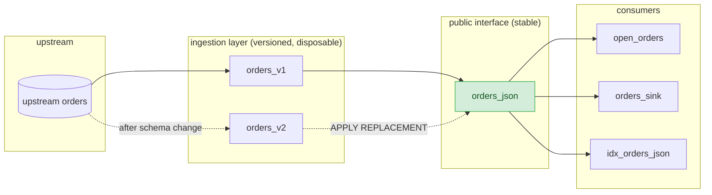

<!-- mz-docs page: ingest-data/network-security/privatelink -->

# AWS PrivateLink connections (Cloud-only)
How to connect Materialize Cloud to a Kafka broker, a Confluent Schema Registry server, a PostgreSQL database, or a MySQL database through an AWS PrivateLink service.
Materialize can connect to a Kafka broker, a Confluent Schema Registry server, a
PostgreSQL database, or a MySQL database through an [AWS PrivateLink](https://aws.amazon.com/privatelink/)
service.

In this guide, we'll cover how to create `AWS PRIVATELINK` connections and
retrieve the AWS principal needed to configure the AWS PrivateLink service.

## Create an AWS PrivateLink connection

**Kafka on AWS:**

> **Note:** Materialize provides a Terraform module that automates the creation and
> configuration of AWS resources for a PrivateLink connection. For more details,
> see the Terraform module repositories for [Amazon MSK](https://github.com/MaterializeInc/terraform-aws-msk-privatelink)
> and [self-managed Kafka clusters](https://github.com/MaterializeInc/terraform-aws-kafka-privatelink).

This section covers how to create AWS PrivateLink connections
and retrieve the AWS principal needed to configure the AWS PrivateLink service.

1. Create target groups. Create a dedicated [target
   group](https://docs.aws.amazon.com/elasticloadbalancing/latest/network/create-target-group.html)
   **for each broker** with the following details:

    a. Target type as **IP address**.

    b. Protocol as **TCP**.

    c. Port as **9092**, or the port that you are using in case it is not 9092 (e.g. 9094 for TLS or 9096 for SASL).

    d. Make sure that the target group is in the same VPC as the Kafka cluster.

    e. Click next, and register the respective Kafka broker to each target group using its IP address.

1. Create a [Network Load
    Balancer](https://docs.aws.amazon.com/elasticloadbalancing/latest/network/create-network-load-balancer.html)
    that is **enabled for the same subnets** that the Kafka brokers are in.

1. Create a [TCP
   listener](https://docs.aws.amazon.com/elasticloadbalancing/latest/network/create-listener.html)
   for every Kafka broker that forwards to the corresponding target group you
   created (e.g. `b-1`, `b-2`, `b-3`).

    The listener port needs to be unique, and will be used later on in the `CREATE CONNECTION` statement.

    For example, you can create a listener for:

    a. Port `9001` → broker `b-1...`.

    b. Port `9002` → broker `b-2...`.

    c. Port `9003` → broker `b-3...`.

1. Verify security groups and health checks. Once the TCP listeners have been
   created, make sure that the [health
   checks](https://docs.aws.amazon.com/elasticloadbalancing/latest/network/target-group-health-checks.html)
   for each target group are passing and that the targets are reported as
   healthy.

    If you have set up a security group for your Kafka cluster, you must ensure that it allows traffic on both the listener port and the health check port.

    **Remarks**:

    - By default, Network Load Balancers do not have associated security
      groups. In addition, target security groups cannot use client security
      groups as a traffic source. Therefore, the security groups for your
      targets must allow traffic using IP address ranges rather than security
      group references. For more information, see the [AWS
      documentation](https://docs.aws.amazon.com/elasticloadbalancing/latest/network/target-group-register-targets.html).

    - If you use [network ACLs
      (NACLs)](https://docs.aws.amazon.com/vpc/latest/userguide/vpc-network-acls.html)
      and traffic between the NLB and its targets crosses subnet boundaries,
      the NACLs must allow both the application port and the ephemeral port
      range (1024–65535) for return traffic. This can occur when cross-zone
      load balancing is enabled, or when the NLB and its targets reside in
      different subnets, even within the same Availability Zone.

      For example, if a target application listens on port 9098, the target
      subnet must allow ingress on port 9098 from the NLB's IP ranges and
      egress on the ephemeral port range (1024–65535) to those ranges
      for return traffic. Likewise, the NLB subnet must allow egress on
      port 9098 to the target IP ranges and ingress on the ephemeral port
      range from them.

    - If you have associated a security group with your Network Load Balancer
      and enabled **Enforce inbound rules on PrivateLink traffic**, the
      security group's inbound rules also apply to traffic from Materialize's
      VPC endpoint. Any traffic not explicitly permitted, including
      Materialize's, will be silently blocked.

      To resolve this, either:
      - Add inbound rules to the NLB's security group that permit the listener
        port and the health check port from a source covering Materialize's
        VPC endpoint traffic, or
      - Disable **Enforce inbound rules on PrivateLink traffic**.

1. Create a VPC [endpoint service](https://docs.aws.amazon.com/vpc/latest/privatelink/create-endpoint-service.html) and associate it with the **Network Load Balancer** that you’ve just created.

    Note the **service name** that is generated for the endpoint service.

1. Create an AWS PrivateLink connection. In Materialize, create an [AWS
    PrivateLink connection](/sql/create-connection/#aws-privatelink) that
    references the endpoint service that you created in the previous step.

    ↕️ **In-region connections**

    To connect to an AWS PrivateLink endpoint service in the **same region** as your
    Materialize environment:

      ```mzsql
      CREATE CONNECTION privatelink_svc TO AWS PRIVATELINK (
        SERVICE NAME 'com.amazonaws.vpce.<region_id>.vpce-svc-<endpoint_service_id>',
        AVAILABILITY ZONES ('use1-az1', 'use1-az2', 'use1-az4')
      );
      ```

    - Replace the `SERVICE NAME` value with the service name you noted earlier.

    - Replace the `AVAILABILITY ZONES` list with the IDs of the availability
      zones in your AWS account. For in-region connections the availability
      zones of the NLB and the consumer VPC **must match**.

      To find your availability zone IDs, select your database in the RDS
      Console and click the subnets under **Connectivity & security**. For each
      subnet, look for **Availability Zone ID** (e.g., `use1-az6`),
      not **Availability Zone** (e.g., `us-east-1d`).

    ↔️ **Cross-region connections**

    To connect to an AWS PrivateLink endpoint service in a **different region** to
    the one where your Materialize environment is deployed:

      ```mzsql
      CREATE CONNECTION privatelink_svc TO AWS PRIVATELINK (
        SERVICE NAME 'com.amazonaws.vpce.us-west-1.vpce-svc-<endpoint_service_id>',
        -- For now, the AVAILABILITY ZONES clause **is** required, but will be
        -- made optional in a future release.
        AVAILABILITY ZONES ()
      );
      ```

    - Replace the `SERVICE NAME` value with the service name you noted earlier.

    - The service name region refers to where the endpoint service was created.
      You **do not need** to specify `AVAILABILITY ZONES` manually — these will
      be optimally auto-assigned when none are provided.

    - For Kafka connections, it is required for [cross-zone load balancing](https://docs.aws.amazon.com/elasticloadbalancing/latest/network/network-load-balancers.html) to be
      enabled on the VPC endpoint service's NLB when using cross-region Privatelink.

1. Configure the AWS PrivateLink service. Retrieve the AWS principal for the AWS
    PrivateLink connection you just created:

      ```mzsql
    SELECT principal
    FROM mz_aws_privatelink_connections plc
    JOIN mz_connections c ON plc.id = c.id
    WHERE c.name = 'privatelink_svc';
    ```

    ```
                                     principal
    ---------------------------------------------------------------------------
     arn:aws:iam::664411391173:role/mz_20273b7c-2bbe-42b8-8c36-8cc179e9bbc3_u1
    ```

    Follow the instructions in the [AWS PrivateLink documentation](https://docs.aws.amazon.com/vpc/latest/privatelink/add-endpoint-service-permissions.html)
    to configure your VPC endpoint service to accept connections from the
    provided AWS principal.

1. If your AWS PrivateLink service is configured to require acceptance of connection requests, you must manually approve the connection request from Materialize after executing `CREATE CONNECTION`. For more details, check the [AWS PrivateLink documentation](https://docs.aws.amazon.com/vpc/latest/privatelink/configure-endpoint-service.html#accept-reject-connection-requests).

    **Note:** It might take some time for the endpoint service connection to show up, so you would need to wait for the endpoint service connection to be ready before you create a source.

1. Validate the AWS PrivateLink connection you created using the [`VALIDATE CONNECTION`](/sql/validate-connection) command:

   ```mzsql
   VALIDATE CONNECTION privatelink_svc;
   ```

   If no validation error is returned, move to the next step.

1. Create a source connection

   In Materialize, create a source connection that uses the AWS PrivateLink
connection you just configured:

   ```mzsql
   CREATE CONNECTION kafka_connection TO KAFKA (
       BROKERS (
           -- The port **must exactly match** the port assigned to the broker in
           -- the TCP listerner of the NLB.
           'b-1.hostname-1:9096' USING AWS PRIVATELINK privatelink_svc (PORT  9001, AVAILABILITY ZONE 'use1-az2'),
           'b-2.hostname-2:9096' USING AWS PRIVATELINK privatelink_svc (PORT  9002, AVAILABILITY ZONE 'use1-az1'),
           'b-3.hostname-3:9096' USING AWS PRIVATELINK privatelink_svc (PORT  9003, AVAILABILITY ZONE 'use1-az4')
       ),
       -- Authentication details
       -- Depending on the authentication method the Kafka cluster is using
       SASL MECHANISMS = 'SCRAM-SHA-512',
       SASL USERNAME = 'foo',
       SASL PASSWORD = SECRET kafka_password
   );
   ```

   If you run into connectivity issues during source creation, make sure that:

   * The `(PORT <port_number>)` value **exactly matches** the port assigned to
      the corresponding broker in the **TCP listener** of the Network Load
      Balancer. Misalignment between ports and broker addresses is the most
      common cause for connectivity issues.

   * For **in-region connections**, the correct availability zone is specified
      for each broker.

**PostgreSQL on AWS:**

> **Note:** Materialize provides a Terraform module that automates the creation and
> configuration of AWS resources for a PrivateLink connection. For more details,
> see the [Terraform module repository](https://github.com/MaterializeInc/terraform-aws-rds-privatelink).

1. #### Create target groups
    Create a dedicated [target group](https://docs.aws.amazon.com/elasticloadbalancing/latest/network/create-target-group.html) for your RDS or Aurora instance with the following details:

    a. Target type as **IP address**.

    b. Protocol as **TCP**.

    c. Port as **5432**, or the port that you are using in case it is not 5432.

    d. Make sure that the target group is in the same VPC as the RDS or Aurora instance.

    e. Click next, and register the respective RDS or Aurora instance to the target group using its IP address.

1. #### Create a Network Load Balancer (NLB)
    Create a [Network Load Balancer](https://docs.aws.amazon.com/elasticloadbalancing/latest/network/create-network-load-balancer.html) that is **enabled for the same subnets** that the RDS or Aurora instance is in.

1. #### Create TCP listeners

    Create a [TCP listener](https://docs.aws.amazon.com/elasticloadbalancing/latest/network/create-listener.html) for your RDS or Aurora instance that forwards to the corresponding target group you created.

1. #### Verify security groups and health checks

    Once the target groups have been created, make sure that the [health checks](https://docs.aws.amazon.com/elasticloadbalancing/latest/network/target-group-health-checks.html) are passing and that the targets are reported as healthy.

    If you have set up a security group for your RDS or Aurora instance, you must ensure that it allows traffic on the health check port.

    **Remarks**:

    - By default, Network Load Balancers do not have associated security
      groups. In addition, target security groups cannot use client security
      groups as a traffic source. Therefore, the security groups for your
      targets must allow traffic using IP address ranges rather than security
      group references. For more information, see the [AWS
      documentation](https://docs.aws.amazon.com/elasticloadbalancing/latest/network/target-group-register-targets.html).

    - If you use [network ACLs
      (NACLs)](https://docs.aws.amazon.com/vpc/latest/userguide/vpc-network-acls.html)
      and traffic between the NLB and its targets crosses subnet boundaries,
      the NACLs must allow both the application port and the ephemeral port
      range (1024–65535) for return traffic. This can occur when cross-zone
      load balancing is enabled, or when the NLB and its targets reside in
      different subnets, even within the same Availability Zone.

      For example, if a target application listens on port 9098, the target
      subnet must allow ingress on port 9098 from the NLB's IP ranges and
      egress on the ephemeral port range (1024–65535) to those ranges
      for return traffic. Likewise, the NLB subnet must allow egress on
      port 9098 to the target IP ranges and ingress on the ephemeral port
      range from them.

    - If you have associated a security group with your Network Load Balancer
      and enabled **Enforce inbound rules on PrivateLink traffic**, the
      security group's inbound rules also apply to traffic from Materialize's
      VPC endpoint. Any traffic not explicitly permitted, including
      Materialize's, will be silently blocked.

      To resolve this, either:
      - Add inbound rules to the NLB's security group that permit the listener
        port and the health check port from a source covering Materialize's
        VPC endpoint traffic, or
      - Disable **Enforce inbound rules on PrivateLink traffic**.

1. #### Create a VPC endpoint service

    Create a VPC [endpoint service](https://docs.aws.amazon.com/vpc/latest/privatelink/create-endpoint-service.html) and associate it with the **Network Load Balancer** that you’ve just created.

    Note the **service name** that is generated for the endpoint service.

1. #### Create an AWS PrivateLink connection

    In Materialize, create an [AWS PrivateLink connection](/sql/create-connection/#aws-privatelink)
    that references the endpoint service that you created in the previous step.

    ↕️ **In-region connections**

    To connect to an AWS PrivateLink endpoint service in the **same region** as your
    Materialize environment:

      ```mzsql
      CREATE CONNECTION privatelink_svc TO AWS PRIVATELINK (
        SERVICE NAME 'com.amazonaws.vpce.<region_id>.vpce-svc-<endpoint_service_id>',
        AVAILABILITY ZONES ('use1-az1', 'use1-az2', 'use1-az4')
      );
      ```

    - Replace the `SERVICE NAME` value with the service name you noted earlier.

    - Replace the `AVAILABILITY ZONES` list with the IDs of the availability
      zones in your AWS account. For in-region connections the availability
      zones of the NLB and the consumer VPC **must match**.

      To find your availability zone IDs, select your database in the RDS
      Console and click the subnets under **Connectivity & security**. For each
      subnet, look for **Availability Zone ID** (e.g., `use1-az6`),
      not **Availability Zone** (e.g., `us-east-1d`).

    ↔️ **Cross-region connections**

    To connect to an AWS PrivateLink endpoint service in a **different region** to
    the one where your Materialize environment is deployed:

      ```mzsql
      CREATE CONNECTION privatelink_svc TO AWS PRIVATELINK (
        SERVICE NAME 'com.amazonaws.vpce.us-west-1.vpce-svc-<endpoint_service_id>',
        -- For now, the AVAILABILITY ZONES clause **is** required, but will be
        -- made optional in a future release.
        AVAILABILITY ZONES ()
      );
      ```

    - Replace the `SERVICE NAME` value with the service name you noted earlier.

    - The service name region refers to where the endpoint service was created.
      You **do not need** to specify `AVAILABILITY ZONES` manually — these will
      be optimally auto-assigned when none are provided.

## Configure the AWS PrivateLink service

1. Retrieve the AWS principal for the AWS PrivateLink connection you just created:

    ```mzsql
    SELECT principal
    FROM mz_aws_privatelink_connections plc
    JOIN mz_connections c ON plc.id = c.id
    WHERE c.name = 'privatelink_svc';
    ```

    ```
                                     principal
    ---------------------------------------------------------------------------
     arn:aws:iam::664411391173:role/mz_20273b7c-2bbe-42b8-8c36-8cc179e9bbc3_u1
    ```

    Follow the instructions in the [AWS PrivateLink documentation](https://docs.aws.amazon.com/vpc/latest/privatelink/add-endpoint-service-permissions.html)
    to configure your VPC endpoint service to accept connections from the
    provided AWS principal.

1. If your AWS PrivateLink service is configured to require acceptance of connection requests, you must manually approve the connection request from Materialize after executing `CREATE CONNECTION`. For more details, check the [AWS PrivateLink documentation](https://docs.aws.amazon.com/vpc/latest/privatelink/configure-endpoint-service.html#accept-reject-connection-requests).

    **Note:** It might take some time for the endpoint service connection to show up, so you would need to wait for the endpoint service connection to be ready before you create a source.

## Validate the AWS PrivateLink connection

Validate the AWS PrivateLink connection you created using the [`VALIDATE CONNECTION`](/sql/validate-connection) command:

```mzsql
VALIDATE CONNECTION privatelink_svc;
```

If no validation error is returned, move to the next step.

## Create a source connection

In Materialize, create a source connection that uses the AWS PrivateLink connection you just configured:

```mzsql
CREATE CONNECTION pg_connection TO POSTGRES (
    HOST 'instance.foo000.us-west-1.rds.amazonaws.com',
    PORT 5432,
    DATABASE postgres,
    USER postgres,
    PASSWORD SECRET pgpass,
    AWS PRIVATELINK privatelink_svc
);
```

This PostgreSQL connection can then be reused across multiple [`CREATE SOURCE`](https://materialize.com/docs/sql/create-source/postgres/) statements.

**MySQL on AWS:**

> **Note:** Materialize provides a Terraform module that automates the creation and
> configuration of AWS resources for a PrivateLink connection. For more details,
> see the [Terraform module repository](https://github.com/MaterializeInc/terraform-aws-rds-privatelink).

1. #### Create target groups
    Create a dedicated [target group](https://docs.aws.amazon.com/elasticloadbalancing/latest/network/create-target-group.html) for your RDS instance with the following details:

    a. Target type as **IP address**.

    b. Protocol as **TCP**.

    c. Port as **3306**, or the port that you are using in case it is not 3306.

    d. Make sure that the target group is in the same VPC as the RDS instance.

    e. Click next, and register the respective RDS instance to the target group using its IP address.

1. #### Create a Network Load Balancer (NLB)
    Create a [Network Load Balancer](https://docs.aws.amazon.com/elasticloadbalancing/latest/network/create-network-load-balancer.html) that is **enabled for the same subnets** that the RDS instance is in.

1. #### Create TCP listeners

    Create a [TCP listener](https://docs.aws.amazon.com/elasticloadbalancing/latest/network/create-listener.html) for your RDS instance that forwards to the corresponding target group you created.

1. #### Verify security groups and health checks

    Once the target groups have been created, make sure that the [health checks](https://docs.aws.amazon.com/elasticloadbalancing/latest/network/target-group-health-checks.html) are passing and that the targets are reported as healthy.

    If you have set up a security group for your RDS instance, you must ensure that it allows traffic on the health check port.

    **Remarks**:

    - By default, Network Load Balancers do not have associated security
      groups. In addition, target security groups cannot use client security
      groups as a traffic source. Therefore, the security groups for your
      targets must allow traffic using IP address ranges rather than security
      group references. For more information, see the [AWS
      documentation](https://docs.aws.amazon.com/elasticloadbalancing/latest/network/target-group-register-targets.html).

    - If you use [network ACLs
      (NACLs)](https://docs.aws.amazon.com/vpc/latest/userguide/vpc-network-acls.html)
      and traffic between the NLB and its targets crosses subnet boundaries,
      the NACLs must allow both the application port and the ephemeral port
      range (1024–65535) for return traffic. This can occur when cross-zone
      load balancing is enabled, or when the NLB and its targets reside in
      different subnets, even within the same Availability Zone.

      For example, if a target application listens on port 9098, the target
      subnet must allow ingress on port 9098 from the NLB's IP ranges and
      egress on the ephemeral port range (1024–65535) to those ranges
      for return traffic. Likewise, the NLB subnet must allow egress on
      port 9098 to the target IP ranges and ingress on the ephemeral port
      range from them.

    - If you have associated a security group with your Network Load Balancer
      and enabled **Enforce inbound rules on PrivateLink traffic**, the
      security group's inbound rules also apply to traffic from Materialize's
      VPC endpoint. Any traffic not explicitly permitted, including
      Materialize's, will be silently blocked.

      To resolve this, either:
      - Add inbound rules to the NLB's security group that permit the listener
        port and the health check port from a source covering Materialize's
        VPC endpoint traffic, or
      - Disable **Enforce inbound rules on PrivateLink traffic**.

1. #### Create a VPC endpoint service

    Create a VPC [endpoint service](https://docs.aws.amazon.com/vpc/latest/privatelink/create-endpoint-service.html) and associate it with the **Network Load Balancer** that you’ve just created.

    Note the **service name** that is generated for the endpoint service.

1. #### Create an AWS PrivateLink connection

    In Materialize, create an [AWS PrivateLink connection](/sql/create-connection/#aws-privatelink)
    that references the endpoint service that you created in the previous step.

    ↕️ **In-region connections**

    To connect to an AWS PrivateLink endpoint service in the **same region** as your
    Materialize environment:

      ```mzsql
      CREATE CONNECTION privatelink_svc TO AWS PRIVATELINK (
        SERVICE NAME 'com.amazonaws.vpce.<region_id>.vpce-svc-<endpoint_service_id>',
        AVAILABILITY ZONES ('use1-az1', 'use1-az2', 'use1-az4')
      );
      ```

    - Replace the `SERVICE NAME` value with the service name you noted earlier.

    - Replace the `AVAILABILITY ZONES` list with the IDs of the availability
      zones in your AWS account. For in-region connections the availability
      zones of the NLB and the consumer VPC **must match**.

      To find your availability zone IDs, select your database in the RDS
      Console and click the subnets under **Connectivity & security**. For each
      subnet, look for **Availability Zone ID** (e.g., `use1-az6`),
      not **Availability Zone** (e.g., `us-east-1d`).

    ↔️ **Cross-region connections**

    To connect to an AWS PrivateLink endpoint service in a **different region** to
    the one where your Materialize environment is deployed:

      ```mzsql
      CREATE CONNECTION privatelink_svc TO AWS PRIVATELINK (
        SERVICE NAME 'com.amazonaws.vpce.us-west-1.vpce-svc-<endpoint_service_id>',
        -- For now, the AVAILABILITY ZONES clause **is** required, but will be
        -- made optional in a future release.
        AVAILABILITY ZONES ()
      );
      ```

    - Replace the `SERVICE NAME` value with the service name you noted earlier.

    - The service name region refers to where the endpoint service was created.
      You **do not need** to specify `AVAILABILITY ZONES` manually — these will
      be optimally auto-assigned when none are provided.

## Configure the AWS PrivateLink service

1. Retrieve the AWS principal for the AWS PrivateLink connection you just created:

    ```mzsql
    SELECT principal
    FROM mz_aws_privatelink_connections plc
    JOIN mz_connections c ON plc.id = c.id
    WHERE c.name = 'privatelink_svc';
    ```

    ```
                                     principal
    ---------------------------------------------------------------------------
     arn:aws:iam::664411391173:role/mz_20273b7c-2bbe-42b8-8c36-8cc179e9bbc3_u1
    ```

    Follow the instructions in the [AWS PrivateLink documentation](https://docs.aws.amazon.com/vpc/latest/privatelink/add-endpoint-service-permissions.html)
    to configure your VPC endpoint service to accept connections from the
    provided AWS principal.

1. If your AWS PrivateLink service is configured to require acceptance of connection requests, you must manually approve the connection request from Materialize after executing `CREATE CONNECTION`. For more details, check the [AWS PrivateLink documentation](https://docs.aws.amazon.com/vpc/latest/privatelink/configure-endpoint-service.html#accept-reject-connection-requests).

    **Note:** It might take some time for the endpoint service connection to show up, so you would need to wait for the endpoint service connection to be ready before you create a source.

## Validate the AWS PrivateLink connection

Validate the AWS PrivateLink connection you created using the [`VALIDATE CONNECTION`](/sql/validate-connection) command:

```mzsql
VALIDATE CONNECTION privatelink_svc;
```

If no validation error is returned, move to the next step.

## Create a source connection

In Materialize, create a source connection that uses the AWS PrivateLink connection you just configured:

```mzsql
CREATE CONNECTION mysql_connection TO MYSQL (
      HOST <host>,
      PORT 3306,
      USER 'materialize',
      PASSWORD SECRET mysqlpass,
      SSL MODE REQUIRED,
      AWS PRIVATELINK privatelink_svc
);
```

This MySQL connection can then be reused across multiple [`CREATE SOURCE`](https://materialize.com/docs/sql/create-source/mysql/) statements.

## Related pages

- [`CREATE SECRET`](/sql/create-secret)
- [`CREATE CONNECTION`](/sql/create-connection)
- [`CREATE SOURCE`: Kafka](/sql/create-source/kafka)
- Integration guides: [Self-hosted
  PostgreSQL](/ingest-data/postgres/self-hosted/), [Amazon RDS for
  PostgreSQL](/ingest-data/postgres/amazon-rds/), [Self-hosted
  Kafka](/ingest-data/kafka/kafka-self-hosted), [Amazon
  MSK](/ingest-data/kafka/amazon-msk), [Redpanda
  Cloud](/ingest-data/redpanda/redpanda-cloud/)

<!-- mz-docs page: ingest-data/network-security/ssh-tunnel -->

# SSH tunnel connections
How to connect Materialize to a Kafka broker, a MySQL database, or PostgreSQL database using an SSH tunnel connection to a SSH bastion server

**Cloud:**
Materialize can connect to a Kafka broker, a Confluent Schema Registry server, a
PostgreSQL database, or a MySQL database through an SSH tunnel connection. In
this guide, you will create an SSH tunnel connection, configure your
Materialize authentication settings, and create a source connection.

Before you begin, make sure you have access to a bastion host. You will need:

* The bastion host IP address and port number
* The bastion host username

1. Create an SSH tunnel connection. In Materialize, create an [SSH tunnel
   connection](/sql/create-connection/#ssh-tunnel) to the bastion host:

    ```mzsql
    CREATE CONNECTION ssh_connection TO SSH TUNNEL (
        HOST '<SSH_BASTION_HOST>',
        USER '<SSH_BASTION_USER>',
        PORT <SSH_BASTION_PORT>
    );
    ```

1. Configure the SSH bastion host. The bastion host needs a **public key** to
connect to the Materialize tunnel you created in the previous step. Materialize
stores public keys for SSH tunnels in the system catalog. Query
[`mz_ssh_tunnel_connections`](/sql/system-catalog/mz_catalog/#mz_ssh_tunnel_connections)
to retrieve the public keys for the SSH tunnel connection you just created:

    ```mzsql
    SELECT
        mz_connections.name,
        mz_ssh_tunnel_connections.*
    FROM
        mz_connections JOIN
        mz_ssh_tunnel_connections USING(id)
    WHERE
        mz_connections.name = 'ssh_connection';
    ```

    ```
    | id    | public_key_1                          | public_key_2                          |
    |-------|---------------------------------------|---------------------------------------|
    | u75   | ssh-ed25519 AAAA...76RH materialize   | ssh-ed25519 AAAA...hLYV materialize   |
    ```

    > Materialize provides two public keys to allow you to rotate keys without
    connection downtime. Review the [`ALTER CONNECTION`](/sql/alter-connection) documentation for
    more information on how to rotate your keys.

1. Log in to your SSH bastion server and add each key to the bastion `authorized_keys` file:

    ```bash
    # Command for Linux
    echo "ssh-ed25519 AAAA...76RH materialize" >> <AUTHORIZED_KEYS_FILE>
    echo "ssh-ed25519 AAAA...hLYV materialize" >> <AUTHORIZED_KEYS_FILE>
    ```

1. Configure your internal firewall to allow the SSH bastion host to connect to your Kafka cluster or PostgreSQL instance.

    If you are using a cloud provider like AWS or GCP, update the security group or firewall rules for your PostgreSQL instance or Kafka brokers.

    Allow incoming traffic from the SSH bastion host IP address on the necessary ports.

    For example, use port `5432` for PostgreSQL and ports `9092`, `9094`, and `9096` for Kafka.

    Test the connection from the bastion host to the Kafka cluster or PostgreSQL instance.

    ```bash
    telnet <KAFKA_BROKER_HOST> <KAFKA_BROKER_PORT>
    telnet <POSTGRES_HOST> <POSTGRES_PORT>
    ```

    If the command hangs, double-check your security group and firewall settings. If the connection is successful, you can proceed to the next step.

1. Verify the SSH tunnel connection from your source to your bastion host:

    ```bash
    # Command for Linux
    ssh -L 9092:kafka-broker:9092 <SSH_BASTION_USER>@<SSH_BASTION_HOST>
    ```

    Verify that you can connect to the Kafka broker or PostgreSQL instance via the SSH tunnel:

    ```bash
    telnet localhost 9092
    ```

    If you are unable to connect using the `telnet` command, enable `AllowTcpForwarding` and `PermitTunnel` on your bastion host SSH configuration file.

    On your SSH bastion host, open the SSH config file (usually located at `/etc/ssh/sshd_config`) using a text editor:

    ```bash
    sudo nano /etc/ssh/sshd_config
    ```

    Add or uncomment the following lines:

    ```bash
    AllowTcpForwarding yes
    PermitTunnel yes
    ```

    Save the changes and restart the SSH service:

    ```bash
    sudo systemctl restart sshd
    ```

1. Retrieve the static egress IPs from Materialize and configure the firewall rules (e.g. AWS Security Groups) for your bastion host to allow SSH traffic for those IP addresses only.

    ```mzsql
    SELECT * FROM mz_catalog.mz_egress_ips;
    ```

    ```
    XXX.140.90.33
    XXX.198.159.213
    XXX.100.27.23
    ```

1. To confirm that the SSH tunnel connection is correctly configured, use the
   [`VALIDATE CONNECTION`](/sql/validate-connection) command:

   ```mzsql
   VALIDATE CONNECTION ssh_connection;
   ```

   If no validation errors are returned, the connection can be used to create a
   source connection.

**Self-Managed:**
Materialize can connect to a Kafka broker, a Confluent Schema Registry server, a
PostgreSQL database, or a MySQL database through an SSH tunnel connection. In
this guide, you will create an SSH tunnel connection, configure your
Materialize authentication settings, and create a source connection.

Before you begin, make sure you have access to a bastion host. You will need:

* The bastion host IP address and port number
* The bastion host username

1. Create an SSH tunnel connection. In Materialize, create an [SSH tunnel
   connection](/sql/create-connection/#ssh-tunnel) to the bastion host:

    ```mzsql
    CREATE CONNECTION ssh_connection TO SSH TUNNEL (
        HOST '<SSH_BASTION_HOST>',
        USER '<SSH_BASTION_USER>',
        PORT <SSH_BASTION_PORT>
    );
    ```

1. Configure the SSH bastion host. The bastion host needs a **public key** to
connect to the Materialize tunnel you created in the previous step. Materialize
stores public keys for SSH tunnels in the system catalog. Query
[`mz_ssh_tunnel_connections`](/sql/system-catalog/mz_catalog/#mz_ssh_tunnel_connections)
to retrieve the public keys for the SSH tunnel connection you just created:

    ```mzsql
    SELECT
        mz_connections.name,
        mz_ssh_tunnel_connections.*
    FROM
        mz_connections JOIN
        mz_ssh_tunnel_connections USING(id)
    WHERE
        mz_connections.name = 'ssh_connection';
    ```

    ```
    | id    | public_key_1                          | public_key_2                          |
    |-------|---------------------------------------|---------------------------------------|
    | u75   | ssh-ed25519 AAAA...76RH materialize   | ssh-ed25519 AAAA...hLYV materialize   |
    ```

    > Materialize provides two public keys to allow you to rotate keys without
    connection downtime. Review the [`ALTER CONNECTION`](/sql/alter-connection) documentation for
    more information on how to rotate your keys.

1. Log in to your SSH bastion server and add each key to the bastion `authorized_keys` file:

    ```bash
    # Command for Linux
    echo "ssh-ed25519 AAAA...76RH materialize" >> <AUTHORIZED_KEYS_FILE>
    echo "ssh-ed25519 AAAA...hLYV materialize" >> <AUTHORIZED_KEYS_FILE>
    ```

1. Configure your internal firewall to allow the SSH bastion host to connect to your Kafka cluster or PostgreSQL instance.

    If you are using a cloud provider like AWS or GCP, update the security group or firewall rules for your PostgreSQL instance or Kafka brokers.

    Allow incoming traffic from the SSH bastion host IP address on the necessary ports.

    For example, use port `5432` for PostgreSQL and ports `9092`, `9094`, and `9096` for Kafka.

    Test the connection from the bastion host to the Kafka cluster or PostgreSQL instance.

    ```bash
    telnet <KAFKA_BROKER_HOST> <KAFKA_BROKER_PORT>
    telnet <POSTGRES_HOST> <POSTGRES_PORT>
    ```

    If the command hangs, double-check your security group and firewall settings. If the connection is successful, you can proceed to the next step.

1. Verify the SSH tunnel connection from your source to your bastion host:

    ```bash
    # Command for Linux
    ssh -L 9092:kafka-broker:9092 <SSH_BASTION_USER>@<SSH_BASTION_HOST>
    ```

    Verify that you can connect to the Kafka broker or PostgreSQL instance via the SSH tunnel:

    ```bash
    telnet localhost 9092
    ```

    If you are unable to connect using the `telnet` command, enable `AllowTcpForwarding` and `PermitTunnel` on your bastion host SSH configuration file.

    On your SSH bastion host, open the SSH config file (usually located at `/etc/ssh/sshd_config`) using a text editor:

    ```bash
    sudo nano /etc/ssh/sshd_config
    ```

    Add or uncomment the following lines:

    ```bash
    AllowTcpForwarding yes
    PermitTunnel yes
    ```

    Save the changes and restart the SSH service:

    ```bash
    sudo systemctl restart sshd
    ```

1. Ensure materialize cluster pods have network access to your SSH bastion host.

1. Validate the SSH tunnel connection

   To confirm that the SSH tunnel connection is correctly configured, use the [`VALIDATE CONNECTION`](/sql/validate-connection) command:

    ```mzsql
    VALIDATE CONNECTION ssh_connection;
    ```

    If no validation errors are returned, the connection can be used to create a source connection.

## Create a source connection

In Materialize, create a source connection that uses the SSH tunnel connection you configured in the previous section:

**Kafka:**
```mzsql
CREATE CONNECTION kafka_connection TO KAFKA (
    BROKER 'broker1:9092',
    SSH TUNNEL ssh_connection
);
```

You can reuse this Kafka connection across multiple [`CREATE
SOURCE`](/sql/create-source/kafka/) statements.

**PostgreSQL:**
```mzsql
CREATE SECRET pgpass AS '<POSTGRES_PASSWORD>';

CREATE CONNECTION pg_connection TO POSTGRES (
  HOST 'instance.foo000.us-west-1.rds.amazonaws.com',
  PORT 5432,
  USER 'postgres',
  PASSWORD SECRET pgpass,
  SSL MODE 'require',
  DATABASE 'postgres'
  SSH TUNNEL ssh_connection
);
```

You can reuse this PostgreSQL connection across multiple [`CREATE SOURCE`](/sql/create-source/postgres/)
statements:

```mzsql
CREATE SOURCE mz_source
  FROM POSTGRES CONNECTION pg_connection (PUBLICATION 'mz_source')
  FOR ALL TABLES;
```

**MySQL:**
```mzsql
CREATE SECRET mysqlpass AS '<POSTGRES_PASSWORD>';

CREATE CONNECTION mysql_connection TO MYSQL (
  HOST '<host>',
  SSH TUNNEL ssh_connection,
);
```

You can reuse this MySQL connection across multiple [`CREATE SOURCE`](/sql/create-source/postgres/)
statements.

## Related pages

- [`CREATE SECRET`](/sql/create-secret)
- [`CREATE CONNECTION`](/sql/create-connection)
- [`CREATE SOURCE`: Kafka](/sql/create-source/kafka/)
- [`CREATE SOURCE`: MySQL](/sql/create-source/mysql)
- [`CREATE SOURCE`: PostgreSQL](/sql/create-source/postgres/)

<!-- mz-docs page: ingest-data/network-security/static-ips -->

# Static IP addresses (Cloud-only)
Materialize Cloud provides static IP addresses that you can use to configure egress policies in your virtual networks that target outbound traffic to Materialize.
Each Materialize Cloud region is associated with a unique set of static egress
[Classless Inter-Domain Routing (CIDR)](https://aws.amazon.com/what-is/cidr/)
blocks. All connections to the public internet initiated by your Materialize
region will originate from an IP address in the provided blocks.

> **Note:** On rare occasion, we may need to change the static egress CIDR blocks associated
> with a region. We make every effort to provide advance notice of such changes.

When connecting Materialize to services in your private networks (e.g., Kafka,
PostgreSQL, MySQL), you must configure any firewalls to allow connections from
all CIDR blocks associated with your region. **Connections may originate from
any address in the region**.

Region          | CIDR
----------------|------------
`aws/us-east-1` | 98.80.4.128/27
`aws/us-east-1` | 3.215.237.176/32
`aws/us-west-2` | 44.242.185.160/27
`aws/us-west-2` | 52.37.108.9/32
`aws/eu-west-1` | 108.128.128.96/27
`aws/eu-west-1` | 54.229.252.215/32

## Fetching static egress IPs addresses

You can fetch the static egress CIDR blocks associated with your region by
querying the [`mz_egress_ips`](/sql/system-catalog/mz_catalog/#mz_egress_ips)
system catalog table.

```mzsql
SELECT * FROM mz_egress_ips;
```

```nofmt
  egress_ip    | prefix_length |      cidr
---------------+---------------+-----------------
 3.215.237.176 |            32 | 3.215.237.176/32
 98.80.4.128   |            27 | 98.80.4.128/27
```

As an alternative, you can also submit an HTTP request to Materialize's
[SQL API](/serve-results/http-api/) querying the [`mz_egress_ips`](/sql/system-catalog/mz_catalog/#mz_egress_ips)
system catalog table. In the request, specify the username, app password, and
host for your Materialize region:

```
curl -s 'https://<host-address>/api/sql' \
    --header 'Content-Type: application/json' \
    --user '<username:app-password>' \
    --data '{ "query": "SELECT cidr from mz_egress_ips;" }' |\
    jq -r '.results[].rows[][]'
```

<!-- mz-docs page: ingest-data/patterns -->

# Patterns

Learn about common Materialize ingestion patterns.

The following section provides examples of implementing some common ingestion
patterns in Materialize:

<!-- mz-docs page: ingest-data/patterns/upstream-schema-changes -->

# Absorbing upstream schema changes
Expose a schema-agnostic materialized view so that upstream schema changes never require downstream reconfiguration.
When you create a table from a source, its columns are pinned to the upstream
schema as it existed at that moment. This applies to every source type that
supports [`CREATE TABLE ... FROM SOURCE`](/sql/create-table/): PostgreSQL,
MySQL, SQL Server, and Kafka. Incorporating a schema change means creating a *new* table from the
same source reference, which means recreating every view, index, and sink built
on top of the old one. Every consumer has to be reconfigured, and each
reprocesses its data from scratch.

Instead, publish a single schema-agnostic materialized view whose output type
never changes and absorb schema changes behind it. Downstream objects are never
recreated, and consumers only receive updates for rows whose data actually
changed.

## Overview

The pattern has two halves:

- A stable public interface: a materialized view with exactly one `jsonb`
  column, produced by `to_jsonb()` over the ingesting table. Its output type
  never varies, so it stays replacement-compatible across any upstream schema
  change.

- An interchangeable ingestion layer: versioned tables
  (`orders_v1`, `orders_v2`, ...) created from the same source reference. When
  the upstream schema changes, you create a new table and swap it in underneath
  the public interface using [`ALTER MATERIALIZED VIEW ... APPLY
  REPLACEMENT`](/sql/alter-materialized-view/).



> **Public Preview:** This feature is in public preview.

## Create the public interface

### Step 1. Create the source and the first ingesting table

Create the source, then create a table from it. The rest of this page uses
`src` for the source and `orders_v1` for the first ingesting table.

**PostgreSQL:**
```mzsql
CREATE SOURCE src
  IN CLUSTER ingest_cluster
  FROM POSTGRES CONNECTION pg_conn (PUBLICATION 'mz_pub');

CREATE TABLE orders_v1 FROM SOURCE src (REFERENCE public.orders);
```

**MySQL:**
```mzsql
CREATE SOURCE src
  IN CLUSTER ingest_cluster
  FROM MYSQL CONNECTION mysql_conn;

CREATE TABLE orders_v1 FROM SOURCE src (REFERENCE shop.orders);
```

**SQL Server:**
```mzsql
CREATE SOURCE src
  IN CLUSTER ingest_cluster
  FROM SQL SERVER CONNECTION mssql_conn;

CREATE TABLE orders_v1 FROM SOURCE src (REFERENCE dbo.orders);
```

**Kafka:**
```mzsql
CREATE SOURCE src
  IN CLUSTER ingest_cluster
  FROM KAFKA CONNECTION kafka_conn (TOPIC 'orders');

CREATE TABLE orders_v1 FROM SOURCE src
  FORMAT AVRO USING CONFLUENT SCHEMA REGISTRY CONNECTION csr_conn;
```

> **Note:** This pattern requires `CREATE TABLE ... FROM SOURCE`. The legacy source syntax
> creates subsources automatically and does not support upstream schema changes.

### Step 2. Create the schema-agnostic materialized view

```mzsql
CREATE MATERIALIZED VIEW orders_json
  IN CLUSTER compute_cluster
AS
SELECT coalesce(jsonb_strip_nulls(to_jsonb(t)), '{}'::jsonb) AS data
FROM orders_v1 t;
```

`jsonb_strip_nulls()` keeps a swap cheap by giving a row whose new column is
`NULL` a byte-identical JSON representation before and after, so Materialize
computes no diff for it. Without it, every row is retracted and reinserted to
add a key whose value is `null`.

`coalesce(..., '{}'::jsonb)` pins the column's nullability. A replacement
materialized view must declare the [same output
schema](/transform-data/updating-materialized-views/replace-materialized-view/)
as its target, *including nullability*. Materialize infers
`jsonb_strip_nulls(to_jsonb(t))` as `NOT NULL` when every column of `t` is `NOT
NULL`, and as nullable otherwise. So the first nullable column added upstream
would change the inferred nullability of the public interface and cause the
replacement to be rejected:

```
ERROR:  replacement schema differs from target schema
DETAIL:  column "data" at position 1: nullability mismatch
         (target: NOT NULL, replacement: NULL)
```

`to_jsonb()` of a row is never `NULL`, so the `coalesce()` branch is
unreachable and only fixes the inferred type.

> **Warning:** Include `coalesce()` in the original view definition. Adding it later
> requires dropping and recreating the public interface.

### Step 3. Build consumers on the public interface

Downstream objects reference `orders_json` and never the versioned tables:

```mzsql
CREATE VIEW open_orders AS
SELECT (data->>'id')::bigint    AS id,
       data->>'customer'        AS customer,
       (data->>'amount')::numeric AS amount
FROM orders_json
WHERE data->>'status' = 'open';

CREATE INDEX idx_orders_json
  IN CLUSTER serving_cluster
  ON orders_json (data);
```

> **Tip:** Extract fields with `->>` and an explicit cast rather than `->`. The `->>`
> operator returns `text` regardless of the underlying JSON scalar type, so a
> consumer written this way keeps working if an upstream column changes from
> `integer` to `text`.

## Detect upstream schema changes

Materialize does not notify you when an upstream schema changes. For PostgreSQL,
MySQL, and SQL Server sources, refresh the source's view of the upstream catalog
and compare it against the columns you are ingesting.

`ALTER SOURCE ... REFRESH REFERENCES` re-reads the upstream catalog and updates
`mz_internal.mz_source_references` without restarting ingestion or triggering a
re-snapshot.

```mzsql
ALTER SOURCE src REFRESH REFERENCES;
```

The query below compares upstream columns against ingested columns and reports
two signals, because neither alone covers every kind of change:

- `column_drift` — a column was added or removed upstream. Detected
  *proactively*: column additions do not interrupt ingestion, so you can
  schedule the migration.
- `stalled` — the ingesting table has already failed. Detected *reactively*.
  Column drops and type changes stall ingestion the moment the upstream DDL
  commits, and a type change is not visible as a column-name difference at all.

```mzsql
WITH source_tables AS (
    -- one row per ingesting table, for every relational source type
    SELECT id, schema_name, table_name FROM mz_internal.mz_postgres_source_tables
    UNION ALL
    SELECT id, schema_name, table_name FROM mz_internal.mz_mysql_source_tables
    UNION ALL
    SELECT id, schema_name, table_name FROM mz_internal.mz_sql_server_source_tables
),
ingesting AS (
    SELECT t.id                                     AS table_id,
           t.source_id,
           d.name || '.' || s.name || '.' || t.name AS mz_table,
           sti.schema_name                          AS up_schema,
           sti.table_name                           AS up_table,
           array_agg(c.name ORDER BY c.position)    AS mz_columns
    FROM mz_tables t
    JOIN source_tables sti ON sti.id = t.id
    JOIN mz_schemas   s ON s.id = t.schema_id
    JOIN mz_databases d ON d.id = s.database_id
    JOIN mz_columns   c ON c.id = t.id
    GROUP BY t.id, t.source_id, d.name, s.name, t.name,
             sti.schema_name, sti.table_name
),
joined AS (
    SELECT i.*,
           r.columns    AS upstream_columns,
           r.updated_at AS refs_refreshed_at,
           st.status,
           st.error
    FROM ingesting i
    JOIN mz_internal.mz_source_references r
      ON  r.source_id = i.source_id
     AND  r.namespace = i.up_schema
     AND  r.name      = i.up_table
    LEFT JOIN mz_internal.mz_source_statuses st ON st.id = i.table_id
)
SELECT mz_table,
       up_schema || '.' || up_table AS upstream_table,
       CASE WHEN status = 'stalled' THEN 'stalled' ELSE 'column_drift' END AS signal,
       status,
       (SELECT coalesce(array_agg(x ORDER BY x), '{}'::text[])
          FROM unnest(upstream_columns) x
         WHERE NOT (x = ANY (mz_columns)))       AS added_upstream,
       (SELECT coalesce(array_agg(x ORDER BY x), '{}'::text[])
          FROM unnest(mz_columns) x
         WHERE NOT (x = ANY (upstream_columns))) AS dropped_upstream,
       refs_refreshed_at,
       left(coalesce(error, ''), 80) AS error
FROM joined
WHERE status = 'stalled'
   OR mz_columns::text[] <> upstream_columns::text[]
ORDER BY mz_table;
```

An empty result means every ingesting table matches its upstream reference. Any
row is an action item. After adding a `channel` column upstream:

```
            mz_table           | upstream_table |    signal    | status  | added_upstream | dropped_upstream
-------------------------------+----------------+--------------+---------+----------------+------------------
 materialize.public.morders_v1 | shop.orders    | column_drift | running | {region}       | {}
 materialize.public.porders_v1 | public.orders  | column_drift | running | {channel}      | {}
```

The query covers PostgreSQL, MySQL, and SQL Server sources in one result set.
Kafka tables are omitted deliberately: their columns come from the Avro reader
schema pinned at `CREATE TABLE`, not from an upstream catalog, so there is no
column list to diff against. See [Kafka sources](#kafka-sources).

> **Note:** `mz_internal.mz_source_references` records upstream column names only; it
> carries no type information. A column type change produces no `column_drift`
> signal, so the `stalled` check is required.

If a table was intentionally created with a column subset — via `EXCLUDE
COLUMNS`, as in [Absorb a column drop](#absorb-a-column-drop) — it reports a
permanent `dropped_upstream` difference. Exclude those tables from the query, or
maintain an allowlist.

## Absorb a column addition

Adding a column upstream does not disturb an existing table: it keeps
replicating and ignores the new column. Migrate whenever convenient.

1. In the upstream database, add the column:

   ```sql
   ALTER TABLE orders ADD COLUMN region text;
   ```

1. Create a new ingesting table from the same reference; it picks up the new
   column. The public interface continues to serve from `orders_v1` throughout.

   ```mzsql
   CREATE TABLE orders_v2 FROM SOURCE src (REFERENCE orders);
   ```

   > **Note:** During the snapshotting, the data ingestion for the existing tables for the same
>    source is temporarily blocked. As such, if possible, you can resize the cluster
>    to speed up the snapshotting process and once the process finishes, resize the
>    cluster for steady-state. You can monitor the snapshot progress on the overview
>    page for the source in the Materialize console.

1. Create a replacement materialized view over the new table. The expression is
   unchanged; only the table it reads from differs.

   ```mzsql
   CREATE REPLACEMENT MATERIALIZED VIEW orders_json_v2
     FOR orders_json
     IN CLUSTER compute_cluster
   AS
   SELECT coalesce(jsonb_strip_nulls(to_jsonb(t)), '{}'::jsonb) AS data
   FROM orders_v2 t;
   ```

1. Wait for the replacement to hydrate:

   ```mzsql
   SELECT mv.name, h.hydrated
   FROM mz_catalog.mz_materialized_views AS mv
   JOIN mz_internal.mz_hydration_statuses AS h ON (mv.id = h.object_id)
   WHERE mv.name = 'orders_json_v2';
   ```

1. Apply the replacement and retire the old table:

   ```mzsql
   ALTER MATERIALIZED VIEW orders_json APPLY REPLACEMENT orders_json_v2;

   DROP TABLE orders_v1;
   ```

Rows whose `region` is `NULL` are unchanged by the swap, so only rows that
already carry a value in the new column produce a diff.

## Absorb a column drop

A column drop stalls any table that ingests the dropped column, and the error
propagates to every reader of the public interface. To avoid an outage, create
the replacement ingesting table before the upstream `ALTER TABLE` runs, using
`EXCLUDE COLUMNS` to omit the column that is going away. `EXCLUDE COLUMNS` is
available for PostgreSQL, MySQL, and SQL Server sources.

1. Create a table that excludes the column and swap the public interface onto
   it, while the column still exists upstream:

   ```mzsql
   CREATE TABLE orders_v2
     FROM SOURCE src (REFERENCE orders)
     WITH (EXCLUDE COLUMNS (region));

   CREATE REPLACEMENT MATERIALIZED VIEW orders_json_v2
     FOR orders_json
   AS
   SELECT coalesce(jsonb_strip_nulls(to_jsonb(t)), '{}'::jsonb) AS data
   FROM orders_v2 t;

   -- after orders_json_v2 has hydrated
   ALTER MATERIALIZED VIEW orders_json APPLY REPLACEMENT orders_json_v2;
   ```

1. Drop the column upstream. `orders_v2` never ingested it, so this is a no-op
   for the public interface and every consumer:

   ```sql
   ALTER TABLE orders DROP COLUMN region;
   ```

1. Retire the old table, which is now stalled:

   ```mzsql
   DROP TABLE orders_v1;
   ```

The swap in the first step retracts and reinserts only rows that had a
non-`NULL` value in the dropped column, since only those rows lose a key.

> **Important:** This ordering requires coordination with whoever runs the upstream migration. If
> a column is dropped without warning, the ingesting table stalls immediately and
> the public interface returns an error until you complete a replacement. See
> [Recover from an unplanned change](#recover-from-an-unplanned-change).

## Absorb a column type change

Changing a column's type upstream is unsupported for PostgreSQL, MySQL, and SQL
Server sources: it stalls any table that ingests that column, including widening
changes such as `integer` to `bigint`.

Absorb one without downtime by temporarily excluding the column, running the
type change, then re-including it. The column is absent from the public
interface between steps 1 and 3.

1. Swap the public interface onto a table that excludes the column:

   ```mzsql
   CREATE TABLE orders_v2
     FROM SOURCE src (REFERENCE orders)
     WITH (EXCLUDE COLUMNS (priority));

   CREATE REPLACEMENT MATERIALIZED VIEW orders_json_v2
     FOR orders_json
   AS
   SELECT coalesce(jsonb_strip_nulls(to_jsonb(t)), '{}'::jsonb) AS data
   FROM orders_v2 t;

   -- after hydration
   ALTER MATERIALIZED VIEW orders_json APPLY REPLACEMENT orders_json_v2;
   DROP TABLE orders_v1;
   ```

1. Perform the type change upstream. No table ingests `priority`, so nothing
   stalls:

   ```sql
   ALTER TABLE orders ALTER COLUMN priority TYPE bigint;
   ```

1. Swap onto a table that includes the column again, now with its new type:

   ```mzsql
   CREATE TABLE orders_v3 FROM SOURCE src (REFERENCE orders);

   CREATE REPLACEMENT MATERIALIZED VIEW orders_json_v3
     FOR orders_json
   AS
   SELECT coalesce(jsonb_strip_nulls(to_jsonb(t)), '{}'::jsonb) AS data
   FROM orders_v3 t;

   -- after hydration
   ALTER MATERIALIZED VIEW orders_json APPLY REPLACEMENT orders_json_v3;
   DROP TABLE orders_v2;
   ```

Because `->>` yields `text` for both JSON numbers and JSON strings, consumers
that extract the column with `(data->>'priority')::bigint` need no changes even
if the JSON scalar type changes.

## Recover from an unplanned change

If a column drop or type change reaches the upstream database without advance
notice, the ingesting table stalls permanently:

```
ERROR:  Source error: source must be dropped and recreated due to failure:
        incompatible schema change on public.orders (oid 16385): column "priority" was dropped or renamed upstream
```

While the table is stalled, reads against the public interface return this
error and any open [`SUBSCRIBE`](/sql/subscribe/) terminates. The stall does not
resolve on its own.

Recover with the same replacement flow:

```mzsql
ALTER SOURCE src REFRESH REFERENCES;

CREATE TABLE orders_v2 FROM SOURCE src (REFERENCE orders);

CREATE REPLACEMENT MATERIALIZED VIEW orders_json_v2
  FOR orders_json
AS
SELECT coalesce(jsonb_strip_nulls(to_jsonb(t)), '{}'::jsonb) AS data
FROM orders_v2 t;

-- after hydration
ALTER MATERIALIZED VIEW orders_json APPLY REPLACEMENT orders_json_v2;
DROP TABLE orders_v1;
```

The public interface is unavailable from the moment the upstream DDL commits
until the replacement is applied — roughly the time it takes to snapshot the
table. Consumers that were disconnected must reconnect, but stateful consumers
such as sinks resume without reprocessing, and only rows whose JSON actually
changed produce a diff.

## Kafka sources

Kafka differs from the relational source types in three ways that matter here:

- A Kafka table's columns come from the Avro reader schema resolved when
  `CREATE TABLE` runs, so compatible upstream schema evolution keeps decoding
  and never stalls the table. There is no equivalent of a stalled ingesting
  table to recover from.
- A table does not expose fields added to the topic's schema after it was
  created. Picking those up requires a new table, which is the
  [column addition](#absorb-a-column-addition) flow.
- `EXCLUDE COLUMNS` and `TEXT COLUMNS` are not supported, so the pre-emptive
  ordering used for [drops](#absorb-a-column-drop) and
  [type changes](#absorb-a-column-type-change) does not apply. Project or cast
  fields in a view on top of the table instead.

The public interface and the replacement swap work the same way. Only detection
and the pre-emptive mitigations are relational-specific.

## Considerations

A replacement materialized view does not inherit
[`RETAIN HISTORY`](/serve-results/durable-subscriptions/#history-retention-period)
from its target. Restate the option on the replacement's definition if you
depend on it. Historical reads that span a swap boundary are not available on
the new collection.

## Related pages

- [Replace materialized views](/transform-data/updating-materialized-views/replace-materialized-view/)
- [`CREATE MATERIALIZED VIEW`](/sql/create-materialized-view/)
- [`ALTER MATERIALIZED VIEW`](/sql/alter-materialized-view/)
- [`CREATE TABLE ... FROM SOURCE`](/sql/create-table/)
- [`jsonb` type](/sql/types/jsonb/)

Source-specific guides to handling upstream schema changes:

- [PostgreSQL](/ingest-data/postgres/source-versioning/)
- [MySQL](/ingest-data/mysql/source-versioning/)
- [SQL Server](/ingest-data/sql-server/source-versioning/)
- [Kafka](/ingest-data/kafka/source-versioning/)

<!-- mz-docs page: ingest-data/performance -->

# Ingestion performance
How Materialize sustains freshness and throughput during ingestion, with predictable load on upstream systems.
This page provides an overview of ingestion performance from internal benchmarks, so you can assess Materialize against a specific workload, size a [cluster](/fundamentals/concepts/clusters/), and estimate cost. The results show that Materialize sustains [fresh data](/fundamentals/concepts/reaction-time/#freshness) with high throughput and predictable load on upstream systems. For the full test methodology and results, see the [ingestion performance litepaper](https://materialize.com/ingestion-performance-litepaper/).

> **Note:** These are indicative numbers from a controlled test bench. For numbers that reflect your workload, we advise testing against your own data and sources.

## Benchmarks

We run five benchmarks spanning the lifecycle of a typical Materialize installation, from bringing a new [source](/fundamentals/concepts/sources/) online, to running in steady state, to scaling up load and the number of clusters. We run each benchmark across PostgreSQL, MySQL, SQL Server, and Kafka, using Materialize's default isolation level of [strict serializability](/serve-results/isolation-level/).

### Snapshot time

- **Test:** How long the initial [snapshot](/ingest-data/#snapshotting) of a newly connected source takes to complete.
- **Method:** We create a source and snapshot 1 to 4 tables (topics for Kafka), each holding 100 million records (about 10 GB), using a 400cc Materialize cluster.
- **Results:** Snapshotting four tables takes about 5 to 26 minutes depending on the source. Snapshot time depends on cluster size and the upstream system, with [Kafka upsert sources](/ingest-data/#upsert-sources) being more resource intensive.

**Chart:**


**Data:**

Snapshot time (minutes) by table count (topics for Kafka).

| Source | 1 | 4 |
|---|---|---|
| PostgreSQL | 2.0 | 5.1 |
| MySQL | 5.6 | 10.6 |
| SQL Server | 7.1 | 26.1 |
| Kafka | 4.2 | 51.2 |

### Snapshot load

- **Test:** The load the snapshot places on the upstream system while it runs.
- **Method:** We create a source and snapshot 1 to 4 tables (topics for Kafka), each holding 100 million records (about 10 GB), recording the upstream system's peak CPU, egress, and memory, using a 400cc Materialize cluster.
- **Results:** When snapshotting four tables, peak CPU stays between about 7% and 21% depending on the source, and the load is mostly CPU and egress.

**Chart:**


**Data:**

Peak upstream load at four tables (topics for Kafka).

| Source | Peak CPU | Egress |
|---|---|---|
| PostgreSQL | 21.3% | 204 MB/s |
| MySQL | 14.5% | 83 MB/s |
| SQL Server | 7.3% | 30 MB/s |
| Kafka | 21.1% (broker) | 73 MB/s (combined) |

### Sustained throughput

- **Test:** How much data Materialize can ingest from a single source while keeping it fresh.
- **Method:** We use a k6 load generator with 1 to 16 parallel writers, each writing as fast as the source accepts, using a 400cc Materialize cluster.
- **Results:** Throughput reaches 43,000 to 117,000 rows a second across all sources (messages for Kafka), with p99 freshness around 1 to 2.5 seconds apart from SQL Server, which lags as its poll-based CDC falls behind.

**Chart:**


**Data:**

Throughput and p99 freshness at four parallel writers.

| Source | Throughput | p99 freshness |
|---|---|---|
| PostgreSQL | ~117,000 rows/s | 2.5 s |
| MySQL | ~43,000 rows/s | 1.2 s |
| SQL Server | ~96,000 rows/s | 308 s |
| Kafka | ~68,000 msgs/s | 1 s |

### Vertical scaling

- **Test:** How many tables a single Materialize cluster keeps fresh at once.
- **Method:** We use a k6 load generator with 16 writers, each writing as fast as the source accepts, increasing the number of tables from 1 to 100, using a 400cc Materialize cluster.
- **Results:** Freshness holds around 1 to 2 seconds from 1 to 100 tables for most sources, apart from SQL Server, which lags as its poll-based CDC falls behind.

**Chart:**


**Data:**

p99 freshness by table count (topics for Kafka).

| Tables | PostgreSQL | MySQL | SQL Server | Kafka |
|---|---|---|---|---|
| 1 | 1.1 s | 1.1 s | 423 s | 1 s |
| 10 | 1.5 s | 1.6 s | 429 s | 1 s |
| 20 | 2.3 s | 2.0 s | 424 s | 1 s |
| 50 | 1.0 s | 1.3 s | 424 s | 1 s |
| 100 | 1.1 s | 1.1 s | 431 s | 1 s |

### Horizontal scaling

- **Test:** How freshness holds as more Materialize clusters read from the same upstream system.
- **Method:** We use a k6 load generator with a single writer writing as fast as the source accepts, increasing the number of 800cc Materialize clusters reading it from 1 to 32.
- **Results:** Freshness holds steady out to 32 clusters for most sources, apart from Kafka, which rises to 5 seconds at the largest fan-out.

**Chart:**


**Data:**

p99 freshness by cluster count, at 10 tables per cluster (topics for Kafka).

| Clusters | PostgreSQL | MySQL | SQL Server | Kafka |
|---|---|---|---|---|
| 1 | 1.4 s | 1.0 s | 6.4 s | 1 s |
| 4 | 1.4 s | 1.0 s | 6.4 s | 1 s |
| 8 | 1.3 s | 1.0 s | 6.3 s | 1 s |
| 16 | 1.4 s | 1.0 s | 6.2 s | 3 s |
| 32 | 1.3 s | 1.0 s | 6.3 s | 5 s |

## Methodology

We use different test methods for the snapshot and continuous ingestion benchmarks. The snapshot benchmarks run against a fixed dataset already in the upstream system, which Materialize ingests until the snapshot completes. The throughput and scaling benchmarks use a [k6](https://k6.io) load generator to write into the upstream system as Materialize ingests, with each configuration running for ten minutes.

We measure freshness differently for databases and Kafka, due to differences in how each operates:

- **Databases**: we inject marker rows through the same source as the workload, timing how long each takes from being written to appearing in Materialize.
- **Kafka**: we use Materialize's reported wallclock lag on the workload table, measured in whole seconds.

We run these benchmarks on every release. The figures here are from Materialize v26.20.2 (EKS), with each source on a managed AWS service:

| System | Instance |
|---|---|
| k6 load generator | c7g.4xlarge |
| PostgreSQL 18 | db.r6g.2xlarge |
| MySQL 8.4 | db.r6g.2xlarge |
| SQL Server 2022 | db.r6i.4xlarge |
| Kafka (Amazon MSK 3.6) | kafka.m5.large (snapshot and throughput benchmarks), kafka.m5.4xlarge (scaling benchmarks); 3 brokers |

## See also

- [Ingestion performance litepaper](https://materialize.com/ingestion-performance-litepaper/)
- [Reaction time](/fundamentals/concepts/reaction-time/)
- [Isolation level](/serve-results/isolation-level/)
- [Cluster sizes](/self-managed-deployments/appendix/appendix-cluster-sizes/)
- [Ingest data](/ingest-data/)

<!-- mz-docs page: ingest-data/postgres -->

# PostgreSQL

Connecting Materialize to a PostgreSQL database for Change Data Capture (CDC).

## Change Data Capture (CDC)

Materialize supports PostgreSQL as a real-time data source. The
[PostgreSQL source](/sql/create-source/postgres/) uses PostgreSQL's
[replication protocol](/sql/create-source/postgres/#change-data-capture)
to **continually ingest changes** resulting from CRUD operations in the upstream
database. The native support for PostgreSQL Change Data Capture (CDC) in
Materialize gives you the following benefits:

* **No additional infrastructure:** Ingest PostgreSQL change data into
    Materialize in real-time with no architectural changes or additional
    operational overhead. In particular, you **do not need to deploy Kafka and
    Debezium** for PostgreSQL CDC.

* **Transactional consistency:** The PostgreSQL source ensures that transactions
    in the upstream PostgreSQL database are respected downstream. Materialize
    will **never show partial results** based on partially replicated
    transactions.

* **Incrementally updated materialized views:** Materialized views in PostgreSQL
    are computationally expensive and require manual refreshes. You can use
    Materialize as a read-replica to build views on top of your PostgreSQL data
    that are efficiently maintained and always up-to-date.

When a source is created, Materialize parallelizes the initial snapshot
across the cluster's workers and, on PostgreSQL 14 and later, splits each
table's read across workers. See [Snapshot
parallelism](/fundamentals/concepts/snapshotting/#parallelism).

### Supported versions and services

The PostgreSQL source requires **PostgreSQL 11+** and is compatible with most
common PostgreSQL hosted services.

### Integration guides

To help you get started, the following integration guides are available:

- [AlloyDB for PostgreSQL](/ingest-data/postgres/alloydb/)
- [Amazon Aurora for PostgreSQL](/ingest-data/postgres/amazon-aurora/)
- [Amazon RDS for PostgreSQL](/ingest-data/postgres/amazon-rds/)
- [Azure DB for PostgreSQL](/ingest-data/postgres/azure-db/)
- [Google Cloud SQL for PostgreSQL](/ingest-data/postgres/cloud-sql/)
- [Neon](/ingest-data/postgres/neon/)
- [Self-hosted PostgreSQL](/ingest-data/postgres/self-hosted/)

## Supported data types

### Supported types

<p>Materialize natively supports the following PostgreSQL types (including the
array type for each of the types):</p>
<ul style="column-count: 3"><li><code>bool</code></li><li><code>bpchar</code></li><li><code>bytea</code></li><li><code>char</code></li><li><code>date</code></li><li><code>daterange</code></li><li><code>float4</code></li><li><code>float8</code></li><li><code>int2</code></li><li><code>int2vector</code></li><li><code>int4</code></li><li><code>int4range</code></li><li><code>int8</code></li><li><code>int8range</code></li><li><code>interval</code></li><li><code>json</code></li><li><code>jsonb</code></li><li><code>numeric</code></li><li><code>numrange</code></li><li><code>oid</code></li><li><code>text</code></li><li><code>time</code></li><li><code>timestamp</code></li><li><code>timestamptz</code></li><li><code>tsrange</code></li><li><code>tstzrange</code></li><li><code>uuid</code></li><li><code>varchar</code></li></ul>

Replicating tables that contain **unsupported [data types](/sql/types/)** is
possible via the `TEXT COLUMNS` option. The specified columns will be
treated as `text`; i.e., will not have the expected PostgreSQL type
features. For example:

* [`enum`]: When decoded as `text`, the implicit ordering of the original
  PostgreSQL `enum` type is not preserved; instead, Materialize will sort values
  as `text`.

* [`money`]: When decoded as `text`, resulting `text` value cannot be cast
back to `numeric`, since PostgreSQL adds typical currency formatting to the
output.

[`enum`]: https://www.postgresql.org/docs/current/datatype-enum.html
[`money`]: https://www.postgresql.org/docs/current/datatype-money.html

## How ingestion from PostgreSQL works

### Replication slots

Each source ingests the raw replication stream data for all tables in the
specified publication using **a single** replication slot. To manage
replication slots:

- For PostgreSQL 13+, set a reasonable value
for [`max_slot_wal_keep_size`](https://www.postgresql.org/docs/13/runtime-config-replication.html#GUC-MAX-SLOT-WAL-KEEP-SIZE)
to limit the amount of storage used by replication slots.

- If you stop using Materialize, or if either the Materialize instance or
the PostgreSQL instance crash, delete any replication slots. You can query
the `mz_internal.mz_postgres_sources` table to look up the name of the
replication slot created for each source.

- If you delete all objects that depend on a source without also dropping
the source, the upstream replication slot remains and will continue to
accumulate data so that the source can resume in the future. To avoid
unbounded disk space usage, make sure to use [`DROP
SOURCE`](/sql/drop-source/) or manually delete the replication slot.

### Snapshotting

The PostgreSQL source performs parallel snapshotting of tables by distributing rows among
workers using ranges of
[`CTID`](https://www.postgresql.org/docs/current/ddl-system-columns.html#DDL-SYSTEM-COLUMNS-CTID).
Materialize uses
[PostgreSQL statistics to estimate](https://www.postgresql.org/docs/current/row-estimation-examples.html)
the amount of data and number of rows to read. Missing or stale statistics can result in uneven
work distribution, reducing snapshot performance. They can also cause incorrect snapshot
progress reporting in the Console.

To avoid this situation, before creating the source in Materialize, ensure statistics are up to
date by running PostgreSQL `ANALYZE` command.

### Publication membership

PostgreSQL's logical replication API does not provide a signal when users
remove tables from publications. Because of this, Materialize relies on
periodic checks to determine if a table has been removed from a publication,
at which time it generates an irrevocable error, preventing any values from
being read from the table.

However, it is possible to remove a table from a publication and then re-add
it before Materialize notices that the table was removed. In this case,
Materialize can no longer provide any consistency guarantees about the data
we present from the table and, unfortunately, is wholly unaware that this
occurred.

To mitigate this issue, if you need to drop and re-add a table to a
publication, ensure that you remove the table/subsource from the source
_before_ re-adding it using the [`DROP SOURCE`](/sql/drop-source/) command.

### Inherited tables

When using [PostgreSQL table inheritance](https://www.postgresql.org/docs/current/tutorial-inheritance.html),
PostgreSQL serves data from `SELECT`s as if the inheriting tables' data is
also present in the inherited table. However, both PostgreSQL's logical
replication and `COPY` only present data written to the tables themselves,
i.e. the inheriting data is _not_ treated as part of the inherited table.

PostgreSQL sources use logical replication and `COPY` to ingest table data,
so inheriting tables' data will only be ingested as part of the inheriting
table, i.e. in Materialize, the data will not be returned when serving
`SELECT`s from the inherited table.

- If using legacy syntax [`CREATE SOURCE ... FOR
  ...`](/sql/create-source/postgres/):

  You can mimic PostgreSQL's `SELECT` behavior with inherited tables by
  creating a materialized view that unions data from the inherited and
  inheriting tables (using `UNION ALL`). However, if new tables inherit from
  the table, data from the inheriting tables will not be available in the
  view. You will need to add the inheriting tables via `ADD SUBSOURCE` and
  create a new view (materialized or non-) that unions the new table.

- If using new [`CREATE TABLE FROM SOURCE`](/sql/create-table/) syntax:

  You can mimic PostgreSQL's `SELECT` behavior with inherited tables by
  creating a materialized view that unions data from the inherited and
  inheriting tables (using `UNION ALL`). However, if new tables inherit from
  the table, data from the inheriting tables will not be available in the
  view. You will need to add the inheriting tables via `CREATE TABLE .. FROM
  SOURCE` and create a new view (materialized or non-) that unions the new
  table.

### Partitioned tables

When you add a [declaratively partitioned
table](https://www.postgresql.org/docs/current/ddl-partitioning.html) to a
publication, PostgreSQL expands it to the table's leaf partitions; the parent
table is not itself replicated. Materialize ingests one table per partition,
which you can reassemble into the parent table using `UNION ALL`.

Materialize does **not** support ingesting from a publication created with
[`publish_via_partition_root =
true`](https://www.postgresql.org/docs/current/sql-createpublication.html),
and doing so can produce incorrect results.

See [Ingest from partitioned
tables](/ingest-data/postgres/partitioned-tables/) for the supported
approaches, including how to add and remove partitions over time.

### Modifying an existing source

When you add a new subsource to an existing source ([`ALTER SOURCE ... ADD
SUBSOURCE ...`](/sql/alter-source/)), Materialize starts the snapshotting
process for the new subsource. During this snapshotting, the data ingestion for
the existing subsources for the same source is temporarily blocked. As such, if
possible, you can resize the cluster to speed up the snapshotting process and
once the process finishes, resize the cluster for steady-state.

## Supported schema and table changes

The following table summarizes how Materialize handles changes to an upstream
table it is ingesting. See the details below the table for the remediation for
each syntax.

| Change | Effect |
| --- | --- |
| Foreign key, `CHECK`, or `EXCLUSION` constraint changes | No impact: Materialize ignores these changes. |
| Dropping a column that is not ingested | No impact. |
| Adding a `NOT NULL`, `UNIQUE`, or `PRIMARY KEY` constraint | No impact. |
| [Adding a column](#adding-a-column) | Handled automatically. Materialize keeps ingesting the existing columns. To pick up the new column, create a new table (current syntax) or re-add the subsource (legacy syntax). |
| [Dropping an ingested column](#dropping-a-column) | Table enters an error state. Re-create the table. |
| [Renaming an ingested column](#renaming-a-column) | Table enters an error state. Re-create the table. |
| [Changing an ingested column's data type](#changing-a-columns-data-type) | Table enters an error state, unless the column is ingested as `text` via `TEXT COLUMNS`. Re-create the table. |
| [Dropping a `NOT NULL`, `UNIQUE`, or `PRIMARY KEY` constraint](#changing-constraints) that existed when the table was created | Table enters an error state. Re-create the table. |
| [Dropping, renaming, or moving a table](#table-level-operations) | Table enters an error state. Re-create the table. |
| [Removing a table from the publication](#table-level-operations) | Table enters an error state. Re-create the table. |
| [Setting a replica identity other than `FULL`](#table-level-operations) | Table enters an error state. Re-create the table. |
| [Truncating a table](#table-level-operations) | Table enters an error state. Use an unqualified `DELETE FROM` instead. |

This section describes how changes to upstream tables that Materialize ingests
affect the corresponding Materialize tables.

### Adding a column

When you add a new column to your upstream table, Materialize continues to
ingest only the existing columns.

To incorporate the new column:

- If using the new [`CREATE SOURCE` and `CREATE TABLE FROM
SOURCE`](/sql/create-source/postgres-v2/) syntax, create a new table from
the source. See [Handle upstream column addition](/ingest-data/postgres/source-versioning/#handle-upstream-column-addition).

- If using the legacy [`CREATE SOURCE ... FOR ...`](/sql/create-source/postgres/) syntax that creates subsources, use [`DROP
SOURCE`](/sql/drop-source/) to drop the affected subsource, and then add the
table back to the source using [`ALTER SOURCE ... ADD
SUBSOURCE`](/sql/alter-source/). The re-added subsource includes the new column.

### Dropping a column

Dropping columns that Materialize does not ingest (for example, columns added
after the source was created, or columns that are excluded) is supported. As
these columns were never ingested, you can drop them without issue.

If your Materialize source ingests a column, dropping that column from your
upstream table puts the affected table into an error state.

- If using the new [`CREATE SOURCE` and `CREATE TABLE FROM
SOURCE`](/sql/create-source/postgres-v2/) syntax, you can safely drop a
column by first ignoring it in Materialize. See [Handle upstream column
drop](/ingest-data/postgres/source-versioning/#handle-upstream-column-drop).

- If using legacy [`CREATE SOURCE ... FOR ...`](/sql/create-source/postgres/) syntax, use [`DROP SOURCE`](/sql/drop-source/) to drop the affected
subsource, and then add the table back to the source using [`ALTER
SOURCE ... ADD SUBSOURCE`](/sql/alter-source/).

### Changing constraints

Materialize ignores the following constraint changes: foreign
key, `CHECK`, and `EXCLUSION`.
As such, you can add or drop them without affecting ingestion.

Materialize also ignores `NOT NULL`, `UNIQUE`, and `PRIMARY KEY` constraints that
are added after the Materialize table is created (that is, the table was created
without them). Adding such a constraint, and later dropping it, does not affect
ingestion.

Dropping a `NOT NULL`, `UNIQUE`, or `PRIMARY KEY` constraint that existed when
the table was created puts the affected table into an error state.

If using the new [`CREATE SOURCE` and `CREATE TABLE FROM
SOURCE`](/sql/create-source/postgres-v2/) syntax, you can safely drop such a
constraint by first excluding it in Materialize. See [Handle upstream
constraint drop](/ingest-data/postgres/source-versioning/#handle-upstream-constraint-drop).

### Changing a column's data type

Changing an ingested column's data type upstream puts the affected
Materialize table into an error state unless the column was ingested as `text`
via the `TEXT COLUMNS` option. Ingestion for that table stops, and you must
drop and recreate the table in Materialize to resume ingestion.

### Renaming a column

Renaming a column that Materialize ingests puts the affected table into an error
state. Ingestion for that table stops, and you must drop and recreate the table
in Materialize to resume ingestion.

### Table-level operations

The following upstream operations put the affected table into an error state.
Ingestion for that table stops, and you must drop and recreate the affected
table in Materialize to resume:

- Dropping a table (`DROP TABLE`), or removing it from the publication (`ALTER PUBLICATION ... DROP TABLE`).
- Renaming a table or moving it to a different schema.
- Setting a table's replica identity to anything other than `FULL` (`ALTER TABLE ... REPLICA IDENTITY`).
- Truncating a table (`TRUNCATE`). To clear a table without putting it into an error state, use an unqualified `DELETE FROM t;` instead.

## Supported database operations

The following table summarizes how Materialize handles operational events on
the upstream PostgreSQL database. See the details below the table for the error
text and any required configuration.

| Operation | Resolution |
| --- | --- |
| Restarting or patching PostgreSQL (including OS-level restarts) | Supported automatically. |
| Restarting Materialize | Supported automatically. |
| Transient network interruptions between Materialize and PostgreSQL | Supported automatically. |
| Resizing the source cluster or changing its replication factor | Supported automatically. |
| The upstream database running out of disk space | Supported automatically, once space is freed. |
| [High-availability failover](#high-availability-failovers) | Requires re-creating the source. On self-managed Materialize, a configuration change can avoid this. |
| [Point-in-time restore](#point-in-time-restore) | Requires re-creating the source. |
| [Restoring from a volume or disk snapshot](#restoring-from-a-volume-or-disk-snapshot) | Not detected. Requires re-creating the source even though it keeps running. |
| [Promoting a physical replica](#promotion-of-a-physical-replica) | Requires re-creating the source. |
| [Replication slot invalidated](#replication-slot-invalidated) by WAL retention | Requires re-creating the source. |
| [Replication slot dropped or rewound](#replication-slot-dropped-or-rewound) | Requires re-creating the source. |
| [Dropping the publication](#dropping-the-publication) | Requires re-creating the source. |
| [Major version upgrades](#major-version-upgrades) | Requires re-creating the source. |

### Operations that do not require re-creating the source

Materialize tracks a [log sequence number
(LSN)](https://www.postgresql.org/docs/current/wal-internals.html) as it
consumes the upstream write-ahead log (WAL), and the source's replication slot
retains the WAL that Materialize has not yet consumed. Because the slot outlives
the connection, routine operational events do not lose data: after a transient
interruption the source stalls, then resumes from its committed LSN and catches
up automatically. **No action is required** for the following operations:

- Restarting or patching PostgreSQL (including OS-level restarts).
- Restarting Materialize. The source resumes from its committed LSN and does
  **not** re-snapshot already-ingested data.
- Transient network interruptions between Materialize and PostgreSQL. These
  surface as [`connection closed`](/ingest-data/postgres/connection-closed/).
- Resizing the cluster that hosts the source, or changing its replication
  factor. Briefly, the source may report [`replication slot ... is
  active`](/ingest-data/postgres/replication-slot-active/) while the upstream
  releases the slot from the previous connection.
- The upstream database running out of disk space, once space is freed.

> **Note:** Recovery after an interruption depends on the WAL that the replication slot is
> holding still being available upstream. An interruption long enough for the slot
> to be invalidated, or for the slot to be dropped, is not recoverable. See
> [Replication slot invalidated](#replication-slot-invalidated) and [Replication
> slot dropped or rewound](#replication-slot-dropped-or-rewound).

> **Warning:** While a source is disconnected, the upstream WAL accumulates behind its
> replication slot and cannot be reclaimed. A long outage, an undersized source
> cluster, or a source cluster stuck in a restart loop can therefore consume
> significant upstream disk. Monitor `restart_lsn` in
> [`pg_replication_slots`](https://www.postgresql.org/docs/current/view-pg-replication-slots.html)
> during planned maintenance.

### Operations that require re-creating the source

A smaller set of events breaks LSN continuity or destroys the replication slot.
When this happens, Materialize cannot guarantee a correct, gap-free view of your
data. Most of these put the **entire source** into an error or permanently
stalled state. One, [restoring from a volume or disk
snapshot](#restoring-from-a-volume-or-disk-snapshot), cannot be detected at all,
so the source keeps running on diverged data. Every event in this section
requires **re-creating** the source. Upstream changes to an individual table's
schema are handled separately, and do not error the entire source.

In each case below, the remediation is to drop and re-create the source:

```mzsql
DROP SOURCE mz_source CASCADE;

CREATE SOURCE mz_source
  FROM POSTGRES CONNECTION pg_connection (PUBLICATION 'mz_source');

-- Re-create the tables you were ingesting.
CREATE TABLE table_1 FROM SOURCE mz_source (REFERENCE public.table_1);
```

If you are using the legacy `CREATE SOURCE ... FOR TABLES` syntax, re-create the
source with the same `FOR TABLES` list instead of adding tables separately.

Because a re-created source snapshots from the current state of the upstream
database, any changes it missed while it was in an error state are reflected in
the snapshot rather than replayed as individual updates.

> **Warning:** `CASCADE` drops every object that depends on the source, including its tables,
> views, materialized views, indexes, and sinks. Capture their definitions before
> you run it, and re-create them once the new source has finished snapshotting.

#### Point-in-time restore

Restoring the source database from a backup, including restoring to a different
server for disaster recovery, increments the PostgreSQL timeline and is detected
as a discontinuity. The source fails with an error of the form:

```
unsupported action: database restored from point-in-time backup. Expected
timeline ID 8 but got 9
```

The same error covers other events that change the timeline, such as a managed
failover between replicas. To see the timeline a source is pinned to, query
[`mz_internal.mz_postgres_sources`](/sql/system-catalog/mz_internal/#mz_postgres_sources):

```mzsql
SELECT s.name, p.replication_slot, p.timeline_id
FROM mz_internal.mz_postgres_sources p
JOIN mz_catalog.mz_sources s ON s.id = p.id;
```

If your upstream fails over between replicas as part of routine maintenance, see
[High-availability failovers](#high-availability-failovers).

#### Restoring from a volume or disk snapshot

Restoring the upstream data directory from a crash-consistent volume or disk
snapshot rolls the database back, but preserves the timeline ID and the
replication slot. Materialize cannot detect this kind of restore. The source
keeps running without an error, but its contents diverge from upstream. This can
surface later as incorrect results, or as negative-accumulation errors in
queries such as `Non-positive multiplicity`.

> **Warning:** After any restore of this kind, drop and re-create the source even if it reports
> as `running`. Do not wait for the source to enter an error state, because it
> will not.

#### Promotion of a physical replica

When a source reads from a physical standby (read replica) rather than the
primary, promoting that standby to a primary fails the source with:

```
unsupported action: upstream physical replica status changed (e.g. a physical
replica was promoted to a primary). Expected pg_is_in_recovery()=true but got
false
```

Materialize detects the promotion while the replication stream is live, without
waiting for a restart. Re-create the source against the promoted node.

#### Replication slot invalidated

PostgreSQL invalidates a replication slot once the WAL it holds exceeds
[`max_slot_wal_keep_size`](https://www.postgresql.org/docs/current/runtime-config-replication.html#GUC-MAX-SLOT-WAL-KEEP-SIZE).
This protects the upstream from running out of disk, at the cost of ending
replication. The source fails with:

```
replication slot has been invalidated because it exceeded the maximum reserved
size
```

To avoid this, size the source cluster so that it keeps up with the upstream
write rate, and set `max_slot_wal_keep_size` high enough to cover your longest
expected outage. Some hosted PostgreSQL services set this value for you and do
not allow it to be raised.

#### Replication slot dropped or rewound

If the slot Materialize is using is dropped upstream, or the upstream is rebuilt
from a base backup (which does not carry replication slots), a new slot starts
at the current LSN, past the point the source needs to resume from. The source
stalls with:

```
slot overcompacted. Requested LSN ... but only LSNs >= ... are available
```

For diagnosis steps, see [Slot
overcompacted](/ingest-data/postgres/slot-overcompacted/). PostgreSQL refuses to
drop a slot that is in use, so this generally happens only while the source is
paused or disconnected.

Not every rewind is caught this way. A rewind that leaves the slot able to serve
the LSN the source asks for, such as [restoring from a volume or disk
snapshot](#restoring-from-a-volume-or-disk-snapshot), raises no error at all.

#### Dropping the publication

Running `DROP PUBLICATION` upstream stalls the source, and all of its tables,
with:

```
publication "mz_source" does not exist
```

Re-create the publication upstream, then re-create the source.

#### Major version upgrades

A PostgreSQL major version upgrade rewrites the on-disk format and does not
preserve the replication slot, so there is no in-place recovery. To upgrade without a gap in your downstream views, run a second source
against the upgraded instance in parallel and cut over once it has hydrated. See
[Upgrade the major version of your PostgreSQL
source](/ingest-data/postgres/major-version-upgrade/).

### High-availability failovers

Some managed PostgreSQL services increment the timeline during routine
high-availability operations, such as maintenance, a machine-tier change, or an
automatic failover between replicas. Materialize cannot distinguish these from a
genuine restore, so by default they fail the source with the [`Expected timeline
ID`](#point-in-time-restore) error.

On self-managed Materialize, where the upstream service guarantees that a
failover is a contiguous fork of the WAL with no data loss, you can disable
timeline validation with the
[`pg_source_validate_timeline`](/sql/alter-system-set/) system parameter:

```mzsql
ALTER SYSTEM SET pg_source_validate_timeline = false;
```

This parameter is not available on Materialize Cloud. There, a
high-availability failover that changes the timeline requires re-creating the
source.

> **Warning:** Disabling this check is a trade-off. With it off, Materialize also does **not**
> detect a genuine [point-in-time restore](#point-in-time-restore) or any other
> discontinuous timeline change, and silently ingesting across one can corrupt the
> contents of the source. Only disable it when your provider documents that its
> failovers preserve WAL continuity for logical replication subscribers, and
> re-create the source manually after any operation that does not.

<!-- mz-docs page: ingest-data/postgres/alloydb -->

# Ingest data from AlloyDB
How to stream data from AlloyDB to Materialize
This page shows you how to stream data from [AlloyDB for PostgreSQL](https://cloud.google.com/alloydb)
to Materialize using the [PostgreSQL source](/sql/create-source/postgres/).

> **Tip:** For help getting started with your own data, you can schedule a [free guided
> trial](https://materialize.com/demo/?utm_campaign=General&utm_source=documentation).

## Before you begin

- Make sure you are running PostgreSQL 11 or higher.

- Make sure you have access to your PostgreSQL instance via [`psql`](https://www.postgresql.org/docs/current/app-psql.html),
  or your preferred SQL client.

If you don't already have an AlloyDB instance, creating one involves several
steps, including configuring your cluster and setting up network connections.
For detailed instructions, refer to the [AlloyDB documentation](https://cloud.google.com/alloydb/docs).

## A. Configure AlloyDB

### 1. Enable logical replication

Materialize uses PostgreSQL's [logical replication](https://www.postgresql.org/docs/current/logical-replication.html)
protocol to track changes in your database and propagate them to Materialize.

To enable logical replication in AlloyDB, see the
[AlloyDB documentation](https://cloud.google.com/datastream/docs/configure-your-source-postgresql-database#configure_alloydb_for_replication).

### 2. Create a publication and a replication user

Once logical replication is enabled, the next step is to create a publication
with the tables that you want to replicate to Materialize. You'll also need a
user for Materialize with sufficient privileges to manage replication.

1. For each table that you want to replicate to Materialize, set the
   [replica identity](https://www.postgresql.org/docs/current/sql-altertable.html#SQL-ALTERTABLE-REPLICA-IDENTITY)
   to `FULL`:

    ```postgres
    ALTER TABLE <table1> REPLICA IDENTITY FULL;
    ```

    ```postgres
    ALTER TABLE <table2> REPLICA IDENTITY FULL;
    ```

    `REPLICA IDENTITY FULL` ensures that the replication stream includes the
    previous data of changed rows, in the case of `UPDATE` and `DELETE`
    operations. This setting enables Materialize to ingest PostgreSQL data with
    minimal in-memory state. However, you should expect increased disk usage in
    your PostgreSQL database.

1. Create a [publication](https://www.postgresql.org/docs/current/logical-replication-publication.html)
   with the tables you want to replicate:

    _For specific tables:_

    ```postgres
    CREATE PUBLICATION mz_source FOR TABLE <table1>, <table2>;
    ```

    _For all tables in the database:_

    ```postgres
    CREATE PUBLICATION mz_source FOR ALL TABLES;
    ```

    The `mz_source` publication will contain the set of change events generated
    from the specified tables, and will later be used to ingest the replication
    stream.

    Be sure to include only the tables you need. If the publication includes
    additional tables, Materialize will waste resources on ingesting and then
    immediately discarding the data.

1. Create a user for Materialize, if you don't already have one:

    ```postgres
    CREATE USER materialize PASSWORD '<password>';
    ```

1. Grant the user permission to manage replication:

    ```postgres
    ALTER ROLE materialize WITH REPLICATION;
    ```

1. Grant the user the required permissions on the tables you want to replicate:

    ```postgres
    GRANT CONNECT ON DATABASE <dbname> TO materialize;
    ```

    ```postgres
    GRANT USAGE ON SCHEMA <schema> TO materialize;
    ```

    ```postgres
    GRANT SELECT ON <table1> TO materialize;
    ```

    ```postgres
    GRANT SELECT ON <table2> TO materialize;
    ```

    Once connected to your database, Materialize will take an initial snapshot
    of the tables in your publication. `SELECT` privileges are required for
    this initial snapshot.

    If you expect to add tables to your publication, you can grant `SELECT` on
    all tables in the schema instead of naming the specific tables:

    ```postgres
    GRANT SELECT ON ALL TABLES IN SCHEMA <schema> TO materialize;
    ```

## B. (Optional) Configure network security

> **Note:** If you are prototyping and your AlloyDB instance is publicly accessible, **you
> can skip this step**. For production scenarios, we recommend configuring one of
> the network security options below.

**Cloud:**

To establish authorized and secure connections to an AlloyDB instance, an
authentication proxy is necessary. Google Cloud Platform provides [a guide](https://cloud.google.com/alloydb/docs/auth-proxy/connect)
to assist you in setting up this proxy and generating a connection string that
can be utilized with Materialize. Further down, we will provide you with a
tailored approach specific to integrating Materialize.

Next, choose the best network configuration for your setup to connect
Materialize with AlloyDB:

- **Allow Materialize IPs:** If your AlloyDB instance is publicly accessible,
    configure your firewall to allow connections from Materialize IP
    addresses.
- **Use an SSH tunnel:** For private networks, use an SSH tunnel to connect
    Materialize to AlloyDB.

**Allow Materialize IPs:**

1. In the [Materialize console's SQL Shell](/developer-tools/console/),
   or your preferred SQL client connected to Materialize, find the static egress
   IP addresses for the Materialize region you are running in:

    ```mzsql
    SELECT * FROM mz_egress_ips;
    ```

1. Update your Google Cloud firewall rules to allow traffic to your AlloyDB auth
   proxy instance from each IP address from the previous step.

**Use an SSH tunnel:**

To create an SSH tunnel from Materialize to your database, you launch an
instance to serve as an SSH bastion host, configure the bastion host to allow
traffic only from Materialize, and then configure your database's private
network to allow traffic from the bastion host.

1. [Launch a GCE instance](https://cloud.google.com/compute/docs/instances/create-start-instance) to
    serve as your SSH bastion host.

    - Make sure the instance is publicly accessible and in the same VPC as your
      database.
    - Add a key pair and note the username. You'll use this username when
      connecting Materialize to your bastion host.
    - Make sure the VM has a [static public IP address](https://cloud.google.com/compute/docs/ip-addresses/reserve-static-external-ip-address).
      You'll use this IP address when connecting Materialize to your bastion
      host.

1. Configure the SSH bastion host to allow traffic only from Materialize.

    1. In the [Materialize console's SQL
       Shell](/developer-tools/console/), or your preferred SQL client
       connected to Materialize, get the static egress IP addresses for the
       Materialize region you are running in:

       ```mzsql
       SELECT * FROM mz_egress_ips;
       ```

    1. Update your SSH bastion host's firewall rules to allow traffic from each
       IP address from the previous step.

1. Update your Google Cloud firewall rules to allow traffic to your AlloyDB auth
   proxy instance from the SSH bastion host.

**Self-Managed:**

To establish authorized and secure connections to an AlloyDB instance, an
authentication proxy is necessary. Google Cloud Platform provides [a guide](https://cloud.google.com/alloydb/docs/auth-proxy/connect)
to assist you in setting up this proxy and generating a connection string that
can be utilized with Materialize. Further down, we will provide you with a
tailored approach specific to integrating Materialize.

Configure your network to allow Materialize to connect to your database. For
example, you can:

- **Allow Materialize IPs:** Configure your database's security group to allow
    connections from Materialize.

- **Use an SSH tunnel:** Use an SSH tunnel to connect Materialize to the
  database.

> **Note:** The steps to allow Materialize to connect to your database  depends on your
> deployment setup. Refer to your company’s network/security policies and
> procedures.

**Allow Materialize IPs:**

1. Update your Google Cloud firewall rules to allow traffic to your AlloyDB auth
   proxy instance from Materialize IPs.

**Use an SSH tunnel:**

To create an SSH tunnel from Materialize to your database, you launch an
instance to serve as an SSH bastion host, configure the bastion host to allow
traffic only from Materialize, and then configure your database's private
network to allow traffic from the bastion host.

1. [Launch a GCE instance](https://cloud.google.com/compute/docs/instances/create-start-instance) to
    serve as your SSH bastion host.

    - Make sure the instance is publicly accessible and in the same VPC as your
      database.
    - Add a key pair and note the username. You'll use this username when
      connecting Materialize to your bastion host.
    - Make sure the VM has a [static public IP address](https://cloud.google.com/compute/docs/ip-addresses/reserve-static-external-ip-address).
      You'll use this IP address when connecting Materialize to your bastion
      host.

1. Configure the SSH bastion host to allow traffic only from Materialize.

1. Update your Google Cloud firewall rules to allow traffic to your AlloyDB auth
   proxy instance from the SSH bastion host.

## C. Ingest data in Materialize

### 1. (Optional) Create a cluster

> **Note:** If you are prototyping and already have a cluster to host your PostgreSQL
> source (e.g. `quickstart`), **you can skip this step**. For production
> scenarios, we recommend separating your workloads into multiple clusters for
> [resource isolation](/sql/create-cluster/#resource-isolation).

In Materialize, a [cluster](/fundamentals/concepts/clusters/) is an isolated environment,
similar to a virtual warehouse in Snowflake. When you create a cluster, you
choose the size of its compute resource allocation based on the work you need
the cluster to do, whether ingesting data from a source, computing
always-up-to-date query results, serving results to external clients, or a
combination.

In this step, you'll create a dedicated cluster for ingesting source data from
your PostgreSQL database.

1. In the [SQL Shell](/developer-tools/console/), or your preferred SQL
   client connected to Materialize, use the [`CREATE CLUSTER`](/sql/create-cluster/)
   command to create the new cluster:

    ```mzsql
    CREATE CLUSTER ingest_postgres (SIZE = '50cc');

    SET CLUSTER = ingest_postgres;
    ```

    A cluster of [size](/sql/create-cluster/#available-sizes) `50cc` should be enough to
    accommodate multiple PostgreSQL sources, depending on the source
    characteristics (e.g., sources with [`ENVELOPE UPSERT`](/sql/create-source/kafka/#upsert-envelope)
    or [`ENVELOPE DEBEZIUM`](/sql/create-source/kafka/#debezium-envelope) will be more
    memory-intensive) and the upstream traffic patterns. You can readjust the
    size of the cluster at any time using the [`ALTER CLUSTER`](/sql/alter-cluster) command:

    ```mzsql
    ALTER CLUSTER <cluster_name> SET ( SIZE = <new_size> );
    ```

### 2. Create a connection

Once you have configured your network, create a connection in Materialize per
your networking configuration.

**Allow Materialize IPs:**

1. In the [Materialize Console's SQL Shell](/developer-tools/console/), or your preferred SQL
client connected to Materialize, use the [`CREATE
SECRET`](/sql/create-secret/) command to securely store the password for the
`materialize` PostgreSQL user you created
[earlier](#2-create-a-publication-and-a-replication-user):   ```mzsql
   CREATE SECRET pgpass AS '<PASSWORD>';

   ```

1. Use the [`CREATE CONNECTION`](/sql/create-connection/) command to create a
connection object with access and authentication details for Materialize to
use:
   ```mzsql
   CREATE CONNECTION pg_connection TO POSTGRES (
     HOST '<host>',
     PORT 5432,
     USER materialize,
     PASSWORD SECRET pgpass,
     SSL MODE 'require',
     DATABASE '<database>'
   );

   ```

   - Replace `<host>` with your PostgreSQL endpoint.

   - Replace `<database>` with the name of the database containing the tables
     you want to replicate to Materialize.

**Use an SSH tunnel:**

1. In the [Materialize Console's SQL Shell](/developer-tools/console/), or your preferred SQL
client connected to Materialize, use the [`CREATE
CONNECTION`](/sql/create-connection/#ssh-tunnel) command to create an SSH
tunnel connection:   ```mzsql
   CREATE CONNECTION ssh_connection TO SSH TUNNEL (
       HOST '<SSH_BASTION_HOST>',
       PORT <SSH_BASTION_PORT>,
       USER '<SSH_BASTION_USER>'
   );

   ```

   - Replace `<SSH_BASTION_HOST>` and `<SSH_BASTION_PORT>` with the public IP
   address and port of the SSH bastion host you created
   [earlier](#b-optional-configure-network-security).

   - Replace `<SSH_BASTION_USER>` with the username for the key pair you
   created for your SSH bastion host.

1. Get Materialize's public keys for the SSH tunnel connection:
   ```mzsql
   SELECT * FROM mz_ssh_tunnel_connections;

   ```

1. Log in to your SSH bastion host and add Materialize's public keys to the
`authorized_keys` file, for example:
   ```mzsql
   echo "ssh-ed25519 AAAA...76RH materialize" >> <AUTHORIZED_KEYS_FILE>
   echo "ssh-ed25519 AAAA...hLYV materialize" >> <AUTHORIZED_KEYS_FILE>

   ```

1. Back in the SQL client connected to Materialize, validate the SSH tunnel
connection you created using the [`VALIDATE
CONNECTION`](/sql/validate-connection) command:
   ```mzsql
   VALIDATE CONNECTION ssh_connection;

   ```   If no validation error is returned, move to the next step.

1. Use the [`CREATE SECRET`](/sql/create-secret/) command to securely store the
password for the `materialize` PostgreSQL user you created
[earlier](#2-create-a-publication-and-a-replication-user):
   ```mzsql
   CREATE SECRET pgpass AS '<PASSWORD>';

   ```

1. 
Use the [`CREATE CONNECTION`](/sql/create-connection/) command to create another connection object, this time with database access and authentication details for Materialize to use:
   ```mzsql
   CREATE CONNECTION pg_connection TO POSTGRES (
     HOST '<host>',
     PORT 5432,
     USER 'materialize',
     PASSWORD SECRET pgpass,
     DATABASE '<database>',
     SSH TUNNEL ssh_connection
     );

   ```

   - Replace `<host>` with your PostgreSQL endpoint.

   - Replace `<database>` with the name of the database containing the tables
   you want to replicate to Materialize.

### 3. Start ingesting data


When snapshotting, Materialize uses PostgreSQL statistics to estimate the amount of data and
number of rows to read. Before creating the source in Materialize, check that the PostgreSQL
statistics are up to date by running PostgreSQL `ANALYZE`.  See
[Snapshotting considerations](#snapshotting) for more information.





{}
{}




{}
{}



### 4. Monitor the ingestion status

Before it starts consuming the replication stream, Materialize takes a snapshot
of the relevant tables in your publication. Until this snapshot is complete,
Materialize won't have the same view of your data as your PostgreSQL database.

In this step, you'll first verify that the source is running and then check the
status of the snapshotting process.

1. Back in the SQL client connected to Materialize, use the
   [`mz_source_statuses`](/sql/system-catalog/mz_internal/#mz_source_statuses)
   table to check the overall status of your source:

    ```mzsql
    WITH
      source_ids AS
      (SELECT id FROM mz_sources WHERE name = 'mz_source')
    SELECT *
    FROM
      mz_internal.mz_source_statuses
        JOIN
          (
            SELECT referenced_object_id
            FROM mz_internal.mz_object_dependencies
            WHERE
              object_id IN (SELECT id FROM source_ids)
            UNION SELECT id FROM source_ids
          )
          AS sources
        ON mz_source_statuses.id = sources.referenced_object_id;
    ```

    For each `subsource`, make sure the `status` is `running`. If you see
    `stalled` or `failed`, there's likely a configuration issue for you to fix.
    Check the `error` field for details and fix the issue before moving on.
    Also, if the `status` of any subsource is `starting` for more than a few
    minutes, [contact our team](/support/).

2. Once the source is running, use the [`mz_source_statistics`](/sql/system-catalog/mz_internal/#mz_source_statistics)
   table to check the status of the initial snapshot:

    ```mzsql
    WITH
      source_ids AS
      (SELECT id FROM mz_sources WHERE name = 'mz_source')
    SELECT sources.referenced_object_id AS id, mz_sources.name, snapshot_committed
    FROM
      mz_internal.mz_source_statistics
        JOIN
          (
            SELECT object_id, referenced_object_id
            FROM mz_internal.mz_object_dependencies
            WHERE
              object_id IN (SELECT id FROM source_ids)
            UNION SELECT id, id FROM source_ids
          )
          AS sources
        ON mz_source_statistics.id = sources.referenced_object_id
        JOIN mz_sources ON mz_sources.id = sources.referenced_object_id;
    ```
    <p></p>

    ```nofmt
    object_id | snapshot_committed
    ----------|------------------
     u144     | t
    (1 row)
    ```

    Once `snapshot_commited` is `t`, move on to the next step. Snapshotting can
    take between a few minutes to several hours, depending on the size of your
    dataset and the size of the cluster the source is running in.

### 5. Right-size the cluster

After the snapshotting phase, Materialize starts ingesting change events from
the PostgreSQL replication stream. For this work, Materialize generally
performs well with an `100cc` replica, so you can resize the cluster
accordingly.

1. Still in a SQL client connected to Materialize, use the [`ALTER CLUSTER`](/sql/alter-cluster/)
   command to downsize the cluster to `100cc`:

    ```mzsql
    ALTER CLUSTER ingest_postgres SET (SIZE '100cc');
    ```

    Behind the scenes, this command adds a new `100cc` replica and removes the
    `50cc` replica.

1. Use the [`SHOW CLUSTER REPLICAS`](/sql/show-cluster-replicas/) command to
   check the status of the new replica:

    ```mzsql
    SHOW CLUSTER REPLICAS WHERE cluster = 'ingest_postgres';
    ```
    <p></p>

    ```nofmt
         cluster     | replica |  size  | ready
    -----------------+---------+--------+-------
     ingest_postgres | r1      | 100cc  | t
    (1 row)
    ```

1. Going forward, you can verify that your new cluster size is sufficient as
follows:

    1. In Materialize, get the replication slot name associated with your
    PostgreSQL source from the [`mz_internal.mz_postgres_sources`](/sql/system-catalog/mz_internal/#mz_postgres_sources)
    table:

        ```mzsql
        SELECT
            d.name AS database_name,
            n.name AS schema_name,
            s.name AS source_name,
            pgs.replication_slot
        FROM
            mz_sources AS s
            JOIN mz_internal.mz_postgres_sources AS pgs ON s.id = pgs.id
            JOIN mz_schemas AS n ON n.id = s.schema_id
            JOIN mz_databases AS d ON d.id = n.database_id;
        ```

    1. In PostgreSQL, check the replication slot lag, using the replication slot
       name from the previous step:

        ```postgres
        SELECT
            pg_size_pretty(pg_current_wal_lsn() - confirmed_flush_lsn)
            AS replication_lag_bytes
        FROM pg_replication_slots
        WHERE slot_name = '<slot_name>';
        ```

        The result of this query is the amount of data your PostgreSQL cluster
        must retain in its replication log because of this replication slot.
        Typically, this means Materialize has not yet communicated back to
        PostgreSQL that it has committed this data. A high value can indicate
        that the source has fallen behind and that you might need to scale up
        your ingestion cluster.

## D. Explore your data

With Materialize ingesting your PostgreSQL data into durable storage, you can
start exploring the data, computing real-time results that stay up-to-date as
new data arrives, and serving results efficiently.

- Explore your data with [`SHOW SOURCES`](/sql/show-sources) and [`SELECT`](/sql/select/).

- Compute real-time results in memory with [`CREATE VIEW`](/sql/create-view/)
  and [`CREATE INDEX`](/sql/create-index/) or in durable
  storage with [`CREATE MATERIALIZED VIEW`](/sql/create-materialized-view/).

- Serve results to a PostgreSQL-compatible SQL client or driver with [`SELECT`](/sql/select/)
  or [`SUBSCRIBE`](/sql/subscribe/) or to an external message broker with
  [`CREATE SINK`](/sql/create-sink/).

- Check out the [tools and integrations](/developer-tools/integrations/) supported by
  Materialize.

## Considerations

<h3 id="supported-types">Supported types</h3>
<p>Materialize natively supports the following PostgreSQL types (including the
array type for each of the types):</p>
<ul style="column-count: 3"><li><code>bool</code></li><li><code>bpchar</code></li><li><code>bytea</code></li><li><code>char</code></li><li><code>date</code></li><li><code>daterange</code></li><li><code>float4</code></li><li><code>float8</code></li><li><code>int2</code></li><li><code>int2vector</code></li><li><code>int4</code></li><li><code>int4range</code></li><li><code>int8</code></li><li><code>int8range</code></li><li><code>interval</code></li><li><code>json</code></li><li><code>jsonb</code></li><li><code>numeric</code></li><li><code>numrange</code></li><li><code>oid</code></li><li><code>text</code></li><li><code>time</code></li><li><code>timestamp</code></li><li><code>timestamptz</code></li><li><code>tsrange</code></li><li><code>tstzrange</code></li><li><code>uuid</code></li><li><code>varchar</code></li></ul>
<p>Replicating tables that contain <strong>unsupported <a href="/sql/types/" >data types</a></strong> is
possible via the <code>TEXT COLUMNS</code> option. The specified columns will be
treated as <code>text</code>; i.e., will not have the expected PostgreSQL type
features. For example:</p>
<ul>
<li>
<p><a href="https://www.postgresql.org/docs/current/datatype-enum.html" ><code>enum</code></a>: When decoded as <code>text</code>, the implicit ordering of the original
PostgreSQL <code>enum</code> type is not preserved; instead, Materialize will sort values
as <code>text</code>.</p>
</li>
<li>
<p><a href="https://www.postgresql.org/docs/current/datatype-money.html" ><code>money</code></a>: When decoded as <code>text</code>, resulting <code>text</code> value cannot be cast
back to <code>numeric</code>, since PostgreSQL adds typical currency formatting to the
output.</p>
</li>
</ul>
<h3 id="replication-slots">Replication slots</h3>
<p>Each source ingests the raw replication stream data for all tables in the
specified publication using <strong>a single</strong> replication slot. To manage
replication slots:</p>
<ul>
<li>
<p>For PostgreSQL 13+, set a reasonable value
for <a href="https://www.postgresql.org/docs/13/runtime-config-replication.html#GUC-MAX-SLOT-WAL-KEEP-SIZE" ><code>max_slot_wal_keep_size</code></a>
to limit the amount of storage used by replication slots.</p>
</li>
<li>
<p>If you stop using Materialize, or if either the Materialize instance or
the PostgreSQL instance crash, delete any replication slots. You can query
the <code>mz_internal.mz_postgres_sources</code> table to look up the name of the
replication slot created for each source.</p>
</li>
<li>
<p>If you delete all objects that depend on a source without also dropping
the source, the upstream replication slot remains and will continue to
accumulate data so that the source can resume in the future. To avoid
unbounded disk space usage, make sure to use <a href="/sql/drop-source/" ><code>DROP SOURCE</code></a> or manually delete the replication slot.</p>
</li>
</ul>
<h3 id="snapshotting">Snapshotting</h3>
<p>The PostgreSQL source performs parallel snapshotting of tables by distributing rows among
workers using ranges of
<a href="https://www.postgresql.org/docs/current/ddl-system-columns.html#DDL-SYSTEM-COLUMNS-CTID" ><code>CTID</code></a>.
Materialize uses
<a href="https://www.postgresql.org/docs/current/row-estimation-examples.html" >PostgreSQL statistics to estimate</a>
the amount of data and number of rows to read. Missing or stale statistics can result in uneven
work distribution, reducing snapshot performance. They can also cause incorrect snapshot
progress reporting in the Console.</p>
<p>To avoid this situation, before creating the source in Materialize, ensure statistics are up to
date by running PostgreSQL <code>ANALYZE</code> command.</p>
<h3 id="publication-membership">Publication membership</h3>
<p>PostgreSQL&rsquo;s logical replication API does not provide a signal when users
remove tables from publications. Because of this, Materialize relies on
periodic checks to determine if a table has been removed from a publication,
at which time it generates an irrevocable error, preventing any values from
being read from the table.</p>
<p>However, it is possible to remove a table from a publication and then re-add
it before Materialize notices that the table was removed. In this case,
Materialize can no longer provide any consistency guarantees about the data
we present from the table and, unfortunately, is wholly unaware that this
occurred.</p>
<p>To mitigate this issue, if you need to drop and re-add a table to a
publication, ensure that you remove the table/subsource from the source
<em>before</em> re-adding it using the <a href="/sql/drop-source/" ><code>DROP SOURCE</code></a> command.</p>
<h3 id="inherited-tables">Inherited tables</h3>
<p>When using <a href="https://www.postgresql.org/docs/current/tutorial-inheritance.html" >PostgreSQL table inheritance</a>,
PostgreSQL serves data from <code>SELECT</code>s as if the inheriting tables&rsquo; data is
also present in the inherited table. However, both PostgreSQL&rsquo;s logical
replication and <code>COPY</code> only present data written to the tables themselves,
i.e. the inheriting data is <em>not</em> treated as part of the inherited table.</p>
<p>PostgreSQL sources use logical replication and <code>COPY</code> to ingest table data,
so inheriting tables&rsquo; data will only be ingested as part of the inheriting
table, i.e. in Materialize, the data will not be returned when serving
<code>SELECT</code>s from the inherited table.</p>
<ul>
<li>
<p>If using legacy syntax <a href="/sql/create-source/postgres/" ><code>CREATE SOURCE ... FOR ...</code></a>:</p>
<p>You can mimic PostgreSQL&rsquo;s <code>SELECT</code> behavior with inherited tables by
creating a materialized view that unions data from the inherited and
inheriting tables (using <code>UNION ALL</code>). However, if new tables inherit from
the table, data from the inheriting tables will not be available in the
view. You will need to add the inheriting tables via <code>ADD SUBSOURCE</code> and
create a new view (materialized or non-) that unions the new table.</p>
</li>
<li>
<p>If using new <a href="/sql/create-table/" ><code>CREATE TABLE FROM SOURCE</code></a> syntax:</p>
<p>You can mimic PostgreSQL&rsquo;s <code>SELECT</code> behavior with inherited tables by
creating a materialized view that unions data from the inherited and
inheriting tables (using <code>UNION ALL</code>). However, if new tables inherit from
the table, data from the inheriting tables will not be available in the
view. You will need to add the inheriting tables via <code>CREATE TABLE .. FROM SOURCE</code> and create a new view (materialized or non-) that unions the new
table.</p>
</li>
</ul>
<h3 id="partitioned-tables">Partitioned tables</h3>
<p>When you add a <a href="https://www.postgresql.org/docs/current/ddl-partitioning.html" >declaratively partitioned
table</a> to a
publication, PostgreSQL expands it to the table&rsquo;s leaf partitions; the parent
table is not itself replicated. Materialize ingests one table per partition,
which you can reassemble into the parent table using <code>UNION ALL</code>.</p>
<p>Materialize does <strong>not</strong> support ingesting from a publication created with
<a href="https://www.postgresql.org/docs/current/sql-createpublication.html" ><code>publish_via_partition_root = true</code></a>,
and doing so can produce incorrect results.</p>
<p>See <a href="/ingest-data/postgres/partitioned-tables/" >Ingest from partitioned
tables</a> for the supported
approaches, including how to add and remove partitions over time.</p>
<h3 id="modifying-an-existing-source">Modifying an existing source</h3>
<p>When you add a new subsource to an existing source (<a href="/sql/alter-source/" ><code>ALTER SOURCE ... ADD SUBSOURCE ...</code></a>), Materialize starts the snapshotting
process for the new subsource. During this snapshotting, the data ingestion for
the existing subsources for the same source is temporarily blocked. As such, if
possible, you can resize the cluster to speed up the snapshotting process and
once the process finishes, resize the cluster for steady-state.</p>

## Handling upstream operations

This section describes how changes to upstream tables that Materialize ingests
affect the corresponding Materialize tables.

### Adding a column

When you add a new column to your upstream table, Materialize continues to
ingest only the existing columns.

To incorporate the new column:

- If using the new [`CREATE SOURCE` and `CREATE TABLE FROM
SOURCE`](/sql/create-source/postgres-v2/) syntax, create a new table from
the source. See [Handle upstream column addition](/ingest-data/postgres/source-versioning/#handle-upstream-column-addition).

- If using the legacy [`CREATE SOURCE ... FOR ...`](/sql/create-source/postgres/) syntax that creates subsources, use [`DROP
SOURCE`](/sql/drop-source/) to drop the affected subsource, and then add the
table back to the source using [`ALTER SOURCE ... ADD
SUBSOURCE`](/sql/alter-source/). The re-added subsource includes the new column.

### Dropping a column

Dropping columns that Materialize does not ingest (for example, columns added
after the source was created, or columns that are excluded) is supported. As
these columns were never ingested, you can drop them without issue.

If your Materialize source ingests a column, dropping that column from your
upstream table puts the affected table into an error state.

- If using the new [`CREATE SOURCE` and `CREATE TABLE FROM
SOURCE`](/sql/create-source/postgres-v2/) syntax, you can safely drop a
column by first ignoring it in Materialize. See [Handle upstream column
drop](/ingest-data/postgres/source-versioning/#handle-upstream-column-drop).

- If using legacy [`CREATE SOURCE ... FOR ...`](/sql/create-source/postgres/) syntax, use [`DROP SOURCE`](/sql/drop-source/) to drop the affected
subsource, and then add the table back to the source using [`ALTER
SOURCE ... ADD SUBSOURCE`](/sql/alter-source/).

### Changing constraints

Materialize ignores the following constraint changes: foreign
key, `CHECK`, and `EXCLUSION`.
As such, you can add or drop them without affecting ingestion.

Materialize also ignores `NOT NULL`, `UNIQUE`, and `PRIMARY KEY` constraints that
are added after the Materialize table is created (that is, the table was created
without them). Adding such a constraint, and later dropping it, does not affect
ingestion.

Dropping a `NOT NULL`, `UNIQUE`, or `PRIMARY KEY` constraint that existed when
the table was created puts the affected table into an error state.

If using the new [`CREATE SOURCE` and `CREATE TABLE FROM
SOURCE`](/sql/create-source/postgres-v2/) syntax, you can safely drop such a
constraint by first excluding it in Materialize. See [Handle upstream
constraint drop](/ingest-data/postgres/source-versioning/#handle-upstream-constraint-drop).

### Changing a column's data type

Changing an ingested column's data type upstream puts the affected
Materialize table into an error state unless the column was ingested as `text`
via the `TEXT COLUMNS` option. Ingestion for that table stops, and you must
drop and recreate the table in Materialize to resume ingestion.

### Renaming a column

Renaming a column that Materialize ingests puts the affected table into an error
state. Ingestion for that table stops, and you must drop and recreate the table
in Materialize to resume ingestion.

### Table-level operations

The following upstream operations put the affected table into an error state.
Ingestion for that table stops, and you must drop and recreate the affected
table in Materialize to resume:

- Dropping a table (`DROP TABLE`), or removing it from the publication (`ALTER PUBLICATION ... DROP TABLE`).
- Renaming a table or moving it to a different schema.
- Setting a table's replica identity to anything other than `FULL` (`ALTER TABLE ... REPLICA IDENTITY`).
- Truncating a table (`TRUNCATE`). To clear a table without putting it into an error state, use an unqualified `DELETE FROM t;` instead.


<!-- mz-docs page: ingest-data/postgres/amazon-aurora -->

# Ingest data from Amazon Aurora
How to stream data from Amazon Aurora for PostgreSQL to Materialize
This page shows you how to stream data from [Amazon Aurora for PostgreSQL](https://aws.amazon.com/rds/aurora/)
to Materialize using the [PostgreSQL source](/sql/create-source/postgres/).

> **Tip:** For help getting started with your own data, you can schedule a [free guided
> trial](https://materialize.com/demo/?utm_campaign=General&utm_source=documentation).

## Before you begin

- Make sure you are running PostgreSQL 11 or higher.

- Make sure you have access to your PostgreSQL instance via [`psql`](https://www.postgresql.org/docs/current/app-psql.html),
  or your preferred SQL client.

> **Warning:** There is a known issue with Aurora PostgreSQL 16.1 that can cause logical replication to fail with the following error:
> - `postgres: sql client error: db error: ERROR: could not map filenumber "base/16402/3147867235" to relation OID`
> This is due to a bug in Aurora's implementation of logical replication in PostgreSQL 16.1, where the system fails to correctly fetch relation metadata from the catalogs. If you encounter these errors, you should upgrade your Aurora PostgreSQL instance to a newer minor version (16.2 or later).
> For more information, see [this AWS discussion](https://repost.aws/questions/QU4RXUrLNQS_2oSwV34pmwww/error-could-not-map-filenumber-after-aurora-upgrade-to-16-1).

## A. Configure Amazon Aurora

### 1. Enable logical replication

Materialize uses PostgreSQL's [logical replication](https://www.postgresql.org/docs/current/logical-replication.html)
protocol to track changes in your database and propagate them to Materialize.

To enable logical replication in Aurora, see the
[Aurora documentation](https://docs.aws.amazon.com/AmazonRDS/latest/AuroraUserGuide/AuroraPostgreSQL.Replication.Logical.html#AuroraPostgreSQL.Replication.Logical.Configure).

> **Note:** Aurora Serverless (v1) [does **not** support](https://docs.aws.amazon.com/AmazonRDS/latest/AuroraUserGuide/aurora-serverless.html#aurora-serverless.limitations)
> logical replication, so it's not possible to use this service with
> Materialize.

### 2. Create a publication and a replication user

Once logical replication is enabled, create a publication with the tables that
you want to replicate to Materialize. You'll also need a user for Materialize
with sufficient privileges to manage replication.

1. As a _superuser_, use `psql` (or your preferred SQL client) to connect to
   your database.

1. For each table that you want to replicate to Materialize, set the
   [replica identity](https://www.postgresql.org/docs/current/sql-altertable.html#SQL-ALTERTABLE-REPLICA-IDENTITY)
   to `FULL`:

    ```postgres
    ALTER TABLE <table1> REPLICA IDENTITY FULL;
    ```

    ```postgres
    ALTER TABLE <table2> REPLICA IDENTITY FULL;
    ```

    `REPLICA IDENTITY FULL` ensures that the replication stream includes the
    previous data of changed rows, in the case of `UPDATE` and `DELETE`
    operations. This setting enables Materialize to ingest PostgreSQL data with
    minimal in-memory state. However, you should expect increased disk usage in
    your PostgreSQL database.

1. Create a [publication](https://www.postgresql.org/docs/current/logical-replication-publication.html)
   with the tables you want to replicate:

    _For specific tables:_

    ```postgres
    CREATE PUBLICATION mz_source FOR TABLE <table1>, <table2>;
    ```

    _For all tables in the database:_

    ```postgres
    CREATE PUBLICATION mz_source FOR ALL TABLES;
    ```

    The `mz_source` publication will contain the set of change events generated
    from the specified tables, and will later be used to ingest the replication
    stream.

    Be sure to include only the tables you need. If the publication includes
    additional tables, Materialize will waste resources on ingesting and then
    immediately discarding the data.

1. Create a user for Materialize, if you don't already have one:

    ```postgres
    CREATE USER materialize PASSWORD '<password>';
    ```

1. Grant the user permission to manage replication:

    ```postgres
    GRANT rds_replication TO materialize;
    ```

1. Grant the user the required permissions on the tables you want to replicate:

    ```postgres
    GRANT CONNECT ON DATABASE <dbname> TO materialize;
    ```

    ```postgres
    GRANT USAGE ON SCHEMA <schema> TO materialize;
    ```

    ```postgres
    GRANT SELECT ON <table1> TO materialize;
    ```

    ```postgres
    GRANT SELECT ON <table2> TO materialize;
    ```

    Once connected to your database, Materialize will take an initial snapshot
    of the tables in your publication. `SELECT` privileges are required for
    this initial snapshot.

    If you expect to add tables to your publication, you can grant `SELECT` on
    all tables in the schema instead of naming the specific tables:

    ```postgres
    GRANT SELECT ON ALL TABLES IN SCHEMA <schema> TO materialize;
    ```

## B. (Optional) Configure network security

> **Note:** If you are prototyping and your Aurora instance is publicly accessible, **you can
> skip this step**. For production scenarios, we recommend configuring one of the
> network security options below.

**Cloud:**

There are various ways to configure your database's network to allow Materialize
to connect:

- **Allow Materialize IPs:** If your database is publicly accessible, you can
    configure your database's security group to allow connections from a set of
    static Materialize IP addresses.

- **Use AWS PrivateLink**: If your database is running in a private network, you
    can use [AWS PrivateLink](/ingest-data/network-security/privatelink/) to
    connect Materialize to the database. For details, see [AWS PrivateLink](/ingest-data/network-security/privatelink/).

- **Use an SSH tunnel:** If your database is running in a private network, you
    can use an SSH tunnel to connect Materialize to the database.

**Allow Materialize IPs:**

1. In the [SQL Shell](/developer-tools/console/) or your preferred SQL
   client connected to Materialize, find the static egress IP addresses for the
   Materialize region you are running in:

    ```mzsql
    SELECT * FROM mz_egress_ips;
    ```

1. In the AWS Management Console, [add an inbound rule to your Aurora security group](https://docs.aws.amazon.com/AWSEC2/latest/UserGuide/changing-security-group.html#add-remove-instance-security-groups)
    for each IP address from the previous step.

    In each rule:

    - Set **Type** to **PostgreSQL**.
    - Set **Source** to the IP address in CIDR notation.

**Use AWS PrivateLink:**

[AWS PrivateLink](https://aws.amazon.com/privatelink/) lets you connect
Materialize to your Aurora instance without exposing traffic to the public
internet. To use AWS PrivateLink, you create a network load balancer in the
same VPC as your Aurora instance and a VPC endpoint service that Materialize
connects to. The VPC endpoint service then routes requests from Materialize to
Aurora via the network load balancer.

> **Note:** Materialize provides a Terraform module that automates the creation and
> configuration of AWS resources for a PrivateLink connection. For more details,
> see the [Terraform module repository](https://github.com/MaterializeInc/terraform-aws-rds-privatelink).

1. Get the IP address of your Aurora instance. You'll need this address to register
   your Aurora instance as the target for the network load balancer in the next
   step.

    To get the IP address of your Aurora instance:

    1. Select your database in the RDS Console.

    1. Find your Aurora endpoint under **Connectivity & security**.

    1. Use the `dig` or `nslookup` command to find the IP address that the
    endpoint resolves to:

       ```sh
       dig +short <AURORA_ENDPOINT>
       ```

1. [Create a dedicated target group for your Aurora instance](https://docs.aws.amazon.com/elasticloadbalancing/latest/network/create-target-group.html).

    - Choose the **IP addresses** type.

    - Set the protocol and port to **TCP** and **5432**.

    - Choose the same VPC as your Aurora instance.

    - Use the IP address from the previous step to register your Aurora instance as
      the target.

    **Warning:** The IP address of your Aurora instance can change without notice.
      For this reason, it's best to set up automation to regularly check the IP
      of the instance and update your target group accordingly. You can use a
      lambda function to automate this process - see Materialize's
      [Terraform module for AWS PrivateLink](https://github.com/MaterializeInc/terraform-aws-rds-privatelink/blob/main/lambda_function.py)
      for an example. Another approach is to [configure an EC2 instance as an
      RDS router](https://aws.amazon.com/blogs/database/how-to-use-amazon-rds-and-amazon-aurora-with-a-static-ip-address/)
      for your network load balancer.

1. [Create a network load balancer](https://docs.aws.amazon.com/elasticloadbalancing/latest/network/create-network-load-balancer.html).

    - For **Network mapping**, choose the same VPC as your Aurora instance and
      select all of the availability zones and subnets that your Aurora instance is
      in.

    - For **Listeners and routing**, set the protocol and port to **TCP**
      and **5432** and select the target group you created in the previous
      step.

1. In the security group of your Aurora instance, [allow traffic from the network load balancer](https://docs.aws.amazon.com/elasticloadbalancing/latest/network/target-group-register-targets.html).

    If [client IP preservation](https://docs.aws.amazon.com/elasticloadbalancing/latest/network/load-balancer-target-groups.html#client-ip-preservation)
    is disabled, the easiest approach is to add an inbound rule with the VPC
    CIDR of the network load balancer. If you don't want to grant access to the
    entire VPC CIDR, you can add inbound rules for the private IP addresses of
    the load balancer subnets.

    - To find the VPC CIDR, go to your network load balancer and look
      under **Network mapping**.
    - To find the private IP addresses of the load balancer subnets, go
      to **Network Interfaces**, search for the name of the network load
      balancer, and look on the **Details** tab for each matching network
      interface.

1. [Create a VPC endpoint service](https://docs.aws.amazon.com/vpc/latest/privatelink/create-endpoint-service.html).

    - For **Load balancer type**, choose **Network** and then select the network
      load balancer you created in the previous step.

    - After creating the VPC endpoint service, note its **Service name**. You'll
      use this service name when connecting Materialize later.

    **Remarks**: By disabling [Acceptance Required](https://docs.aws.amazon.com/vpc/latest/privatelink/configure-endpoint-service.html#accept-reject-connection-requests),
      while still strictly managing who can view your endpoint via IAM,
      Materialize will be able to seamlessly recreate and migrate endpoints as
      we work to stabilize this feature.

1. Go back to the target group you created for the network load balancer and
   make sure that the [health checks](https://docs.aws.amazon.com/elasticloadbalancing/latest/network/target-group-health-checks.html)
   are reporting the targets as healthy.

**Use an SSH tunnel:**

To create an SSH tunnel from Materialize to your database, you launch an
instance to serve as an SSH bastion host, configure the bastion host to allow
traffic only from Materialize, and then configure your database's private
network to allow traffic from the bastion host.

> **Note:** Materialize provides a Terraform module that automates the creation and
> configuration of resources for an SSH tunnel. For more details, see the
> [Terraform module repository](https://github.com/MaterializeInc/terraform-aws-ec2-ssh-bastion).

1. [Launch an EC2 instance](https://docs.aws.amazon.com/AWSEC2/latest/UserGuide/LaunchingAndUsingInstances.html)
    to serve as your SSH bastion host.

    - Make sure the instance is publicly accessible and in the same VPC as your
      RDS instance.

    - Add a key pair and note the username. You'll use this username when
      connecting Materialize to your bastion host.

    **Warning:** Auto-assigned public IP addresses can change in [certain cases](https://docs.aws.amazon.com/AWSEC2/latest/UserGuide/using-instance-addressing.html#concepts-public-addresses).
      For this reason, it's best to associate an [elastic IP address](https://docs.aws.amazon.com/AWSEC2/latest/UserGuide/using-instance-addressing.html#ip-addressing-eips)
      to your bastion host.

1. Configure the SSH bastion host to allow traffic only from Materialize.

    1. In the [SQL Shell](/developer-tools/console/), or your preferred
       SQL client connected to Materialize, get the static egress IP addresses for
       the Materialize region you are running in:

       ```mzsql
       SELECT * FROM mz_egress_ips;
       ```

    1. For each static egress IP, [add an inbound rule](https://docs.aws.amazon.com/AWSEC2/latest/UserGuide/ec2-security-groups.html)
       to your SSH bastion host's security group.

        In each rule:

        - Set **Type** to **PostgreSQL**.
        - Set **Source** to the IP address in CIDR notation.

1. In the security group of your RDS instance, [add an inbound rule](https://docs.aws.amazon.com/elasticloadbalancing/latest/network/target-group-register-targets.html)
   to allow traffic from the SSH bastion host.

    - Set **Type** to **All TCP**.
    - Set **Source** to **Custom** and select the bastion host's security
      group.

**Self-Managed:**

Configure your network to allow Materialize to connect to your database. For
example, you can:

- **Allow Materialize IPs:** Configure your database's security group to allow
    connections from Materialize.

- **Use an SSH tunnel:** Use an SSH tunnel to connect Materialize to the
  database.

> **Note:** The steps to allow Materialize to connect to your database  depends on your
> deployment setup. Refer to your company’s network/security policies and
> procedures.

**Allow Materialize IPs:**

1. In the AWS Management Console, [add an inbound rule to your Aurora security group](https://docs.aws.amazon.com/AWSEC2/latest/UserGuide/changing-security-group.html#add-remove-instance-security-groups)
   to allow traffic from Materialize IPs.

    In each rule:

    - Set **Type** to **PostgreSQL**.
    - Set **Source** to the IP address in CIDR notation.

**Use an SSH tunnel:**

To create an SSH tunnel from Materialize to your database, you launch an
instance to serve as an SSH bastion host, configure the bastion host to allow
traffic only from Materialize, and then configure your database's private
network to allow traffic from the bastion host.

> **Note:** Materialize provides a Terraform module that automates the creation and
> configuration of resources for an SSH tunnel. For more details, see the
> [Terraform module repository](https://github.com/MaterializeInc/terraform-aws-ec2-ssh-bastion).

1. [Launch an EC2 instance](https://docs.aws.amazon.com/AWSEC2/latest/UserGuide/LaunchingAndUsingInstances.html)
    to serve as your SSH bastion host.

    - Make sure the instance is publicly accessible and in the same VPC as your
      RDS instance.

    - Add a key pair and note the username. You'll use this username when
      connecting Materialize to your bastion host.

    **Warning:** Auto-assigned public IP addresses can change in [certain cases](https://docs.aws.amazon.com/AWSEC2/latest/UserGuide/using-instance-addressing.html#concepts-public-addresses).
      For this reason, it's best to associate an [elastic IP address](https://docs.aws.amazon.com/AWSEC2/latest/UserGuide/using-instance-addressing.html#ip-addressing-eips)
      to your bastion host.

1. Configure the SSH bastion host to allow traffic only from Materialize.

1. In the security group of your RDS instance, [add an inbound rule](https://docs.aws.amazon.com/elasticloadbalancing/latest/network/target-group-register-targets.html)
   to allow traffic from the SSH bastion host.

    - Set **Type** to **All TCP**.
    - Set **Source** to **Custom** and select the bastion host's security
      group.

## C. Ingest data in Materialize

### 1. (Optional) Create a cluster

> **Note:** If you are prototyping and already have a cluster to host your PostgreSQL
> source (e.g. `quickstart`), **you can skip this step**. For production
> scenarios, we recommend separating your workloads into multiple clusters for
> [resource isolation](/sql/create-cluster/#resource-isolation).

In Materialize, a [cluster](/fundamentals/concepts/clusters/) is an isolated environment,
similar to a virtual warehouse in Snowflake. When you create a cluster, you
choose the size of its compute resource allocation based on the work you need
the cluster to do, whether ingesting data from a source, computing
always-up-to-date query results, serving results to external clients, or a
combination.

In this step, you'll create a dedicated cluster for ingesting source data from
your PostgreSQL database.

1. In the [SQL Shell](/developer-tools/console/), or your preferred SQL
   client connected to Materialize, use the [`CREATE CLUSTER`](/sql/create-cluster/)
   command to create the new cluster:

    ```mzsql
    CREATE CLUSTER ingest_postgres (SIZE = '50cc');

    SET CLUSTER = ingest_postgres;
    ```

    A cluster of [size](/sql/create-cluster/#available-sizes) `50cc` should be enough to
    accommodate multiple PostgreSQL sources, depending on the source
    characteristics (e.g., sources with [`ENVELOPE UPSERT`](/sql/create-source/kafka/#upsert-envelope)
    or [`ENVELOPE DEBEZIUM`](/sql/create-source/kafka/#debezium-envelope) will be more
    memory-intensive) and the upstream traffic patterns. You can readjust the
    size of the cluster at any time using the [`ALTER CLUSTER`](/sql/alter-cluster) command:

    ```mzsql
    ALTER CLUSTER <cluster_name> SET ( SIZE = <new_size> );
    ```

### 2. Create a connection

Once you have configured your network, create a connection in Materialize per
your networking configuration.

**Allow Materialize IPs:**

1. In the [Materialize Console's SQL Shell](/developer-tools/console/), or your preferred SQL
client connected to Materialize, use the [`CREATE
SECRET`](/sql/create-secret/) command to securely store the password for the
`materialize` PostgreSQL user you created
[earlier](#2-create-a-publication-and-a-replication-user):   ```mzsql
   CREATE SECRET pgpass AS '<PASSWORD>';

   ```

1. Use the [`CREATE CONNECTION`](/sql/create-connection/) command to create a
connection object with access and authentication details for Materialize to
use:
   ```mzsql
   CREATE CONNECTION pg_connection TO POSTGRES (
     HOST '<host>',
     PORT 5432,
     USER materialize,
     PASSWORD SECRET pgpass,
     SSL MODE 'require',
     DATABASE '<database>'
   );

   ```

   - Replace `<host>` with the **Writer** endpoint for your Aurora database. To
     find the endpoint, select your database in the AWS Management Console,
     then click the **Connectivity & security** tab and look for the endpoint
     with type **Writer**.

       <div class="warning">
           <strong class="gutter">WARNING!</strong>
           You must use the <strong>Writer</strong> endpoint for the database. Using a <strong>Reader</strong> endpoint will not work.
       </div>

   - Replace `<database>` with the name of the database containing the tables
     you want to replicate to Materialize.

**Use AWS PrivateLink (Cloud-only):**

1. In the [Materialize Console's SQL Shell](/developer-tools/console/), or your preferred SQL
client connected to Materialize, use the [`CREATE
CONNECTION`](/sql/create-connection/#aws-privatelink) command to create an
AWS PrivateLink connection:   ```mzsql
   CREATE CONNECTION privatelink_svc TO AWS PRIVATELINK (
     SERVICE NAME 'com.amazonaws.vpce.us-east-1.vpce-svc-0356210a8a432d9e9',
     AVAILABILITY ZONES ('use1-az1', 'use1-az2', 'use1-az4')
   );

   ```

   - Replace the `SERVICE NAME` value with the service name you noted
   [earlier](#b-optional-configure-network-security).

   - Replace the `AVAILABILITY ZONES` list with the IDs of the availability
     zones in your AWS account.

     To find your availability zone IDs, select your database in the RDS
     Console and click the subnets under **Connectivity & security**. For each
     subnet, look for **Availability Zone ID** (e.g., `use1-az6`),
     not **Availability Zone** (e.g., `us-east-1d`).

1. Retrieve the AWS principal for the AWS PrivateLink connection you just created:
   ```mzsql
   SELECT principal
   FROM mz_aws_privatelink_connections plc
   JOIN mz_connections c ON plc.id = c.id
   WHERE c.name = 'privatelink_svc';

   ```

   The results should resemble:
   ```
                                    principal
   ---------------------------------------------------------------------------
    arn:aws:iam::664411391173:role/mz_20273b7c-2bbe-42b8-8c36-8cc179e9bbc3_u1
   ```

1. Update your VPC endpoint service to [accept connections from the AWS principal](https://docs.aws.amazon.com/vpc/latest/privatelink/add-endpoint-service-permissions.html).

1. If your AWS PrivateLink service is configured to require acceptance of
connection requests, [manually approve the connection request from
Materialize](https://docs.aws.amazon.com/vpc/latest/privatelink/configure-endpoint-service.html#accept-reject-connection-requests).
   **Note:** It can take some time for the connection request to show up. Do
not move on to the next step until you've approved the connection.

1. Validate the AWS PrivateLink connection you created using the [`VALIDATE
CONNECTION`](/sql/validate-connection) command:
   ```mzsql
   VALIDATE CONNECTION privatelink_svc;

   ```   If no validation error is returned, move to the next step.

1. Use the [`CREATE SECRET`](/sql/create-secret/) command to securely store the
password for the `materialize` PostgreSQL user you created
[earlier](#2-create-a-publication-and-a-replication-user):
   ```mzsql
   CREATE SECRET pgpass AS '<PASSWORD>';

   ```
1. Use the [`CREATE CONNECTION`](/sql/create-connection/) command to create
another connection object, this time with database access and authentication
details for Materialize to use:
   ```mzsql
   CREATE CONNECTION pg_connection TO POSTGRES (
     HOST '<host>',
     PORT 5432,
     USER 'materialize',
     PASSWORD SECRET pgpass,
     DATABASE '<database>',
     AWS PRIVATELINK privatelink_svc
     );

   ```
   - Replace `<host>` with your Aurora endpoint. To find your Aurora endpoint,
     select your database in the AWS Management Console, and look
     under **Connectivity & security**.

   - Replace `<database>` with the name of the database containing the tables
     you want to replicate to Materialize.

**Use an SSH tunnel:**

1. In the [Materialize Console's SQL Shell](/developer-tools/console/), or your preferred SQL
client connected to Materialize, use the [`CREATE
CONNECTION`](/sql/create-connection/#ssh-tunnel) command to create an SSH
tunnel connection:   ```mzsql
   CREATE CONNECTION ssh_connection TO SSH TUNNEL (
       HOST '<SSH_BASTION_HOST>',
       PORT <SSH_BASTION_PORT>,
       USER '<SSH_BASTION_USER>'
   );

   ```

   - Replace `<SSH_BASTION_HOST>` and `<SSH_BASTION_PORT>` with the public IP
   address and port of the SSH bastion host you created
   [earlier](#b-optional-configure-network-security).

   - Replace `<SSH_BASTION_USER>` with the username for the key pair you
   created for your SSH bastion host.

1. Get Materialize's public keys for the SSH tunnel connection:
   ```mzsql
   SELECT
       mz_connections.name,
       mz_ssh_tunnel_connections.*
   FROM
       mz_connections
   JOIN
       mz_ssh_tunnel_connections USING(id)
   WHERE
       mz_connections.name = 'ssh_connection';

   ```

1. Log in to your SSH bastion host and add Materialize's public keys to the
`authorized_keys` file, for example:
   ```mzsql
   echo "ssh-ed25519 AAAA...76RH materialize" >> <AUTHORIZED_KEYS_FILE>
   echo "ssh-ed25519 AAAA...hLYV materialize" >> <AUTHORIZED_KEYS_FILE>

   ```

1. Back in the SQL client connected to Materialize, validate the SSH tunnel
connection you created using the [`VALIDATE
CONNECTION`](/sql/validate-connection) command:
   ```mzsql
   VALIDATE CONNECTION ssh_connection;

   ```   If no validation error is returned, move to the next step.

1. Use the [`CREATE SECRET`](/sql/create-secret/) command to securely store the
password for the `materialize` PostgreSQL user you created
[earlier](#2-create-a-publication-and-a-replication-user):
   ```mzsql
   CREATE SECRET pgpass AS '<PASSWORD>';

   ```

1. 
Use the [`CREATE CONNECTION`](/sql/create-connection/) command to create another connection object, this time with database access and authentication details for Materialize to use:
   ```mzsql
   CREATE CONNECTION pg_connection TO POSTGRES (
     HOST '<host>',
     PORT 5432,
     USER 'materialize',
     PASSWORD SECRET pgpass,
     DATABASE '<database>',
     SSH TUNNEL ssh_connection
     );

   ```

   - Replace `<host>` with your Aurora endpoint. To find your Aurora endpoint,
   select your database in the AWS Management Console, and look under
   **Connectivity & security**.

   - Replace `<database>` with the name of the database containing the tables
   you want to replicate to Materialize.

### 3. Start ingesting data


When snapshotting, Materialize uses PostgreSQL statistics to estimate the amount of data and
number of rows to read. Before creating the source in Materialize, check that the PostgreSQL
statistics are up to date by running PostgreSQL `ANALYZE`.  See
[Snapshotting considerations](#snapshotting) for more information.





{}
{}




{}
{}



### 4. Monitor the ingestion status

Before it starts consuming the replication stream, Materialize takes a snapshot
of the relevant tables in your publication. Until this snapshot is complete,
Materialize won't have the same view of your data as your PostgreSQL database.

In this step, you'll first verify that the source is running and then check the
status of the snapshotting process.

1. Back in the SQL client connected to Materialize, use the
   [`mz_source_statuses`](/sql/system-catalog/mz_internal/#mz_source_statuses)
   table to check the overall status of your source:

    ```mzsql
    WITH
      source_ids AS
      (SELECT id FROM mz_sources WHERE name = 'mz_source')
    SELECT *
    FROM
      mz_internal.mz_source_statuses
        JOIN
          (
            SELECT referenced_object_id
            FROM mz_internal.mz_object_dependencies
            WHERE
              object_id IN (SELECT id FROM source_ids)
            UNION SELECT id FROM source_ids
          )
          AS sources
        ON mz_source_statuses.id = sources.referenced_object_id;
    ```

    For each `subsource`, make sure the `status` is `running`. If you see
    `stalled` or `failed`, there's likely a configuration issue for you to fix.
    Check the `error` field for details and fix the issue before moving on.
    Also, if the `status` of any subsource is `starting` for more than a few
    minutes, [contact our team](/support/).

2. Once the source is running, use the [`mz_source_statistics`](/sql/system-catalog/mz_internal/#mz_source_statistics)
   table to check the status of the initial snapshot:

    ```mzsql
    WITH
      source_ids AS
      (SELECT id FROM mz_sources WHERE name = 'mz_source')
    SELECT sources.referenced_object_id AS id, mz_sources.name, snapshot_committed
    FROM
      mz_internal.mz_source_statistics
        JOIN
          (
            SELECT object_id, referenced_object_id
            FROM mz_internal.mz_object_dependencies
            WHERE
              object_id IN (SELECT id FROM source_ids)
            UNION SELECT id, id FROM source_ids
          )
          AS sources
        ON mz_source_statistics.id = sources.referenced_object_id
        JOIN mz_sources ON mz_sources.id = sources.referenced_object_id;
    ```
    <p></p>

    ```nofmt
    object_id | snapshot_committed
    ----------|------------------
     u144     | t
    (1 row)
    ```

    Once `snapshot_commited` is `t`, move on to the next step. Snapshotting can
    take between a few minutes to several hours, depending on the size of your
    dataset and the size of the cluster the source is running in.

### 5. Right-size the cluster

After the snapshotting phase, Materialize starts ingesting change events from
the PostgreSQL replication stream. For this work, Materialize generally
performs well with an `100cc` replica, so you can resize the cluster
accordingly.

1. Still in a SQL client connected to Materialize, use the [`ALTER CLUSTER`](/sql/alter-cluster/)
   command to downsize the cluster to `100cc`:

    ```mzsql
    ALTER CLUSTER ingest_postgres SET (SIZE '100cc');
    ```

    Behind the scenes, this command adds a new `100cc` replica and removes the
    `50cc` replica.

1. Use the [`SHOW CLUSTER REPLICAS`](/sql/show-cluster-replicas/) command to
   check the status of the new replica:

    ```mzsql
    SHOW CLUSTER REPLICAS WHERE cluster = 'ingest_postgres';
    ```
    <p></p>

    ```nofmt
         cluster     | replica |  size  | ready
    -----------------+---------+--------+-------
     ingest_postgres | r1      | 100cc  | t
    (1 row)
    ```

1. Going forward, you can verify that your new cluster size is sufficient as
follows:

    1. In Materialize, get the replication slot name associated with your
    PostgreSQL source from the [`mz_internal.mz_postgres_sources`](/sql/system-catalog/mz_internal/#mz_postgres_sources)
    table:

        ```mzsql
        SELECT
            d.name AS database_name,
            n.name AS schema_name,
            s.name AS source_name,
            pgs.replication_slot
        FROM
            mz_sources AS s
            JOIN mz_internal.mz_postgres_sources AS pgs ON s.id = pgs.id
            JOIN mz_schemas AS n ON n.id = s.schema_id
            JOIN mz_databases AS d ON d.id = n.database_id;
        ```

    1. In PostgreSQL, check the replication slot lag, using the replication slot
       name from the previous step:

        ```postgres
        SELECT
            pg_size_pretty(pg_current_wal_lsn() - confirmed_flush_lsn)
            AS replication_lag_bytes
        FROM pg_replication_slots
        WHERE slot_name = '<slot_name>';
        ```

        The result of this query is the amount of data your PostgreSQL cluster
        must retain in its replication log because of this replication slot.
        Typically, this means Materialize has not yet communicated back to
        PostgreSQL that it has committed this data. A high value can indicate
        that the source has fallen behind and that you might need to scale up
        your ingestion cluster.

## D. Explore your data

With Materialize ingesting your PostgreSQL data into durable storage, you can
start exploring the data, computing real-time results that stay up-to-date as
new data arrives, and serving results efficiently.

- Explore your data with [`SHOW SOURCES`](/sql/show-sources) and [`SELECT`](/sql/select/).

- Compute real-time results in memory with [`CREATE VIEW`](/sql/create-view/)
  and [`CREATE INDEX`](/sql/create-index/) or in durable
  storage with [`CREATE MATERIALIZED VIEW`](/sql/create-materialized-view/).

- Serve results to a PostgreSQL-compatible SQL client or driver with [`SELECT`](/sql/select/)
  or [`SUBSCRIBE`](/sql/subscribe/) or to an external message broker with
  [`CREATE SINK`](/sql/create-sink/).

- Check out the [tools and integrations](/developer-tools/integrations/) supported by
  Materialize.

## Considerations

<h3 id="supported-types">Supported types</h3>
<p>Materialize natively supports the following PostgreSQL types (including the
array type for each of the types):</p>
<ul style="column-count: 3"><li><code>bool</code></li><li><code>bpchar</code></li><li><code>bytea</code></li><li><code>char</code></li><li><code>date</code></li><li><code>daterange</code></li><li><code>float4</code></li><li><code>float8</code></li><li><code>int2</code></li><li><code>int2vector</code></li><li><code>int4</code></li><li><code>int4range</code></li><li><code>int8</code></li><li><code>int8range</code></li><li><code>interval</code></li><li><code>json</code></li><li><code>jsonb</code></li><li><code>numeric</code></li><li><code>numrange</code></li><li><code>oid</code></li><li><code>text</code></li><li><code>time</code></li><li><code>timestamp</code></li><li><code>timestamptz</code></li><li><code>tsrange</code></li><li><code>tstzrange</code></li><li><code>uuid</code></li><li><code>varchar</code></li></ul>
<p>Replicating tables that contain <strong>unsupported <a href="/sql/types/" >data types</a></strong> is
possible via the <code>TEXT COLUMNS</code> option. The specified columns will be
treated as <code>text</code>; i.e., will not have the expected PostgreSQL type
features. For example:</p>
<ul>
<li>
<p><a href="https://www.postgresql.org/docs/current/datatype-enum.html" ><code>enum</code></a>: When decoded as <code>text</code>, the implicit ordering of the original
PostgreSQL <code>enum</code> type is not preserved; instead, Materialize will sort values
as <code>text</code>.</p>
</li>
<li>
<p><a href="https://www.postgresql.org/docs/current/datatype-money.html" ><code>money</code></a>: When decoded as <code>text</code>, resulting <code>text</code> value cannot be cast
back to <code>numeric</code>, since PostgreSQL adds typical currency formatting to the
output.</p>
</li>
</ul>
<h3 id="replication-slots">Replication slots</h3>
<p>Each source ingests the raw replication stream data for all tables in the
specified publication using <strong>a single</strong> replication slot. To manage
replication slots:</p>
<ul>
<li>
<p>For PostgreSQL 13+, set a reasonable value
for <a href="https://www.postgresql.org/docs/13/runtime-config-replication.html#GUC-MAX-SLOT-WAL-KEEP-SIZE" ><code>max_slot_wal_keep_size</code></a>
to limit the amount of storage used by replication slots.</p>
</li>
<li>
<p>If you stop using Materialize, or if either the Materialize instance or
the PostgreSQL instance crash, delete any replication slots. You can query
the <code>mz_internal.mz_postgres_sources</code> table to look up the name of the
replication slot created for each source.</p>
</li>
<li>
<p>If you delete all objects that depend on a source without also dropping
the source, the upstream replication slot remains and will continue to
accumulate data so that the source can resume in the future. To avoid
unbounded disk space usage, make sure to use <a href="/sql/drop-source/" ><code>DROP SOURCE</code></a> or manually delete the replication slot.</p>
</li>
</ul>
<h3 id="snapshotting">Snapshotting</h3>
<p>The PostgreSQL source performs parallel snapshotting of tables by distributing rows among
workers using ranges of
<a href="https://www.postgresql.org/docs/current/ddl-system-columns.html#DDL-SYSTEM-COLUMNS-CTID" ><code>CTID</code></a>.
Materialize uses
<a href="https://www.postgresql.org/docs/current/row-estimation-examples.html" >PostgreSQL statistics to estimate</a>
the amount of data and number of rows to read. Missing or stale statistics can result in uneven
work distribution, reducing snapshot performance. They can also cause incorrect snapshot
progress reporting in the Console.</p>
<p>To avoid this situation, before creating the source in Materialize, ensure statistics are up to
date by running PostgreSQL <code>ANALYZE</code> command.</p>
<h3 id="publication-membership">Publication membership</h3>
<p>PostgreSQL&rsquo;s logical replication API does not provide a signal when users
remove tables from publications. Because of this, Materialize relies on
periodic checks to determine if a table has been removed from a publication,
at which time it generates an irrevocable error, preventing any values from
being read from the table.</p>
<p>However, it is possible to remove a table from a publication and then re-add
it before Materialize notices that the table was removed. In this case,
Materialize can no longer provide any consistency guarantees about the data
we present from the table and, unfortunately, is wholly unaware that this
occurred.</p>
<p>To mitigate this issue, if you need to drop and re-add a table to a
publication, ensure that you remove the table/subsource from the source
<em>before</em> re-adding it using the <a href="/sql/drop-source/" ><code>DROP SOURCE</code></a> command.</p>
<h3 id="inherited-tables">Inherited tables</h3>
<p>When using <a href="https://www.postgresql.org/docs/current/tutorial-inheritance.html" >PostgreSQL table inheritance</a>,
PostgreSQL serves data from <code>SELECT</code>s as if the inheriting tables&rsquo; data is
also present in the inherited table. However, both PostgreSQL&rsquo;s logical
replication and <code>COPY</code> only present data written to the tables themselves,
i.e. the inheriting data is <em>not</em> treated as part of the inherited table.</p>
<p>PostgreSQL sources use logical replication and <code>COPY</code> to ingest table data,
so inheriting tables&rsquo; data will only be ingested as part of the inheriting
table, i.e. in Materialize, the data will not be returned when serving
<code>SELECT</code>s from the inherited table.</p>
<ul>
<li>
<p>If using legacy syntax <a href="/sql/create-source/postgres/" ><code>CREATE SOURCE ... FOR ...</code></a>:</p>
<p>You can mimic PostgreSQL&rsquo;s <code>SELECT</code> behavior with inherited tables by
creating a materialized view that unions data from the inherited and
inheriting tables (using <code>UNION ALL</code>). However, if new tables inherit from
the table, data from the inheriting tables will not be available in the
view. You will need to add the inheriting tables via <code>ADD SUBSOURCE</code> and
create a new view (materialized or non-) that unions the new table.</p>
</li>
<li>
<p>If using new <a href="/sql/create-table/" ><code>CREATE TABLE FROM SOURCE</code></a> syntax:</p>
<p>You can mimic PostgreSQL&rsquo;s <code>SELECT</code> behavior with inherited tables by
creating a materialized view that unions data from the inherited and
inheriting tables (using <code>UNION ALL</code>). However, if new tables inherit from
the table, data from the inheriting tables will not be available in the
view. You will need to add the inheriting tables via <code>CREATE TABLE .. FROM SOURCE</code> and create a new view (materialized or non-) that unions the new
table.</p>
</li>
</ul>
<h3 id="partitioned-tables">Partitioned tables</h3>
<p>When you add a <a href="https://www.postgresql.org/docs/current/ddl-partitioning.html" >declaratively partitioned
table</a> to a
publication, PostgreSQL expands it to the table&rsquo;s leaf partitions; the parent
table is not itself replicated. Materialize ingests one table per partition,
which you can reassemble into the parent table using <code>UNION ALL</code>.</p>
<p>Materialize does <strong>not</strong> support ingesting from a publication created with
<a href="https://www.postgresql.org/docs/current/sql-createpublication.html" ><code>publish_via_partition_root = true</code></a>,
and doing so can produce incorrect results.</p>
<p>See <a href="/ingest-data/postgres/partitioned-tables/" >Ingest from partitioned
tables</a> for the supported
approaches, including how to add and remove partitions over time.</p>
<h3 id="modifying-an-existing-source">Modifying an existing source</h3>
<p>When you add a new subsource to an existing source (<a href="/sql/alter-source/" ><code>ALTER SOURCE ... ADD SUBSOURCE ...</code></a>), Materialize starts the snapshotting
process for the new subsource. During this snapshotting, the data ingestion for
the existing subsources for the same source is temporarily blocked. As such, if
possible, you can resize the cluster to speed up the snapshotting process and
once the process finishes, resize the cluster for steady-state.</p>

## Handling upstream operations

This section describes how changes to upstream tables that Materialize ingests
affect the corresponding Materialize tables.

### Adding a column

When you add a new column to your upstream table, Materialize continues to
ingest only the existing columns.

To incorporate the new column:

- If using the new [`CREATE SOURCE` and `CREATE TABLE FROM
SOURCE`](/sql/create-source/postgres-v2/) syntax, create a new table from
the source. See [Handle upstream column addition](/ingest-data/postgres/source-versioning/#handle-upstream-column-addition).

- If using the legacy [`CREATE SOURCE ... FOR ...`](/sql/create-source/postgres/) syntax that creates subsources, use [`DROP
SOURCE`](/sql/drop-source/) to drop the affected subsource, and then add the
table back to the source using [`ALTER SOURCE ... ADD
SUBSOURCE`](/sql/alter-source/). The re-added subsource includes the new column.

### Dropping a column

Dropping columns that Materialize does not ingest (for example, columns added
after the source was created, or columns that are excluded) is supported. As
these columns were never ingested, you can drop them without issue.

If your Materialize source ingests a column, dropping that column from your
upstream table puts the affected table into an error state.

- If using the new [`CREATE SOURCE` and `CREATE TABLE FROM
SOURCE`](/sql/create-source/postgres-v2/) syntax, you can safely drop a
column by first ignoring it in Materialize. See [Handle upstream column
drop](/ingest-data/postgres/source-versioning/#handle-upstream-column-drop).

- If using legacy [`CREATE SOURCE ... FOR ...`](/sql/create-source/postgres/) syntax, use [`DROP SOURCE`](/sql/drop-source/) to drop the affected
subsource, and then add the table back to the source using [`ALTER
SOURCE ... ADD SUBSOURCE`](/sql/alter-source/).

### Changing constraints

Materialize ignores the following constraint changes: foreign
key, `CHECK`, and `EXCLUSION`.
As such, you can add or drop them without affecting ingestion.

Materialize also ignores `NOT NULL`, `UNIQUE`, and `PRIMARY KEY` constraints that
are added after the Materialize table is created (that is, the table was created
without them). Adding such a constraint, and later dropping it, does not affect
ingestion.

Dropping a `NOT NULL`, `UNIQUE`, or `PRIMARY KEY` constraint that existed when
the table was created puts the affected table into an error state.

If using the new [`CREATE SOURCE` and `CREATE TABLE FROM
SOURCE`](/sql/create-source/postgres-v2/) syntax, you can safely drop such a
constraint by first excluding it in Materialize. See [Handle upstream
constraint drop](/ingest-data/postgres/source-versioning/#handle-upstream-constraint-drop).

### Changing a column's data type

Changing an ingested column's data type upstream puts the affected
Materialize table into an error state unless the column was ingested as `text`
via the `TEXT COLUMNS` option. Ingestion for that table stops, and you must
drop and recreate the table in Materialize to resume ingestion.

### Renaming a column

Renaming a column that Materialize ingests puts the affected table into an error
state. Ingestion for that table stops, and you must drop and recreate the table
in Materialize to resume ingestion.

### Table-level operations

The following upstream operations put the affected table into an error state.
Ingestion for that table stops, and you must drop and recreate the affected
table in Materialize to resume:

- Dropping a table (`DROP TABLE`), or removing it from the publication (`ALTER PUBLICATION ... DROP TABLE`).
- Renaming a table or moving it to a different schema.
- Setting a table's replica identity to anything other than `FULL` (`ALTER TABLE ... REPLICA IDENTITY`).
- Truncating a table (`TRUNCATE`). To clear a table without putting it into an error state, use an unqualified `DELETE FROM t;` instead.


