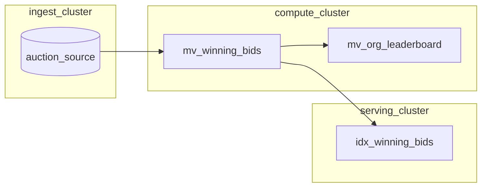
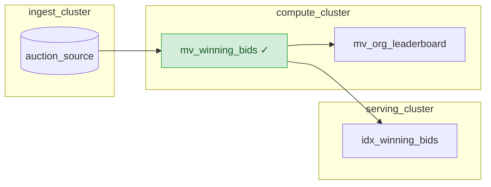

<!-- mz-docs page: transform-data/idiomatic-materialize-sql/top-k -->

# Top-K in group
Use idiomatic Materialize SQL to find the top-k/top-n elements in each group.
## Overview

The "Top-K in group" query pattern groups by some key and return the first K
elements within each group according to some ordering.

> ### Materialize and window functions
> For indexed views and materialized views that contain [window
> functions](/sql/functions/#window-functions) (including aggregate functions used
> with an `OVER` clause), when an input record in a partition is
> added/removed/changed, Materialize **recomputes the results from scratch** for
> that partition (instead of using incremental computation).
> The `PARTITION BY` clause of your window function determines your partitions. If
> `PARTITION BY` is omitted, all records belong to a single partition (i.e., any
> record change results in a recomputation from scratch over the whole input).
> To avoid performance issues that may arise as the number of records grows,
> consider rewriting your indexed views and materialized views to use idiomatic
> Materialize SQL instead of window functions. If your view definitions cannot be
> rewritten without the window functions and the performance of window functions
> is insufficient for your use case, please [contact our team](/support/).

## Idiomatic Materialize SQL

### For K >= 1

**Idiomatic Materialize SQL**: For Top-K queries where K >= 1, use a subquery to
[SELECT DISTINCT](/sql/select/#select-distinct) on the grouping key and perform
a [LATERAL](/sql/select/join/#lateral-subqueries) join (by the grouping key)
with another subquery that specifies the ordering and the limit K.

<table>
<thead>
<tr>
<th></th>
<th></th>
</tr>
</thead>
<tbody>
<tr>
<td><blue>Idiomatic Materialize SQL</blue></td>
<td class="copyableCode">

Use a subquery to
[SELECT DISTINCT](/sql/select/#select-distinct) on the grouping key (e.g.,
`fieldA`), and perform a [LATERAL](/sql/select/join/#lateral-subqueries) join
(by the grouping key `fieldA`) with another subquery that specifies the ordering
(e.g., `fieldZ [ASC|DESC]`) and the limit K.

```mzsql
SELECT fieldA, fieldB, ...
FROM (SELECT DISTINCT fieldA FROM tableA) grp,
     LATERAL (SELECT fieldB, ... , fieldZ FROM tableA
        WHERE fieldA = grp.fieldA
        ORDER BY fieldZ ... LIMIT K)   -- K is a number >= 1
ORDER BY fieldA, fieldZ ... ;
```

</td>
</tr>
<tr>
<td><red>Anti-pattern</red></td>
<td>

<red>Avoid the use of `ROW_NUMBER() OVER (PARTITION BY ... ORDER BY ...)` for Top-K queries.</red>

```nofmt
-- Anti-pattern. Avoid. --
SELECT fieldA, fieldB, ...
FROM (
   SELECT fieldA, fieldB, ... , fieldZ,
      ROW_NUMBER() OVER (PARTITION BY fieldA
      ORDER BY fieldZ ... ) as rn
   FROM tableA)
WHERE rn <= K     -- K is a number >= 1
ORDER BY fieldA, fieldZ ...;
```

</td>
</tr>
</tbody>
</table>

#### Query hints

To further improve the memory usage of the idiomatic Materialize SQL, you can
specify a [`LIMIT INPUT GROUP SIZE` query hint](/sql/select/#query-hints) in the
idiomatic Materialize SQL.

```mzsql
SELECT fieldA, fieldB, ...
FROM (SELECT DISTINCT fieldA FROM tableA) grp,
     LATERAL (SELECT fieldB, ... , fieldZ FROM tableA
        WHERE fieldA = grp.fieldA
        OPTIONS (LIMIT INPUT GROUP SIZE = ...)
        ORDER BY fieldZ ... LIMIT K)   -- K is a number >= 1
ORDER BY fieldA, fieldZ ... ;
```

For more information on setting `LIMIT INPUT GROUP SIZE`, see
[Optimization](/transform-data/optimization/#query-hints).

### For K = 1

**Idiomatic Materialize SQL**: For K = 1, use a [SELECT DISTINCT
ON()](/sql/select/#select-distinct-on) on the grouping key (e.g., `fieldA`) and
order the results first by the `DISTINCT ON` key and then the Top-K ordering
key (e.g., `fieldA, fieldZ [ASC|DESC]`).

Alternatively, you can also use the more general [Top-K where K >= 1](#for-k--1)
pattern, specifying 1 as the limit.

<table>
<thead>
<tr>
<th></th>
<th></th>
</tr>
</thead>
<tbody>
<tr>
<td><blue>Idiomatic Materialize SQL</blue></td>
<td class="copyableCode">

```mzsql
SELECT DISTINCT ON(fieldA) fieldA, fieldB, ...
FROM tableA
ORDER BY fieldA, fieldZ ... ;
```

</td>
</tr>

<tr>
<td><red>Anti-pattern</red></td>
<td>

<red>Avoid the use of `ROW_NUMBER() OVER (PARTITION BY ... ORDER BY ...)` for Top-K queries.</red>

```nofmt
-- Anti-pattern. Avoid. --
SELECT fieldA, fieldB, ...
FROM (
   SELECT fieldA, fieldB, ... , fieldZ,
      ROW_NUMBER() OVER (PARTITION BY fieldA
      ORDER BY fieldZ ... ) as rn
   FROM tableA)
WHERE rn = 1
ORDER BY fieldA, fieldZ ...;
```

</td>
</tr>
</tbody>
</table>

### Query hints

To further improve the memory usage of the idiomatic Materialize SQL, you can
specify a [`DISTINCT ON INPUT GROUP SIZE` query hint](/sql/select/#query-hints)
in the idiomatic Materialize SQL.

```mzsql
SELECT DISTINCT ON(fieldA) fieldA, fieldB, ...
FROM tableA
OPTIONS (DISTINCT ON INPUT GROUP SIZE = ...)
ORDER BY fieldA, fieldZ ... ;
```

For more information on setting `DISTINCT ON INPUT GROUP SIZE`, see
[`EXPLAIN ANALYZE HINTS`](/sql/explain-analyze/#explain-analyze-hints).

## Examples

> **Note:** The example data can be found in the
> [Appendix](/transform-data/idiomatic-materialize-sql/appendix/example-orders).

### Select Top-3 items

Using idiomatic Materialize SQL, the following example finds the top 3 items (by
descending subtotal) in each order. The example uses a subquery to [SELECT
DISTINCT](/sql/select/#select-distinct) on the grouping key (`order_id`), and
performs a [LATERAL](/sql/select/join/#lateral-subqueries) join (by the grouping
key) with another subquery that specifies the ordering (`ORDER BY subtotal
DESC`) and limits its results to 3 (`LIMIT 3`).

<table>
<thead>
<tr>
<th></th>
<th></th>
</tr>
</thead>
<tbody>
<tr>
<td><blue>Idiomatic Materialize SQL</blue></td>
<td class="copyableCode">

```mzsql
SELECT order_id, item, subtotal
FROM (SELECT DISTINCT order_id FROM orders_view) grp,
     LATERAL (SELECT item, subtotal FROM orders_view
        WHERE order_id = grp.order_id
        ORDER BY subtotal DESC LIMIT 3)
ORDER BY order_id, subtotal DESC;
```

</td>
</tr>

<tr>
<td><red>Anti-pattern</red> ❌</td>
<td>

<red>Avoid the use of `ROW_NUMBER() OVER (PARTITION BY ... ORDER BY ...)` for Top-K queries.</red>

```nofmt
-- Anti-pattern --
SELECT order_id, item, subtotal
FROM (
   SELECT order_id, item, subtotal,
      ROW_NUMBER() OVER (PARTITION BY order_id ORDER BY subtotal DESC) as rn
   FROM orders_view)
WHERE rn <= 3
ORDER BY order_id, subtotal DESC;
```

</td>
</tr>

</tbody>
</table>

### Select Top-1 item

Using idiomatic Materialize SQL, the following example finds the top 1 item (by
descending subtotal) in each order. The example uses a query to [SELECT DISTINCT
ON()](/sql/select/#select-distinct-on) on the grouping key (`order_id`) with an
`ORDER BY order_id, subtotal DESC` (i.e., ordering first by the `DISTINCT
ON`/grouping key, then the descending subtotal). [^1]

<table>
<thead>
<tr>
<th></th>
<th></th>
</tr>
</thead>
<tbody>
<tr>
<td><blue>Idiomatic Materialize SQL</blue></td>
<td class="copyableCode">

```mzsql
SELECT DISTINCT ON(order_id) order_id, item, subtotal
FROM orders_view
ORDER BY order_id, subtotal DESC;
```

</td>
</tr>
<tr>
<td><red>Anti-pattern</red> ❌</td>
<td>

<red>Avoid the use of `ROW_NUMBER() OVER (PARTITION BY ... ORDER BY ...)` for Top-K queries.</red>

```nofmt
-- Anti-pattern --
SELECT order_id, item, subtotal
FROM (
   SELECT order_id, item, subtotal,
      ROW_NUMBER() OVER (PARTITION BY order_id ORDER BY subtotal DESC) as rn
   FROM orders_view)
WHERE rn = 1
ORDER BY order_id, subtotal DESC;
```

</td>
</tr>
</tbody>
</table>

[^1]: Alternatively, you can also use the [idiomatic Materialize SQL for the
    more general Top K query](#for-k--1), specifying 1 as the limit.

## See also

- [SELECT DISTINCT](/sql/select/#select-distinct)
- [LATERAL subqueries](/sql/select/join/#lateral-subqueries)
- [Query hints for Top K](/transform-data/optimization/#query-hints)
- [Window functions](/sql/functions/#window-functions)

<!-- mz-docs page: transform-data/monitor-freshness -->

# How to monitor freshness in Materialize
How to monitor data freshness across your environment and for specific objects in Materialize.
[Freshness](/fundamentals/concepts/reaction-time/#freshness) measures the time from when a
change occurs in an upstream system to when it becomes visible in the results of
a query. This guide shows how to track freshness for an object over time and how
to summarize a whole window of freshness observations with a CCDF or an HDR
histogram.

If freshness is worse than expected, see [Freshness
troubleshooting](/transform-data/freshness-troubleshooting/) to diagnose and
resolve the cause.

## Track freshness over time

To track freshness for a specific object over time, query its wallclock lag
history. The following query returns the last 6 hours of wallclock lag for a
materialized view (replace `<your_mv_name>` with the name of your object):

```mzsql
SELECT wl.occurred_at, wl.lag
FROM mz_internal.mz_wallclock_global_lag_recent_history wl
JOIN mz_catalog.mz_objects o ON wl.object_id = o.id
WHERE o.name = '<your_mv_name>'
  AND wl.occurred_at > now() - INTERVAL '6 hours'
ORDER BY wl.occurred_at DESC;
```

For example, for a materialized view named `freshness_demo`, the query returns
output like the following:

```none
      occurred_at       |   lag
------------------------+----------
 2026-07-30 19:38:00+00 | 00:00:02
 2026-07-30 19:37:00+00 | 00:00:02
 2026-07-30 19:36:00+00 | 00:00:02
 2026-07-30 19:35:00+00 | 00:00:02
 2026-07-30 19:34:00+00 | 00:00:02
(5 rows)
```

Each row is one minute-binned observation of the object's wallclock lag, most
recent first. Here lag holds steady at about two seconds, which is the expected,
healthy pattern for a lightly loaded object.

> **Note:** [`mz_internal.mz_wallclock_global_lag_recent_history`](/sql/system-catalog/mz_internal/#mz_wallclock_global_lag_recent_history)
> is indexed and holds only the past 24 hours of data. Querying it is fast, so it
> is the right choice for frequent or interactive monitoring and for dashboards.
> Use this relation by default, as in the query above. For older data, see
> [Monitor historical freshness](#monitor-historical-freshness).

## Monitor historical freshness

`mz_wallclock_global_lag_recent_history` holds only the past 24 hours. To look
further back, query
[`mz_internal.mz_wallclock_global_lag_history`](/sql/system-catalog/mz_internal/#mz_wallclock_global_lag_history)
instead, which covers the full retention window of at least 30 days. The
columns are identical, so any query in this guide works against it by swapping
the relation name and widening the time filter:

```mzsql
SELECT wl.occurred_at, wl.lag
FROM mz_internal.mz_wallclock_global_lag_history wl
JOIN mz_catalog.mz_objects o ON wl.object_id = o.id
WHERE o.name = '<your_mv_name>'
  AND wl.occurred_at > now() - INTERVAL '7 days'
ORDER BY wl.occurred_at DESC;
```

Because the relation is unindexed, a single query can occupy
`mz_catalog_server` for several seconds. Keep the `occurred_at` filter as
narrow as the question allows, and aggregate in the query rather than pulling
raw rows out for a longer window. For example, the following returns one
maximum lag per day over the past 30 days:

```mzsql
SELECT
    date_trunc('day', wl.occurred_at) AS day,
    max(wl.lag) AS max_lag
FROM mz_internal.mz_wallclock_global_lag_history wl
JOIN mz_catalog.mz_objects o ON wl.object_id = o.id
WHERE o.name = '<your_mv_name>'
  AND wl.occurred_at > now() - INTERVAL '30 days'
GROUP BY 1
ORDER BY 1 DESC;
```

For recurring or dashboard queries that fit within the last 24 hours, stay on
`mz_wallclock_global_lag_recent_history`.

If you need historical data on a recurring basis, run the query from a separate
cluster instead of the default `mz_catalog_server`. A slow scan of the unindexed
relation can tie up `mz_catalog_server` for seconds at a time, and because it
also serves the `SHOW` commands and catalog lookups behind the Console and
interactive tooling, that slows catalog queries across your whole environment.
These queries read only system catalog relations, so Materialize routes them to
`mz_catalog_server` by default. Point the session at your own cluster and turn
off catalog auto-routing so the query actually runs there:

```mzsql
CREATE CLUSTER freshness_monitoring (SIZE = '25cc');
SET cluster = freshness_monitoring;
SET auto_route_catalog_queries = false;
```

## Summarize freshness with a CCDF

A raw time series is hard to summarize. A **complementary cumulative
distribution function (CCDF)** compresses a whole window of freshness observations
into a compact summary that answers one question: for a given threshold `X`,
what fraction of the time was the object's freshness at or above `X`?

This is the compact way to describe a freshness distribution. Instead of staring
at a time series, you can make statements like "freshness stayed under 10
seconds 99.9% of the time". Reading it the other way round, from a percentile to
a freshness, needs the [HDR
histogram](#summarize-freshness-with-an-hdr-histogram) below.

The following query builds a freshness CCDF across every object from the last 24
hours of history. It reads the fast, indexed
`mz_internal.mz_wallclock_global_lag_recent_history` and, for a fixed set of
decade thresholds (1, 10, and 100 seconds), reports the fraction of observations
whose freshness was at or above each threshold. The fixed thresholds mean every run
returns all three rows, even when the larger thresholds have no observations:

```mzsql
WITH lags AS (
    -- Convert each lag to seconds, dropping unhydrated (NULL) observations and
    -- any non-positive lag.
    SELECT extract(epoch FROM wl.lag) AS lag_seconds
    FROM mz_internal.mz_wallclock_global_lag_recent_history wl
    WHERE wl.lag IS NOT NULL
      AND wl.lag > INTERVAL '0'
),
thresholds AS (
    -- Fixed decade thresholds, so the CCDF always reports 1s, 10s, and 100s.
    SELECT unnest(ARRAY[1, 10, 100]) AS lag_threshold_seconds
)
SELECT
    t.lag_threshold_seconds,
    count(*) FILTER (WHERE l.lag_seconds >= t.lag_threshold_seconds)::float8
        / count(*) AS fraction_of_time_at_or_above
FROM thresholds t, lags l
GROUP BY t.lag_threshold_seconds
ORDER BY t.lag_threshold_seconds;
```

The query returns output like the following:

```none
 lag_threshold_seconds | fraction_of_time_at_or_above
-----------------------+------------------------------
                     1 |                            1
                    10 |                            0
                   100 |                            0
(3 rows)
```

Read this as: freshness was at or above 1 second 100% of the time and never
reached 10 seconds or 100 seconds (0% at or above each). This is the healthy
pattern for a lightly loaded instance whose objects all sit at a low,
near-constant lag, so the 10-second and 100-second thresholds are zero here. A
busier instance under real load might show non-zero fractions at those higher
thresholds.

By default this query aggregates across every object. To scope the CCDF to a
single object, join `mz_catalog.mz_objects` in the `lags` CTE and filter on the
object name (replace `<your_mv_name>` with the name of your object):

```mzsql
WITH lags AS (
    -- Convert each lag to seconds, dropping unhydrated (NULL) observations and
    -- any non-positive lag.
    SELECT extract(epoch FROM wl.lag) AS lag_seconds
    FROM mz_internal.mz_wallclock_global_lag_recent_history wl
    JOIN mz_catalog.mz_objects o ON wl.object_id = o.id
    WHERE o.name = '<your_mv_name>'
      AND wl.lag IS NOT NULL
      AND wl.lag > INTERVAL '0'
),
thresholds AS (
    -- Fixed decade thresholds, so the CCDF always reports 1s, 10s, and 100s.
    SELECT unnest(ARRAY[1, 10, 100]) AS lag_threshold_seconds
)
SELECT
    t.lag_threshold_seconds,
    count(*) FILTER (WHERE l.lag_seconds >= t.lag_threshold_seconds)::float8
        / count(*) AS fraction_of_time_at_or_above
FROM thresholds t, lags l
GROUP BY t.lag_threshold_seconds
ORDER BY t.lag_threshold_seconds;
```

To compare against an SLO, pick your target freshness (say 10 seconds) and read
the fraction of time at or above it. That fraction is how often the object was
violating the SLO over the window.

Expect a few artifacts in the data. NULL lag rows are unhydrated observations,
and the query above already filters them out. If a spurious shelf appears far
out at roughly `1.76e9` seconds (about 56 years), it comes from unhydrated
collections reported at the Unix epoch, so filter it out (for example with `AND
wl.lag < INTERVAL '1 year'`) so it does not distort the fractions.

## Summarize freshness with an HDR histogram

A CCDF answers a question you pose in one direction: you pick a threshold, and
it tells you what fraction of the time freshness was at or above it. Sometimes
you want the other direction. You pick a percentile, and it tells you the
freshness. Answering that requires a distribution over many buckets rather than
a handful of fixed thresholds.

A **High Dynamic Range (HDR) histogram** provides one. It buckets observations
so that bucket width grows with magnitude: narrow buckets near zero, wide
buckets far out. This bounds the *relative* error of every bucket while keeping
the total number of buckets small, which suits lag measurements, where a
one-second difference matters at 2s and is noise at 200s. For background on the
technique and on exact histograms as an alternative, see [Percentile
calculation](/transform-data/patterns/percentiles/).

The following query buckets the last 24 hours of lag observations and turns the
bucket counts into a cumulative distribution. Each lag is converted to seconds
and decomposed into `significand * 2^exponent`. The significand is rounded down
to a multiple of 1/16 (4 bits of precision), and the value reconstructed to give
the bucket. The final `SELECT` divides each bucket's cumulative count by
the total count:

```mzsql
WITH
  lags AS (
      -- Convert each lag to seconds, dropping unhydrated (NULL) observations,
      -- any non-positive lag, and the epoch shelf described in the CCDF
      -- section above.
      SELECT extract(epoch FROM wl.lag) AS lag_seconds
      FROM mz_internal.mz_wallclock_global_lag_recent_history wl
      WHERE wl.lag IS NOT NULL
        AND wl.lag > INTERVAL '0'
        AND wl.lag < INTERVAL '1 year'
  ),
  lag_exponents AS (
      -- Decompose each lag into significand * 2^exponent.
      SELECT lag_seconds, floor(log(2, lag_seconds))::int AS exponent
      FROM lags
  ),
  buckets AS (
      -- Reduce the significand by 4 bits, rounding the value down to the
      -- nearest multiple of 1/16, then reconstruct it to get the bucket.
      SELECT
          trunc(lag_seconds / pow(2.0, exponent) * pow(2.0, 4)) / pow(2.0, 4)
              * pow(2.0, exponent) AS bucket_seconds
      FROM lag_exponents
  ),
  histogram AS (
      SELECT bucket_seconds, count(*) AS count_of_bucket_values
      FROM buckets
      GROUP BY bucket_seconds
  )
SELECT
    h.bucket_seconds,
    h.count_of_bucket_values,
    sum(g.count_of_bucket_values) AS cumulative_count,
    sum(g.count_of_bucket_values)::float8
        / (SELECT sum(count_of_bucket_values) FROM histogram)
        AS cumulative_density
FROM histogram g, histogram h
WHERE g.bucket_seconds <= h.bucket_seconds
GROUP BY h.bucket_seconds, h.count_of_bucket_values
ORDER BY h.bucket_seconds;
```

The query returns output like the following:

```none
 bucket_seconds | count_of_bucket_values | cumulative_count | cumulative_density
----------------+------------------------+------------------+--------------------
              1 |                   7613 |             7613 | 0.9450099304865939
              2 |                    366 |             7979 |  0.990441906653426
              3 |                     32 |             8011 | 0.9944141012909633
              4 |                     36 |             8047 | 0.9988828202581926
              5 |                      7 |             8054 | 0.9997517378351539
              6 |                      2 |             8056 |                  1
(6 rows)
```

Every bucket here is a whole number of seconds, because at this range 4 bits of
significand precision is finer than the 1s resolution of the measurement itself.
The buckets only start to widen further out, and 4 bits hold every one of them to
within about 6% of the values it contains, so the bucket count stays bounded
however far the tail runs.

To read a percentile, take the lowest bucket whose cumulative density reaches
it. Wrapping the distribution in one more CTE and filtering on
`cumulative_density` returns the approximate p99 freshness:

```mzsql
WITH
  lags AS (
      SELECT extract(epoch FROM wl.lag) AS lag_seconds
      FROM mz_internal.mz_wallclock_global_lag_recent_history wl
      WHERE wl.lag IS NOT NULL
        AND wl.lag > INTERVAL '0'
        AND wl.lag < INTERVAL '1 year'
  ),
  lag_exponents AS (
      SELECT lag_seconds, floor(log(2, lag_seconds))::int AS exponent
      FROM lags
  ),
  buckets AS (
      SELECT
          trunc(lag_seconds / pow(2.0, exponent) * pow(2.0, 4)) / pow(2.0, 4)
              * pow(2.0, exponent) AS bucket_seconds
      FROM lag_exponents
  ),
  histogram AS (
      SELECT bucket_seconds, count(*) AS count_of_bucket_values
      FROM buckets
      GROUP BY bucket_seconds
  ),
  distribution AS (
      SELECT
          h.bucket_seconds,
          sum(g.count_of_bucket_values)::float8
              / (SELECT sum(count_of_bucket_values) FROM histogram)
              AS cumulative_density
      FROM histogram g, histogram h
      WHERE g.bucket_seconds <= h.bucket_seconds
      GROUP BY h.bucket_seconds
  )
SELECT bucket_seconds AS approximate_p99
FROM distribution
WHERE cumulative_density >= 0.99
ORDER BY cumulative_density
LIMIT 1;
```

```none
 approximate_p99
-----------------
               2
(1 row)
```

The bucket is a lower bound: the true p99 lies between this bucket and the next
one up. Raising the significand precision from 4 bits narrows that interval at
the cost of more buckets; lowering it does the reverse.

By default these queries aggregate across every object. To scope them to a
single object, join `mz_catalog.mz_objects` in the `lags` CTE and filter on the
object name, as in the CCDF section above.

Reading percentiles off a table works, but a **percentile plot** shows the whole
distribution at once. Lag goes on a log vertical axis, and the percentile on a
log-probability horizontal axis, so each additional nine gets the same width. A
linear percentile axis would crush every nine past the first into the last few
pixels, which is exactly where the interesting behaviour lives:


Read it by picking a percentile along the bottom and reading the lag off the
left, which is the lookup the p99 query above performs. Each step up is one
bucket boundary. Where the curve crosses the SLO line is the percentile at which
the target stops holding, so a curve that crosses early is failing the target
more often than one that crosses late.

The curve has to stop somewhere: a window of `N` observations cannot express a
percentile beyond `1 - 1/N`, because past that there is less than one
observation left to place. That is why the right-hand end is annotated with the
furthest percentile the window supports rather than running to p100.

> **Note:** Wallclock lag is reported in whole seconds, always rounded up, so the smallest
> positive lag is 1s and every bucket boundary below 1s is unreachable. Combined
> with 4 bits of significand precision, every integer up to 32s gets a bucket
> to itself, and merging only begins above that: 32s and 33s share a bucket, then
> 34s and 35s, and so on. The approximation matters for objects that fall minutes
> or hours behind, not for healthy ones.
> The queries also drop rows where `lag` is NULL. A NULL means the object was not
> readable when the observation was taken, usually because it had not finished
> hydrating, so there is no lag to bucket. Dropping those rows is not neutral:
> Materialize treats an unreadable object as lagging more than any finite
> measurement, so an object that spent part of the window unhydrated looks better
> in this distribution than it behaved.


<!-- mz-docs page: transform-data/optimization -->

# Optimization
Recommendations for query optimization in Materialize.
## Reduce the size of the data

With view definitions, you can project only the columns you need, filter out
unnecessary rows, and convert values to more [compact data
types](/sql/types/) where possible.

For stacked view definitions, apply these strategies as early as possible to
reduce the size of data.

### Project only the columns you need

Instead of using `SELECT *` in your view definition, select only the columns
your downstream queries actually reference. For example:

```mzsql
-- Project only the columns downstream queries reference.
CREATE VIEW order_totals AS
  SELECT id, customer_id, total
  FROM orders;
```

### Filter out unnecessary rows

Specify conditions to filter out unnecessary rows. Filter as close to the source
as possible such that downstream joins and aggregations process fewer rows.

```mzsql
CREATE VIEW active_orders AS
  SELECT id, customer_id, total
  FROM orders
  WHERE status = 'active';
```

### Use compact data types

When applicable, choose a more compact representation of a view's column to
reduce the size of each row, especially for views over large collections of
data:

- If a column is of type `text` but its values can accurately be represented as
  a more compact type, cast to that type. For example, a column containing only
  the strings `'true'` or `'false'` can be represented as `boolean`.

- If a column holds one of a small, fixed set of string values (e.g., days of
  the week, or status values), represent each value as a small integer code
  instead.

For example, assume the `events` table includes:

- an `id` field of type `text` whose values are `UUID`s as text; and

- an `event_ts` field of type `timestamp`, from which you only need the day of
  the week.

You can create a view that uses more compact representations of these
columns:

```mzsql
CREATE VIEW events_compact AS
  SELECT
    id::uuid AS id,                                       -- cast to type UUID
    EXTRACT(dow FROM event_ts)::smallint AS day_of_week   -- encode day-of-week
  FROM events;
```

> **Note:** For integers, the actual number of bytes written depends on the actual
> value. For example, a `bigint` value of `3` takes 2 bytes total (1 payload
> byte plus 1 tag byte). As such, casting to a smaller integer type does not necessarily reduce storage.

## Indexes

Indexes in Materialize maintain the complete up-to-date query results in memory
(and not just the index keys and the pointers to data rows). Unlike some other
databases, Materialize can use an index to serve query results even if the query
does not specify a `WHERE` condition on the index keys. Serving queries from
an index is fast since the results are already up-to-date and in memory.

Materialize can use [indexes](/fundamentals/concepts/indexes/) to further optimize query
performance in Materialize. Improvements can be significant, reducing some query
times down to single-digit milliseconds.

Building an efficient index depends on the clauses used in your queries as well
as your expected access patterns. Use the following as a guide:

* [WHERE point lookups](#where-point-lookups)
* [JOIN](#join)
* [DEFAULT](#default-index)

### `WHERE` point lookups

Unlike some other databases, Materialize can use an index to serve query results
even if the query does not specify a `WHERE` condition on the index keys. For
some queries, Materialize can perform [**point
lookups**](/fundamentals/concepts/indexes/#point-lookups) on the index (as opposed to an
index scan) if the query's `WHERE` clause:

- Specifies equality (`=` or `IN`) condition on **all** the indexed fields. The
  equality conditions must specify the **exact** index key expression (including
  type).

- Only uses `AND` (conjunction) to combine conditions for **different** fields.

Depending on your query pattern, you may want to build indexes to support point
lookups.

#### Create an index to support point lookups

To [create an index](/sql/create-index/) to support [**point
lookups**](/fundamentals/concepts/indexes/#point-lookups):

```mzsql
CREATE INDEX ON obj_name (<keys>);
```

- Specify **only** the keys that are constrained in the query's `WHERE` clause.
  If your index contains keys not specified in the query's `WHERE` clause, then
  Materialize performs a full index scan.

- Specify all (or a subset of) keys that are constrained in the query pattern's
  `WHERE` clause. If the index specifies all the keys, Materialize performs a
  point lookup only. If the index specifies a subset of keys, then Materialize
  performs a point lookup on the index keys and then filters these results using
  the conditions on the non-indexed fields.

- Specify index keys that **exactly match** the column expressions in the
  `WHERE` clause. For example, if the query specifies `WHERE quantity * price =
  100`, the index key should be `quantity * price` and not `price * quantity`.

- If the `WHERE` uses `OR` clauses and:

  - The `OR` arguments constrain all the same fields (e.g., `WHERE (quantity = 5
    AND price = 1.25) OR (quantity = 10 AND price = 1.25)`), create an index for
    the constrained fields (e.g., `quantity` and `price`).

  - The `OR` arguments constrain some of the same fields (e.g., `WHERE (quantity
    = 5 AND price = 1.25) OR (quantity = 10 AND item = 'brownie)`), create an
    index for the intersection of the constrained fields (e.g., `quantity`).
    Materialize performs a point lookup on the indexed key and then filters the
    results using the conditions on the non-indexed fields.

  - The `OR` arguments constrain completely disjoint sets of fields (e.g.,
    `WHERE quantity = 5 OR item = 'brownie'`), try to rewrite your query using a
    `UNION` (or `UNION ALL`), where each argument of the `UNION` has one of the
    original `OR` arguments.

    For example, the query can be rewritten as:

    ```mzsql
    SELECT * FROM orders_view WHERE quantity = 5
    UNION
    SELECT * FROM orders_view WHERE item = 'brownie';
    ```

    Depending on your usage pattern, you may want point-lookup indexes on both
    `quantity` and `item` (i.e., create two indexes, one on `quantity` and one
    on `item`). However, since each index will hold a copy of the data, consider
    the tradeoff between speed and memory usage. If the memory impact of having
    both indexes is too high, you might want to take a more global look at all
    of your queries to determine which index to build.

#### Examples

| WHERE clause of your query patterns    | Index for point lookups                                 |
|---------------------------------------------------|------------------------------------------|
| `WHERE x = 42`                                    | `CREATE INDEX ON obj_name (x);`        |
| `WHERE x IN (1, 2, 3)`                            | `CREATE INDEX ON obj_name (x);`        |
| `WHERE x = 1 OR x = 2`                            | `CREATE INDEX ON obj_name (x);`        |
| `WHERE (x, y) IN ((1, 'a'), (7, 'b'), (8, 'c'))`  | `CREATE INDEX ON obj_name (x, y);` or <br/> `CREATE INDEX ON obj_name (y, x);`  |
| `WHERE x = 1 AND y = 'abc'`                       | `CREATE INDEX ON obj_name (x, y);` or <br/> `CREATE INDEX ON obj_name (y, x);` |
| `WHERE (x = 5 AND y = 'a') OR (x = 7 AND y = ''`) | `CREATE INDEX ON obj_name (x, y);` or <br/> `CREATE INDEX ON obj_name (y, x);`     |
| `WHERE y * x = 64`                                | `CREATE INDEX ON obj_name (y * x);`    |
| `WHERE upper(y) = 'HELLO'`                        | `CREATE INDEX ON obj_name (upper(y));` |

You can verify that Materialize is accessing the input by an index lookup using [`EXPLAIN`](/sql/explain-plan/).

```mzsql
CREATE INDEX ON foo (x, y);
EXPLAIN SELECT * FROM foo WHERE x = 42 AND y = 50;
```

In the [`EXPLAIN`](/sql/explain-plan/) output, check for `lookup_value` after
the index name to confirm that Materialize will use a point lookup; i.e., that
Materialize will only read the matching records from the index instead of
scanning the entire index:

```
 Explained Query (fast path):
   Project (#0{x}, #1{y})
     ReadIndex on=materialize.public.foo foo_x_y_idx=[lookup value=(42, 50)]

 Used Indexes:
   - materialize.public.foo_x_y_idx (lookup)
```

### `JOIN`

In general, you can [improve the performance of your joins](https://materialize.com/blog/maintaining-joins-using-few-resources) by creating indexes on the columns occurring in join keys. (When a relation is joined with different relations on different keys, then separate indexes should be created for these keys.) This comes at the cost of additional memory usage. Materialize's in-memory [arrangements](/overview/arrangements) (the internal data structure of indexes) allow the system to share indexes across queries: **for multiple queries, an index is a fixed upfront cost with memory savings for each new query that uses it.**

Let's create a few tables to work through examples.

```mzsql
CREATE TABLE teachers (id INT, name TEXT);
CREATE TABLE sections (id INT, teacher_id INT, course_id INT, schedule TEXT);
CREATE TABLE courses (id INT, name TEXT);
```

#### Multiple Queries Join On the Same Collection

Let's consider two queries that join on a common collection. The idea is to create an index that can be shared across the two queries to save memory.

Here is a query where we join a collection `teachers` to a collection `sections` to see the name of the teacher, schedule, and course ID for a specific section of a course.

```mzsql
SELECT
    t.name,
    s.schedule,
    s.course_id
FROM teachers t
INNER JOIN sections s ON t.id = s.teacher_id;
```

Here is another query that also joins on `teachers.id`. This one counts the number of sections each teacher teaches.

```mzsql
SELECT
    t.id,
    t.name,
    count(*)
FROM teachers t
INNER JOIN sections s ON t.id = s.teacher_id
GROUP BY t.id, t.name;
```

We can eliminate redundant memory usage for these two queries by creating an index on the common column being joined, `teachers.id`.

```mzsql
CREATE INDEX pk_teachers ON teachers (id);
```

#### Joins with Filters

If your query filters one or more of the join inputs by a literal equality (e.g., `WHERE t.name = 'Escalante'`), place one of those input collections first in the `FROM` clause. In particular, this can speed up [ad hoc `SELECT` queries](/sql/select/#ad-hoc-queries) by accessing collections using index lookups rather than full scans.

Note that when the same input is being used in a join as well as being constrained by equalities to literals, _either_ the join _or_ the literal equalities can be sped up by an index (possibly the same index, but usually different indexes). Which of these will perform better depends on the characteristics of your data. For example, the following query can make use of _either_ of the following two indexes, but not both at the same time:
- on `teachers(name)` to perform the `t.name = 'Escalante'` point lookup before the join,
- on `teachers(id)` to speed up the join and then perform the `WHERE t.name = 'Escalante'`.

```mzsql
SELECT
    t.name,
    s.schedule,
    s.course_id
FROM teachers t
INNER JOIN sections s ON t.id = s.teacher_id
WHERE t.name = 'Escalante';
```

In this case, the index on `teachers(name)` might work better, as the `WHERE t.name = 'Escalante'` can filter out a very large percentage of the `teachers` table before the table is fed to the join. You can see an example `EXPLAIN` command output for the above query [here](#use-explain-to-verify-index-usage).

#### Optimize Multi-Way Joins with Delta Joins

Materialize has access to a join execution strategy we call **delta joins**, which aggressively re-uses indexes and maintains no intermediate results in memory. Materialize considers this plan only if all the necessary indexes already exist, in which case the additional memory cost of the join is zero. This is typically possible when you index all the join keys (including primary keys and foreign keys that are involved in the join). Delta joins are relevant only for joins of more than 2 inputs.

Let us extend the previous example by also querying for the name of the course rather than just the course ID, needing a 3-input join.

```mzsql
CREATE VIEW course_schedule AS
  SELECT
      t.name AS teacher_name,
      s.schedule,
      c.name AS course_name
  FROM teachers t
  INNER JOIN sections s ON t.id = s.teacher_id
  INNER JOIN courses c ON c.id = s.course_id;
```

In this case, we create indexes on the join keys to optimize the query:

```mzsql
CREATE INDEX pk_teachers ON teachers (id);
CREATE INDEX sections_fk_teachers ON sections (teacher_id);
CREATE INDEX pk_courses ON courses (id);
CREATE INDEX sections_fk_courses ON sections (course_id);
```

```mzsql
EXPLAIN SELECT * FROM course_schedule;
```

```
Optimized Plan
Explained Query:
  Project (#1, #5, #7)
    Filter (#0) IS NOT NULL AND (#4) IS NOT NULL
      Join on=(#0 = #3 AND #4 = #6) type=delta                 <---------- Delta join
        ArrangeBy keys=[[#0]]
          ReadIndex on=teachers pk_teachers=[delta join 1st input (full scan)]
        ArrangeBy keys=[[#1], [#2]]
          ReadIndex on=sections sections_fk_teachers=[delta join lookup] sections_fk_courses=[delta join lookup]
        ArrangeBy keys=[[#0]]
          ReadIndex on=courses pk_courses=[delta join lookup]

Used Indexes:
  - materialize.public.pk_teachers (delta join 1st input (full scan))
  - materialize.public.sections_fk_teachers (delta join lookup)
  - materialize.public.pk_courses (delta join lookup)
  - materialize.public.sections_fk_courses (delta join lookup)
```

For [ad hoc `SELECT` queries](/sql/select/#ad-hoc-queries) with a delta join, place the smallest input (taking into account predicates that filter from it) first in the `FROM` clause. (This is only relevant for joins with more than two inputs, because two-input joins are always Differential joins.)

It is important to note that often more than one index is needed on a single input of a multi-way join. In the above example, `sections` needs an index on the `teacher_id` column and another index on the `course_id` column. Generally, when a relation is joined with different relations on different keys, then separate indexes should be created for each of these keys.

#### Further Optimize with Late Materialization

Materialize can further optimize memory usage when joining collections with primary and foreign key constraints using a pattern known as **late materialization**.

To understand late materialization, you need to know about primary and foreign keys. In our example, the `teachers.id` column uniquely identifies all teachers. When a column or set of columns uniquely identifies each record, it is called a **primary key**. We also have `sections.teacher_id`, which is not the primary key of `sections`, but it *does* correspond to the primary key of `teachers`. Whenever we have a column that is a primary key of another collection, it is called a [**foreign key**](https://en.wikipedia.org/wiki/Foreign_key).

In many relational databases, indexes don't replicate the entire collection of data. Rather, they maintain just a mapping from the indexed columns back to a primary key. These few columns can take substantially less space than the whole collection, and may also change less as various unrelated attributes are updated. This is called **late materialization**, and it is possible to achieve in Materialize as well. Here are the steps to implementing late materialization along with examples.

1. Create indexes on the primary key column(s) for your input collections.
    ```mzsql
    CREATE INDEX pk_teachers ON teachers (id);
    CREATE INDEX pk_sections ON sections (id);
    CREATE INDEX pk_courses ON courses (id);
    ```

2. For each foreign key in the join, create a "narrow" view with just two columns: foreign key and primary key. Then create two indexes: one for the foreign key and one for the primary key. In our example, the two foreign keys are `sections.teacher_id` and `sections.course_id`, so we do the following:
    ```mzsql
    -- Create a "narrow" view containing primary key sections.id
    -- and foreign key sections.teacher_id
    CREATE VIEW sections_narrow_teachers AS SELECT id, teacher_id FROM sections;
    -- Create indexes on those columns
    CREATE INDEX sections_narrow_teachers_0 ON sections_narrow_teachers (id);
    CREATE INDEX sections_narrow_teachers_1 ON sections_narrow_teachers (teacher_id);
    ```
    ```mzsql
    -- Create a "narrow" view containing primary key sections.id
    -- and foreign key sections.course_id
    CREATE VIEW sections_narrow_courses AS SELECT id, course_id FROM sections;
    -- Create indexes on those columns
    CREATE INDEX sections_narrow_courses_0 ON sections_narrow_courses (id);
    CREATE INDEX sections_narrow_courses_1 ON sections_narrow_courses (course_id);
    ```
    > **Note:** In this case, because both foreign keys are in `sections`, we could have gotten away with one narrow collection `sections_narrow_teachers_and_courses` with indexes on `id`, `teacher_id`, and `course_id`. In general, we won't be so lucky to have all the foreign keys in the same collection, so we've shown the more general pattern of creating a narrow view and two indexes for each foreign key.

3. Rewrite your query to use your narrow collections in the join conditions. Example:

    ```mzsql
    SELECT
      t.name AS teacher_name,
      s.schedule,
      c.name AS course_name
    FROM sections_narrow_teachers s_t
    INNER JOIN sections s ON s_t.id = s.id
    INNER JOIN teachers t ON s_t.teacher_id = t.id
    INNER JOIN sections_narrow_courses s_c ON s_c.id = s.id
    INNER JOIN courses c ON s_c.course_id = c.id;
    ```

Check out the blog post [Delta Joins and Late Materialization](https://materialize.com/blog/delta-joins/) to go deeper on join optimization in Materialize.

### Default index

Create a default index when there is no particular `WHERE` or `JOIN` clause that would fit the above cases. This can still speed up your query by reading the input from memory.

Clause                                               | Index                               |
-----------------------------------------------------|-------------------------------------|
`SELECT x, y FROM obj_name`                          | `CREATE DEFAULT INDEX ON obj_name;` |

### Use `EXPLAIN` to verify index usage

Use `EXPLAIN` to verify that indexes are used as you expect. For example:

```mzsql
CREATE TABLE teachers (id INT, name TEXT);
CREATE TABLE sections (id INT, teacher_id INT, course_id INT, schedule TEXT);
CREATE TABLE courses (id INT, name TEXT);

CREATE INDEX pk_teachers ON teachers (id);
CREATE INDEX teachers_name ON teachers (name);
CREATE INDEX sections_fk_teachers ON sections (teacher_id);
CREATE INDEX pk_courses ON courses (id);
CREATE INDEX sections_fk_courses ON sections (course_id);

EXPLAIN
  SELECT
      t.name AS teacher_name,
      s.schedule,
      c.name AS course_name
  FROM teachers t
  INNER JOIN sections s ON t.id = s.teacher_id
  INNER JOIN courses c ON c.id = s.course_id
  WHERE t.name = 'Escalante';
```

```
                                                  Optimized Plan
------------------------------------------------------------------------------------------------------------------
 Explained Query:                                                                                                +
   Project (#1, #6, #8)                                                                                          +
     Filter (#0) IS NOT NULL AND (#5) IS NOT NULL                                                                +
       Join on=(#0 = #4 AND #5 = #7) type=delta                                                                  +
         ArrangeBy keys=[[#0]]                                                                                   +
           ReadIndex on=materialize.public.teachers teachers_name=[lookup value=("Escalante")]                   +
         ArrangeBy keys=[[#1], [#2]]                                                                             +
           ReadIndex on=sections sections_fk_teachers=[delta join lookup] sections_fk_courses=[delta join lookup]+
         ArrangeBy keys=[[#0]]                                                                                   +
           ReadIndex on=courses pk_courses=[delta join lookup]                                                   +
                                                                                                                 +
 Used Indexes:                                                                                                   +
   - materialize.public.teachers_name (lookup)                                                                   +
   - materialize.public.sections_fk_teachers (delta join lookup)                                                 +
   - materialize.public.pk_courses (delta join lookup)                                                           +
   - materialize.public.sections_fk_courses (delta join lookup)                                                  +
```

You can see in the above `EXPLAIN` printout that the system will use `teachers_name` for a point lookup, and use three other indexes for the execution of the delta join. Note that the `pk_teachers` index is not used, as explained [above](#joins-with-filters).

The following are the possible index usage types:
- `*** full scan ***`: Materialize will read the entire index.
- `lookup`: Materialize will look up only specific keys in the index.
- `differential join`: Materialize will use the index to perform a _differential join_. For a differential join between two relations, the amount of memory required is proportional to the sum of the sizes of each of the input relations that are **not** indexed. In other words, if an input is already indexed, then the size of that input won't affect the memory usage of a differential join between two relations. For a join between more than two relations, we recommend aiming for a delta join instead of a differential join, as explained [above](#optimize-multi-way-joins-with-delta-joins). A differential join between more than two relations will perform a series of binary differential joins on top of each other, and each of these binary joins (except the first one) will use memory proportional to the size of the intermediate data that is fed into the join.
- `delta join 1st input (full scan)`: Materialize will use the index for the first input of a [delta join](#optimize-multi-way-joins-with-delta-joins). Note that the first input of a delta join is always fully scanned. However, executing the join won't require additional memory if the input is indexed.
- `delta join lookup`: Materialize will use the index for a non-first input of a [delta join](#optimize-multi-way-joins-with-delta-joins). This means that, in an ad hoc query, the join will perform only lookups into the index.
- `fast path limit`: When a [fast path](/sql/explain-plan/#fast-path-queries) query has a `LIMIT` clause but no `ORDER BY` clause, then Materialize will read from the index only as many records as required to satisfy the `LIMIT` (plus `OFFSET`) clause.

### Limitations

<p>Materialize indexes are not optimized for:</p>
<ul>
<li>
<p>Ordered access, including:</p>
<ul>
<li>
<p>Range queries, that is, queries using <code>&gt;</code>, <code>&gt;=</code>, <code>&lt;</code>, <code>&lt;=</code>, or <code>BETWEEN</code>
(e.g., <code>WHERE quantity &gt; 10</code>, <code>WHERE price &gt;= 10 AND price &lt;= 50</code>, and
<code>WHERE quantity BETWEEN 10 AND 20</code>).</p>
</li>
<li>
<p>Queries that use <code>ORDER BY</code> on the index key.</p>
</li>
</ul>
</li>
<li>
<p>Lookups on a prefix of a multi-column index key. For example, an index
with the key <code>(a, b)</code> is not optimized for a query that specifies an
equality condition on <code>a</code> but not on <code>b</code>.</p>
</li>
<li>
<p>Lookups that do not match the exact index key expression. For example,
for an index with the key <code>lower(a)</code>, an equality condition on <code>a</code> does
not match the index key; the query must specify an equality condition on
<code>lower(a)</code> for a point lookup.</p>
</li>
<li>
<p><code>GROUP BY</code> aggregations. An index on the grouping key does not reduce the work of computing the aggregation: Materialize reads the full index and maintains the aggregation separately.</p>
</li>
</ul>

## Query hints

Materialize has at present three important [query hints]: `AGGREGATE INPUT GROUP SIZE`, `DISTINCT ON INPUT GROUP SIZE`, and `LIMIT INPUT GROUP SIZE`. These hints apply to indexed or materialized views that need to incrementally maintain [`MIN`], [`MAX`], or [Top K] queries, as specified by SQL aggregations, `DISTINCT ON`, or `LIMIT` clauses. Maintaining these queries while delivering low latency result updates is demanding in terms of main memory. This is because Materialize builds a hierarchy of aggregations so that data can be physically partitioned into small groups. By having only small groups at each level of the hierarchy, we can make sure that recomputing aggregations is not slowed down by skew in the sizes of the original query groups.

The number of levels needed in the hierarchical scheme is by default set assuming that there may be large query groups in the input data. By specifying the query hints, it is possible to refine this assumption, allowing Materialize to build a hierarchy with fewer levels and lower memory consumption without sacrificing update latency.

Consider the previous example with the collection `sections`. Maintenance of the maximum `course_id` per `teacher` can be achieved with a materialized view:

```mzsql
CREATE MATERIALIZED VIEW max_course_id_per_teacher AS
SELECT teacher_id, MAX(course_id)
FROM sections
GROUP BY teacher_id;
```

If the largest number of `course_id` values that are allocated to a single `teacher_id` is known, then this number can be provided as the `AGGREGATE INPUT GROUP SIZE`. For the query above, it is possible to get an estimate for this number by:

```mzsql
SELECT MAX(course_count)
FROM (
  SELECT teacher_id, COUNT(*) course_count
  FROM sections
  GROUP BY teacher_id
);
```

However, the estimate is based only on data that is already present in the system. So taking into account how much this largest number could expand is critical to avoid issues with update latency after tuning the query hint.

For our example, let's suppose that we determined the largest number of courses per teacher to be `1000`. Then, the original definition of `max_course_id_per_teacher` can be revised to include the `AGGREGATE INPUT GROUP SIZE` query hint as follows:

```mzsql
CREATE MATERIALIZED VIEW max_course_id_per_teacher AS
SELECT teacher_id, MAX(course_id)
FROM sections
GROUP BY teacher_id
OPTIONS (AGGREGATE INPUT GROUP SIZE = 1000)
```

The other two hints can be provided in [Top K] query patterns specified by `DISTINCT ON` or `LIMIT`. As examples, consider that we wish not to compute the maximum `course_id`, but rather the `id` of the section of this top course. This computation can be incrementally maintained by the following materialized view:

```mzsql
CREATE MATERIALIZED VIEW section_of_top_course_per_teacher AS
SELECT DISTINCT ON(teacher_id) teacher_id, id AS section_id
FROM sections
OPTIONS (DISTINCT ON INPUT GROUP SIZE = 1000)
ORDER BY teacher_id ASC, course_id DESC;
```

In the above examples, we see that the query hints are always positioned in an `OPTIONS` clause after a `GROUP BY` clause, but before an `ORDER BY`, as captured by the [`SELECT` syntax]. However, in the case of Top K using a `LATERAL` subquery and `LIMIT`, it is important to note that the hint is specified in the subquery. For instance, the following materialized view illustrates how to incrementally maintain the top-3 section `id`s ranked by `course_id` for each teacher:

```mzsql
CREATE MATERIALIZED VIEW sections_of_top_3_courses_per_teacher AS
SELECT id AS teacher_id, section_id
FROM teachers grp,
     LATERAL (SELECT id AS section_id
              FROM sections
              WHERE teacher_id = grp.id
              OPTIONS (LIMIT INPUT GROUP SIZE = 1000)
              ORDER BY course_id DESC
              LIMIT 3);
```

For indexed and materialized views that have already been created without specifying query hints, Materialize includes an introspection view, [`mz_introspection.mz_expected_group_size_advice`], that can be used to query, for a given cluster, all incrementally maintained [dataflows] where tuning of the above query hints could be beneficial. The introspection view also provides an advice value based on an estimate of how many levels could be cut from the hierarchy. The following query illustrates how to access this introspection view:

```mzsql
SELECT dataflow_name, region_name, levels, to_cut, hint
FROM mz_introspection.mz_expected_group_size_advice
ORDER BY dataflow_name, region_name;
```

The column `hint` provides the estimated value to be provided to the `AGGREGATE INPUT GROUP SIZE` in the case of a `MIN` or `MAX` aggregation or to the `DISTINCT ON INPUT GROUP SIZE` or `LIMIT INPUT GROUP SIZE` in the case of a Top K pattern.

## Improve performance when using temporal filters

[Temporal filters](/transform-data/patterns/temporal-filters/) bound a
query's results using [`mz_now()`](/sql/functions/now_and_mz_now), e.g.:

```mzsql
WHERE mz_now() <= event_ts + INTERVAL '24 hours'
```

Input data originally appears at a timestamp precision of one second, so rows
typically arrive in batches that share a single timestamp. They don't age out
of the window that way: the temporal filter retracts each row at the
millisecond-precision timestamp derived from that row's own `event_ts`, so
data changes at a much finer granularity while aging out than it did when it
arrived. Materialize computes a result update for each of those distinct
timestamps, which, for a computation that is expensive to maintain
incrementally, means a disproportionate amount of work, hurting CPU usage and
freshness.

**Rounding** the timestamp expression that `mz_now()` is compared against,
e.g. with [`date_bin`](/sql/functions/date-bin), collapses many of these
distinct timestamps together. Rows that would otherwise expire at slightly
different times now expire in the same batch, so Materialize can consolidate
the overlapping intermediate state into a single update instead of tracking
each one separately.

### When it helps

Rounding is most effective for temporal filters with **high input update
rates** where consecutive updates touch **heavily overlapping data**, and
where the underlying computation is expensive to recompute per update (for
example, a filter feeding into joins, aggregations, or window functions that
can't be maintained cheaply per row). In this situation, coarsening the
timestamp granularity can meaningfully reduce CPU usage and improve freshness
(lower wallclock lag), since Materialize processes fewer, larger batches
instead of many nearly-identical small ones.

It's not helpful, or not applicable, when:

- The filter already needs fine-grained (sub-interval) precision, e.g., a
  sliding window that must expire records to the millisecond.
- The comparison against `mz_now()` isn't an inequality, e.g., an equality
  check, since then there is no bound to round.
- The query is already cheap to maintain incrementally, in which case
  rounding adds complexity for negligible benefit.

### Example

Before: a materialized view with a temporal filter that admits rows for
exactly 24 hours, using the raw, millisecond-precision `event_ts`:

```mzsql
CREATE MATERIALIZED VIEW recent_events AS
SELECT *
FROM events
WHERE mz_now() <= event_ts + INTERVAL '24 hours';
```

After: round the timestamp expression down to the nearest 10 seconds with
`date_bin`, so all rows whose `event_ts` falls in the same 10-second bucket
expire together:

```mzsql
CREATE MATERIALIZED VIEW recent_events AS
SELECT *
FROM events
WHERE mz_now() <= date_bin('10 seconds', event_ts, TIMESTAMP '1970-01-01') + INTERVAL '24 hours';
```

The same idea applies to indexes with a temporal filter in their underlying
view, and to filters expressed with epoch arithmetic rather than `date_bin`.
For example, the filter:

```mzsql
WHERE mz_now() <= extract(epoch FROM event_ts) * 1000 + 86400000
```

can be rounded to whole seconds by flooring the timestamp expression:

```mzsql
WHERE mz_now() <= floor(extract(epoch FROM event_ts)) * 1000 + 86400000
```

### Tradeoffs

- **This trades timing precision for performance.** Rows now become valid or
  invalid only at the rounding interval's boundary, which adds up to one
  interval's worth of imprecision to the filter's effective bound.
- **Round in the direction that preserves your query's guarantee.**
  `date_bin` always rounds *down*, and flooring an epoch expression does the
  same. Which direction is the conservative one depends on the semantics you
  need: if a record must never be retained for more than 24 hours, rounding
  an upper bound down is safe, because rows can then only expire up to one
  interval early; if a record must always be retained for at least 24 hours,
  you need to round *up* instead. Don't round blindly; check which direction
  preserves the guarantee your query depends on.
- **Choosing the interval matters.** Too fine an interval loses most of the
  consolidation benefit, while too coarse an interval measurably hurts
  freshness precision (you're adding up to that much latency). Since input
  data appears at a one-second timestamp precision to begin with, rounding to intervals
  larger than one second has diminishing returns, and going beyond roughly 10
  seconds is unlikely to help any further.
- **This is a manual, per-query rewrite**, not an optimization Materialize
  applies automatically. You need to identify which temporal filters are
  costly to maintain and rewrite each one.

[query hints]: /sql/select/#query-hints
[arrangements]: /fundamentals/concepts/arrangements/#arrangements
[`MIN`]: /sql/functions/#min
[`MAX`]: /sql/functions/#max
[Top K]: /transform-data/patterns/top-k
[`mz_introspection.mz_expected_group_size_advice`]: /sql/system-catalog/mz_introspection/#mz_expected_group_size_advice
[dataflows]: /fundamentals/concepts/arrangements/#dataflows
[`SELECT` syntax]: /sql/select/#syntax

<!-- mz-docs page: transform-data/patterns -->

# Patterns

Learn about common Materialize query patterns.

The following section provides examples of implementing some common query
patterns in Materialize:

<!-- mz-docs page: transform-data/patterns/ontology -->

# Use an ontology table
Create an ontology table that helps agents write correct joins.
The ontology table is a curated catalog of join relationships between tables in
your database. Each row describes a single join: the columns in one table that
reference columns in another.

Through the Materialize [MCP server](/developer-tools/mcp-server/)'s `query` tool,
an agent can query the ontology table before writing multi-table SQL.

> **Note:** This pattern relies on the MCP server's `query` tool, which is enabled by
> default starting in v26.27 for the agent MCP server and v26.30 for the developer
> MCP server.

```sql
CREATE TABLE ontology (
    table_name         text   NOT NULL,
    columns            text[] NOT NULL,
    referenced_table   text   NOT NULL,
    referenced_columns text[] NOT NULL
);

COMMENT ON TABLE ontology IS
'Defines the join relationships between tables in the database. Each row
describes a single join: the columns in table_name that reference
referenced_columns in referenced_table. ALWAYS query this table before
writing any multi-table query. Use it to confirm exact join keys rather
than guessing column names. Filter by table_name OR referenced_table to
find all relationships involving a given table.';

COMMENT ON COLUMN ontology.table_name IS
'The dependent table, the one that holds the foreign key.';
COMMENT ON COLUMN ontology.columns IS
'The FK columns in table_name, in order. Pair positionally with referenced_columns.';
COMMENT ON COLUMN ontology.referenced_table IS
'The parent table, the one being pointed to.';
COMMENT ON COLUMN ontology.referenced_columns IS
'The PK or unique columns in referenced_table, in order matching columns.';

CREATE DEFAULT INDEX ON ontology;
```

## Agent system prompt

Add the following to the agent's system prompt to enforce the intended behavior:

```text
Before writing or executing any joins, query the ontology table for the involved table names. Use the returned join keys verbatim.
```

## Example: e-commerce schema

Given the following tables and join-relevant columns:

| Table | Key columns |
| --- | --- |
| `customers` | `id`, `email` |
| `addresses` | `id`, `customer_id` |
| `orders` | `id`, `customer_id`, `shipping_address_id` |
| `order_items` | `id`, `order_id`, `product_id` |
| `products` | `id`, `category_id` |
| `categories` | `id` |
| `support_tickets` | `id`, `customer_email` *(implicit join, no FK)* |

The ontology table is populated as:

```sql
INSERT INTO ontology (table_name, columns, referenced_table, referenced_columns) VALUES
('addresses',       ARRAY['customer_id'],         'customers',  ARRAY['id']),
('orders',          ARRAY['customer_id'],         'customers',  ARRAY['id']),
('orders',          ARRAY['shipping_address_id'], 'addresses',  ARRAY['id']),
('order_items',     ARRAY['order_id'],            'orders',     ARRAY['id']),
('order_items',     ARRAY['product_id'],          'products',   ARRAY['id']),
('products',        ARRAY['category_id'],         'categories', ARRAY['id']),
('support_tickets', ARRAY['customer_email'],      'customers',  ARRAY['email']);
```

Tables with multiple relationships, like `orders`, contribute one row per
relationship. Implicit joins, such as `support_tickets` → `customers`, are
documented exactly like the declared foreign-key relationships.

<!-- mz-docs page: transform-data/patterns/partition-by -->

# Partitioning and filter pushdown
Declare how collections are stored.
[//]: # "TODO link to the source table docs once that feature is documented."

A few types of Materialize collections are durably written to storage: [materialized views](/sql/create-materialized-view/), [tables](/sql/create-table), and [sources](/sql/create-source).

Internally, each collection is stored as a set of **runs** of data, each of which is sorted and then partitioned up into individual **parts**, and those parts are written to object storage and fetched only when necessary to satisfy a query. Materialize will also periodically **compact** the data it stores, to consolidate small parts into larger ones or discard deleted rows.

For [materialized views](/sql/create-materialized-view/) and
[tables](/sql/create-table) (including read-only tables created from sources),
you can use the `PARTITION BY` option to declare the **expected** internal
ordering of the data. If the data has that ordering, optimizations like [filter
pushdown](#filter-pushdown) can be more effective, which in turn can make
queries and other operations more efficient.

> **Warning:** The `PARTITION BY` option declares the expected layout of your data. It does not
> change how the data is stored. Materialize validates the option against the
> [requirements](#requirements) below, but otherwise stores your data as it would
> without the option. As a result, adding or removing `PARTITION BY` does not
> affect query performance.
> The requirements are what make this possible. The option can only name a prefix
> of the collection's columns, which is the ordering Materialize already uses
> internally, so a valid `PARTITION BY` clause never asks for a layout that
> differs from the default one. The option records your expectation so that
> Materialize can preserve it, and it lets you find out at creation time if the
> ordering you want is not one Materialize can provide.
> If you are adding `PARTITION BY` to make a specific query faster, see [Filter
> pushdown](#filter-pushdown) instead: whether pushdown helps depends on your data
> and your filters, not on this option.

> **Note:** The `PARTITION BY` option has no impact on the order in which records are returned by queries.
> If you want to return results in a specific order, use an `ORDER BY` clause on your [`SELECT` statement](/sql/select/).

## Syntax

The option `PARTITION BY <column list>` declares that a [materialized view](/sql/create-materialized-view/#syntax) or [table](/sql/create-table/) should be partitioned by the listed columns.
For example, a table that stores an append-only collection of events may want to partition the data by time:

```mzsql
CREATE TABLE events (event_ts timestamptz, body jsonb)
WITH (
    PARTITION BY (event_ts)
);
```

This `PARTITION BY` clause declares that events with similar `event_ts` timestamps should be stored together.

> **Note:** The `PARTITION BY` option described here is unrelated to the `PARTITION BY`
> option of [`CREATE SINK ... INTO KAFKA`](/sql/create-sink/kafka/#partitioning),
> which chooses the Kafka partition that a sink writes each row to.

When multiple columns are specified, rows are partitioned lexicographically.
For example, `PARTITION BY (event_date, event_time)` would partition first by the created date;
if many rows have the same `event_date`, those rows would be partitioned by the `event_time` column.
Durable collections without a `PARTITION BY` option can be partitioned arbitrarily.

> **Note:** The `PARTITION BY` option does not mean that rows with different values for the specified columns will be stored in different parts, only that rows with similar values for those columns should be stored together.

## Requirements

Materialize currently imposes some restrictions on the list of columns in the `PARTITION BY` clause.
These restrictions describe the orderings Materialize can provide, and are enforced when you create the object.

- This clause must list a prefix of the columns in the collection. For example:
  - if you're creating a table that partitions by a single column, that column must be the first column in the table's schema definition;
  - if you're creating a table that partitions by two columns, those columns must be the first two columns in the table's schema definition and listed in the same order.
- Only certain types of columns are supported. This includes:
    - all fixed-width integer types, including `smallint`, `integer`, and `bigint`;
    - date and time types, including `date`, `time`, `timestamp`, `timestamptz`, and `mz_timestamp`;
    - string types like `text` and `bytea`;
    - `boolean` and `uuid`;
    - `record` types where all fields types are supported.

## Filter pushdown

Suppose that our example `events` table has accumulated years' worth of data, but we're running a query that matches only rows from a narrow range of timestamps.

```mzsql
SELECT * FROM events
WHERE event_ts >= TIMESTAMPTZ '2024-10-01' AND event_ts < TIMESTAMPTZ '2024-10-02';
```

This query returns only rows with similar values for `event_ts`: timestamps within a single day.
If rows with similar `event_ts` values are stored close together, the rows that pass this filter live in a small subset of parts, and Materialize can skip fetching the rest.

Materialize tracks a small amount of metadata for every part, including the range of possible values for many columns. When it can determine that none of the data in a part will match a filter, it will skip fetching that data from object storage. This optimization is called _filter pushdown_, and when you're querying with a selective filter against a large collection, it can save a great deal of time and computation.

Materialize always attempts to apply filter pushdown, but it is most effective when similar rows are stored together.
Whether rows are stored together depends on your data and the order in which the data was written.
You cannot control this layout with the `PARTITION BY` option itself.
In practice, Materialize currently stores data sorted by the collection's leading columns, so the order of columns in your schema influences it.
The option declares that ordering rather than creating it.

To maximize the effectiveness of filter pushdown, you can:

- Add a filter that only matches a narrow range of values in a single column.
- Filter on a column that appears early in the collection's column list, and whose values correlate with the order in which rows were written. A timestamp on an append-only collection is a straightforward example, as is an identifier that increases over time (e.g., UUIDv7).

To measure the effectiveness of filter pushdown, use [`EXPLAIN FILTER PUSHDOWN`](/sql/explain-filter-pushdown/) to see the number of parts and bytes your query would need to fetch.

Filters that consist of arithmetic, date math, and comparisons are generally eligible for pushdown. More complex filters might not be. Note that eligibility is not the same as pruning: a filter can be eligible and still fetch every part, depending on how the data is laid out.

Some common functions, such as casting from a string to a timestamp, can prevent filter pushdown for a query. For similar functions that _do_ allow pushdown, see [the pushdown functions documentation](/sql/functions/pushdown/).

## Examples

These examples create real objects. After you have tried the examples, make sure to drop these objects and spin down any resources you may have created.

The `PARTITION BY` clauses below declare the ordering each collection expects. Because the option does not change how data is stored, these examples store and fetch the same data without them. The clause still records the expected ordering, and Materialize validates it when you create the object.

### Partitioning by timestamp

For timeseries or "event"-type collections, it's often useful to partition the data by timestamp.

1. First, create a table called `events`.
    ```mzsql
    -- Create a table of timestamped events. Note that the `event_ts` column is
    -- first in the column list and in the parition-by clause.
    CREATE TABLE events (
        event_ts timestamptz,
        content text
    ) WITH (
        PARTITION BY (event_ts)
    );
    ```

1. Insert a few records, one "older" record and one more recent.
    ```mzsql
    INSERT INTO events VALUES (TIMESTAMPTZ '2024-10-01 12:00:00+00', 'hello');
    INSERT INTO events VALUES (TIMESTAMPTZ '2025-10-01 12:00:00+00', 'world');
    ```

1. Run a select statement against a narrow range of timestamps. This should return only the more recent of the two rows.
    ```mzsql
    SELECT * FROM events WHERE event_ts >= TIMESTAMPTZ '2025-01-01';
    ```

1. To verify that Materialize fetched only the parts that contain data in that
   range, run an `EXPLAIN FILTER PUSHDOWN` statement.
    ```mzsql
    EXPLAIN FILTER PUSHDOWN FOR
    SELECT * FROM events WHERE event_ts >= TIMESTAMPTZ '2025-01-01';
    ```

If you query a range that no event falls into, you'll notice that not only does the query return zero rows, but the explain shows that we fetched zero parts.

> **Note:** The exact numbers you see here may vary: parts can be much larger than a single row, and the actual level of filtering may fluctuate for small datasets as data is compacted together internally. However, datasets of a few gigabytes or larger should reliably see benefits from this optimization.

### Partitioning by category

Other datasets don't have a strong timeseries component, but they do have a clear notion of type or category. For example, suppose you have a collection of music venues spread across the world that you regularly query by a single country.

1. First, create a table called `venues`, partitioned by country.
    ```mzsql
    -- Create a table for our venue data.
    -- Once again, the partition column is listed first.
    CREATE TABLE venues (
        country_code text,
        id bigint,
        name text
    ) WITH (
        PARTITION BY (country_code)
    );
    ```

1. Insert a few records with different country codes.
    ```mzsql
    INSERT INTO venues VALUES ('US', 1, 'Rock World');
    INSERT INTO venues VALUES ('CA', 2, 'Friendship Cove');
    ```

1. Query for venues in particular countries.
    ```mzsql
    SELECT * FROM venues WHERE country_code IN ('US', 'MX');
    ```

1. Run `EXPLAIN FILTER PUSHDOWN` to check that we're filtering out parts that don't include data that's relevant to the query.
    ```mzsql
    EXPLAIN FILTER PUSHDOWN FOR
    SELECT * FROM venues WHERE country_code IN ('US', 'MX');
    ```

> **Note:** As before, filter pushdown on small collections may provide little or no benefit. With larger datasets, filter pushdown can reduce the number of parts that need to be fetched. However, a category column like `country_code` is less favorable for filter pushdown than a timestamp: venues from the same country are typically grouped within each internally sorted run, but a country's rows may be spread across several runs depending on when they arrived, so the benefit is usually smaller than for a timestamp filter and is best measured with `EXPLAIN FILTER PUSHDOWN`.


<!-- mz-docs page: transform-data/patterns/percentiles -->

# Percentile calculation
How to use histograms to efficiently calculate percentiles in Materialize.
Percentiles are a useful statistic to understand and interpret data distribution. This pattern covers how to use histograms to efficiently calculate percentiles in Materialize.

One way to compute percentiles is to order all values and pick the value at the
position of the corresponding percentile. However, this approach requires
storing all values, causing memory to grow linearly with the number of tracked
values.

Instead, more memory efficient alternatives are to use **histograms** and **High
Dynamic Range (HDR) histograms**:

- [Histograms](#using-histograms-to-compute-exact-percentiles) have a lower
  memory footprint that is linear to the number of _unique_ values and can
  compute precise percentiles. However, for domains with _high_ cardinality,
  calculating precise percentiles may be computationally expensive.

- [HDR histograms](#using-hdr-histograms-to-compute-approximate-percentiles)
  further reduce the memory footprint but computes approximate percentiles.
  Depending on the precision needed for the percentiles, HDR histograms may be
  preferred for domains with a high cardinality and dynamic range of values.

## Using histograms to compute exact percentiles

Histograms summarize data sets by grouping values into ranges and counting how
many elements fall into each range. From this summary, you can get the
percentile information by identifying the range where the cumulative count
crosses the desired percentile threshold. By grouping each distinct value into
its own range, you can get exact percentiles; however, this can be
computationally expensive if there are large number of distinct values.
Alternatively, you can get an approximate percentiles by using [HDR
histograms](#using-hdr-histograms-to-compute-approximate-percentiles).

To use histograms to compute exact percentiles:

- First, create a histogram view that groups each distinct value into its own
  bucket and counts the number of each distinct value.

- Then, using a cross join on the histogram view, create a distribution view
  that calculates the cumulative density for a bucket by dividing the cumulative
  counts (sum of the counts for all buckets up to and including that bucket) by
  the total count.

  > **Note:** The use of the cross join produces a number of outputs that is quadratic in
>   the input. And, while the results will only be linear in size, it may take a
>   disproportionate amount of time to produce and maintain.

### Example

1. Create a table `input`:

   ```mzsql
   CREATE TABLE input (value BIGINT);
   ```

2. Insert into the `input` table values `1` to `10`.

   ```mzsql
   INSERT INTO input
   SELECT n FROM generate_series(1,10) AS n;
   ```

1. Create a `histogram` view to track unique values from the
   `input` table and their count:

   ```mzsql
   CREATE VIEW histogram AS
   SELECT
     value AS bucket,
     count(*) AS count_of_bucket_values
   FROM input
   GROUP BY value;
   ```

1. Create a view `distribution` to calculate the cumulative count and the
   cumulative density for each bucket. The cumulative density is calculated by
   dividing the cumulative count for a bucket (i.e., count for all bucket values
   up to and including that bucket) by the total count.

   ```mzsql
   CREATE VIEW distribution AS
   SELECT
     h.bucket,
     h.count_of_bucket_values,
     sum(g.count_of_bucket_values) AS cumulative_count,
     sum(g.count_of_bucket_values) / (SELECT sum(count_of_bucket_values) FROM histogram) AS cumulative_density
   FROM histogram g, histogram h
   WHERE g.bucket <= h.bucket
   GROUP BY h.bucket, h.count_of_bucket_values
   ORDER BY cumulative_density;
   ```

   > **Note:** The use of the cross join produces a number of outputs that is quadratic in
>    the input. And, while the results will only be linear in size, it may take a
>    disproportionate amount of time to produce and maintain.

1. You can then query `distribution` by the `cumulative_density` field to
   return specific percentiles. For example, the following query returns the
   90-th percentile.

   ```mzsql
   SELECT bucket AS percentile90
   FROM distribution
   WHERE cumulative_density >= 0.9
   ORDER BY cumulative_density
   LIMIT 1;
   ```

## Using HDR histograms to compute approximate percentiles

[HDR histograms](https://github.com/HdrHistogram/HdrHistogram) can be used to approximate percentiles in a space efficient manner that scales well even for large domains with many distinct values. HDR histograms reduce the precision of values that are tracked and use buckets with variable width. Buckets that are closer to 0 are smaller whereas buckets far away from 0 are wider. This works particularly well for data that exhibits a long tail of large values, e.g., latency measurements.

HDR histograms are related to how [floating point numbers are
represented](https://en.wikipedia.org/wiki/Double-precision_floating-point_format)
as integers. The underlying assumption is that smaller numbers require a higher
precision to be distinguishable (e.g. 5 ms and 6 ms are different and should be
in different buckets) whereas larger numbers can be rounded more aggressively as
their relative error becomes less relevant (e.g. 10000 ms and 10001 ms are
almost the same and can reside in the same bucket).

In the example below, to reduce the number of buckets, the values are first
decomposed into `significand * 2^exponent`, and then with the precision of the
significand lowered, reconstructed for the respective bucket value.

- With higher precisions, fewer items are kept in the same bucket and thus, more
  memory is required, but the approximate percentile becomes more precise.

- With lower precisions, more items are kept in the same bucket, and thus, the
  less memory is required, but the approximate percentile becomes less precise.

Except for the bucket calculation, the basic ideas of [using histograms to
compute percentiles](#using-histograms-to-compute-exact-percentiles) remains the
same for HDR histograms.

### Example

> **Tip:** The following example assumes you have not previously created and populated the
> `input` table from the [Using histograms to compute exact percentiles
> example](#example). If you have created and populated the table, skip the
> corresponding steps.

1. Create a table `input`:

   ```mzsql
   CREATE TABLE input (value BIGINT);
   ```

2. Insert into the `input` table values `1` to `10`.

   ```mzsql
   INSERT INTO input
   SELECT n FROM generate_series(1,10) AS n;
   ```

1. Create a `hdr_histogram` view. To reduce the number of buckets, the values
   are rounded down to the nearest multiple of 1/16. Specifically, the values
   are first decomposed into `significand * 2^exponent`. Then by reducing the
   precision of the significand to 1/16 (4 bits), the value is reconstructed to
   an approximated value.

   **Materialize Console:**

```mzsql
CREATE VIEW hdr_histogram AS
WITH
  input_parts AS (
    SELECT
      CASE WHEN value = 0 THEN NULL
          ELSE trunc(log(2, abs(value)))::int
      END AS exponent,
      CASE WHEN value = 0 THEN NULL
          ELSE value / pow(2.0, trunc(log(2, abs(value)))::int)
      END AS significand
    FROM input
  ),
  buckets AS (
    -- reduce precision by 4 bits to round down the value to the nearest multiple of 1/16
    SELECT
      trunc(significand * pow(2.0, 4)) / pow(2.0, 4)
        * pow(2.0, exponent)
        AS bucket
    FROM input_parts
  )
SELECT
  COALESCE(bucket, 0) AS bucket,
  count(*) AS count_of_bucket_values
FROM buckets
GROUP BY bucket;
```

   **psql:**

```mzsql
-- precision for the representation of the significand in bits
\set precision 4

CREATE VIEW hdr_histogram AS
WITH
  input_parts AS (
    SELECT
      CASE WHEN value = 0 THEN NULL
          ELSE trunc(log(2, abs(value)))::int
      END AS exponent,
      CASE WHEN value = 0 THEN NULL
          ELSE value / pow(2.0, trunc(log(2, abs(value)))::int)
      END AS significand
    FROM input
  ),
  buckets AS (
    -- reduce precision by 4 bits to round down the value to the nearest multiple of 1/16
    SELECT
      trunc(significand * pow(2.0, :precision)) / pow(2.0, :precision)
        * pow(2.0, exponent)
        AS bucket
    FROM input_parts
  )
SELECT
  COALESCE(bucket, 0) AS bucket,
  count(*) AS count_of_bucket_values
FROM buckets
GROUP BY bucket;
```

1. Create a view `hdr_distribution` to calculate the cumulative count and the
   cumulative density for each bucket. The cumulative density is calculated by
   dividing the cumulative count for a bucket (i.e., count for all bucket values
   up to and including that bucket) by the total count.

   ```mzsql
   CREATE VIEW hdr_distribution AS
   SELECT
     h.bucket,
     h.count_of_bucket_values,
     sum(g.count_of_bucket_values) AS cumulative_count,
     sum(g.count_of_bucket_values) / (SELECT sum(count_of_bucket_values) FROM hdr_histogram) AS  cumulative_density
   FROM hdr_histogram g, hdr_histogram h
   WHERE g.bucket <= h.bucket
   GROUP BY h.bucket, h.count_of_bucket_values;
   ```

1. You can then query `hdr_distribution` by the `cumulative_density` field
   to return _approximate_ percentiles. More precisely, the query returns the
   lower bound for the percentile (the next larger bucket represents the upper
   bound).

   For example, the following query returns the lower bound for the 90-th
   percentile.

   ```mzsql
   SELECT bucket AS approximate_percentile
   FROM hdr_distribution
   WHERE cumulative_density >= 0.9
   ORDER BY cumulative_density
   LIMIT 1;
   ```

### HDR Histograms and approximate values

For small numbers, `distribution` and `hdr_distribution` are identical. Even in
`hdr_distribution`, all numbers from 1 to 10 are stored in their own buckets. To
verify, query `hdr_distribution`:

```mzsql
SELECT * FROM hdr_distribution;
```

The query returns the following:

```none
 bucket | frequency | cumulative_count     | cumulative_density
--------+-----------+----------------------+-------------------------
      1 |         1 |                    1 |                     0.1
      2 |         1 |                    2 |                     0.2
      3 |         1 |                    3 |                     0.3
      4 |         1 |                    4 |                     0.4
      5 |         1 |                    5 |                     0.5
      6 |         1 |                    6 |                     0.6
      7 |         1 |                    7 |                     0.7
      8 |         1 |                    8 |                     0.8
      9 |         1 |                    9 |                     0.9
     10 |         1 |                   10 |                       1
(10 rows)
```

But if values grow larger, buckets can contain more than one value. Let's see what happens if more values are added to the `input` table.

```mzsql
INSERT INTO input SELECT n FROM generate_series(11,10001) AS n;
```

Unlike the `distribution` view (used in the histogram approach) where each
bucket contains only a single value and has 10001 rows, a single bucket in
`hdr_distribution` can represent up to 512 distinct values and has 163 rows:

```mzsql
SELECT * FROM hdr_distribution ORDER BY cumulative_density;
```

The query returns the following:

```none
 bucket | frequency | cumulative_count     | cumulative_density
--------+-----------+----------------------+-------------------------------------------
      1 |         1 |                    1 |     0.00000999990000099999000009999900001
      2 |         1 |                    2 |     0.00001999980000199998000019999800002
      3 |         1 |                    3 |     0.00002999970000299997000029999700003
      4 |         1 |                    4 |     0.00003999960000399996000039999600004
      5 |         1 |                    5 |     0.00004999950000499995000049999500005
...skipping...
   7424 |       256 |                 7679 | 0.767823217678232176782321767823217678232
   7680 |       256 |                 7935 | 0.793420657934206579342065793420657934207
   7936 |       256 |                 8191 | 0.819018098190180981901809819018098190181
   8192 |       512 |                 8703 |  0.87021297870212978702129787021297870213
   8704 |       512 |                 9215 | 0.921407859214078592140785921407859214079
   9216 |       512 |                 9727 | 0.972602739726027397260273972602739726027
   9728 |       274 |                10001 |                                         1
(163 rows)
```

When querying `hdr_distribution`  for the 90-th percentile value:

```mzsql
SELECT bucket AS approximate_percentile
FROM hdr_distribution
WHERE cumulative_density >= 0.9
ORDER BY cumulative_density
LIMIT 1;
```

The query returns an approximate
percentile of `8704` (or more precisely between `8704`and `9216`) whereas the
precise percentile is `9001`.

```none
 approximate_percentile
------------------------
                   8704
(1 row)
```

The precision of the approximation can be adapted by changing the `precision` in the definition of `hdr_histogram`. The higher the `precision`, the fewer items are kept in the same bucket and therefore the more precise the approximate percentile becomes. The lower the `precision`, the more items are kept in the same bucket and therefore the less memory is required.

<!-- mz-docs page: transform-data/patterns/refresh-strategies -->

# Refresh strategies and scheduled clusters
Configure materialized views to recompute on a fixed schedule, and host them on clusters that turn on only for refreshes.

Materialized views in Materialize are incrementally maintained by default, meaning their results are automatically updated as soon as new data arrives.
This guarantees that queries returns the most up-to-date information available with minimal delay and that results are always as [fresh](/fundamentals/concepts/reaction-time) as the input data itself.

In most cases, this default behavior is ideal.
However, in some very specific scenarios like reporting over slow changing historical data, it may be acceptable to relax freshness in order to reduce compute usage.
For these cases, Materialize supports refresh strategies, which allow you to configure a materialized view to recompute itself on a fixed schedule rather than maintaining them incrementally.

> **Note:** The use of refresh strategies is discouraged unless you have a clear and measurable need to reduce maintenance costs on stale or archival data. For most use cases, the default incremental maintenance model provides a better experience.

## Refresh strategies

### Refresh on commit

<p style="font-size:14px"><b>Syntax:</b> <code>REFRESH ON COMMIT</code></p>

Materialized views in Materialize are incrementally updated by default. This means that as soon as new data arrives in the system, any dependent materialized views are automatically and continuously updated. This behavior, known as **refresh on commit**, ensures that the view's contents are always as fresh as the underlying data.

**`REFRESH ON COMMIT` is:**

* **Generally available**
* The **default behavior** for all materialized views
* **Implicit** and does not need to be manually specified
* **Strongly recommended** for the vast majority of use cases

With `REFRESH ON COMMIT`, Materialize provides low-latency, up-to-date results without requiring user-defined schedules or manual refreshes. This model is ideal for most workloads, including streaming analytics, live dashboards, customer-facing queries, and applications that rely on timely, accurate results.

Only in rare cases—such as batch-oriented processing or reporting over slowly changing historical datasets—might it make sense to trade off freshness for potential cost savings. In such cases, consider defining an explicit refresh strategy to control when recomputation occurs.

### Refresh at

<p style="font-size:14px"><b>Syntax:</b> <code>REFRESH AT</code> { <code>CREATION</code> | <i>timestamp</i> }</p>

This strategy allows configuring a materialized view to **refresh at a specific
time**. The refresh time can be specified as a timestamp, or using the `AT CREATION`
clause, which triggers a first refresh when the materialized view is created.

**Example**

To create a materialized view that is refreshed at creation, and then at the
specified times:

```mzsql
CREATE MATERIALIZED VIEW mv_refresh_at
IN CLUSTER my_scheduled_cluster
WITH (
  -- Refresh at creation, so the view is populated ahead of
  -- the first user-specified refresh time
  REFRESH AT CREATION,
  -- Refresh at a user-specified (future) time
  REFRESH AT '2024-06-06 12:00:00',
  -- Refresh at another user-specified (future) time
  REFRESH AT '2024-06-08 22:00:00'
)
AS SELECT ... FROM ...;
```

You can specify multiple `REFRESH AT` strategies in the same `CREATE` statement,
and combine them with the [`REFRESH EVERY` strategy](#refresh-every).

### Refresh every

<p style="font-size:14px"><b>Syntax:</b> <code>REFRESH EVERY</code> <i>interval</i> [ <code>ALIGNED TO</code> <i>timestamp</i> ]</code></p>

This strategy allows configuring a materialized view to **refresh at regular
intervals**. The `ALIGNED TO` clause additionally allows specifying the _phase_
of the scheduled refreshes: for daily refreshes, it specifies the time of the
day when the refresh will happen; for weekly refreshes, it specifies the day of
the week and the time of the day when the refresh will happen. If `ALIGNED TO`
is not specified, it defaults to the time when the materialized view is
created.

**Example**

To create a materialized view that is refreshed at creation, and then once a day
at 10PM UTC:

```mzsql
CREATE MATERIALIZED VIEW mv_refresh_every
IN CLUSTER my_scheduled_cluster
WITH (
  -- Refresh at creation, so the view is populated ahead of
  -- the first user-specified refresh time
  REFRESH AT CREATION,
  -- Refresh every day at 10PM UTC
  REFRESH EVERY '1 day' ALIGNED TO '2024-06-06 22:00:00'
) AS
SELECT ...;
```

You can specify multiple `REFRESH EVERY` strategies in the same `CREATE`
statement, and combine them with the [`REFRESH AT` strategy](#refresh-at). When
this strategy, we recommend **always** using the [`REFRESH AT CREATION`](#refresh-at)
clause, so the materialized view is available for querying ahead of the first
user-specified refresh time.

### Querying materialized views with refresh strategies

Materialized views configured with [`REFRESH EVERY` strategies](#refresh-every)
have a period of unavailability around the scheduled refresh times — during this
period, the view **will not return any results**. To avoid unavailability
during the refresh operation, you must host these views in
[**scheduled clusters**](#scheduled-clusters), which can be
configured to automatically [turn on ahead of the scheduled refresh time](#hydration-time-estimate).

**Example**

To create a scheduled cluster that turns on 1 hour ahead of any scheduled
refresh times:

```mzsql
CREATE CLUSTER my_scheduled_cluster (
  SIZE = '3200cc',
  SCHEDULE = ON REFRESH (HYDRATION TIME ESTIMATE = '1 hour')
);
```

You can then create a materialized view in this cluster, configured to refresh
at creation, then once a day at 12PM UTC:

```mzsql
CREATE MATERIALIZED VIEW mv_refresh_every
IN CLUSTER my_scheduled_cluster
WITH (
  -- Refresh at creation, so the view is populated ahead of
  -- the first user-specified refresh time
  REFRESH AT CREATION,
  -- Refresh every day at 12PM UTC
  REFRESH EVERY '1 day' ALIGNED TO '2024-06-18 00:00:00'
) AS
SELECT ...;
```

Because the materialized view is hosted on a scheduled cluster that is
configured to **turn on ahead of any scheduled refreshes**, you can expect
`my_scheduled_cluster` to be provisioned at 11PM UTC — or, 1 hour ahead of the
scheduled refresh time for `mv_refresh_every`. This means that the cluster can
backfill the view with pre-existing data — a process known as [_hydration_](/serve-results/troubleshooting/#hydrating-objects)
— ahead of the refresh operation, which **reduces the total unavailability window
of the view** to just the duration of the refresh.

If the cluster is **not** configured to turn on ahead of scheduled refreshes
(i.e., using the `HYDRATION TIME ESTIMATE` option), the total unavailability
window of the view will be a combination of the hydration time for all objects
in the cluster (typically long) and the duration of the refresh for the
materialized view (typically short).

Depending on the actual time it takes to hydrate the view or set of views in the
cluster, you can later adjust the hydration time estimate value for the
cluster using [`ALTER CLUSTER`](#altering-a-clusters-schedule):

```mzsql
ALTER CLUSTER my_scheduled_cluster
SET (SCHEDULE = ON REFRESH (HYDRATION TIME ESTIMATE = '30 minutes'));
```

### Introspection

To check details about the (non-default) refresh strategies associated with any materialized
view in the system, you can query
the [`mz_internal.mz_materialized_view_refresh_strategies`](/sql/system-catalog/mz_internal/#mz_materialized_view_refresh_strategies)
and [`mz_internal.mz_materialized_view_refreshes`](/sql/system-catalog/mz_internal/#mz_materialized_view_refreshes)
system catalog tables:

```mzsql
SELECT mv.id AS materialized_view_id,
       mv.name AS materialized_view_name,
       rs.type AS refresh_strategy,
       rs.interval AS refresh_interval,
       rs.aligned_to AS refresh_interval_phase,
       rs.at AS refresh_time,
       r.last_completed_refresh,
       r.next_refresh
FROM mz_internal.mz_materialized_view_refresh_strategies rs
JOIN mz_internal.mz_materialized_view_refreshes r ON r.materialized_view_id = rs.materialized_view_id
JOIN mz_materialized_views mv ON rs.materialized_view_id = mv.id;
```

## Scheduled clusters

To support [scheduled refreshes in materialized views](#refresh-strategies),
you can configure a cluster to automatically turn on and off using the
`SCHEDULE...ON REFRESH` syntax.

```mzsql
CREATE CLUSTER my_scheduled_cluster (
  SIZE = '800cc',
  SCHEDULE = ON REFRESH (HYDRATION TIME ESTIMATE = '1 hour')
);
```

Scheduled clusters should **only** contain materialized views configured with a
non-default [refresh strategy](#refresh-strategies)
(and any indexes built on these views). These clusters will automatically turn
on (i.e., be provisioned with compute resources) based on the configured
refresh strategies, and **only** consume credits for the duration of the
refreshes.

It's not possible to manually turn on a cluster with `ON REFRESH` scheduling. If
you need to turn on a cluster outside its schedule, you can temporarily disable
scheduling and provision compute resources using [`ALTER CLUSTER`](#altering-a-clusters-schedule):

```mzsql
ALTER CLUSTER my_scheduled_cluster SET (SCHEDULE = MANUAL, REPLICATION FACTOR = 1);
```

To re-enable scheduling:

```mzsql
ALTER CLUSTER my_scheduled_cluster
SET (SCHEDULE = ON REFRESH (HYDRATION TIME ESTIMATE = '1 hour'));
```

The `SCHEDULE` option accepts the following values:

Value        | Description
-------------|---------------------------------------------------------------
`MANUAL`     | The cluster is provisioned and turned off manually. This is the default.
`ON REFRESH` | The cluster automatically turns on to perform scheduled refreshes of the materialized views it hosts, and turns off otherwise.

### Hydration time estimate

<p style="font-size:14px"><b>Syntax:</b> <code>HYDRATION TIME ESTIMATE</code> <i>interval</i></p>

By default, scheduled clusters will turn on at the scheduled refresh time. To
avoid [unavailability of the objects scheduled for refresh](#querying-materialized-views-with-refresh-strategies) during the refresh
operation, we recommend turning the cluster on ahead of the scheduled time to
allow hydration to complete. This can be controlled using the `HYDRATION
TIME ESTIMATE` clause.

### Altering a cluster's schedule

For use cases that require using scheduled clusters, you can set or change the
originally configured schedule and related options using the [`ALTER
CLUSTER`](/sql/alter-cluster/) command.

```mzsql
ALTER CLUSTER c1 SET (SCHEDULE = ON REFRESH (HYDRATION TIME ESTIMATE = '1 hour'));
```

### Scheduling strategy

To check the scheduling strategy associated with a cluster, you can query the
[`mz_internal.mz_cluster_schedules`](/sql/system-catalog/mz_internal/#mz_cluster_schedules)
system catalog table:

```mzsql
SELECT c.id AS cluster_id,
       c.name AS cluster_name,
       cs.type AS schedule_type,
       cs.refresh_hydration_time_estimate
FROM mz_internal.mz_cluster_schedules cs
JOIN mz_clusters c ON cs.cluster_id = c.id
WHERE c.name = 'my_refresh_cluster';
```

To check if a scheduled cluster is turned on, you can query the
[`mz_catalog.mz_cluster_replicas`](/sql/system-catalog/mz_catalog/#mz_cluster_replicas) system catalog table:

```mzsql
SELECT cs.cluster_id,
       -- A cluster with scheduling is "on" when it has compute resources
       -- (i.e. a replica) attached.
       CASE WHEN cr.id IS NOT NULL THEN true
       ELSE false END AS is_on
FROM mz_internal.mz_cluster_schedules cs
JOIN mz_clusters c ON cs.cluster_id = c.id AND cs.type = 'on-refresh'
LEFT JOIN mz_cluster_replicas cr ON c.id = cr.cluster_id;
```

You can also use the [audit log](/sql/system-catalog/mz_catalog/#mz_audit_events)
to observe the commands that are automatically run when a scheduled cluster is
turned on and off for materialized view refreshes:

```mzsql
SELECT *
FROM mz_audit_events
WHERE object_type = 'cluster-replica'
ORDER BY occurred_at DESC;
```

A replica created for a scheduled refresh is marked with `"reason":"schedule"`
under the `details` column, along with a `scheduling_policies` entry that names
the materialized views behind the decision. When the refresh window closes, the
replica's `drop` event is marked with `"reason":"retired"` and carries no
further detail.

<!-- mz-docs page: transform-data/patterns/rules-engine -->

# Rules execution engine
Encode rules as data and apply them using lateral joins.
A rules engine is a powerful way to make decisions based on data.
With Materialize, you can execute those rules continuously.

Rule execution use cases can have many thousands of rules, so it's sometimes impractical to have a separate SQL view for each one.
Fortunately there is a pattern to address this need without having to create and manage many separate views.
If your rules are simple enough to be expressed as data (i.e. not arbitrary SQL), then you can use `LATERAL` joins to implement a rules execution engine.

## Hands-on Example

In this example, we have a dataset about birds. We need to subscribe to all birds in the dataset that satisfy a set of rules.
Instead of creating separate views for each rule, you can encode the rules **as data** and use a `LATERAL` join to execute them.

A `LATERAL` join is essentially a `for` loop; for each element of one dataset, do something with another dataset.
In our example, for each rule in a `bird_rules` dataset, we filter the `birds` dataset according to the rule.

### Create Resources

1. Create the `birds` table and insert some birds.
    ```mzsql
    CREATE TABLE birds (
    id INT,
    name VARCHAR(50),
    wingspan_cm FLOAT,
    colors jsonb
    );

    INSERT INTO birds (id, name, wingspan_cm, colors) VALUES
    (1, 'Sparrow', 15.5, '["Brown"]'),
    (2, 'Blue Jay', 20.2, '["Blue"]'),
    (3, 'Cardinal', 22.1, '["Red"]'),
    (4, 'Robin', 18.7, '["Red","Brown"]'),
    (5, 'Hummingbird', 8.2, '["Green"]'),
    (6, 'Penguin', 99.5, '["Black", "White"]'),
    (7, 'Eagle', 200.8, '["Brown"]'),
    (8, 'Owl', 105.3, '["Gray"]'),
    (9, 'Flamingo', 150.6, '["Pink"]'),
    (10, 'Pelican', 180.4, '["White"]');
    ```
1. Create the `bird_rules` table and insert a few rules.
    ```mzsql
    CREATE TABLE bird_rules (
    id INT,
    starts_with CHAR(1),
    wingspan_operator VARCHAR(3),
    wingspan_cm FLOAT,
    colors JSONB
    );

    INSERT INTO bird_rules (id, starts_with, wingspan_operator, wingspan_cm, colors)
    VALUES
    (1, 'P', 'GTE', 50.0, '["Blue"]'),
    (2, 'P', 'LTE', 100.0, '["Black","White"]'),
    (3, 'R', 'GTE', 20.0, '["Red"]');
    ```
    Each rule has a unique `id` and encodes filters on starting letter, wingspan, and color. For `wingspan_operator`, `'GTE'` means "greater than or equal" and `'LTE'` means "less than or equal". For more complicated rules with varying schemas, consider using the [`jsonb` type](/sql/types/jsonb) and adjust the logic in the upcoming `LATERAL` join to suit your needs.

### Create the View

Here is the view that will execute our bird rules:

```mzsql
CREATE VIEW birds_filtered AS
SELECT r.id AS rule_id, b.name, b.colors, b.wingspan_cm
FROM
-- retrieve bird rules
(SELECT id, starts_with, wingspan_operator, wingspan_cm, colors FROM bird_rules) AS r,
-- for each bird rule, find the birds who satisfy it
LATERAL (
    SELECT *
    FROM birds
    WHERE r.starts_with = SUBSTRING(birds.name, 1, 1)
        AND (
            (r.wingspan_operator = 'GTE' AND birds.wingspan_cm >= r.wingspan_cm)
            OR
            (r.wingspan_operator = 'LTE' AND birds.wingspan_cm <= r.wingspan_cm)
        )
        AND r.colors <@ birds.colors
) AS b;
```

### Subscribe to Changes

1. Subscribe to the changes of `birds_filtered`.
    ```mzsql
    SUBSCRIBE TO birds_filtered;
    ```

   > **Tip:** If running this example in a client, use `COPY(SUBSCRIBE...) TO STDOUT;`.

    ```nofmt
    mz_timestamp  | mz_diff | rule_id |   name   |      colors         | wingspan_cm
    --------------|---------|---------|----------|---------------------|------------
    1688673701670      1         2       Penguin     ["Black","White"]       99.5
    ```
    Notice that the majestic penguin satisfies rule 2. None of the other birds satisfy any of the rules.
1. In a separate session, insert a new bird that satisfies rule 3. Rule 3 requires a bird whose first letter is 'R', with a wingspan greater than or equal to 20 centimeters, and whose colors contain "Red". We will insert a "Really big robin" that satisfies this rule.
    ```mzsql
    INSERT INTO birds VALUES (11, 'Really big robin', 25.0, '["Red"]');
    ```
    Back in the `SUBSCRIBE` terminal, notice the output was immediately updated.
    ```nofmt
    mz_timestamp  | mz_diff | rule_id |       name         |  colors   | wingspan_cm
    --------------|---------|---------|--------------------|-----------|------------
    1688674195279      1         3       Really big robin     ["Red"]        25
    ```
1. For fun, let's delete rule 3 and see what happens.
    ```mzsql
    DELETE FROM bird_rules WHERE id = 3;
    ```
    ```nofmt
    mz_timestamp  | mz_diff | rule_id |       name         |  colors   | wingspan_cm
    --------------|---------|---------|--------------------|-----------|------------
    1688674195279     -1         3       Really big robin     ["Red"]        25
    ```
    Notice the bird was removed because the rule no longer exists.
1. Now let's update an existing bird so that it satisfies a new rule. It turns out our penguin also has some blue coloration we didn't notice before.
    ```mzsql
    UPDATE birds SET colors = '["Black","White","Blue"]' WHERE name = 'Penguin';
    ```
    ```nofmt
    mz_timestamp  | mz_diff | rule_id |   name   |      colors              | wingspan_cm
    --------------|---------|---------|----------|--------------------------|------------
    1688675781416     -1         2       Penguin   ["Black","White"]               99.5
    1688675781416      1         2       Penguin   ["Black","White","Blue"]        99.5
    1688675781416      1         1       Penguin   ["Black","White","Blue"]        99.5
    ```
    First there was an update to the row corresponding to the penguin's adherence to rule 2: a diff of -1 to delete the old value with just the black and white colors, and a diff of +1 to add the new value with black, white, and blue colors. Then there was a new record showing that the penguin now also adheres to rule 1.

### Clean Up

Press `Ctrl+C` to stop your `SUBSCRIBE` query and then drop the tables to clean up.

```mzsql
DROP TABLE birds CASCADE;
DROP TABLE bird_rules CASCADE;
```

## Conclusion

Rule execution engines can be much more complex than the minimal example presented here, but the underlying principle is the same; define the rules as **data** and use a `LATERAL` join to apply each rule to the dataset. Once you materialize the view, either by creating an index or creating it as a materialized view, the results will be kept up to date automatically as the dataset changes and as the rules change.

<!-- mz-docs page: transform-data/patterns/temporal-filters -->

# Temporal filters (time windows)
Perform time-windowed computation over temporal data.
A **temporal filter** is a query condition/predicate that uses the
[`mz_now()`](/sql/functions/now_and_mz_now) function to filter data based on a
time-related condition. Using a temporal filter reduces the working dataset,
saving memory resources and focusing on results that meet the condition.

In Materialize, you implement temporal filters using the
[`mz_now()`](/sql/functions/now_and_mz_now) function (which returns
Materialize's current virtual timestamp) in a `WHERE` or `HAVING` clause;
specifically, you compare [`mz_now()`](/sql/functions/now_and_mz_now) to a
numeric or timestamp column expression. As
[`mz_now()`](/sql/functions/now_and_mz_now) progresses (every millisecond),
records for which the condition is no longer true are retracted from the working
dataset while records for which the condition becomes true are included in the
working dataset. When using temporal filters, Materialize must be prepared to
retract updates in the near future and will need resources to maintain these
retractions.

For example, the following temporal filter reduces the working dataset to those
records whose event timestamp column (`event_ts`) is no more than 5 minutes ago:

```mzsql
WHERE mz_now() <= event_ts + INTERVAL '5min'
```

> **Note:** It may feel more natural to write this filter as the equivalent `WHERE event_ts >= mz_now() - INTERVAL '5min'`.
> However, there are currently no valid operators for the [`mz_timestamp`
> type](/sql/types/mz_timestamp) that would allow this.  See [`mz_now()` requirements and restrictions](#mz_now-requirements-and-restrictions).

The following diagram shows record `B` falling out of the result set as time
moves forward:

- In the first timeline, record `B` occurred less than 5 minutes ago (occurred
  less than 5 minutes from `mz_now()`).

- In the second timeline, as `mz_now()` progresses, record `B` occurred more
  than 5 minutes from `mz_now()`.


## `mz_now()` requirements and restrictions

### `mz_now()` requirements

> **Tip:** When possible, prefer materialized views when using temporal filter to take
> advantage of custom consolidation.

When creating a temporal filter using
[`mz_now()`](/sql/functions/now_and_mz_now) in a `WHERE` or `HAVING` clause, the
clause has the following shape:

<div class="highlight"><pre tabindex="0" class="chroma"><code class="language-mzsql" data-lang="mzsql"><span class="line"><span class="cl"><span class="n">mz_now</span><span class="p">()</span> <span class="o">&lt;</span><span class="n">comparison_operator</span><span class="o">&gt;</span> <span class="o">&lt;</span><span class="n">numeric_expr</span> <span class="o">|</span> <span class="n">timestamp_expr</span><span class="o">&gt;</span>
</span></span></code></pre></div><ul>
<li>
<code>mz_now()</code> must be used with one of the following comparison operators: <code>=</code>,
<code>&lt;</code>, <code>&lt;=</code>, <code>&gt;</code>, <code>&gt;=</code>, or an operator that desugars to them or to a conjunction
(<code>AND</code>) of them (for example, <code>BETWEEN...AND...</code>). That is, you cannot use
date/time operations directly on  <code>mz_now()</code> to calculate a timestamp in the
past or future. Instead, rewrite the query expression to move the operation to
the other side of the comparison.
</li>
<li>
<p><code>mz_now()</code> can only be compared to either a
<a href="/sql/types/numeric" ><code>numeric</code></a> expression or a
<a href="/sql/types/timestamp" ><code>timestamp</code></a> expression not containing <code>mz_now()</code>.</p>
</li>
</ul>

### `mz_now()` restrictions

The [`mz_now()`](/sql/functions/now_and_mz_now) clause has the following
restrictions:

- <p>When used in a materialized view definition, a view definition that is being
indexed (i.e., although you can create the view and perform ad-hoc query on
the view, you cannot create an index on that view), or a <code>SUBSCRIBE</code>
statement:</p>
<ul>
<li>
<p><code>mz_now()</code> clauses can only be combined using an <code>AND</code>, and</p>
</li>
<li>
<p>All top-level <code>WHERE</code> or <code>HAVING</code> conditions must be combined using an <code>AND</code>,
even if the <code>mz_now()</code> clause is nested.</p>
</li>
</ul>

  To rewrite the query, see [Disjunction (OR)
  alternatives](http://localhost:1313/docs/transform-data/idiomatic-materialize-sql/mz_now/#disjunctions-or).

- If part of a  `WHERE` clause, the `WHERE` clause cannot be an [aggregate
 `FILTER` expression](/sql/functions/filters).

## Examples

These examples create real objects.
After you have tried the examples, make sure to drop these objects and spin down any resources you may have created.

> **Tip:** When possible, prefer materialized views when using temporal filter to take
> advantage of custom consolidation.

### Sliding window

<!-- This example also appears in now_and_mz_now -->
It is common for real-time applications to be concerned with only a recent period of time.
We call this a **sliding window**.
Other systems use this term differently because they cannot achieve a continuously sliding window.

In this case, we will filter a table to only include only records from the last 30 seconds.

1. First, create a table called `events` and a view of the most recent 30 seconds of events.
    ```mzsql
    --Create a table of timestamped events.
    CREATE TABLE events (
        content TEXT,
        event_ts TIMESTAMP
    );

    -- Create a view of events from the last 30 seconds.
    CREATE VIEW last_30_sec AS
    SELECT event_ts, content
    FROM events
    WHERE mz_now() <= event_ts + INTERVAL '30s';
    ```

1. Next, subscribe to the results of the view.
    ```mzsql
    COPY (SUBSCRIBE (SELECT ts, content FROM last_30_sec)) TO STDOUT;
    ```

1. In a separate session, insert a record.
    ```mzsql
    INSERT INTO events VALUES ('hello', now());
    ```

1. Back in the first session, watch the record expire after 30 seconds.
    ```nofmt
    1686868190714   1       2023-06-15 22:29:50.711 hello
    1686868220712   -1      2023-06-15 22:29:50.711 hello
    ```
    Press `Ctrl+C` to quit the `SUBSCRIBE` when you are ready.

You can materialize the `last_30_sec` view by [recreating it as a `MATERIALIZED
VIEW`](/sql/create-materialized-view/) (results persisted to storage). When
you do so, Materialize will keep the results up to date with records expiring
automatically according to the temporal filter.

### Time-to-Live (TTL)

The **time to live (TTL)** pattern helps to filter rows with user-defined expiration times.
This example uses a `tasks` table with a time to live for each task.
Materialize then helps perform actions according to each task's expiration time.

1. First, create a table:
    ```mzsql
    CREATE TABLE tasks (name TEXT, created_ts TIMESTAMP, ttl INTERVAL);
    ```

1. Add some tasks to track:
    ```mzsql
    INSERT INTO tasks VALUES ('send_email', now(), INTERVAL '5 minutes');
    INSERT INTO tasks VALUES ('time_to_eat', now(), INTERVAL '1 hour');
    INSERT INTO tasks VALUES ('security_block', now(), INTERVAL '1 day');
    ```

1. Create a view using a temporal filter **over the expiration time**. For our example, the expiration time represents the sum between the task's `created_ts` and its `ttl`.
    ```mzsql
    CREATE MATERIALIZED VIEW tracking_tasks AS
    SELECT
      name,
      created_ts + ttl as expiration_time
    FROM tasks
    WHERE mz_now() < created_ts + ttl;
    ```
    The moment `mz_now()` crosses the expiration time of a record, that record is retracted (removed) from the result set.

You can now:

- Query the remaining time for a row:
  ```mzsql
    SELECT expiration_time - now() AS remaining_ttl
    FROM tracking_tasks
    WHERE name = 'time_to_eat';
  ```

- Check if a particular row is still available:
  ```mzsql
  SELECT true
  FROM tracking_tasks
  WHERE name = 'security_block';
  ```

- Trigger an external process when a row expires:
  ```mzsql
    INSERT INTO tasks VALUES ('send_email', now(), INTERVAL '5 seconds');
    COPY( SUBSCRIBE tracking_tasks WITH (SNAPSHOT = false) ) TO STDOUT;

  ```
  ```nofmt
  mz_timestamp | mz_diff | name       | expiration_time |
  -------------|---------|------------|-----------------|
  ...          | -1      | send_email | ...             | <-- Time to send the email!
  ```

### Periodically emit results

Suppose you want to count the number of records in each 1 minute time window, grouped by an `id` column.
You don't care to receive every update as it happens; instead, you would prefer Materialize to emit a single result at the end of each window.
Materialize [date functions](/sql/functions/#date-and-time-functions) are helpful for use cases like this where you want to bucket records into time windows.

The strategy for this example is to put an initial temporal filter on the input (say, 30 days) to bound it, use the [`date_bin` function](/sql/functions/date-bin) to bin records into 1 minute windows, use a second temporal filter to emit results at the end of the window, and finally apply a third temporal filter shorter than the first (say, 7 days) to set how long results should persist in Materialize.

1. First, create a table for the input records.
    ```mzsql
    CREATE TABLE input (id INT, event_ts TIMESTAMP);
    ```
1. Create a view that filters the input for the most recent 30 days and buckets records into 1 minute windows.
    ```mzsql
    CREATE VIEW
        input_recent_bucketed
        AS
            SELECT
                id,
                date_bin(
                        '1 minute',
                        event_ts,
                        '2000-01-01 00:00:00+00'
                    )
                    + INTERVAL '1 minute'
                    AS window_end
            FROM input
            WHERE mz_now() <= event_ts + INTERVAL '30 days';
    ```
1. Create the final output view that does the aggregation and maintains 7 days worth of results.
    ```mzsql
    CREATE MATERIALIZED VIEW output
        AS
            SELECT
              id,
              count(id) AS count,
              window_end
            FROM input_recent_bucketed
            WHERE
                mz_now() >= window_end
                    AND
                mz_now() < window_end + INTERVAL '7 days'
            GROUP BY window_end, id;
    ```
    This `WHERE` clause means "the result for a 1-minute window should come into effect when `mz_now()` reaches `window_end` and be removed 7 days later". Without the latter constraint, records in the result set would receive strange updates as records expire from the initial 30 day filter on the input.
1. Subscribe to the `output`.
    ```mzsql
    COPY (SUBSCRIBE (SELECT * FROM output)) TO STDOUT;
    ```
1. In a different session, insert some records.
    ```mzsql
    INSERT INTO input VALUES (1, now());
    -- wait a moment
    INSERT INTO input VALUES (1, now());
    -- wait a moment
    INSERT INTO input VALUES (1, now());
    -- wait a moment
    INSERT INTO input VALUES (2, now());
    ```
1. Back at the `SUBSCRIBE`, wait about a minute for your final aggregation result to show up the moment the 1 minute window ends.
    ```nofmt
     mz_timestamp | mz_diff |  id   | count |      window_end
    --------------|---------|-------|-------|----------------------
    1686889140000       1       1       3       2023-06-16 04:19:00
    1686889140000       1       2       1       2023-06-16 04:19:00
    ```
    If you are very patient, you will see these results retracted in 7 days.
    Press `Ctrl+C` to exit the `SUBSCRIBE` when you are finished playing.

From here, you could create a [Kafka sink](/sql/create-sink/) and use Kafka Connect to archive the historical results to a data warehouse (ignoring Kafka tombstone records that represent retracted results).

## Late arriving events

For various reasons, it's possible for records to arrive out of order.
For example, network connectivity issues may cause a mobile device to emit data with a timestamp from the relatively distant past.
How can you account for late arriving data in Materialize?

Consider the temporal filter for the most recent hour's worth of records.

```mzsql
WHERE mz_now() <= event_ts + INTERVAL '1hr'
```

Suppose a record with a timestamp `11:00:00` arrives "late" with a virtual timestamp of `11:59:59` and you query this collection at a virtual timestamp of `12:00:00`.
According to the temporal filter, the record is included for results as of virtual time `11:59:59` and retracted just after `12:00:00`.

Let's say another record comes in with a timestamp of `11:00:00`, but `mz_now()` has marched forward to `12:00:01`.
Unfortunately, this record does not pass the filter and is excluded from processing altogether.

In conclusion: if you want to account for late arriving data up to some given time duration, you must adjust your temporal filter to allow for such records to make an appearance in the result set.
This is often referred to as a **grace period**.

<!--
The temporal filter pushdown documentation is hidden while the optimization is
being reworked: the guarantees described below do not currently hold for most
temporal filters. The anchor is kept because pages across the docs, including
published release notes, link to `#temporal-filter-pushdown`.
-->
<a id="temporal-filter-pushdown" name="temporal-filter-pushdown"></a>


<!-- mz-docs page: transform-data/updating-materialized-views -->

# Updating materialized views

Strategies for updating materialized views in production.

As your application and workload evolves, you might need to update materialized view definitions. Materialize offers multiple strategies to update your materialized views, each with different tradeoffs for complexity, resource usage, and impact on freshness.

## Choosing an update strategy

| Strategy | When to use | Tradeoffs |
|----------|-------------|-----------|
| [**Blue/green deployments**](/developer-tools/dbt/blue-green-deployments/) | Complex changes across multiple objects, or when using dbt for deployment orchestration. | Ensures no impact to data freshness during cutover, but temporarily doubles resource usage and requires team coordination. |
| [**Replace materialized view**](replace-materialized-view/) | Simple changes to a single materialized view's query definition. | Simpler to deploy with no additional tooling, but may impact freshness on the materialized view and all downstream objects. |

## Blue/green deployments

Blue/green deployments allow you to deploy changes to a separate environment
("green") that mirrors your production environment ("blue"). After the green environment has hydrated, you atomically swap the
environments.

This strategy is ideal when:

- You're making changes across multiple materialized views, indexes, or clusters
- You're using dbt to manage your Materialize objects
- You need to ensure zero impact to data freshness during the cutover
- You have the resources to temporarily run two environments in parallel

For detailed instructions, see the [Blue/green deployment guide](/developer-tools/dbt/blue-green-deployments/).

## Replace materialized view

The [`ALTER MATERIALIZED VIEW ... APPLY
REPLACEMENT`](/sql/alter-materialized-view/) command allows you to update a
single materialized view's definition while preserving its name, downstream
dependencies, and indexes. Materialize calculates the *diff* between the
original and replacement views, then propagates the changes to all dependent
objects.

This strategy is ideal when:

- You're modifying a single materialized view.
- You want a simple, SQL-native approach without additional tooling.
- You can tolerate a brief reduction in freshness on the materialized view, and all downstream objects.

For detailed instructions, see the [Replace materialized view guide](replace-materialized-view/).

<!-- mz-docs page: transform-data/updating-materialized-views/replace-materialized-view -->

# Replace Materialized Views
Learn how to update a materialized view, while preserving dependencies, using CREATE REPLACEMENT and ALTER MATERIALIZED VIEW.

> **Public Preview:** This feature is in public preview.

This guide walks you through the steps required to modify the definition of an existing materialized view, while preserving all downstream dependencies.

Materialize is able to replace a materialized view in place, by calculating the *diff* between the original and the replacement. Once applied, the *diff* flows downstream to all dependent objects.

In this guide, you will:
1. Set up a data source.
2. Create a materialized view and dependent objects (downstream materialized
   views and indexes).
3. Create a replacement materialized view.
4. Apply the replacement and verify the results.

## Guide

### Before you begin

Before using this guide, you should be familiar with:

- [Sources](/fundamentals/concepts/sources/) and how data flows into Materialize
- [Views and materialized views](/fundamentals/concepts/views/)
- [Indexes](/fundamentals/concepts/indexes/) and how they improve query performance
- [Clusters](/fundamentals/concepts/clusters/) and compute resource management

### Step 0. Create clusters

This guide uses a [three-tier cluster architecture](/clusters/operational-guidelines/#three-tier-architecture),
with separate clusters for ingestion, computation, and serving.

**cc clusters:**
Create separate clusters for ingestion, computation, and serving.
```mzsql
-- Create an ingestion cluster
CREATE CLUSTER ingest_cluster SIZE = '300cc';

-- Create a compute cluster
CREATE CLUSTER compute_cluster SIZE = '300cc';

-- Create a serving cluster
CREATE CLUSTER serving_cluster SIZE = '300cc';
```

**M.1 clusters:**
Create separate clusters for ingestion, computation, and serving.
```mzsql
-- Create an ingestion cluster
CREATE CLUSTER ingest_cluster SIZE = 'M.1-small';

-- Create a compute cluster
CREATE CLUSTER compute_cluster SIZE = 'M.1-small';

-- Create a serving cluster
CREATE CLUSTER serving_cluster SIZE = 'M.1-small';
```

### Step 1. Set up a data source

For this guide, we'll use the [Materialize auction load generator](/sql/create-source/load-generator/#creating-an-auction-load-generator) as our data source.

1. Create a schema for the project:

   ```mzsql
   -- Create a schema for the project
   CREATE SCHEMA IF NOT EXISTS auction_house;
   ```

1. Create the source in the ingestion cluster:

   ```mzsql
   -- Create auction load generator source
   CREATE SOURCE auction_house.auction_source
     IN CLUSTER ingest_cluster
     FROM LOAD GENERATOR AUCTION (TICK INTERVAL '1s')
     FOR ALL TABLES;
   ```

   This creates several tables (referred to as subsources in
   Materialize) including `auctions`, `bids`, `users`, and `organizations` that
   simulate a live auction environment.

### Step 2. Create the materialized view and its dependent objects

1. In the `compute_cluster`, create a materialized view `mv_winning_bids` that
   identifies winning bids for completed auctions:

   ```mzsql
   -- Materialized view: winning bids
   -- Joins auction data to find the highest bid for each completed auction
   CREATE MATERIALIZED VIEW auction_house.mv_winning_bids
     IN CLUSTER compute_cluster
   AS
   SELECT
       a.id AS auction_id,
       a.item,
       a.end_time,
       b.id AS winning_bid_id,
       b.amount AS winning_amount,
       b.bid_time AS winning_bid_time,
       u.id AS winner_id,
       u.name AS winner_name,
       o.id AS winner_org_id,
       o.name AS winner_org_name
   FROM auction_house.auctions a
   JOIN auction_house.bids b ON a.id = b.auction_id
   JOIN auction_house.users u ON b.buyer = u.id
   JOIN auction_house.organizations o ON u.org_id = o.id
   WHERE a.end_time < mz_now()
   AND b.amount = (
       SELECT MAX(b2.amount)
       FROM auction_house.bids b2
       WHERE b2.auction_id = a.id
   );
   ```

1. In the `compute_cluster`, create a downstream materialized view
   `mv_org_leaderboard` that uses `mv_winning_bids` to aggregate winning bids by
   organization:

   ```mzsql
   -- Materialized view: organization leaderboard
   -- Aggregates winning bids by organization (depends on the winning bids view)
   CREATE MATERIALIZED VIEW auction_house.mv_org_leaderboard
     IN CLUSTER compute_cluster
   AS
   SELECT
       winner_org_id AS org_id,
       winner_org_name AS org_name,
       COUNT(*) AS total_wins,
       SUM(winning_amount) AS total_spent,
       AVG(winning_amount)::NUMERIC(10,2) AS avg_winning_bid,
       MAX(winning_amount) AS highest_winning_bid,
       MIN(winning_amount) AS lowest_winning_bid
   FROM auction_house.mv_winning_bids
   GROUP BY winner_org_id, winner_org_name;
   ```

1. In the `serving_cluster`, create an index on `mv_winning_bids` to make
results available in memory for fast queries:

   ```mzsql
   -- Index on mv_winning_bids.
   -- Makes results available in memory within the serving cluster
   CREATE INDEX idx_winning_bids
     IN CLUSTER serving_cluster
     ON auction_house.mv_winning_bids (auction_id);
   ```

At this point, you have:
- A source generating auction data;
- A materialized view `mv_winning_bid` that computes winning bids for auctions;
- A downstream materialized view `mv_org_leaderboard` that  aggregates winning
  bids results by organization;
- An index `idx_winning_bids` on `mv_winning_bids` for seving winning bid
  queries



### Step 3. Create a replacement materialized view.

Now, suppose you want to modify `mv_winning_bids` to only include bids above
a certain threshold. Instead of dropping and recreating the materialized view
(which would require recreating all downstream objects), you can create a
replacement.

1. In the `compute_cluster`, use [`CREATE REPLACEMENT MATERIALIZED
VIEW`](/sql/create-materialized-view/) to create `mv_winning_bids_v2` with the
updated materialized view defintion:

   ```mzsql
   -- Create a replacement for the winning bids view
   CREATE REPLACEMENT MATERIALIZED VIEW auction_house.mv_winning_bids_v2
     FOR auction_house.mv_winning_bids
     IN CLUSTER compute_cluster
   AS
   SELECT
       a.id AS auction_id,
       a.item,
       a.end_time,
       b.id AS winning_bid_id,
       b.amount AS winning_amount,
       b.bid_time AS winning_bid_time,
       u.id AS winner_id,
       u.name AS winner_name,
       o.id AS winner_org_id,
       o.name AS winner_org_name
   FROM auction_house.auctions a
   JOIN auction_house.bids b ON a.id = b.auction_id
   JOIN auction_house.users u ON b.buyer = u.id
   JOIN auction_house.organizations o ON u.org_id = o.id
   WHERE a.end_time < mz_now()
   AND b.amount = (
       SELECT MAX(b2.amount)
       FROM auction_house.bids b2
       WHERE b2.auction_id = a.id
   )
   AND b.amount > 50;  -- New filter: only include winning bids above 50
   ```

   The replacement materialized view:
   - References the original view using `FOR auction_house.mv_winning_bids`.
   - Specifies the same output schema as the original view (i.e., same column
     names, column types, column order, nullability, and keys) in its `SELECT`
     statement.
   - Computes results independently while the original continues serving
     queries.

   > **Note:** You can query a replacement materialized view to validate its results before
>    replacing. However, when queried, replacement materialized views are treated
>    like a [view](/sql/create-view), and the query results are re-computed as part
>    of the query execution. As such, queries against replacement materialized views
>    are slower and more computationally expensive than queries against regular
>    materialized views.

1. Before applying the replacement materialized view, wait for it to fully hydrate. To query
   the replacement materialized view's hydration status:

   ```mzsql
   -- Check hydration status of the replacement materialized view
   SELECT
        mv.name,
        h.hydrated
    FROM mz_catalog.mz_materialized_views AS mv
    JOIN mz_internal.mz_hydration_statuses AS h ON (mv.id = h.object_id)
    WHERE mv.name = 'mv_winning_bids_v2';
   ```

   Wait until `hydrated` returns `true` before proceeding. The time required
   depends on the size of your data and the complexity of the query.

### Step 4. Apply the replacement and verify the results

Once the replacement materialized view is fully hydrated, you can use [`ALTER
MATERIALIZED VIEW ... APPLY REPLACEMENT`](/sql/alter-materialized-view/) to
replace the original materialized view.

When replacing a materialized view, the operation:

- Replaces the materialized view's definition with that of the replacement
  view and drops the replacement view at the same time.

- Emits a diff representing the changes between the old and new output.

> **Warning:** When applying the replacement, dependent objects must process the diff
> emitted by the operation. Depending on the size of the changes, this may
> cause temporary CPU and memory spikes.

```mzsql
-- Apply the replacement
ALTER MATERIALIZED VIEW auction_house.mv_winning_bids
  APPLY REPLACEMENT auction_house.mv_winning_bids_v2;
```

After this command completes:
- The original view now uses the updated query definition.
- The replacement view is automatically dropped.
- Downstream objects will receive the diff and begin processing it.
- No downstream objects need to be recreated.



You can confirm the materialized view is now using the updated definition (and
reflected in its index):

```mzsql
-- Query the updated view for winning bids <= 50. This should return 0 rows
SELECT * FROM auction_house.mv_winning_bids
WHERE winning_amount <= 50;
```

You can also confirm that the downstream leaderboard view reflects the filtered data:

```mzsql
-- Verify downstream view received updates
-- The lowest_winning_bid should be greater than 50
SELECT * FROM auction_house.mv_org_leaderboard
ORDER BY lowest_winning_bid ASC
LIMIT 1;
```

## Best practices

### Size up clusters before applying a replacement

When applying the replacement, dependent objects must process the diff
emitted by the operation. Depending on the size of the changes, this may
cause temporary CPU and memory spikes.

Since applying a replacement temporarily increases memory usage, consider
[resizing your clusters](/sql/alter-cluster/#resizing) to a larger size before
applying the replacement. This helps ensure sufficient memory is available while
the diff is being processed and will prevent out of memory errors.

You can resize back down after the replacement is complete. To automate this
process, you can consider using [mz-clusterctl](https://github.com/MaterializeInc/mz-clusterctl),
which will auto-scale cluster sizes based on cluster activity.

### Drop unused replacement

The [`ALTER MATERIALIZED VIEW ... APPLY
REPLACEMENT`](/sql/alter-materialized-view/) command drops the replacement materialized view
as part of its operation. However, if you decide not to apply a replacement,
instead of keeping unused replacement materialized views around, you can manually drop it:

```mzsql
-- Drop the replacement without applying
DROP MATERIALIZED VIEW auction_house.mv_winning_bids_v2;
```

## Troubleshooting

**Issue:** Command does not return.

**Common cause:** The original materialized view is lagging behind the replacement. If
the original is lagging behind the replacement, the command waits for the
original view to catch up.

**Action:** Cancel the command and check whether the original materialized view is
lagging behind the replacement.

To check whether the original materialized view is lagging behind the replacement, run
the following query to check their write frontiers, substituting the names
of your original and replacement materialized views.

```mzsql
SELECT o.name, f.write_frontier
FROM mz_objects o, mz_cluster_replica_frontiers f
WHERE o.name in ('<view>', '<view_replacement>')
AND f.object_id = o.id;
```

If the original materialized view is behind, rerun the query to check the progress of the
original materialized view. If the rate of advancement suggests that catch
up will take an extended period of time, it is recommended to drop the
replacement view.

## Related pages

- [Updating materialized views](/transform-data/updating-materialized-views/)
- [`CREATE MATERIALIZED VIEW`](/sql/create-materialized-view)
- [`ALTER MATERIALIZED VIEW`](/sql/alter-materialized-view)
- [Views](/fundamentals/concepts/views/)
- [Indexes](/fundamentals/concepts/indexes/)
- [Clusters](/fundamentals/concepts/clusters/)

