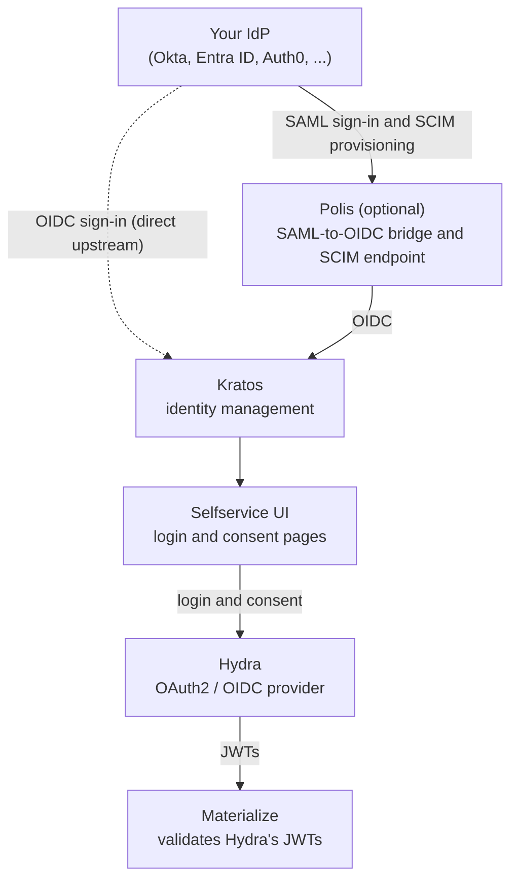

# Advanced SSO (OIDC, SAML and SCIM)

Configure OIDC, SAML, SCIM, and role mapping for Self-Managed Materialize with the advanced SSO stack.

> **Public Preview:** This feature is in public preview.

Self-Managed Materialize supports OIDC sign-in directly, as described in
[Simple SSO (OIDC)](/self-managed-deployments/sso/oidc/). For **SAML**, **SCIM
provisioning**, or **federation through an IdP-agnostic proxy**, Materialize
provides an additional Terraform-managed stack that sits in front of
Materialize and acts as the OIDC issuer.

This section walks through deploying that stack, configuring it against your
identity provider, and operating it day to day.

## How it works

### Architecture



When a user opens the Materialize Console, the console redirects to Hydra,
which hands the login to the selfservice UI. The user signs in through your
IdP, either over SAML through Polis or directly over OIDC. Kratos records the
identity, and Hydra issues the tokens the console uses. Materialize validates
each token against Hydra's signing keys and maps the `email` claim to a SQL
role, creating the role on first sign-in.

### Powered by Ory

The stack is built from [Ory](https://www.ory.sh/docs/) components:

| Component | Role |
|---|---|
| **Polis** | Optional. Acts as the SAML service provider for your IdP, translates SAML to OIDC for Kratos, and serves the SCIM endpoint for IdP-driven user provisioning. |
| **Kratos** | Stores identities, runs the login flow, and federates upstream OIDC providers. |
| **Selfservice UI** | Renders the login and consent pages, and mediates between the browser and Kratos and Hydra. |
| **Hydra** | The OAuth2 and OIDC authorization server that Materialize trusts. Issues the JWTs. |
| **Materialize** | The protected application. Trusts Hydra's JWTs and creates SQL roles from the `email` claim on first sign-in. |

Each component is deployed and managed by the Terraform modules in
[`materialize-terraform-self-managed`](https://github.com/MaterializeInc/materialize-terraform-self-managed).
The composite `ory-stack` module wires them together and handles the
integration with your Materialize instance (OAuth2 client registration,
network policies, console TLS).

### What gets deployed

When you apply one of the enterprise examples, Terraform stands up:

- A Kubernetes cluster (AKS / GKE / EKS) sized for both Materialize and Ory
- A Materialize PostgreSQL instance (Cloud SQL / Flexible Server / RDS)
- A separate PostgreSQL instance (or set of databases on a shared instance,
  depending on cloud) for Kratos, Hydra, and Polis
- Object storage for Materialize's persistence backend
- The Materialize operator and a Materialize instance CR
- Kratos, Hydra, and the selfservice UI in the `ory` namespace
- Optional: Polis in the same namespace, with its own TLS termination
  proxy
- cert-manager, with either a self-signed or BYO ClusterIssuer for the
  browser-facing TLS certificates
- Optional: Prometheus and Grafana for observability

If Materialize is already running, you can add only the SSO components. See
[Add to an existing installation](/self-managed-deployments/sso/advanced/existing-installation/).

## What to expect

### Roles involved

Standing up this stack is usually a multi-party effort, though on a smaller
team one person often wears several of these hats.

| Role | Owns | Pages |
|---|---|---|
| Materialize / infra admin | Gathers the prerequisites, then runs the Terraform: sets tfvars (including `enable_polis`, the browser-facing FQDNs, and `saml_providers`), places `idp-metadata.xml` next to the tfvars, and applies. The module wires OIDC into Materialize. | [Prerequisites](/self-managed-deployments/sso/advanced/prerequisites/), the install pages, and [Configure identity providers](/self-managed-deployments/sso/advanced/identity-providers/) |
| IdP / Okta admin | Creates the SAML app (and the optional SCIM app): sets the ACS URL to `https://<your-polis-hostname>/api/oauth/saml` and the audience to `https://saml.boxyhq.com`, exports the IdP metadata XML, assigns users and groups, and hands the metadata (plus the SCIM token) back to the infra admin. | [Configure identity providers](/self-managed-deployments/sso/advanced/identity-providers/) |
| DNS owner | Creates the A / CNAME records pointing at the LoadBalancer IPs after the first apply, so cert-manager can issue the browser-facing TLS certificates. | The install pages and [Prerequisites](/self-managed-deployments/sso/advanced/prerequisites/) |

### Steps involved

End to end, the handoffs run in this order:

1. The Materialize admin gathers the [prerequisites](/self-managed-deployments/sso/advanced/prerequisites/), including a license key that includes the advanced SSO entitlement.
2. The IdP admin creates the SAML application and exports its metadata XML.
3. The Materialize admin applies Terraform with Polis enabled and `idp-metadata.xml` in place.
4. The DNS owner creates the DNS records, and cert-manager issues the TLS certificates.
5. The Materialize admin registers the Polis SAML connection, adds the `saml_providers` block, and re-applies.
6. Optionally, the IdP admin enables SCIM provisioning.
7. Verify sign-in from the Materialize Console.

## Next steps

Work through these pages in order:

1. **[Prerequisites](/self-managed-deployments/sso/advanced/prerequisites/)**: license key, DNS, cert-manager, and Polis requirements
2. **Install**: either [add the stack to an existing installation](/self-managed-deployments/sso/advanced/existing-installation/), or deploy a new one on [Azure](/self-managed-deployments/sso/advanced/install-on-azure/), [GCP](/self-managed-deployments/sso/advanced/install-on-gcp/), or [AWS](/self-managed-deployments/sso/advanced/install-on-aws/)
3. **[Configure identity providers](/self-managed-deployments/sso/advanced/identity-providers/)**: direct OIDC, SAML via Polis, and SCIM provisioning
4. **[Enable role mapping](/self-managed-deployments/sso/advanced/role-mapping/)**: grant Materialize roles from IdP groups
5. **[Operations](/self-managed-deployments/sso/advanced/operations/)**: day-2 tasks such as rotating credentials, adding OAuth2 clients, and managing identities
6. **[Troubleshooting](/self-managed-deployments/sso/advanced/troubleshooting/)**: common errors and fixes

---

## Add to an existing installation

If Materialize is already running, you can add the advanced SSO stack
without redeploying it. This guide assumes you manage Materialize with the
[Materialize Terraform modules](https://github.com/MaterializeInc/materialize-terraform-self-managed),
including the `materialize-instance` module.

Materialize is switched over in a separate apply at the end, so you can check
the stack before any user signs in through it:

1. Create the Ory databases.
2. Add the `ory-stack` module and check that it's healthy. Materialize keeps
   using its current authentication.
3. Point Materialize at Hydra.

## Before you begin

Complete the [prerequisites](/self-managed-deployments/sso/advanced/prerequisites/).

## Step 1: Create the Ory databases

Kratos and Hydra each need their own PostgreSQL database, and Polis needs one
too if you plan to enable SAML. They can share a PostgreSQL server, either your
existing one or a dedicated instance, as long as the Kubernetes cluster can
reach it. The enterprise examples use a managed instance (Cloud SQL, Azure
Database for PostgreSQL flexible server, or RDS) in the same network as the
cluster.

1. Create a user and the databases. Each component runs its own schema
   migrations on startup, so the user must own its databases:

   ```sql
   CREATE USER oryadmin WITH PASSWORD '<password>';
   CREATE DATABASE kratos OWNER oryadmin;
   CREATE DATABASE hydra OWNER oryadmin;
   -- Only if you plan to enable SAML:
   CREATE DATABASE polis OWNER oryadmin;
   ```

1. Build a connection string for each database. URL-encode the password, for
   example with Terraform's `urlencode()`:

   ```hcl
   locals {
     ory_kratos_dsn = "postgres://oryadmin:${urlencode(var.ory_db_password)}@<host>:5432/kratos?sslmode=require"
     ory_hydra_dsn  = "postgres://oryadmin:${urlencode(var.ory_db_password)}@<host>:5432/hydra?sslmode=require"
     # uselibpqcompat=true keeps sslmode=require at libpq semantics (encrypt,
     # don't verify), which Polis's driver needs against managed servers.
     ory_polis_dsn  = "postgres://oryadmin:${urlencode(var.ory_db_password)}@<host>:5432/polis?sslmode=require&uselibpqcompat=true"
   }
   ```

## Step 2: Add the Ory stack

1. Add the `ory-stack` module next to your existing modules, substituting
   your own hostnames and `ClusterIssuer`:

   ```hcl
   module "ory" {
     source = "github.com/MaterializeInc/materialize-terraform-self-managed//kubernetes/modules/ory-stack?ref=<RELEASE_TAG>"

     namespace = "ory"

     hydra_fqdn  = "hydra.example.com"
     kratos_fqdn = "kratos.example.com"
     ui_fqdn     = "auth.example.com"

     kratos_dsn = local.ory_kratos_dsn
     hydra_dsn  = local.ory_hydra_dsn

     # Use the ory_oel_image_tag default from the enterprise example at the same release.
     oel_image_tag   = "<ORY_IMAGE_TAG>"
     license_key_jwt = var.license_key

     cert_issuer_ref = {
       name = "letsencrypt-prod"
       kind = "ClusterIssuer"
     }
     # true for an in-cluster self-signed issuer, false for a public ACME issuer
     cert_issuer_signs_cluster_local = false

     # Registers the Materialize Console as an OAuth2 client in Hydra.
     materialize_namespace    = "materialize-environment"
     materialize_console_fqdn = "console.example.com"
   }

   output "ory_lb_addresses" {
     value = module.ory.lb_addresses
   }
   ```

   The load balancer settings differ by cloud. Copy `lb_annotations`, and on
   AWS `lb_load_balancer_class` and `lb_external_traffic_policy`, from the
   `module "ory"` block in the enterprise example for your cloud
   ([AWS](https://github.com/MaterializeInc/materialize-terraform-self-managed/tree/main/aws/examples/enterprise),
   [Azure](https://github.com/MaterializeInc/materialize-terraform-self-managed/tree/main/azure/examples/enterprise),
   [GCP](https://github.com/MaterializeInc/materialize-terraform-self-managed/tree/main/gcp/examples/enterprise)).
   To enable SAML, also set `enable_polis`, `polis_fqdn`, and `polis_dsn = local.ory_polis_dsn`;
   see [Configure identity providers](/self-managed-deployments/sso/advanced/identity-providers/).

1. Apply:

   ```bash
   terraform init -upgrade
   terraform apply
   ```

1. Create DNS records pointing the Hydra, Kratos, and selfservice UI
   hostnames at the addresses in `terraform output ory_lb_addresses`: an A
   record for an IP (Azure, GCP) or a CNAME for a hostname (AWS).

1. Check that Hydra serves its discovery document, with an `issuer` that
   matches `hydra_fqdn`:

   ```bash
   curl -fsSL https://hydra.example.com/.well-known/openid-configuration | jq .issuer
   ```

## Step 3: Point Materialize at Hydra

1. In your existing `materialize-instance` module, switch authentication to
   OIDC and set the OIDC parameters from the `ory-stack` outputs:

   ```hcl
   module "materialize_instance" {
     # ... your existing settings ...

     authenticator_kind = "Oidc"
     # Password for the mz_system admin user, kept as a fallback under OIDC.
     external_login_password_mz_system = var.external_login_password_mz_system

     # With network policies enabled, lets Materialize reach Hydra for its signing keys.
     ory_namespace = "ory"

     system_parameters = {
       oidc_issuer                  = module.ory.hydra_external_url
       oidc_audience                = jsonencode([module.ory.oauth2_client_id])
       oidc_authentication_claim    = "email"
       console_oidc_client_id       = module.ory.oauth2_client_id
       console_oidc_scopes          = "openid email"
       # Optional: grant roles from IdP groups (see Enable role mapping).
       oidc_group_role_sync_enabled = "true"
     }

     # Set a new UUID so environmentd restarts with the new parameters.
     force_rollout = "<NEW_UUID>"
   }
   ```

   Users keep their existing SQL roles as long as the `email` claim matches
   the role names. If your users currently sign in with passwords, see
   [Migrate to SSO](/security/self-managed/sso-migration/).

1. Apply:

   ```bash
   terraform apply
   ```

## Step 4: Verify sign-in

Smoke-test each browser-facing endpoint. These commands assume a publicly trusted issuer (`cert_issuer_ref` set). With the default self-signed issuer, fetch its CA first and pass `--cacert ca.crt` to each `curl`:

```bash
kubectl -n cert-manager get secret <name_prefix>-root-ca -o jsonpath='{.data.ca\.crt}' | base64 -d > ca.crt
```

```bash
# Hydra OIDC discovery (issuer should match ory_hydra_fqdn)
curl -fsSL https://hydra.example.com/.well-known/openid-configuration | jq .issuer

# Kratos health
curl -fsSL https://kratos.example.com/health/ready

# Selfservice UI health
curl -fsSL https://auth.example.com/health/alive

# Polis health (only when enable_polis = true)
curl -fsSL https://polis.example.com/api/health

# Materialize console (expect HTTP 200)
curl -fsSL -o /dev/null -w "%{http_code}\n" https://console.example.com
```

Then sign in end to end, which is what proves SSO works:

1. Open `https://console.example.com`. You are redirected to the selfservice UI at `auth.example.com`, with one button per `upstream_identity_providers` entry and per `saml_providers` entry. Each button's text comes from that entry's `label`; see [Configure identity providers](/self-managed-deployments/sso/advanced/identity-providers/).
2. Sign in through one of them. You should land back in the Console as that user.
3. Run `SELECT current_user;`. It should return the user's email.

## Next steps

- [Configure identity providers](/self-managed-deployments/sso/advanced/identity-providers/)
- [Enable role mapping](/self-managed-deployments/sso/advanced/role-mapping/)

---

## Configure identity providers

Once the Ory stack is deployed, you connect it to your identity
provider. There are three paths, depending on what your IdP supports
and what you need.

| Path | Use when |
|---|---|
| [Direct OIDC](#direct-oidc) | Your IdP speaks OIDC and you only need authentication |
| [SAML via Polis](#saml-via-polis) | Your IdP only speaks SAML, or you want a single proxy in front of multiple IdPs |
| [SCIM via Polis](#scim-via-polis) | You want users provisioned and deactivated automatically from your IdP |

The SAML and SCIM paths require `enable_polis = true` in your tfvars.
SCIM is layered on top of SAML; you need the SAML connection registered
in Polis first.

## Direct OIDC

The simplest path. Kratos federates upstream OIDC providers directly,
no Polis required. Use this when your IdP supports OIDC and you don't
need SCIM provisioning.

### Step 1. Create an OIDC application in your IdP

Create a new application with these settings:

- **Sign-in redirect URI**: `https://<your-kratos-hostname>/self-service/methods/oidc/callback/<id>`
  where `<id>` matches the entry you'll add to tfvars (e.g. `okta`,
  `entra`, `google`).
- **Grant types**: Authorization Code

You don't set scopes on the application. Kratos requests them at sign-in
from the entry's `scope` list in tfvars, which defaults to `openid`,
`email`, `profile`.

For Okta specifically: Applications → Create App Integration → OIDC →
Web Application → set the redirect URI as above, and assign the users or
groups who should sign in.

Copy the **Client ID** and **Client Secret** from the app's **General**
tab. The issuer URL is not shown on the app. For Okta, use one of:

- `https://<your-okta-domain>`, Okta's built-in org authorization
  server. Available on every Okta org. To find your Okta domain, click
  your username in the upper-right corner of the Admin Console.
- `https://<your-okta-domain>/oauth2/default`, or another custom
  authorization server. Requires Okta's API Access Management. The
  **Issuer URI** is listed under **Security** → **API** →
  **Authorization Servers**. A custom authorization server has its own
  access policy, separate from the app's sign-on policy: on its
  **Access Policies** tab, make sure a policy is assigned to your app
  and has a rule that allows the Authorization Code grant.

Either works here, because Materialize trusts the tokens Hydra issues,
not Okta's.

To map Okta groups to Materialize roles, Okta also needs to send a `groups`
claim. See [Enable role mapping](/self-managed-deployments/sso/advanced/role-mapping/#before-you-begin).

### Step 2. Add the provider to tfvars

Add an entry to `upstream_identity_providers` in your `terraform.tfvars`:

```hcl
upstream_identity_providers = [
  {
    id            = "okta"
    provider      = "generic"
    client_id     = "<from Okta>"
    client_secret = "<from Okta>"
    issuer_url    = "https://your-org.okta.com" # or .../oauth2/default, see Step 1
    scope         = ["openid", "email", "profile"]
    label         = "Sign in with Okta"
  },
]
```

Run `terraform apply`. Kratos will reload its config and pick up the new
provider. The label text becomes the button on the login screen.

### Step 3. Test the login

Open the Materialize Console in an incognito window:
`https://<your-console-hostname>`. You should see the Kratos login
screen with a "Sign in with Okta" button. Click it; you'll bounce
through your IdP and land in the Materialize Console signed in.

## SAML via Polis

Use this when your IdP only supports SAML (Entra SAML, ADFS, Okta SAML,
Auth0 SAML), or when you want a single SSO proxy in front of multiple
IdPs.

The flow at runtime: console → Hydra → Kratos UI → "Sign in via SAML"
button → Polis → your IdP SAML → back through Polis → Kratos issues a
federated identity → Hydra issues an OAuth2 token → console.

### Step 1. Create a SAML application in your IdP

In your IdP, create a SAML 2.0 application with:

- **ACS URL / Assertion consumer URL**:
  `https://<your-polis-hostname>/api/oauth/saml`
- **Audience URI / Entity ID**: `https://saml.boxyhq.com`
- **NameID format**: EmailAddress
- **Attribute statements**: at minimum, `email`, `firstName` and `lastName`,
  mapped from the IdP user profile. In Okta:

  | Name | Value |
  |------|-------|
  | `email` | `user.profile.email` |
  | `firstName` | `user.profile.firstName` |
  | `lastName` | `user.profile.lastName` |
- **Group attribute statement** (optional but required for `groups` in
  the JWT): name `groups`, filter `Matches regex .*` (or a narrower
  filter to scope which groups flow through).

Save and grab the SAML metadata URL (or download the metadata XML).
Assign users (or groups) to the app so they can authenticate through it.

> **Note:** **Okta:** set the `groups` claim in the **Group Attribute Statements**
> table, not the **Add expression** dialog at the top of the Attribute
> Statements section. The Group Attribute Statements table lives under the
> SAML app's **Sign On** tab, inside the collapsed **Show legacy
> configuration** panel. Set Name `groups`, Name format `Unspecified`, and a
> Filter such as `Starts with` and your role-name prefix. The newer
> expression UI does not expose group functions like `Groups.startsWith` or
> `Arrays.flatten` on trial / integrator tenants, which is why the legacy
> table is the reliable path. See Okta's [attribute statements](https://help.okta.com/oie/en-us/content/topics/apps/define-attribute-statements.htm),
> the legacy config, versus their newer [federated claims](https://help.okta.com/oie/en-us/content/topics/apps/federated-claims-overview.htm)
> model.

### Step 2. Get the Polis admin API key

```bash
POLIS_API_KEY=$(kubectl get secret -n ory polis-config \
  -o jsonpath='{.data.API_KEYS}' | base64 -d)
```

### Step 3. Register the SAML connection in Polis

You can register through the Polis admin API (below) or through the Polis
admin UI, which is easier for ongoing management but requires bootstrapping
first, see
[Unlock the Polis admin UI without SMTP](/self-managed-deployments/sso/advanced/operations/#unlock-the-polis-admin-ui-without-smtp).

If the IdP exposes a publicly-fetchable metadata URL:

```bash
curl -X POST https://<your-polis-hostname>/api/v1/sso \
  -H "Authorization: Api-Key $POLIS_API_KEY" \
  -H "Content-Type: application/x-www-form-urlencoded" \
  --data-urlencode "tenant=<customer-name>" \
  --data-urlencode "product=materialize" \
  --data-urlencode "name=<idp-name>-saml" \
  --data-urlencode "redirectUrl=https://<your-kratos-hostname>/self-service/methods/saml/callback/polis" \
  --data-urlencode "defaultRedirectUrl=https://<your-console-hostname>" \
  --data-urlencode "metadataUrl=https://<idp-metadata-url>"
```

If the metadata URL is gated by API auth (Okta integrator orgs, for
example), POST the raw XML instead:

```bash
curl -X POST https://<your-polis-hostname>/api/v1/sso \
  -H "Authorization: Api-Key $POLIS_API_KEY" \
  -H "Content-Type: application/x-www-form-urlencoded" \
  --data-urlencode "tenant=<customer-name>" \
  --data-urlencode "product=materialize" \
  --data-urlencode "name=<idp-name>-saml" \
  --data-urlencode "redirectUrl=https://<your-kratos-hostname>/self-service/methods/saml/callback/polis" \
  --data-urlencode "defaultRedirectUrl=https://<your-console-hostname>" \
  --data-urlencode "rawMetadata=$(cat idp-metadata.xml)"
```

If `rawMetadata` fails with "Couldn't fetch XML data" (some shells strip
newlines), base64-encode the file first and use `encodedRawMetadata` instead:

```bash
--data-urlencode "encodedRawMetadata=$(base64 < idp-metadata.xml | tr -d '\n')"
```

The response contains a `clientID` and `clientSecret`. Save them for the
next step.

Verify the connection landed:

```bash
curl -s -H "Authorization: Api-Key $POLIS_API_KEY" \
  "https://<your-polis-hostname>/api/v1/sso?tenant=<customer-name>&product=materialize" | jq .
```

### Step 4. Wire Polis into Kratos as a SAML sign-in provider

Polis is a SAML method in Kratos, not an OIDC provider, so it goes in
`saml_providers` rather than `upstream_identity_providers`. Add an entry:

```hcl
saml_providers = [
  {
    id            = "polis"
    label         = "Sign in via SAML"
    client_id     = "<clientID from Step 3>"
    client_secret = "<clientSecret from Step 3>"
    issuer_url    = "https://<your-polis-hostname>"
    auth_url      = "https://<your-polis-hostname>/api/oauth/authorize"
    token_url     = "https://<your-polis-hostname>/api/oauth/token"
  },
]
```

The `issuer_url` is the base Polis URL, with no `/saml` suffix. Save the
SAML metadata from Step 1 as `idp-metadata.xml` next to your
`terraform.tfvars`: the example's `main.tf` reads it with `file()` and
injects it as `raw_idp_metadata_xml`, so you never paste XML into tfvars.

Run `terraform apply`. The "Sign in via SAML" button will appear on the
Kratos login screen.

### Step 5. Test the SAML login

Open the Materialize Console in an incognito window. Click **Sign in via
SAML**. You'll bounce through Polis to your IdP, authenticate, and land
in the Materialize Console. The federated identity is created in Kratos
on first login, and Materialize JIT-creates the SQL role from your email
claim.

## SCIM via Polis

Adds automatic user and group provisioning and deactivation from your IdP to
Materialize. Builds on the SAML setup above.

### Step 1. Create a SCIM directory in Polis

Same choice as with SAML: register through the API (below) or through the
Polis admin UI ([bootstrapped separately](/self-managed-deployments/sso/advanced/operations/#unlock-the-polis-admin-ui-without-smtp)).

```bash
curl -X POST https://<your-polis-hostname>/api/v1/dsync \
  -H "Authorization: Api-Key $POLIS_API_KEY" \
  -H "Content-Type: application/x-www-form-urlencoded" \
  --data-urlencode "tenant=<customer-name>" \
  --data-urlencode "product=materialize" \
  --data-urlencode "name=<idp-name>-scim" \
  --data-urlencode "type=okta-scim-v2"
```

For other IdPs, change `type` to `azure-scim-v2`, `onelogin-scim-v2`,
or `generic-scim-v2`.

Save the `scim.endpoint` URL and `scim.secret` bearer token from the
response. Both go into your IdP's SCIM configuration.

### Step 2. Enable SCIM provisioning in your IdP

Steps for Okta (other IdPs vary in wording but follow the same shape):

1. Open the SAML application you created above.
2. **General** tab → Provisioning → switch to "SCIM" → Save.
3. A **Provisioning** tab appears. Click into it → **Integration**:
   - SCIM connector base URL: paste `scim.endpoint` **with a trailing
     slash**. Okta rejects the URL without one ("Invalid Base URL for
     the SCIM Connector").
   - Unique identifier for users: `email`
   - Supported provisioning actions: Import New Users and Profile
     Updates, Push New Users, Push Profile Updates, Push Groups
   - Authentication Mode: **HTTP Header** (not Basic Auth)
   - Authorization / Token: paste `scim.secret`
   - Click **Test Connector Configuration**; it should report the
     connector as configured. The base URL's host must be reachable
     from your IdP's cloud (see [Troubleshooting](/self-managed-deployments/sso/advanced/troubleshooting/)).
4. **Provisioning** → **To App** → Edit → enable Create Users, Update
   User Attributes, Deactivate Users. Save.
5. **Push Groups** tab (appears once SCIM is enabled) → **Push Groups
   → By name** → pick each group you want in Polis's directory → tick
   "Push group memberships immediately" → Save. This creates the group
   entity in Polis; individual users are still pushed via the
   Assignments step below.
6. **Assignments** tab → **Assign → Assign to People** (or **Assign to
   Groups**) → assign the users / groups that should be provisioned.
   Okta pushes a SCIM POST per user within seconds.

### Step 3. Verify the push

Currently-assigned users push immediately. New users push on assignment.

```bash
DIRECTORY_ID=<id from the Step 1 response>
curl -s -H "Authorization: Api-Key $POLIS_API_KEY" \
  "https://<your-polis-hostname>/api/v1/dsync/users?tenant=<customer-name>&product=materialize&directoryId=$DIRECTORY_ID" | jq .
```

You should see the assigned users with their email, name, and external
ID populated.

> **Note:** **Existing assignments don't backfill on enable.** If a user was
> assigned to the SAML app before SCIM was turned on, Okta doesn't
> re-push them. Either unassign and reassign the user (the cleanest
> trigger), or push manually via Okta admin → Directory → People → the
> user → Applications → "..." → Push profile updates.

### Step 4. (Optional) Sync groups

Group memberships flow through the stack in two independent ways:

1. **SAML attribute statement**: on each login, the IdP attaches the
   user's group memberships to the SAML assertion. Polis passes them
   through as an OIDC claim, Kratos writes them onto the identity
   trait, and the Ory stack embeds them in the JWT as a `groups` claim
   that Materialize can read. **Refreshed on every login.**
2. **SCIM directory push**: the IdP synchronizes group entities and
   memberships into Polis's directory. **Refreshed continuously**, but
   doesn't itself change the contents of a JWT already in flight; the
   user has to log in again to see updates.

For the SAML attribute path (recommended):

1. In your SAML app configuration, add a `groups` attribute statement
   (Okta: Sign On tab → Attribute Statements → legacy Group Attribute
   Statements → Name: `groups`, Filter: `Matches regex .*`).
2. Log in via the console. The `groups` JWT claim will contain the
   user's group names.

For the SCIM directory push (audit + future integration):

1. Create a group in your IdP and add users to it.
2. Open the SAML app → **Push Groups** tab → "Push Groups" → "by name"
   → search and add the group → save.

Confirm the push landed in Polis:

```bash
curl -s -H "Authorization: Api-Key $POLIS_API_KEY" \
  "https://<your-polis-hostname>/api/v1/dsync/groups?tenant=<customer-name>&product=materialize&directoryId=$DIRECTORY_ID" | jq .
```

Group memberships flow all the way to the JWT (via the `groups` claim) and
Materialize can automatically translate them into SQL role memberships on
each login. Enable it via the `oidc_group_role_sync_enabled` system
parameter; see [Enable role mapping](/self-managed-deployments/sso/advanced/role-mapping/)
for details and the naming convention.

## What happens when users sign in

The Ory stack issues OIDC tokens with the user's email as the `email`
claim. Materialize is configured with `oidc_authentication_claim =
"email"`, so:

- **First login**: Materialize creates a SQL role named after the user's
  email (JIT role creation). The role has no privileges by default.
- **Subsequent logins**: Same role is reused.
- **Deprovisioned in IdP**: SCIM deactivates the user in Polis, but the
  Materialize SQL role isn't dropped automatically. You'll need to
  `DROP ROLE "user@email"` separately or let it become a stale (but
  inactive) record.

To grant privileges, see the role / permission management docs at
[RBAC](/security/self-managed/access-control/).

## See also

- [SSO (direct OIDC)](/self-managed-deployments/sso/oidc/) -- the simpler path
  for OIDC-only deployments
- [Operations](/self-managed-deployments/sso/advanced/operations/) -- day-2: rotating credentials, adding
  OAuth2 clients
- [Troubleshooting](/self-managed-deployments/sso/advanced/troubleshooting/) -- common errors during the
  IdP-side setup

---

## Enable role mapping

Materialize can automatically grant and revoke SQL role memberships based
on the `groups` claim in the JWT Hydra issues, so you manage a user's
Materialize privileges by adjusting their IdP group memberships instead of
running manual `GRANT` statements.

## Before you begin

Your IdP must send group memberships in the `groups` claim:

- **SAML through Polis:** add a `groups` attribute statement to the SAML app,
  as described in
  [Sync groups](/self-managed-deployments/sso/advanced/identity-providers/#step-4-optional-sync-groups).
- **Okta over OIDC:** with Okta's org authorization server, open the app's
  **Sign On** tab and set a **Groups claim filter** in the OpenID Connect ID
  Token section (name `groups`, for example **Matches regex** `.*`). With a
  custom authorization server, add a claim named `groups` on its **Claims**
  tab instead (value type **Groups**, included in the ID token).

Without the claim, users can still sign in, but no roles are synced.

## Enable the sync

The feature is off by default. To enable it, set the following system
parameter on the `materialize-instance` module:

```hcl
system_parameters = {
  # ... existing OIDC params ...
  oidc_group_role_sync_enabled = "true"
}
```

Bump `force_rollout` to a new UUID and re-apply so environmentd picks up the
change.

## How it works

On each OIDC login, environmentd reads the `groups` claim from the JWT
(default claim name `groups`, configurable via `oidc_group_claim`; supports
dot-separated paths like `customClaims.groups`). For each group name it
looks up a Materialize role with the exact same name (case-sensitive):

- Roles found are granted to the user.
- Roles previously granted by the sync that are no longer in the claim are
  revoked.
- Manual `GRANT`s are never touched; the sync only manages memberships it
  granted itself, marked by an internal sentinel grantor (`mz_jwt_sync`).
- Groups matching reserved role names (`mz_`, `pg_`, `PUBLIC`) or with no
  matching Materialize role are silently skipped with a client notice.

## Set up roles

Name IdP groups to match SQL role names one-to-one. Create the Materialize
roles once as `mz_system`, along with whatever privileges the group should
carry:

```mzsql
CREATE ROLE "mz-admins";
GRANT USAGE ON CLUSTER quickstart TO "mz-admins";
GRANT USAGE ON SCHEMA materialize.public TO "mz-admins";
GRANT SELECT ON ALL TABLES IN SCHEMA materialize.public TO "mz-admins";
```

Any user whose JWT `groups` claim contains `mz-admins` is now automatically
granted the role on their next login.

## Make a user a superuser

Superuser is an attribute on a user's own role, not a role they can be granted,
so it can't come from group sync. Set it with SQL as `mz_system` (or another
superuser):

```mzsql
ALTER ROLE "alex@example.com" SUPERUSER;
```

The role must exist first: have the user sign in once, or create it with
`CREATE ROLE "alex@example.com"`. The change applies from the user's next
session. To remove it, run `ALTER ROLE "alex@example.com" NOSUPERUSER`.

## Verify the sync

To see sync-managed memberships:

```mzsql
SELECT r.name AS role, m.name AS member, g.name AS grantor
FROM mz_role_members rm
JOIN mz_roles r ON r.id = rm.role_id
JOIN mz_roles m ON m.id = rm.member
JOIN mz_roles g ON g.id = rm.grantor
WHERE g.name = 'mz_jwt_sync';
```

## Strict vs. fail-open

By default (`oidc_group_role_sync_strict = false`), a sync failure during
login is logged and delivered to the client as a notice, but the login
still proceeds with existing memberships. Set the parameter to `"true"` to
reject logins on sync failure (fail-closed) if you need stricter guarantees.

## Deprovisioning caveat

Sync is a login-time snapshot. A currently-active session keeps its role
memberships until the user re-logs in and Materialize re-evaluates the
claim. For instant revocation, terminate the user's session at the IdP and
let their next login pick up the new state.

---

## Install on AWS

This guide walks through the
[`aws/examples/enterprise`](https://github.com/MaterializeInc/materialize-terraform-self-managed/tree/main/aws/examples/enterprise)
example in the [Materialize Terraform
repository](https://github.com/MaterializeInc/materialize-terraform-self-managed),
which extends the base [Install on
AWS](/self-managed-deployments/installation/install-on-aws/) walkthrough with
the advanced SSO stack on EKS.

If Materialize is already running, see [Add to an existing
installation](/self-managed-deployments/sso/advanced/existing-installation/)
instead.

Self-managed Materialize requires: a Kubernetes (v1.31+) cluster; PostgreSQL as
a metadata database; blob storage; and a license key.
 This example layers the
Ory stack (Kratos, Hydra, the selfservice UI, and optional Polis) on top so
that the Materialize Console authenticates users through OIDC, with SAML and
SCIM available when Polis is enabled. The example wires these modules
together as a reference; the individual modules are designed to be composed
into your own Terraform rather than used only through the example.

> **Note:** We recommend pinning your module sources to specific tags to avoid unexpected breaking
> changes in future versions.
> We recommend updating your module source tags when updating Materialize versions,
> taking care to follow any instructions in the release notes.

## What Gets Created

This example provisions everything from the base [Install on
AWS](/self-managed-deployments/installation/install-on-aws/) guide, plus the
additions below.

### Networking

| Resource | Description |
|----------|-------------|
| Public Hostnames | Six browser-facing hostnames (Hydra, Kratos, the selfservice UI, optional Polis, the Materialize Console, balancerd). DNS records are created by you after `terraform apply`. |
| LoadBalancer Services | One per browser-facing service in the `ory` and `materialize-environment` namespaces. Backed by AWS Network Load Balancers via the AWS Load Balancer Controller, target type `ip`. |

### Database

| Resource | Description |
|----------|-------------|
| Ory Kratos RDS | Dedicated RDS instance for the `kratos` database. PostgreSQL 18, `db.t3.small`. |
| Ory Hydra RDS | Dedicated RDS instance for the `hydra` database. PostgreSQL 18, `db.t3.small`. |
| Ory Polis RDS (optional) | Dedicated RDS instance for the `polis` database when `enable_polis = true`. PostgreSQL 18, `db.t3.small`. |
| User | `oryadmin` shared across instances, with auto-generated password. |

AWS RDS is one-database-per-instance, so each Ory component gets its own RDS
instance. (GCP Cloud SQL, in contrast, hosts them as separate databases on a
single shared instance.)

### Kubernetes Add-ons

| Resource | Description |
|----------|-------------|
| Ory Kratos | Helm release in the `ory` namespace. Identity management: login, registration, recovery, account flows. |
| Ory Hydra | Helm release in the `ory` namespace. OAuth2 / OIDC provider that the Materialize Console trusts. Hydra Maester is enabled. |
| Ory Selfservice UI | Helm release in the `ory` namespace. Renders the Kratos login, consent, and recovery pages. |
| Ory Polis (optional) | Helm release in the `ory` namespace when `enable_polis = true`. SAML-to-OIDC bridge plus SCIM endpoint. |
| Polis TLS termination (optional) | Polis serves plain HTTP internally. The Polis chart runs a TLS-terminating sidecar that presents HTTPS on the public port, using the cert-manager certificate mounted into it. |
| cert-manager `ClusterIssuer` | Defaults to the in-cluster self-signed issuer. Override via `cert_issuer_ref` to plug in a real one (corporate CA, Let's Encrypt, etc.). |

### Materialize

| Resource | Description |
|----------|-------------|
| Materialize Instance | Configured for OIDC sign-in against the Hydra issuer URL. The browser-facing console hostname is registered as the OAuth2 redirect URI. |

## AWS-Specific Requirements

Cross-cutting requirements (license key with the `ory` entitlement, DNS
hostnames, cert-manager strategy, required tools) are covered on the shared
[Prerequisites](/self-managed-deployments/sso/advanced/prerequisites/)
page. This section only lists the AWS-specific bits.

An active AWS account with permission to create:

- EKS clusters and Karpenter nodepools
- RDS instances
- S3 buckets
- VPCs and networking resources
- IAM roles and policies

## Getting Started: Advanced SSO Example

> **Note:** We recommend pinning your module sources to specific tags to avoid unexpected breaking
> changes in future versions.
> We recommend updating your module source tags when updating Materialize versions,
> taking care to follow any instructions in the release notes.

> **Tip:** * The `examples/enterprise` example, used in this tutorial, is provided for illustration and to help you get started. In practice, we recommend instantiating these modules within your own Terraform code rather than relying on the example configuration directly.

### Step 1: Set Up the Environment

1. Open a terminal window.

1. Clone the Materialize Terraform repository and go to the
   `aws/examples/enterprise` directory:

   ```bash
   git clone https://github.com/MaterializeInc/materialize-terraform-self-managed.git
   cd materialize-terraform-self-managed/aws/examples/enterprise
   ```

1. Ensure your AWS CLI is configured with the appropriate profile, substituting
   `<your-aws-profile>` with the profile to use:

   ```bash
   export AWS_PROFILE=<your-aws-profile>
   ```

### Step 2: Configure Terraform Variables

1. Create a `terraform.tfvars` file with the required variables:

   - `aws_region`: AWS region (defaults to `us-east-1`)
   - `aws_profile`: AWS CLI profile to use
   - `name_prefix`: Prefix for all resource names
   - `license_key`: Materialize license key JWT with the `ory` entitlement
   - `k8s_apiserver_authorized_networks`: CIDRs allowed to reach the EKS API server (required, no default)
   - `ory_hydra_fqdn`, `ory_ui_fqdn`, `ory_kratos_fqdn`, `materialize_console_fqdn`, `materialize_balancerd_fqdn`: Hostnames for the browser-facing services
   - `internal_load_balancer`: Defaults to `true`, which gives every load balancer a private address. Set it to `false` to reach the endpoints from outside the VPC. SCIM from a cloud IdP such as Okta requires this, because the IdP must reach Polis
   - `ingress_cidr_blocks`: CIDRs allowed to reach the load balancers when `internal_load_balancer = false` (defaults to `0.0.0.0/0`, tighten for production)
   - `tags`: Map of tags to apply to resources

   ```hcl
   aws_region  = "us-east-1"
   aws_profile = "default"
   name_prefix = "mz-enterprise"
   license_key = "your-materialize-license-key"

   k8s_apiserver_authorized_networks = ["0.0.0.0/0"]   # tighten for production

   ory_hydra_fqdn             = "hydra.example.com"
   ory_ui_fqdn                = "auth.example.com"
   ory_kratos_fqdn            = "kratos.example.com"
   materialize_console_fqdn   = "console.example.com"
   materialize_balancerd_fqdn = "balancerd.example.com"

   tags = {
     environment = "demo"
   }
   ```

1. To enable Polis (SAML and SCIM):

```hcl
enable_polis   = true
ory_polis_fqdn = "polis.example.com"
```

1. To bring your own cert-manager `ClusterIssuer` for the browser-facing TLS certs (Hydra, Kratos, the selfservice UI, Polis, the Materialize console, and balancerd):

```hcl
cert_issuer_ref = {
  name = "letsencrypt-prod"
  kind = "ClusterIssuer"
}
```

If you want a Let's Encrypt issuer signed via DNS-01, the example's README ships a starter `letsencrypt.tf` snippet for Cloudflare, Route 53, Azure DNS, and Google Cloud DNS. Drop it next to `main.tf`, set your DNS provider API token, and point `cert_issuer_ref` at it.

1. To federate logins through one or more upstream OIDC providers (Okta, Google Workspace, Auth0, Entra), add an `upstream_identity_providers` list. Each entry renders as a "Sign in with ..." button on the selfservice UI:

```hcl
upstream_identity_providers = [
  {
    id            = "okta"
    provider      = "generic"
    client_id     = "<from your IdP>"
    client_secret = "<from your IdP>"
    issuer_url    = "https://your-org.okta.com"
    scope         = ["openid", "email", "profile"]
    label         = "Sign in with Okta"
  },
]
```

Register the redirect URI `https://<ory_kratos_fqdn>/self-service/methods/oidc/callback/<id>` at the upstream IdP. See [Configure identity providers](/self-managed-deployments/sso/advanced/identity-providers/) for SAML and SCIM setup once the stack is up.

### Step 3: Apply the Terraform

1. Initialize the Terraform directory:

   ```bash
   terraform init
   ```

1. Apply the Terraform configuration:

   ```bash
   terraform apply
   ```

   Expect 30 to 45 minutes for the full apply. The slowest parts are EKS
   provisioning, the RDS instances, and the Materialize instance reaching
   ready.

1. Configure `kubectl` against the new cluster:

   ```bash
   aws eks update-kubeconfig \
     --name $(terraform output -raw eks_cluster_name) \
     --region <your-aws-region>
   ```

### Step 4: Create DNS Records

After `terraform apply`, read the load balancer addresses from the Terraform outputs:

```bash
# Ory endpoints (all clouds)
terraform output ory_lb_addresses

# Console and balancerd, Azure and GCP
terraform output console_load_balancer_ip
terraform output balancerd_load_balancer_ip

# Console and balancerd, AWS (one NLB hostname serves both)
terraform output nlb_dns_name
```

Create DNS records pointing the browser-facing hostnames at those addresses: an A record for an IP (Azure, GCP), a CNAME for a hostname (AWS):

| Hostname | Address |
|----------|---------|
| `hydra.example.com` | `ory_lb_addresses.hydra` |
| `kratos.example.com` | `ory_lb_addresses.kratos` |
| `auth.example.com` | `ory_lb_addresses.ui` |
| `polis.example.com` | `ory_lb_addresses.polis` (only when `enable_polis = true`) |
| `console.example.com` | `console_load_balancer_ip` (Azure, GCP) or `nlb_dns_name` (AWS) |
| `balancerd.example.com` | `balancerd_load_balancer_ip` (Azure, GCP) or `nlb_dns_name` (AWS) |

cert-manager issues TLS certs as soon as DNS resolves. Wait for all Certificates to report `READY=True`:

```bash
kubectl get certificate -A -w
```

The first certificate issuance typically takes 1 to 3 minutes per cert when using ACME (Let's Encrypt DNS-01); in-cluster self-signed certs issue near-instantly.

### Step 5: Verify the Deployment

Smoke-test each browser-facing endpoint. These commands assume a publicly trusted issuer (`cert_issuer_ref` set). With the default self-signed issuer, fetch its CA first and pass `--cacert ca.crt` to each `curl`:

```bash
kubectl -n cert-manager get secret <name_prefix>-root-ca -o jsonpath='{.data.ca\.crt}' | base64 -d > ca.crt
```

```bash
# Hydra OIDC discovery (issuer should match ory_hydra_fqdn)
curl -fsSL https://hydra.example.com/.well-known/openid-configuration | jq .issuer

# Kratos health
curl -fsSL https://kratos.example.com/health/ready

# Selfservice UI health
curl -fsSL https://auth.example.com/health/alive

# Polis health (only when enable_polis = true)
curl -fsSL https://polis.example.com/api/health

# Materialize console (expect HTTP 200)
curl -fsSL -o /dev/null -w "%{http_code}\n" https://console.example.com
```

Then sign in end to end, which is what proves SSO works:

1. Open `https://console.example.com`. You are redirected to the selfservice UI at `auth.example.com`, with one button per `upstream_identity_providers` entry and per `saml_providers` entry. Each button's text comes from that entry's `label`; see [Configure identity providers](/self-managed-deployments/sso/advanced/identity-providers/).
2. Sign in through one of them. You should land back in the Console as that user.
3. Run `SELECT current_user;`. It should return the user's email.

If you haven't configured an identity provider yet, see
[Configure identity
providers](/self-managed-deployments/sso/advanced/identity-providers/).

## Customizing Your Deployment

You can override module inputs independently. For details on the per-cloud
modules, see the [top-level
README](https://github.com/MaterializeInc/materialize-terraform-self-managed/tree/main)
and the [AWS-specific
README](https://github.com/MaterializeInc/materialize-terraform-self-managed/tree/main/aws).

Notes specific to AWS:

- **One RDS per Ory component**: AWS RDS is one-database-per-instance, so
  Kratos, Hydra, and Polis (when enabled) each get their own `db.t3.small`
  RDS instance. GCP Cloud SQL hosts them as separate databases on a single
  shared instance.
- **EKS API server access**: `k8s_apiserver_authorized_networks` has no
  default. Production deployments should pin a tight allowlist instead of
  `0.0.0.0/0`.
- **Karpenter nodepools**: The generic nodepool defaults to `t4g.xlarge`
  (arm64 Graviton); the Materialize nodepool uses `r7gd.2xlarge`. Both use
  Bottlerocket. Override via the `instance_types_*` locals in `main.tf`.
- **NLB target type `ip`**: Ory and console Services are exposed via Network
  Load Balancers with the `ip` target type, so traffic goes directly to pod
  IPs without an intermediate node hop.

## Cleanup

```bash
terraform destroy
```

> **Note:** **AWS-specific teardown gotchas:** the AWS Load Balancer Controller and
> Karpenter can deadlock each other on destroy. If `terraform destroy` hangs,
> you may need to manually delete Karpenter-managed nodes and the LBC-created
> NLB target groups before the destroy can finish. See the example
> [README](https://github.com/MaterializeInc/materialize-terraform-self-managed/tree/main/aws/examples/enterprise#destroy)
> for the exact cleanup commands.

> **Note:** `terraform destroy` can hang on the `ory` namespace because the `OAuth2Client` CRD has a Hydra Maester finalizer that is not always cleared before Maester itself is torn down. If the destroy stalls on the namespace, patch the finalizer off:
> ```bash
> kubectl patch oauth2client materialize-oauth2-client -n ory \
>   --type=json -p='[{"op":"remove","path":"/metadata/finalizers"}]'
> ```
> Then re-run `terraform destroy`. A cleaner fix is tracked upstream.

## See Also

- [Configure identity providers](/self-managed-deployments/sso/advanced/identity-providers/)
- [Operations](/self-managed-deployments/sso/advanced/operations/)
- [Troubleshooting](/self-managed-deployments/sso/advanced/troubleshooting/)
- [Install on AWS (base Materialize stack)](/self-managed-deployments/installation/install-on-aws/)

---

## Install on Azure

This guide walks through the
[`azure/examples/enterprise`](https://github.com/MaterializeInc/materialize-terraform-self-managed/tree/main/azure/examples/enterprise)
example in the [Materialize Terraform
repository](https://github.com/MaterializeInc/materialize-terraform-self-managed),
which extends the base [Install on
Azure](/self-managed-deployments/installation/install-on-azure/) walkthrough
with the advanced SSO stack on AKS.

If Materialize is already running, see [Add to an existing
installation](/self-managed-deployments/sso/advanced/existing-installation/)
instead.

Self-managed Materialize requires: a Kubernetes (v1.31+) cluster; PostgreSQL as
a metadata database; blob storage; and a license key.
 This example layers the
Ory stack (Kratos, Hydra, the selfservice UI, and optional Polis) on top so
that the Materialize Console authenticates users through OIDC, with SAML and
SCIM available when Polis is enabled. The example wires these modules
together as a reference; the individual modules are designed to be composed
into your own Terraform rather than used only through the example.

> **Note:** We recommend pinning your module sources to specific tags to avoid unexpected breaking
> changes in future versions.
> We recommend updating your module source tags when updating Materialize versions,
> taking care to follow any instructions in the release notes.

## What Gets Created

This example provisions everything from the base [Install on
Azure](/self-managed-deployments/installation/install-on-azure/) guide, plus
the additions below.

### Networking

| Resource | Description |
|----------|-------------|
| Public Hostnames | Six browser-facing hostnames (Hydra, Kratos, the selfservice UI, optional Polis, the Materialize Console, balancerd). DNS records are created by you after `terraform apply`. |
| LoadBalancer Services | One per browser-facing service in the `ory` and `materialize-environment` namespaces. Backed by Azure standard load balancers. |

### Database

| Resource | Description |
|----------|-------------|
| Ory Azure PostgreSQL Flexible Server | Separate instance from the Materialize backend. PostgreSQL 18, `Standard_B1ms` SKU, 32GB storage, private endpoint only. |
| Databases | `kratos`, `hydra`, plus `polis` when `enable_polis = true`. |
| User | `oryadmin` with auto-generated password. |

### Kubernetes Add-ons

| Resource | Description |
|----------|-------------|
| Ory Kratos | Helm release in the `ory` namespace. Identity management: login, registration, recovery, account flows. |
| Ory Hydra | Helm release in the `ory` namespace. OAuth2 / OIDC provider that the Materialize Console trusts. Hydra Maester is enabled. |
| Ory Selfservice UI | Helm release in the `ory` namespace. Renders the Kratos login, consent, and recovery pages. |
| Ory Polis (optional) | Helm release in the `ory` namespace when `enable_polis = true`. SAML-to-OIDC bridge plus SCIM endpoint. |
| Polis TLS termination (optional) | Polis serves plain HTTP internally. The Polis chart runs a TLS-terminating sidecar that presents HTTPS on the public port, using the cert-manager certificate mounted into it. |
| cert-manager `ClusterIssuer` | Defaults to the in-cluster self-signed issuer. Override via `cert_issuer_ref` to plug in a real one (corporate CA, Let's Encrypt, etc.). |

### Materialize

| Resource | Description |
|----------|-------------|
| Materialize Instance | Configured for OIDC sign-in against the Hydra issuer URL. The browser-facing console hostname is registered as the OAuth2 redirect URI. |

## Azure-Specific Requirements

Cross-cutting requirements (license key with the `ory` entitlement, DNS
hostnames, cert-manager strategy, required tools) are covered on the shared
[Prerequisites](/self-managed-deployments/sso/advanced/prerequisites/)
page. This section only lists the Azure-specific bits.

An active Azure subscription with permission to create:

- Resource groups
- Virtual networks, subnets, and NAT gateways
- AKS clusters and node pools
- Azure Database for PostgreSQL Flexible Servers
- Storage accounts
- Managed identities and role assignments

## Getting Started: Advanced SSO Example

> **Note:** We recommend pinning your module sources to specific tags to avoid unexpected breaking
> changes in future versions.
> We recommend updating your module source tags when updating Materialize versions,
> taking care to follow any instructions in the release notes.

> **Tip:** * The `examples/enterprise` example, used in this tutorial, is provided for illustration and to help you get started. In practice, we recommend instantiating these modules within your own Terraform code rather than relying on the example configuration directly.

### Step 1: Set Up the Environment

1. Open a terminal window.

1. Clone the Materialize Terraform repository and go to the
   `azure/examples/enterprise` directory:

   ```bash
   git clone https://github.com/MaterializeInc/materialize-terraform-self-managed.git
   cd materialize-terraform-self-managed/azure/examples/enterprise
   ```

1. Sign in to Azure and select the subscription you'll deploy into:

   ```bash
   az login
   az account set --subscription <your-subscription-id>
   ```

### Step 2: Configure Terraform Variables

1. Create a `terraform.tfvars` file with the required variables:

   - `subscription_id`: Azure subscription ID
   - `resource_group_name`: Name of the resource group to create
   - `name_prefix`: Prefix for all resource names
   - `location`: Azure region
   - `license_key`: Materialize license key JWT with the `ory` entitlement
   - `k8s_apiserver_authorized_networks`: CIDRs allowed to reach the AKS API server (required, no default)
   - `ory_hydra_fqdn`, `ory_ui_fqdn`, `ory_kratos_fqdn`, `materialize_console_fqdn`, `materialize_balancerd_fqdn`: Hostnames for the browser-facing services
   - `internal_load_balancer`: Defaults to `true`, which gives every load balancer a private address. Set it to `false` to reach the endpoints from outside the VPC. SCIM from a cloud IdP such as Okta requires this, because the IdP must reach Polis
   - `ingress_cidr_blocks`: CIDRs allowed to reach the load balancers when `internal_load_balancer = false` (defaults to `0.0.0.0/0`, tighten for production)
   - `tags`: Map of tags to apply to resources

   ```hcl
   subscription_id     = "12345678-1234-1234-1234-123456789012"
   resource_group_name = "materialize-enterprise-rg"
   name_prefix         = "mz-enterprise"
   location            = "westus2"
   license_key         = "your-materialize-license-key"

   k8s_apiserver_authorized_networks = ["0.0.0.0/0"]   # tighten for production

   ory_hydra_fqdn             = "hydra.example.com"
   ory_ui_fqdn                = "auth.example.com"
   ory_kratos_fqdn            = "kratos.example.com"
   materialize_console_fqdn   = "console.example.com"
   materialize_balancerd_fqdn = "balancerd.example.com"

   tags = {
     environment = "demo"
   }
   ```

1. To enable Polis (SAML and SCIM):

```hcl
enable_polis   = true
ory_polis_fqdn = "polis.example.com"
```

1. To bring your own cert-manager `ClusterIssuer` for the browser-facing TLS certs (Hydra, Kratos, the selfservice UI, Polis, the Materialize console, and balancerd):

```hcl
cert_issuer_ref = {
  name = "letsencrypt-prod"
  kind = "ClusterIssuer"
}
```

If you want a Let's Encrypt issuer signed via DNS-01, the example's README ships a starter `letsencrypt.tf` snippet for Cloudflare, Route 53, Azure DNS, and Google Cloud DNS. Drop it next to `main.tf`, set your DNS provider API token, and point `cert_issuer_ref` at it.

1. To federate logins through one or more upstream OIDC providers (Okta, Google Workspace, Auth0, Entra), add an `upstream_identity_providers` list. Each entry renders as a "Sign in with ..." button on the selfservice UI:

```hcl
upstream_identity_providers = [
  {
    id            = "okta"
    provider      = "generic"
    client_id     = "<from your IdP>"
    client_secret = "<from your IdP>"
    issuer_url    = "https://your-org.okta.com"
    scope         = ["openid", "email", "profile"]
    label         = "Sign in with Okta"
  },
]
```

Register the redirect URI `https://<ory_kratos_fqdn>/self-service/methods/oidc/callback/<id>` at the upstream IdP. See [Configure identity providers](/self-managed-deployments/sso/advanced/identity-providers/) for SAML and SCIM setup once the stack is up.

### Step 3: Apply the Terraform

1. Initialize the Terraform directory:

   ```bash
   terraform init
   ```

1. Apply the Terraform configuration:

   ```bash
   terraform apply
   ```

   Expect 30 to 45 minutes for the full apply. The slowest parts are AKS
   provisioning, the two Flexible Server instances, and the Materialize
   instance reaching ready.

1. Configure `kubectl` against the new cluster:

   ```bash
   az aks get-credentials \
     --resource-group $(terraform output -raw resource_group_name) \
     --name $(terraform output -raw aks_cluster_name)
   ```

### Step 4: Create DNS Records

After `terraform apply`, read the load balancer addresses from the Terraform outputs:

```bash
# Ory endpoints (all clouds)
terraform output ory_lb_addresses

# Console and balancerd, Azure and GCP
terraform output console_load_balancer_ip
terraform output balancerd_load_balancer_ip

# Console and balancerd, AWS (one NLB hostname serves both)
terraform output nlb_dns_name
```

Create DNS records pointing the browser-facing hostnames at those addresses: an A record for an IP (Azure, GCP), a CNAME for a hostname (AWS):

| Hostname | Address |
|----------|---------|
| `hydra.example.com` | `ory_lb_addresses.hydra` |
| `kratos.example.com` | `ory_lb_addresses.kratos` |
| `auth.example.com` | `ory_lb_addresses.ui` |
| `polis.example.com` | `ory_lb_addresses.polis` (only when `enable_polis = true`) |
| `console.example.com` | `console_load_balancer_ip` (Azure, GCP) or `nlb_dns_name` (AWS) |
| `balancerd.example.com` | `balancerd_load_balancer_ip` (Azure, GCP) or `nlb_dns_name` (AWS) |

cert-manager issues TLS certs as soon as DNS resolves. Wait for all Certificates to report `READY=True`:

```bash
kubectl get certificate -A -w
```

The first certificate issuance typically takes 1 to 3 minutes per cert when using ACME (Let's Encrypt DNS-01); in-cluster self-signed certs issue near-instantly.

### Step 5: Verify the Deployment

Smoke-test each browser-facing endpoint. These commands assume a publicly trusted issuer (`cert_issuer_ref` set). With the default self-signed issuer, fetch its CA first and pass `--cacert ca.crt` to each `curl`:

```bash
kubectl -n cert-manager get secret <name_prefix>-root-ca -o jsonpath='{.data.ca\.crt}' | base64 -d > ca.crt
```

```bash
# Hydra OIDC discovery (issuer should match ory_hydra_fqdn)
curl -fsSL https://hydra.example.com/.well-known/openid-configuration | jq .issuer

# Kratos health
curl -fsSL https://kratos.example.com/health/ready

# Selfservice UI health
curl -fsSL https://auth.example.com/health/alive

# Polis health (only when enable_polis = true)
curl -fsSL https://polis.example.com/api/health

# Materialize console (expect HTTP 200)
curl -fsSL -o /dev/null -w "%{http_code}\n" https://console.example.com
```

Then sign in end to end, which is what proves SSO works:

1. Open `https://console.example.com`. You are redirected to the selfservice UI at `auth.example.com`, with one button per `upstream_identity_providers` entry and per `saml_providers` entry. Each button's text comes from that entry's `label`; see [Configure identity providers](/self-managed-deployments/sso/advanced/identity-providers/).
2. Sign in through one of them. You should land back in the Console as that user.
3. Run `SELECT current_user;`. It should return the user's email.

If you haven't configured an identity provider yet, see
[Configure identity
providers](/self-managed-deployments/sso/advanced/identity-providers/).

## Customizing Your Deployment

You can override module inputs independently. For details on the per-cloud
modules, see the [top-level
README](https://github.com/MaterializeInc/materialize-terraform-self-managed/tree/main)
and the [Azure-specific
README](https://github.com/MaterializeInc/materialize-terraform-self-managed/tree/main/azure).

Notes specific to Azure:

- **PostgreSQL version**: The example targets PostgreSQL 18 on Azure
  Database for PostgreSQL Flexible Server. The `azurerm` provider declaration
  in `versions.tf` is pinned at `>= 4.55.0` to support PG 18.
- **AKS API server access**: `k8s_apiserver_authorized_networks` has no
  default. Production deployments should pin a tight allowlist instead of
  `0.0.0.0/0`.
- **VM sizes**: Default node pool uses `Standard_D4ps_v6` (arm64). The
  Materialize node pool uses `Standard_E*` instances. Adjust via
  `materialize_nodepool` and the default pool size variables.

## Cleanup

```bash
terraform destroy
```

> **Note:** `terraform destroy` can hang on the `ory` namespace because the `OAuth2Client` CRD has a Hydra Maester finalizer that is not always cleared before Maester itself is torn down. If the destroy stalls on the namespace, patch the finalizer off:
> ```bash
> kubectl patch oauth2client materialize-oauth2-client -n ory \
>   --type=json -p='[{"op":"remove","path":"/metadata/finalizers"}]'
> ```
> Then re-run `terraform destroy`. A cleaner fix is tracked upstream.

## See Also

- [Configure identity providers](/self-managed-deployments/sso/advanced/identity-providers/)
- [Operations](/self-managed-deployments/sso/advanced/operations/)
- [Troubleshooting](/self-managed-deployments/sso/advanced/troubleshooting/)
- [Install on Azure (base Materialize stack)](/self-managed-deployments/installation/install-on-azure/)

---

## Install on GCP

This guide walks through the
[`gcp/examples/enterprise`](https://github.com/MaterializeInc/materialize-terraform-self-managed/tree/main/gcp/examples/enterprise)
example in the [Materialize Terraform
repository](https://github.com/MaterializeInc/materialize-terraform-self-managed),
which extends the base [Install on
GCP](/self-managed-deployments/installation/install-on-gcp/) walkthrough with
the advanced SSO stack on GKE.

If Materialize is already running, see [Add to an existing
installation](/self-managed-deployments/sso/advanced/existing-installation/)
instead.

Self-managed Materialize requires: a Kubernetes (v1.31+) cluster; PostgreSQL as
a metadata database; blob storage; and a license key.
 This example layers the
Ory stack (Kratos, Hydra, the selfservice UI, and optional Polis) on top so
that the Materialize Console authenticates users through OIDC, with SAML and
SCIM available when Polis is enabled. The example wires these modules
together as a reference; the individual modules are designed to be composed
into your own Terraform rather than used only through the example.

> **Note:** We recommend pinning your module sources to specific tags to avoid unexpected breaking
> changes in future versions.
> We recommend updating your module source tags when updating Materialize versions,
> taking care to follow any instructions in the release notes.

## What Gets Created

This example provisions everything from the base [Install on
GCP](/self-managed-deployments/installation/install-on-gcp/) guide, plus the
additions below.

### Networking

| Resource | Description |
|----------|-------------|
| Public Hostnames | Six browser-facing hostnames (Hydra, Kratos, the selfservice UI, optional Polis, the Materialize Console, balancerd). DNS records are created by you after `terraform apply`. |
| LoadBalancer Services | One per browser-facing service in the `ory` and `materialize-environment` namespaces. Backed by GCP network load balancers. |

### Database

| Resource | Description |
|----------|-------------|
| Ory Cloud SQL for PostgreSQL | Separate instance from the Materialize backend. PostgreSQL 18, `db-f1-micro` tier, private IP only. |
| Databases | `kratos`, `hydra`, plus `polis` when `enable_polis = true`. Cloud SQL supports multiple databases on a single instance, so all three Ory components share this instance. |
| User | `oryadmin` with auto-generated password. |

### Kubernetes Add-ons

| Resource | Description |
|----------|-------------|
| Ory Kratos | Helm release in the `ory` namespace. Identity management: login, registration, recovery, account flows. |
| Ory Hydra | Helm release in the `ory` namespace. OAuth2 / OIDC provider that the Materialize Console trusts. Hydra Maester is enabled. |
| Ory Selfservice UI | Helm release in the `ory` namespace. Renders the Kratos login, consent, and recovery pages. |
| Ory Polis (optional) | Helm release in the `ory` namespace when `enable_polis = true`. SAML-to-OIDC bridge plus SCIM endpoint. |
| Polis TLS termination (optional) | Polis serves plain HTTP internally. The Polis chart runs a TLS-terminating sidecar that presents HTTPS on the public port, using the cert-manager certificate mounted into it. |
| cert-manager `ClusterIssuer` | Defaults to the in-cluster self-signed issuer. Override via `cert_issuer_ref` to plug in a real one (corporate CA, Let's Encrypt, etc.). |

### Materialize

| Resource | Description |
|----------|-------------|
| Materialize Instance | Configured for OIDC sign-in against the Hydra issuer URL. The browser-facing console hostname is registered as the OAuth2 redirect URI. |

## GCP-Specific Requirements

Cross-cutting requirements (license key with the `ory` entitlement, DNS
hostnames, cert-manager strategy, required tools) are covered on the shared
[Prerequisites](/self-managed-deployments/sso/advanced/prerequisites/)
page. This section only lists the GCP-specific bits.

A Google account with permission to enable the required APIs on your project and to create:

- GKE clusters and node pools
- Cloud SQL instances and VPC peering
- Cloud Storage buckets
- VPC networks, subnets, Cloud Router, Cloud NAT
- Service accounts and IAM bindings

## Getting Started: Advanced SSO Example

> **Note:** We recommend pinning your module sources to specific tags to avoid unexpected breaking
> changes in future versions.
> We recommend updating your module source tags when updating Materialize versions,
> taking care to follow any instructions in the release notes.

> **Tip:** * The `examples/enterprise` example, used in this tutorial, is provided for illustration and to help you get started. In practice, we recommend instantiating these modules within your own Terraform code rather than relying on the example configuration directly.

### Step 1: Set Up the Environment

1. Open a terminal window.

1. Clone the Materialize Terraform repository and go to the
   `gcp/examples/enterprise` directory:

   ```bash
   git clone https://github.com/MaterializeInc/materialize-terraform-self-managed.git
   cd materialize-terraform-self-managed/gcp/examples/enterprise
   ```

1. Authenticate with Google Cloud and select your project:

   ```bash
   gcloud auth application-default login
   gcloud config set project <your-project-id>
   ```

### Step 2: Configure Terraform Variables

1. Create a `terraform.tfvars` file with the required variables:

   - `project_id`: GCP project ID
   - `region`: GCP region (defaults to `us-central1`)
   - `name_prefix`: Prefix for all resource names
   - `license_key`: Materialize license key JWT with the `ory` entitlement
   - `k8s_apiserver_authorized_networks`: CIDRs allowed to reach the GKE master endpoint (required, no default)
   - `ory_hydra_fqdn`, `ory_ui_fqdn`, `ory_kratos_fqdn`, `materialize_console_fqdn`, `materialize_balancerd_fqdn`: Hostnames for the browser-facing services
   - `internal_load_balancer`: Defaults to `true`, which gives every load balancer a private address. Set it to `false` to reach the endpoints from outside the VPC. SCIM from a cloud IdP such as Okta requires this, because the IdP must reach Polis
   - `ingress_cidr_blocks`: CIDRs allowed to reach the load balancers when `internal_load_balancer = false` (defaults to `0.0.0.0/0`, tighten for production)
   - `labels`: Map of labels to apply to resources

   ```hcl
   project_id  = "my-gcp-project-id"
   region      = "us-central1"
   name_prefix = "mz-enterprise"
   license_key = "your-materialize-license-key"

   k8s_apiserver_authorized_networks = [
     {
       cidr_block   = "0.0.0.0/0"   # tighten for production
       display_name = "lab"
     },
   ]

   ory_hydra_fqdn             = "hydra.example.com"
   ory_ui_fqdn                = "auth.example.com"
   ory_kratos_fqdn            = "kratos.example.com"
   materialize_console_fqdn   = "console.example.com"
   materialize_balancerd_fqdn = "balancerd.example.com"

   labels = {
     environment = "demo"
   }
   ```

1. To enable Polis (SAML and SCIM):

```hcl
enable_polis   = true
ory_polis_fqdn = "polis.example.com"
```

1. To bring your own cert-manager `ClusterIssuer` for the browser-facing TLS certs (Hydra, Kratos, the selfservice UI, Polis, the Materialize console, and balancerd):

```hcl
cert_issuer_ref = {
  name = "letsencrypt-prod"
  kind = "ClusterIssuer"
}
```

If you want a Let's Encrypt issuer signed via DNS-01, the example's README ships a starter `letsencrypt.tf` snippet for Cloudflare, Route 53, Azure DNS, and Google Cloud DNS. Drop it next to `main.tf`, set your DNS provider API token, and point `cert_issuer_ref` at it.

1. To federate logins through one or more upstream OIDC providers (Okta, Google Workspace, Auth0, Entra), add an `upstream_identity_providers` list. Each entry renders as a "Sign in with ..." button on the selfservice UI:

```hcl
upstream_identity_providers = [
  {
    id            = "okta"
    provider      = "generic"
    client_id     = "<from your IdP>"
    client_secret = "<from your IdP>"
    issuer_url    = "https://your-org.okta.com"
    scope         = ["openid", "email", "profile"]
    label         = "Sign in with Okta"
  },
]
```

Register the redirect URI `https://<ory_kratos_fqdn>/self-service/methods/oidc/callback/<id>` at the upstream IdP. See [Configure identity providers](/self-managed-deployments/sso/advanced/identity-providers/) for SAML and SCIM setup once the stack is up.

### Step 3: Apply the Terraform

1. Initialize the Terraform directory:

   ```bash
   terraform init
   ```

1. Apply the Terraform configuration:

   ```bash
   terraform apply
   ```

   Expect 30 to 45 minutes for the full apply. The slowest parts are GKE
   provisioning, the two Cloud SQL instances, and the Materialize instance
   reaching ready.

1. Configure `kubectl` against the new cluster:

   ```bash
   gcloud container clusters get-credentials \
     $(terraform output -raw gke_cluster_name) \
     --region $(terraform output -raw gke_cluster_location)
   ```

### Step 4: Create DNS Records

After `terraform apply`, read the load balancer addresses from the Terraform outputs:

```bash
# Ory endpoints (all clouds)
terraform output ory_lb_addresses

# Console and balancerd, Azure and GCP
terraform output console_load_balancer_ip
terraform output balancerd_load_balancer_ip

# Console and balancerd, AWS (one NLB hostname serves both)
terraform output nlb_dns_name
```

Create DNS records pointing the browser-facing hostnames at those addresses: an A record for an IP (Azure, GCP), a CNAME for a hostname (AWS):

| Hostname | Address |
|----------|---------|
| `hydra.example.com` | `ory_lb_addresses.hydra` |
| `kratos.example.com` | `ory_lb_addresses.kratos` |
| `auth.example.com` | `ory_lb_addresses.ui` |
| `polis.example.com` | `ory_lb_addresses.polis` (only when `enable_polis = true`) |
| `console.example.com` | `console_load_balancer_ip` (Azure, GCP) or `nlb_dns_name` (AWS) |
| `balancerd.example.com` | `balancerd_load_balancer_ip` (Azure, GCP) or `nlb_dns_name` (AWS) |

cert-manager issues TLS certs as soon as DNS resolves. Wait for all Certificates to report `READY=True`:

```bash
kubectl get certificate -A -w
```

The first certificate issuance typically takes 1 to 3 minutes per cert when using ACME (Let's Encrypt DNS-01); in-cluster self-signed certs issue near-instantly.

### Step 5: Verify the Deployment

Smoke-test each browser-facing endpoint. These commands assume a publicly trusted issuer (`cert_issuer_ref` set). With the default self-signed issuer, fetch its CA first and pass `--cacert ca.crt` to each `curl`:

```bash
kubectl -n cert-manager get secret <name_prefix>-root-ca -o jsonpath='{.data.ca\.crt}' | base64 -d > ca.crt
```

```bash
# Hydra OIDC discovery (issuer should match ory_hydra_fqdn)
curl -fsSL https://hydra.example.com/.well-known/openid-configuration | jq .issuer

# Kratos health
curl -fsSL https://kratos.example.com/health/ready

# Selfservice UI health
curl -fsSL https://auth.example.com/health/alive

# Polis health (only when enable_polis = true)
curl -fsSL https://polis.example.com/api/health

# Materialize console (expect HTTP 200)
curl -fsSL -o /dev/null -w "%{http_code}\n" https://console.example.com
```

Then sign in end to end, which is what proves SSO works:

1. Open `https://console.example.com`. You are redirected to the selfservice UI at `auth.example.com`, with one button per `upstream_identity_providers` entry and per `saml_providers` entry. Each button's text comes from that entry's `label`; see [Configure identity providers](/self-managed-deployments/sso/advanced/identity-providers/).
2. Sign in through one of them. You should land back in the Console as that user.
3. Run `SELECT current_user;`. It should return the user's email.

If you haven't configured an identity provider yet, see
[Configure identity
providers](/self-managed-deployments/sso/advanced/identity-providers/).

## Customizing Your Deployment

You can override module inputs independently. For details on the per-cloud
modules, see the [top-level
README](https://github.com/MaterializeInc/materialize-terraform-self-managed/tree/main)
and the [GCP-specific
README](https://github.com/MaterializeInc/materialize-terraform-self-managed/tree/main/gcp).

Notes specific to GCP:

- **Shared Cloud SQL instance for Ory**: Cloud SQL supports multiple databases
  on a single instance, so Kratos, Hydra, and optional Polis share one
  `db-f1-micro` instance with separate databases. (AWS, in contrast,
  provisions one RDS instance per Ory component.)
- **GKE master access**: `k8s_apiserver_authorized_networks` has no default.
  Production deployments should pin a tight allowlist instead of `0.0.0.0/0`.
- **Egress to the OEL proxy**: GKE nodes need outbound access to
  `ory.registry.cloud.materialize.com` and `storage.googleapis.com`. The proxy
  returns HTTP 307 redirects to signed GCS URLs for blob layers, which the
  kubelet follows directly. Adjust your VPC firewall and Cloud NAT egress
  rules accordingly.
- **Node pools**: Default `e2-standard-8` for the generic pool;
  `n2-highmem-8` with one local SSD for the Materialize pool. Override via the
  `generic_nodepool` and `materialize_nodepool` variables.

## Cleanup

```bash
terraform destroy
```

> **Note:** `terraform destroy` can hang on the `ory` namespace because the `OAuth2Client` CRD has a Hydra Maester finalizer that is not always cleared before Maester itself is torn down. If the destroy stalls on the namespace, patch the finalizer off:
> ```bash
> kubectl patch oauth2client materialize-oauth2-client -n ory \
>   --type=json -p='[{"op":"remove","path":"/metadata/finalizers"}]'
> ```
> Then re-run `terraform destroy`. A cleaner fix is tracked upstream.

## See Also

- [Configure identity providers](/self-managed-deployments/sso/advanced/identity-providers/)
- [Operations](/self-managed-deployments/sso/advanced/operations/)
- [Troubleshooting](/self-managed-deployments/sso/advanced/troubleshooting/)
- [Install on GCP (base Materialize stack)](/self-managed-deployments/installation/install-on-gcp/)

---

## Operations

This page covers ongoing operations once the Ory stack is deployed and
your IdP is connected.

## Add additional OAuth2 clients

By default the ory-stack module registers a single OAuth2Client in Hydra for the
Materialize Console. If you have other internal applications that
should authenticate through the same Hydra instance, you can register
additional clients using Hydra Maester's `OAuth2Client` CRDs.

Apply a manifest like:

```yaml
apiVersion: hydra.ory.sh/v1alpha1
kind: OAuth2Client
metadata:
  name: my-internal-app
  namespace: ory
spec:
  clientName: My Internal App
  grantTypes: ["authorization_code", "refresh_token"]
  responseTypes: ["code", "id_token"]
  scope: "openid profile email offline"
  redirectUris:
    - "https://my-app.example.com/auth/callback"
  secretName: my-internal-app-credentials
  tokenEndpointAuthMethod: "client_secret_basic"
  # Keep skipConsent: false. The consent handler injects the identity's email
  # and groups claims; skipping it issues tokens Materialize rejects.
  skipConsent: false
```

Hydra Maester watches for these resources and registers the client with
Hydra. The generated client_id and client_secret are written to the
`secretName` Kubernetes Secret in the same namespace.

To read the credentials:

```bash
kubectl get secret my-internal-app-credentials -n ory \
  -o jsonpath='{.data.CLIENT_ID}' | base64 -d
kubectl get secret my-internal-app-credentials -n ory \
  -o jsonpath='{.data.CLIENT_SECRET}' | base64 -d
```

## Rotate the license key

When your Materialize license key approaches expiry or you receive a
new one with updated entitlements:

1. Update `license_key` in `terraform.tfvars`.
2. Run `terraform apply`.

The `imagePullSecret` in the `ory` namespace gets updated with the new
JWT. Pods don't roll automatically, but the next time they restart (or
the next image pull) they'll use the new credentials. To force an
immediate roll:

```bash
kubectl rollout restart deployment kratos hydra ory-selfservice-ui -n ory
kubectl rollout restart deployment polis -n ory   # only if enable_polis
```

The Materialize side also picks up the new key on the next operator
reconcile.

## Manage Kratos identities

Kratos stores user identities in its own PostgreSQL database. You can
inspect and manage them via Kratos's admin API.

Get the in-cluster admin URL:

```bash
kubectl port-forward -n ory svc/kratos-admin 4434:4434
```

List identities:

```bash
curl -s http://localhost:4434/admin/identities | jq .
```

Get a specific identity:

```bash
curl -s http://localhost:4434/admin/identities/<id> | jq .
```

Lock a user out (disable login):

```bash
curl -X PATCH http://localhost:4434/admin/identities/<id> \
  -H "Content-Type: application/json-patch+json" \
  -d '[{"op": "replace", "path": "/state", "value": "inactive"}]'
```

See the [Kratos admin API
reference](https://www.ory.sh/docs/kratos/reference/api) for the full
set of operations.

## Manage Polis SAML connections and SCIM directories

Polis admin operations go through its admin API. The Polis admin web UI
is not exposed by default (the module sets `hosted = false`).

Get the admin API key:

```bash
POLIS_API_KEY=$(kubectl get secret -n ory polis-config \
  -o jsonpath='{.data.API_KEYS}' | base64 -d)
```

List SAML connections:

```bash
curl -s -H "Authorization: Api-Key $POLIS_API_KEY" \
  "https://<your-polis-hostname>/api/v1/sso?tenant=<customer-name>&product=materialize" | jq .
```

Update a SAML connection (for example, to refresh the IdP metadata XML
after a certificate rotation):

```bash
curl -X PATCH "https://<your-polis-hostname>/api/v1/sso?tenant=<customer-name>&product=materialize&name=okta-saml" \
  -H "Authorization: Api-Key $POLIS_API_KEY" \
  -H "Content-Type: application/x-www-form-urlencoded" \
  --data-urlencode "rawMetadata=$(cat new-saml-metadata.xml)"
```

List SCIM directories:

```bash
curl -s -H "Authorization: Api-Key $POLIS_API_KEY" \
  "https://<your-polis-hostname>/api/v1/dsync?tenant=<customer-name>&product=materialize" | jq .
```

Delete a SCIM directory (use cautiously, this disconnects the IdP push
target):

```bash
curl -X DELETE -H "Authorization: Api-Key $POLIS_API_KEY" \
  "https://<your-polis-hostname>/api/v1/dsync?tenant=<customer-name>&product=materialize&directoryId=<id>"
```

If you want to enable the multi-tenant admin UI for hands-on
management instead of the API, set in tfvars:

```hcl
polis_helm_values = {
  polis = { hosted = true }
}
```

and re-apply. The UI is then available at
`https://<your-polis-hostname>/admin/auth/login`. You'll need to
configure a NextAuth provider for login (see
[Polis hosted-mode docs](https://www.ory.sh/docs/polis/deploy/env-variables)).

### Unlock the Polis admin UI without SMTP

Once the admin UI is up, prefer it over the direct API calls in
[Configure identity providers](/self-managed-deployments/sso/advanced/identity-providers/)
for registering SAML connections and SCIM directories going forward.

The default admin login flow uses an email magic link, which requires
SMTP to be configured. If you don't want to run SMTP just to access the
admin plane, Polis exposes a built-in reserved tenant
(`_jackson_boxyhq` / `_jackson_admin_portal`) whose sole purpose is to
gate the admin UI login on a SAML IdP you already have. Registering
your customer's IdP there lets operators sign into the admin UI via
their own SSO with no mail server involved.

Reuse the same Okta (or other) SAML app you configured for user login,
then register a second connection under the reserved tenant:

```bash
curl -sS -H "Authorization: Api-Key $POLIS_API_KEY" \
  -X POST "https://<your-polis-hostname>/api/v1/connections" \
  --data-urlencode "tenant=_jackson_boxyhq" \
  --data-urlencode "product=_jackson_admin_portal" \
  --data-urlencode "name=admin-bootstrap" \
  --data-urlencode "encodedRawMetadata=$(base64 < okta-metadata.xml | tr -d '\n')" \
  --data-urlencode "defaultRedirectUrl=https://<your-polis-hostname>/admin/sso-connection" \
  --data-urlencode 'redirectUrl=["https://<your-polis-hostname>/api/auth/callback/boxyhq-saml"]'
```

Then browse to `https://<your-polis-hostname>/admin/auth/login` and
click "**Sign in with SAML**". The flow bounces through your IdP and
lands you at the Polis admin dashboard.

For a production deployment, register a **separate** SAML app on the
IdP side for admin access (rather than reusing the end-user app), so
you can control admin membership independently.

## Disable registration in Kratos

By default Kratos allows users to register new identities through the
selfservice UI. For production deployments where users come exclusively
from your IdP, disable registration via Helm values in tfvars:

```hcl
kratos_helm_values = {
  kratos = {
    config = {
      selfservice = {
        flows = {
          registration = {
            enabled = false
          }
        }
      }
    }
  }
}
```

Apply. The "Sign up" link disappears from the login screen.

## Back up the Ory PostgreSQL database

The Ory components (Kratos, Hydra, Polis) store identities, OAuth2
clients, sessions, SAML connections, and SCIM directory state in a
PostgreSQL database. Loss of this database means:

- All Kratos identities are gone (users will need to re-register / be
  re-provisioned via SCIM on next login)
- All issued Hydra tokens are invalidated
- All Polis SAML connections and SCIM directories have to be re-created

Each cloud's database module enables managed automated backups by
default (`backup_retained_backups = 35` on Cloud SQL,
`backup_retention_days = 35` on Flexible Server and RDS). For
production deployments, verify the retention period matches your DR
requirements and consider running periodic restore drills to confirm
the backups are usable.

## Monitor the stack

If you deployed with `enable_observability = true` (the default), the
example provisions Prometheus and Grafana scraping Materialize and the
Ory pods. The Ory Helm charts emit standard metrics including request
counts and latencies per endpoint, which you can wire into your
existing alerting.

Key signals to alert on:

- Hydra `/oauth2/token` 5xx rate (token issuance failing)
- Kratos `/sessions/whoami` 5xx rate (session validation failing)
- Polis OIDC callback errors (SAML assertions failing)
- Pod restart counts on any Ory component
- PostgreSQL connection failures from any Ory component (suggests DB
  saturation or networking issues)

---

## Prerequisites

Before running the enterprise example for your cloud, gather the items
below.

## First, get a license key that includes the advanced SSO entitlements

The advanced SSO stack requires a Materialize enterprise license whose JWT
carries the `ory` entitlement. Community licenses don't include this
entitlement, and licenses issued before the entitlement existed will keep
working for Materialize itself but will be rejected by the Ory registry
proxy. Contact
[Materialize support](/support/) to have an
ory-enabled key issued.

## Allow cluster egress

The Ory pods need network egress to two hosts:

| Host | Purpose |
|------|---------|
| `ory.registry.cloud.materialize.com` | The Materialize-hosted Ory registry proxy. |
| `storage.googleapis.com` | The proxy returns HTTP 307 redirects to signed GCS URLs for blob layers, which the kubelet follows directly. |

If your cluster has egress restrictions or a NAT gateway with allowlist
rules, both hosts must be reachable. For example, to check from inside the
cluster:

```bash
kubectl run egress-check --rm -it --restart=Never --image=curlimages/curl -- \
  sh -c 'curl -sS -o /dev/null -w "%{http_code}\n" https://ory.registry.cloud.materialize.com/v2/; \
         curl -sS -o /dev/null -w "%{http_code}\n" https://storage.googleapis.com/'
```

Any HTTP status code, such as `401` from the registry or `400` from
`storage.googleapis.com`, means the host is reachable. A timeout or connection error means egress is blocked.

## Set up DNS hostnames

You need DNS hostnames you control for each browser-facing service:

| Hostname | Purpose |
|----------|---------|
| `hydra.example.com` | OAuth2 / OIDC issuer that Materialize trusts |
| `kratos.example.com` | Kratos public API; browser-side redirect target |
| `auth.example.com` | Selfservice UI (login, consent, registration pages) |
| `polis.example.com` | Polis (SAML ACS, SCIM endpoint, OIDC token endpoint). Only when Polis is enabled. |
| `console.example.com` | Materialize Console |
| `balancerd.example.com` | Materialize's SQL-over-HTTP endpoint. The console's browser-side JS calls this directly, so it needs a public hostname and a trusted TLS cert. |

You will create DNS records pointing at the LoadBalancer IPs (or hostnames,
on AWS) after the first `terraform apply`. The example does not create the
DNS records for you; the per-cloud install pages show the exact commands to
look up each LB.

## Install cert-manager and set up a `ClusterIssuer`

cert-manager is required to provision TLS certificates for each
browser-facing hostname. The [self-managed Terraform](https://github.com/MaterializeInc/materialize-terraform-self-managed/tree/main/kubernetes/modules/cert-manager)
provides a module to deploy it. cert-manager must be paired with a
`ClusterIssuer`, which you can configure in one of three modes:

### In-cluster self-signed (demos and air-gapped clusters)

The default when `cert_issuer_ref` is not set: cert-manager generates an
in-cluster CA and signs all browser-facing certs from it. Browsers will not
trust the certs out of the box.

Suitable for offline demos or proof-of-concept clusters where no public DNS
or ACME path is available. Production deployments should use a real issuer.

### Bring your own `ClusterIssuer`

Set `cert_issuer_ref` in tfvars to point at an existing `ClusterIssuer` you
manage yourself, outside the Materialize Terraform modules. Typical sources:
a corporate CA, an ACME issuer (Let's Encrypt) already configured for other
workloads, or a managed cloud issuer.

```hcl
cert_issuer_ref = {
  name = "letsencrypt-prod"
  kind = "ClusterIssuer"
}
```

The browser-facing certs use this issuer. The internal mTLS cert between
Materialize components continues to use the in-cluster self-signed cluster
issuer because it includes `*.cluster.local` SANs that public ACME issuers
cannot sign.

### Let's Encrypt with cert-manager DNS-01

For new deployments that want browser-trusted certs without a managed cloud
cert service, you can configure a Let's Encrypt `ClusterIssuer` backed by
cert-manager's DNS-01 solver. Cloudflare, Route 53, Azure DNS, and Google
Cloud DNS are all supported by cert-manager out of the box.

A starter `letsencrypt.tf` block is documented in the README of each
per-cloud enterprise example. Drop it into your root module, set your DNS
provider API token, and point `cert_issuer_ref` at it.

## Optional: Enable SAML

Polis is the SAML-to-OIDC bridge that acts as the SAML service provider for
your IdP. Kratos consumes it through its SAML sign-in method (`saml_providers`),
not as an upstream OIDC provider. Polis also exposes a SCIM endpoint for IdP-driven user
provisioning. It is off by default; opt in by setting `enable_polis = true`
and supplying `ory_polis_fqdn` in the per-cloud install.

The Polis Helm chart and image are pulled through the same OEL registry
proxy as the rest of the Ory stack, authenticated with the same license key
JWT.

## Required tools

- [Terraform](https://developer.hashicorp.com/terraform/install?product_intent=terraform) (>= 1.8)
- [kubectl](https://kubernetes.io/docs/tasks/tools/install-kubectl/)
- [Helm 3.2.0+](https://helm.sh/docs/intro/install/) (only required if you want to inspect chart values)
- The cloud CLI for your target cloud:
  [Azure CLI](https://learn.microsoft.com/en-us/cli/azure/install-azure-cli),
  [gcloud CLI](https://cloud.google.com/sdk/docs/install), or
  [AWS CLI](https://docs.aws.amazon.com/cli/latest/userguide/install-cliv2.html)
- `jq` (optional, helpful when piping through admin API responses)

## Next steps

Once you have the license key, DNS plan, and cert-manager strategy sorted,
add the stack to your existing installation, or pick your cloud and follow
the install guide:

- [Add to an existing installation](/self-managed-deployments/sso/advanced/existing-installation/)
- [Install on Azure](/self-managed-deployments/sso/advanced/install-on-azure/)
- [Install on GCP](/self-managed-deployments/sso/advanced/install-on-gcp/)
- [Install on AWS](/self-managed-deployments/sso/advanced/install-on-aws/)

---

## Troubleshooting

Common errors and fixes when deploying or operating the Ory stack.

## Where to look first

For most failures, the right place to start is the Ory pod logs:

```bash
kubectl logs -n ory deploy/kratos -f
kubectl logs -n ory deploy/hydra -f
kubectl logs -n ory deploy/ory-selfservice-ui -f
kubectl logs -n ory deploy/polis -f          # when enable_polis = true
```

Hydra Maester (responsible for managing OAuth2Client CRDs):

```bash
kubectl logs -n ory deploy/hydra-hydra-maester -f
```

For login-time issues, tail Kratos, Hydra, and Polis simultaneously so
you can see which component rejected the flow.

## Symptom table

| Symptom | Likely cause | Fix |
|---|---|---|
| Pods stuck in `ImagePullBackOff` | License key JWT missing the `ory` entitlement, or expired | Update `license_key` in tfvars, re-apply, restart the Ory pods |
| `curl https://polis.example.com` times out, LB has zero endpoints | Service selector doesn't match polis pod labels | Confirm the LoadBalancer Service selector targets `app.kubernetes.io/name=polis, instance=polis` |
| TLS handshake fails on polis hostname | Polis serves plain HTTP internally; the Polis chart's TLS sidecar terminates HTTPS | Check the Polis pod's TLS sidecar container is running and the `polis-tls` certificate secret exists |
| Polis SCIM endpoint URLs return `http://localhost:5225/...` | `EXTERNAL_URL` env var not set on Polis | Module sets it automatically from `external_url`; re-run `terraform apply` |
| Polis logs `OAuth server not configured correctly for openid flow, check if JWT signing keys are loaded` | `OPENID_RSA_PRIVATE_KEY` and `OPENID_RSA_PUBLIC_KEY` missing | Module auto-generates and injects them; re-run `terraform apply` |
| Polis logs `"pkcs8" must be PKCS#8 formatted string` | RSA private key was PKCS#1 | Module uses the PKCS#8 form; re-run `terraform apply` |
| Terraform apply fails on the Polis Helm release with `failed to create patch: The order in patch list ... doesn't match $setElementOrder list` | The live Polis Deployment has a duplicated environment variable (older module versions set `OPENID_REDIRECT_EXACT_MATCH` twice), which Kubernetes can't patch once the list changes | Delete the Deployment (`kubectl -n ory delete deployment polis`) and re-run `terraform apply`, which recreates it; Polis's data lives in its database, so nothing is lost |
| First login fails with `no matching authentication claim found in the JWT` | Hydra issued a token without identity claims. Common causes: the OAuth2 client has `skipConsent: true`, or a `kratos_helm_values` override dropped the module's `oidc`/`saml` registration `session` hooks | Keep `skipConsent: false` on the Materialize client (the module default). The consent handler injects the email and groups claims. If you override `kratos_helm_values`, keep the registration `after` hooks for `oidc` and `saml` |
| `"Couldn't fetch XML data"` when registering a Polis SAML connection | The IdP's metadata URL is gated by API auth | Post `rawMetadata=<XML>` to Polis instead of `metadataUrl=...` |
| "Sign in via SAML" button missing on Kratos login | Cached login flow from before the polis provider was added | Hard refresh or open a new incognito session |
| Materialize Console reaches the login screen but balancerd times out | DNS or cert SAN mismatch | Confirm the balancerd hostname A record resolves and is in the cert SAN list (`balancerd_extra_dns_names`) |
| User logs in but can't run any SQL | JIT role created with no privileges | Run `GRANT <role> TO "user@email"` as `mz_system` |
| SCIM "Test Connector Configuration" passes but no users push | Existing assignments don't backfill when SCIM is enabled after-the-fact | In Okta, unassign + reassign the user, or push profile updates from the people side |
| `terraform destroy` hangs on `kubernetes_namespace.ory` | OAuth2Client finalizer not cleared because Hydra Maester is torn down before processing it | `kubectl patch oauth2client materialize-oauth2-client -n ory --type=json -p='[{"op":"remove","path":"/metadata/finalizers"}]'` then re-run destroy |

## Detailed walkthroughs

### Hydra returns `invalid_client` on the token endpoint

Usually means the OAuth2Client CRD didn't reconcile against Hydra (so
the `client_id` Materialize is using doesn't exist in Hydra's
database).

Check the CRD:

```bash
kubectl get oauth2client -n ory materialize-oauth2-client -o yaml
```

Look for the `status.reconciliationError` field. Common errors:

- "Hydra admin unreachable" -- Hydra Maester can't connect to Hydra's
  admin port. Confirm `hydra-admin.ory.svc.cluster.local:4445` resolves
  from inside the cluster.
- "duplicate client name" -- a stale OAuth2Client from a previous apply
  exists in Hydra's DB. Delete the CRD, wait for Hydra Maester to drop
  the Hydra-side record, then re-apply.

Check Hydra Maester logs:

```bash
kubectl logs -n ory deploy/hydra-hydra-maester --tail=100
```

### Kratos selfservice UI shows a blank login page

Almost always a TLS or DNS issue between the browser and Kratos. Open
your browser's network tab and inspect the requests:

- 502/504 on `/self-service/login/browser` → Kratos isn't reachable
  from the UI pod. Check Kratos pod status.
- TLS error on the redirect target → cert not provisioned yet, or the
  hostname DNS record isn't propagated. Run `kubectl get certificate -A`
  and confirm `kratos-tls` is `READY=True`.
- `CORS` error → the Hydra `cors_allowed_origins` doesn't include the
  console hostname. Check the `hydra` Helm release values.

### Polis SAML flow returns `server_error: <random-name>`

Polis encodes errors with a random nickname for the log entry (e.g.
`curve_tourist_bean`). The real error is in the Polis pod logs:

```bash
kubectl logs -n ory deploy/polis --tail=200 | grep -B2 -A5 "error\|Error"
```

Common causes:

- `"pkcs8" must be PKCS#8 formatted string` → see symptom table
- IdP metadata doesn't include the SAML signing cert → re-export the
  metadata XML from the IdP and update the Polis connection with
  `rawMetadata`
- Audience mismatch → confirm the IdP's SAML app audience is set to
  `https://saml.boxyhq.com`

### Console login loops back to the IdP indefinitely

Usually a redirect URI mismatch. The redirect URI registered with your
IdP must exactly match what Kratos sends:

```
https://<your-kratos-hostname>/self-service/methods/oidc/callback/<id>
```

where `<id>` is the entry in `upstream_identity_providers`. Trailing slashes
matter. Update the redirect URI in the IdP to match.

If the redirect URI is correct, check the `oidc_audience` system
parameter on the Materialize side. It must include the OAuth2 client_id
Hydra Maester generated:

```bash
kubectl get secret -n ory materialize-oauth2-client \
  -o jsonpath='{.data.CLIENT_ID}' | base64 -d
```

Compare with the Materialize CR's `system_parameters.oidc_audience`.

### Inspecting the JWT

To see exactly which claims a Hydra-issued token carries, sign in through the
browser, then in DevTools grab the `id_token` (Application → Cookies, or the
OAuth callback response in the Network tab) and decode the middle segment:

```bash
echo '<paste-JWT>' | cut -d. -f2 | base64 -d 2>/dev/null | jq
```

Look for `email`, `iss` (should match your `ory_hydra_fqdn`), and any custom
claims you configured (`groups`, etc.).

### JWT is missing a custom claim (e.g. `groups`) even though the IdP is sending it

Kratos's OIDC jsonnet mapper exposes standard OpenID claims (`email`, `sub`,
`aud`, `iss`, `preferred_username`, etc.) as top-level keys on the `claims`
object, but any non-standard claim (`groups`, `department`, `tenant_id`, ...)
lives under `claims.raw_claims`.

If the mapper reads `claims.groups`, it will silently return null or an empty
default even when the IdP token clearly contains `groups`. Read from
`claims.raw_claims` (with a fallback for providers that flatten):

```jsonnet
local claims = std.extVar('claims');
local raw = if std.objectHas(claims, 'raw_claims') then claims.raw_claims else {};
local groups_from(src) = if std.objectHas(src, 'groups') then src.groups else [];
{
  identity: {
    traits: {
      email: claims.email,
      groups: if std.length(groups_from(claims)) > 0 then groups_from(claims) else groups_from(raw),
    },
  },
}
```

This is the pattern the module ships. When adding new IdP-specific custom
claims to the mapper, always check `raw_claims` first.

### Okta reports "Invalid Base URL for the SCIM Connector"

The SCIM connector base URL Polis returns
(`<polis-hostname>/api/scim/v2.0/<directoryId>`) must be entered into Okta
**with a trailing slash**. Without it, Okta's client-side validation rejects
the URL before making any HTTP request. Add `/` at the end and re-test.

### Okta's "Test Connector Configuration" fails with "Error authenticating: null"

Okta calls the SCIM base URL from its own cloud, so the host in that URL must
be reachable from the internet (restricted to your IdP's egress ranges if you
like). If Polis sits behind an internal load balancer or a private network, the
test fails with this unhelpful message even though the token is correct. Use a
hostname that resolves to a publicly reachable Polis endpoint for the SCIM base
URL, keeping the same `/api/scim/v2.0/<directoryId>/` path and token.

### Users don't appear in Polis's directory after assigning a group

Assigning a group to the SAML app under **Assignments** normally triggers
user provisioning for each member, but Okta silently skips users whose
profile is missing an attribute the SCIM mapping requires (email in
particular).

Diagnose and unstick:

1. Check the app's **Assignments** tab. Each assigned user has a push
   status column. A red icon means provisioning failed; hover for the
   reason. If it says the user "was assigned this application before
   Provisioning was enabled", click **Provision User** at the top of the
   tab to provision all pending users.
2. Force a push manually: **Assignments** tab → **Assign → Assign to
   People** and add the user by email.
3. Verify in Polis:

   ```bash
   curl -s -H "Authorization: Api-Key $POLIS_API_KEY" \
     "https://<your-polis-hostname>/api/v1/dsync/users?directoryId=$DIRECTORY_ID" | jq .
   ```

Note: pushing a group via the **Push Groups** tab creates the group entity
in Polis but does **not** push its members as SCIM users. Members are
provisioned via **Assignments**.

### A specific cloud is hanging during destroy

See the cloud-specific notes:

- **Azure**: usually the OAuth2Client finalizer (see the symptom table
  above)
- **AWS**: the AWS Load Balancer Controller can race with namespace
  deletion. See [AWS-specific notes](/self-managed-deployments/sso/advanced/install-on-aws/#cleanup)
- **GCP**: the GKE master IP allocator can be slow; usually patience is
  the fix

## When to escalate

If the failure doesn't match any of the above and the Ory pod logs
don't surface a clear cause, file an issue with:

- The pod logs (`kubectl logs -n ory deploy/<component>`) from the
  affected component plus the two it talks to
- The Hydra OAuth2Client CRD YAML (`kubectl get oauth2client -n ory
  materialize-oauth2-client -o yaml`)
- The output of `kubectl get all,certificate,oauth2client -n ory`
- The cloud (Azure / GCP / AWS), Materialize version, and Ory chart
  version pinned in your tfvars

## See also

- [Ory Kratos troubleshooting](https://www.ory.sh/docs/kratos/troubleshooting)
- [Ory Hydra debugging](https://www.ory.sh/docs/hydra/debug)
- [Ory Polis docs](https://www.ory.sh/docs/polis)

