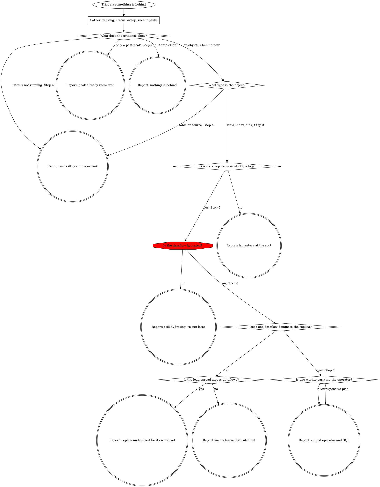

# Debug Freshness

Find the one object causing a freshness problem. Explain why it is behind.
The report must name the culprit, show the evidence, and point to the SQL causing the expensive work.

## Tools

This skill runs on the Materialize developer MCP server, which exposes two
read-only tools. `query_system_catalog` reads `mz_*`, `pg_catalog`, and
`information_schema`. `query` takes a cluster and runs everything else:
`EXPLAIN` statements and `mz_introspection` relations. Client configuration
prefixes them with the server name, as in
`mcp__<server>__query_system_catalog`.

The `EXPLAIN` commands, their output columns, and the operator patterns are in
[references/dataflow-analysis.md](references/dataflow-analysis.md#command-reference).
Each step below names the exact command it needs.

## Workflow



## Step 1: Gather the evidence and pick a subject

Run all three lookups before choosing a subject.

1. [Current lag](references/attribution.md#current-lag) ranks what is behind
   right now.
2. [Status sweep](references/attribution.md#status-sweep) catches what the
   ranking cannot: a stalled source keeps a current write frontier and reports
   seconds of lag, so it reads healthy in the ranking. Any row here is a finding
   whatever the ranking says, and its error text outranks lag.
3. [Recent peaks](references/attribution.md#recent-peaks) covers the last 24
   hours. The ranking describes this instant only, so a peak that recovered an
   hour ago leaves no trace in it.

Read the three together:

- A row in the status sweep sends you to Step 4, whatever else is true.
- An object standing clearly apart in the ranking is your subject. Continue
  below.
- A flat ranking and a clean sweep, but an object whose recent peak towers over
  its average, means the event has already recovered. Report that, with the shape
  from Step 2 and any restart from
  [compute gates](references/attribution.md#compute-gates).
- All three clean means nothing is behind. Say so.

Everything downstream is keyed on the fully qualified `database.schema.object`
name the queries return, never an id. The reference queries all carry a
`materialize.public.my_view` placeholder. Substitute the name you are
investigating, or the query comes back empty and the object looks idle. See
[name resolution](references/attribution.md#name-resolution).

The `type` column picks the path:

| Type | Path |
|---|---|
| `table`, `source` | Step 4. The attribution walk has no rows for these. |
| `materialized-view`, `index` | Step 2. |
| `sink` | Step 2, then [sink status](references/attribution.md#sink-status). Operator analysis is not available for sinks. |

## Step 2: Read the lag history

One reading cannot separate a spike from a sustained problem.
`mz_wallclock_global_lag_recent_history` holds one sample per minute for 24
hours.

Query: [references/attribution.md](references/attribution.md#lag-history).

A climbing lag, a lag holding at a plateau, and a single spike that recovered
are three different problems. The first two are worth continuing on. A sample
count below 1440 is also the object's age in minutes, which Step 6 needs.

## Step 3: Attribute the lag to a hop

Lag is inherited, and `mz_internal.mz_materialization_lag` attributes it.

| Column | Meaning |
|---|---|
| `local_lag` | Lag this object adds on top of its direct inputs. |
| `global_lag` | Lag against its root inputs. |
| `slowest_local_input_id` | Its slowest direct input, followed hop by hop. |
| `slowest_global_input_id` | Its slowest root input, in one jump. |

Query: [references/attribution.md](references/attribution.md#attribution-walk).

Compare the hops against each other. The hop carrying most of the object's
`global_lag` owns the delay and is the subject of Steps 4 onward, not the object
you started from. When no hop stands out, the lag is entering at the root:
continue at Step 4 with the root table or source.

## Step 4: Ingestion

The lag enters at a table or source.

1. Status and error text: [ingestion](references/attribution.md#ingestion). A
   stalled source with an error is the whole answer.
2. Snapshot progress, same section. `snapshot_committed` false means the source
   is still taking its initial snapshot and is not behind at all.
3. Write frontier, same section, to see whether it is advancing. An advancing
   frontier does not clear a source: status and error text outrank it.

For a sink, use [sink status](references/attribution.md#sink-status).

Any one of the three can be the whole answer. When one is, report it and stop.

A source whose error text names an upstream problem is diagnosed: an
incompatible schema change, a dropped publication, an expired credential. The fix
is upstream of Materialize and outside this skill.

## Step 5: Confirm hydration and pick a replica

Two things before any `EXPLAIN ANALYZE`.

Hydration. A hydrating dataflow is doing snapshot work, so `EXPLAIN ANALYZE`
measures catching up rather than keeping up. When
`mz_internal.mz_hydration_statuses` reports the object not hydrated, report that
and ask for a re-run once it finishes.

Replica. Every replica does identical work, so one is representative. Between
two, analyze whichever is doing less work and has no recent `offline` entry.

Queries: [references/attribution.md](references/attribution.md#compute-gates).

## Step 6: Find what consumes the replica

Dataflows share a replica's CPU and memory, so the lagging object may be starved
by an unrelated one.

Run `EXPLAIN ANALYZE CLUSTER CPU, MEMORY`, then again `WITH SKEW`. Details:
[cluster level](references/dataflow-analysis.md#cluster-level).

`total_elapsed` is cumulative since the dataflow started, so compare candidates
against their age from [object age](references/attribution.md#object-age) before
concluding anything. The `object` column is the name to carry forward; the
`global_id` is transient and resolves nowhere.

Read the ranking against itself. A dataflow accounting for most of what the
replica has spent is the subject of Step 7, whether or not it is the object you
started from. The gap between it and the next dataflow down is the evidence that
it stands apart.

When nothing stands out and the replica has no headroom left, the workload is
larger than the replica: many dataflows sharing it, none of them individually at
fault. That is the diagnosis, and the utilization figures are the evidence. When
nothing stands out and the replica has headroom, the result is inconclusive.
Report what was ruled out rather than promoting the top row into a culprit.

## Step 7: Find the expensive operator

Rank that dataflow's operators:
[operator costs](references/dataflow-analysis.md#operator-costs). It takes the
fully qualified name and runs on the dataflow's own cluster.

An operator holding most of `percent_of_dataflow` is where to start. A list that
declines gradually means the cost is spread and no single operator is the answer.
Say so rather than naming the largest.

A thin result has two readings, and the operator names separate them. One or two
operators with real elapsed time means an index whose dataflow only arranges
another object's output: resolve what it indexes in Step 8 and analyze that
instead. A single operator with a null cost means a passthrough that owns no
operators at all: the work lives in the object named in its `Read` or `Arranged`
line, which may sit on a different cluster, so take that name back to Step 6.

For the top operators only, check distribution:
[operator skew](references/dataflow-analysis.md#operator-skew).

A `max_worker_ratio` climbing toward the worker count means one worker is
carrying the operator, and the dataflow runs at that worker's speed. Name that
operator, then check whether it is an `Arrange` with an empty key. An empty key
routes every record to one worker, which happens with a cross join or a join
whose predicates are all inequalities. A join needs at least one equality to
spread work. Characterize the hot key when asked.

A ratio near 1 on an expensive operator means the plan is expensive rather than
skewed. Look at join order, and at filters and projections that could be pushed
down further. The `Source` section of the physical plan lists `project`,
`filter`, and `pushdown`.

Operator meanings: [reading operators](references/dataflow-analysis.md#reading-operators).

## Step 8: Map operators back to SQL

1. You already have the costly operators and their `lir_id` values from Step 7.
2. Find which object owns the SQL. For a materialized view it is the object itself. For an index, resolve what it indexes through `mz_indexes.on_id`: an index on a materialized view is inheriting that view's lag, so analyze the materialized view instead, while an index on a plain view carries the view's whole body in its own dataflow.
3. Find the views inlined into the dataflow. A plain view has no dataflow of its own, so its body is built inside whatever consumes it, and the expensive operator may come from there. Walk `mz_object_dependencies` recursively and collect every dependency of type `view`; a materialized view, table, or source is a boundary with its own dataflow. The reference has the query.
4. Run `EXPLAIN PHYSICAL PLAN WITH (node identifiers) AS TEXT FOR ...`. Each node has `// { node_id: LirId(N) }`, matching the ids from step 1, along with column names, join predicates, and group keys.
5. Read the definitions from steps 2 and 3 with `SHOW CREATE MATERIALIZED VIEW` or `SHOW CREATE VIEW`, and find the clause the plan node came from.

Queries and a worked example:
[references/dataflow-analysis.md](references/dataflow-analysis.md#mapping-to-sql).

## Step 9: Report

Fill in every slot. "None" is a valid value and is more useful than omission.

```markdown
**Culprit:** <fully qualified name> on cluster <cluster>, replica <replica>
**Classification:** unhealthy source or sink | recovered peak, nothing behind now
| still hydrating | starved by another dataflow | worker skew | expensive plan |
undersized replica | lag enters at the root | nothing behind | inconclusive
**Evidence:**
- Lag: <object> at <lag>, history <shape> over <samples> minutes
- Attribution: <hop chain, with the local_lag of the hop that owns it>
- Replica: <cpu_percent>, <memory_percent>, top dataflow <percent of total>
**Expensive operator:** <operator> at <percent_of_dataflow>, worker ratio <ratio>
**SQL:** <clause>, in <fully qualified view name>, inlined into <dataflow name>
**Ruled out:** <what was checked and found healthy>
**Unexplained:** <what the evidence does not account for>
```

Name the clause, the view holding it, and the dataflow separately when they
differ, so the reader sees both the dataflow to fix and the file to edit.

The report is the deliverable. Remedies are a separate request.
